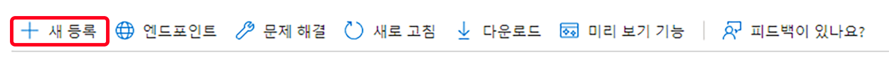

# 메일 서비스에 대한 OAuth2 지원 {#oauth2-support-for-the-mail-service}

AEM as a Cloud Service는 조직의 이메일 요구 사항 보호 준수를 위해 통합 메일 서비스에 대한 OAuth2 지원을 제공합니다.

여러 이메일 공급자에 대해 OAuth를 구성할 수 있습니다. 다음은 Microsoft® Office 365 Outlook과 함께 OAuth2를 통해 인증할 AEM 메일 서비스를 구성하는 방법에 대한 단계별 지침입니다. 다른 공급업체가 유사한 방식으로 구성될 수 있습니다.

AEM as a Cloud Service 메일 서비스에 대한 자세한 내용은 [이메일 보내기](/help/implementing/developing/introduction/development-guidelines.md#sending-email)를 참조하십시오.

## Microsoft® Outlook {#microsoft-outlook}

1. [https://portal.azure.com/](https://portal.azure.com/)으로 이동한 다음 로그인합니다.
1. 검색창에서 **Azure Active Directory**&#x200B;를 검색한 다음, 결과를 클릭합니다. 또는 [https://portal.azure.com/#blade/Microsoft_AAD_IAM/ActiveDirectoryMenuBlade/Overview](https://portal.azure.com/#blade/Microsoft_AAD_IAM/ActiveDirectoryMenuBlade/Overview)에서 바로 검색할 수 있습니다.
1. **앱 등록** - **신규 등록**&#x200B;을 클릭합니다.

   

1. 요구 사항에 따라 정보를 입력한 다음, **등록**&#x200B;을 클릭합니다.
1. 새로 만든 앱으로 이동하여 **API 권한**&#x200B;을 선택합니다.
1. **권한 추가** > **그래프 권한** > **위임된 권한**&#x200B;을 클릭합니다.
1. 아래의 앱에 대한 권한을 선택한 다음 **권한 추가**&#x200B;를 클릭합니다.

   >[!NOTE]
   >
   >권한 구성은 시간이 지나면서 발전할 수 있습니다. 권한 구성이 예상대로 작동하지 않으면 Microsoft로 작업합니다.

   * `https://outlook.office.com/SMTP.Send`
   * `openid`
   * `offline_access`
   * `email`
   * `profile`
1. **인증** > **플랫폼 추가** > **웹**&#x200B;으로 이동한 다음 **리디렉션 URL** 섹션에서 슬래시가 있는 URL과 슬래시가 없는 URL을 추가합니다.
   * `http://localhost/`
   * `http://localhost`
1. 각 URL을 추가한 후 **구성**&#x200B;을 눌러 요구 사항에 따라 설정을 구성합니다.
1. 그런 다음 **증명서 및 보안**&#x200B;으로 이동하고, **신규 클라이언트 보안**&#x200B;을 클릭한 후 화면에 표시되는 단계에 따라 보안을 생성합니다. 나중에 사용할 수 있도록 이러한 보안 내용을 메모해 두십시오.
1. 왼쪽 창에서 **개요**&#x200B;를 누르고 나중에 사용할 수 있도록 **애플리케이션(클라이언트) ID** 및 **디렉터리(테넌트) ID** 값을 복사합니다.

재점검하려면 AEM측의 메일 서비스에 대한 OAuth2 구성에 대한 다음 정보를 사용합니다.

* 테넌트 ID로 구성되는 인증 URL 형식: `https://login.microsoftonline.com/<tenantID>/oauth2/v2.0/authorize`
* 테넌트 ID로 구성되는 토큰 URL 형식: `https://login.microsoftonline.com/<tenantID>/oauth2/v2.0/token`
* 테넌트 ID로 구성되는 새로 고침 URL 형식: `https://login.microsoftonline.com/<tenantID>/oauth2/v2.0/token`
* 클라이언트 ID
* 클라이언트 보안

### 새로 고침 토큰 생성 {#generating-the-refresh-token}

이후 다음 작업을 수행하여 후속 단계에서 OSGi 구성의 일부가 되는 새로 고침 토큰을 생성합니다.

1. `clientID` 및 `tenantID`를 계정과 관련된 값으로 바꾼 후 브라우저에서 다음 URL을 엽니다.

   ```
   https://login.microsoftonline.com/%3ctenantID%3e/oauth2/v2.0/authorize?client_id=%3cclientId%3e&response_type=code&redirect_uri=http://localhost&response_mode=query&scope=https://outlook.office.com/SMTP.Send%20email%20openid%20profile%20offline_access&state=12345`
   ```

1. 메시지가 표시되면 권한을 허용합니다.
1. 해당 URL은 다음 형식으로 구성된 새 위치로 리디렉션합니다.

   ```
   http://localhost/?code=<code>&state=12345&session_state=4f984c6b-cc1f-47b9-81b2-66522ea83f81#`
   ```

1. 위 예의 `<code>` 값을 복사합니다.
1. 다음 cURL 명령을 사용하여 refreshToken을 가져옵니다. `<code>` 값과 tenantID, clientID 및 clientSecret을 계정에 대한 값으로 교체합니다.

   ```
   curl --location --request POST 'https://login.microsoftonline.com/<tenantId>/oauth2/v2.0/token' \
   --header 'Content-Type: application/x-www-form-urlencoded' \
   --header 'Cookie: buid=0.ARgAep0nU49DzUGmoP2wnvyIkcQjsx26HEpOnvHS0akqXQgYAAA.AQABAAEAAAD--DLA3VO7QrddgJg7Wevry9XPJSKbGVlPt5NWYxLtTl3K1W0LwHXelrffApUo_K02kFrkvmGm94rfBT94t25Zq4bCd5IM3yFOjWb3V22yDM7-rl112sLzbBQBRCL3QAAgAA; esctx=AQABAAAAAAD--DLA3VO7QrddgJg7Wevr4a8wBjYcNbBXRievdTOd15caaeAsQdXeBAQA3tjVQaxmrOXFGkKaE7HBzsJrzA-ci4RRpor-opoo5gpGLh3pj_iMZuqegQPEb1V5sUVQV8_DUEbBv5YFV2eczS5EAhLBAwAd1mHx6jYOL8LwZNDFvd2-MhVXwPd6iKPigSuBxMogAA; x-ms-gateway-slice=estsfd; stsservicecookie=estsfd; fpc=Auv6lTuyAP1FuOOCfj9w0U_5vR5dAQAAALDXP9gOAAAAwIpkkQEAAACT2T_YDgAAAA' \
   --data-urlencode 'client_id=<clientID>' \
   --data-urlencode 'scope=https://outlook.office.com/SMTP.Send https://graph.microsoft.com/Mail.Read https://graph.microsoft.com/Mail.Send https://graph.microsoft.com/User.Read email openid profile offline_access' \
   --data-urlencode 'redirect_uri=http://localhost' \
   --data-urlencode 'grant_type=authorization_code' \
   --data-urlencode 'client_secret=<clientSecret>' \
   --data-urlencode 'code=<code>'
   ```

1. refreshToken 및 accessToken을 기록해 두십시오.

### 토큰 확인 {#validating-the-tokens}

AEM측의 OAuth 구성을 진행하기에 앞서 아래 절차에 따라 accessToken 및 refreshToken을 확인하십시오.

1. 다음 curl로 이전 절차에서 생성한 refreshToken을 사용하여 accessToken을 생성하고, `<client_id>`, `<client_secret>` 및 `<refreshToken>`의 값을 바꿉니다.

   ```
   curl --location --request POST 'https://login.microsoftonline.com/<tenetId>/oauth2/v2.0/token' \
   --header 'Content-Type: application/x-www-form-urlencoded' \
   --header 'Cookie: buid=0.ARgAep0nU49DzUGmoP2wnvyIkcQjsx26HEpOnvHS0akqXQgYAAA.AQABAAEAAAD--DLA3VO7QrddgJg7Wevry9XPJSKbGVlPt5NWYxLtTl3K1W0LwHXelrffApUo_K02kFrkvmGm94rfBT94t25Zq4bCd5IM3yFOjWb3V22yDM7-rl112sLzbBQBRCL3QAAgAA; esctx=AQABAAAAAAD--DLA3VO7QrddgJg7Wevr4a8wBjYcNbBXRievdTOd15caaeAsQdXeBAQA3tjVQaxmrOXFGkKaE7HBzsJrzA-ci4RRpor-opoo5gpGLh3pj_iMZuqegQPEb1V5sUVQV8_DUEbBv5YFV2eczS5EAhLBAwAd1mHx6jYOL8LwZNDFvd2-MhVXwPd6iKPigSuBxMogAA; x-ms-gateway-slice=estsfd; stsservicecookie=estsfd; fpc=Auv6lTuyAP1FuOOCfj9w0U_IezHLAQAAAPeNSdgOAAAA' \
   --data-urlencode 'client_id=<client_id>' \
   --data-urlencode 'scope=https://outlook.office.com/SMTP.Send https://graph.microsoft.com/Mail.Read https://graph.microsoft.com/Mail.Send https://graph.microsoft.com/User.Read email openid profile offline_access' \
   --data-urlencode 'redirect_uri=http://localhost' \
   --data-urlencode 'grant_type=refresh_token' \
   --data-urlencode 'client_secret=<client_secret>' \
   --data-urlencode 'refresh_token=<refreshToken>'
   ```

1. 제대로 작동하는지 확인하려면 accessToken을 사용하여 메일을 전송합니다.

>[!NOTE]
>
> [이 위치](https://learn.microsoft.com/en-us/azure/active-directory/develop/v2-oauth2-auth-code-flow)에서 Postman API 컬렉션을 가져올 수 있습니다.
>
> 자세한 내용은 [여기](https://learn.microsoft.com/en-us/exchange/client-developer/legacy-protocols/how-to-authenticate-an-imap-pop-smtp-application-by-using-oauth)에서 MSFT OAuth 문서를 참조하십시오.

### AEM as a Cloud Service와 통합 {#integration-with-aem-as-a-cloud-service}

1. 다음 구문을 사용하여 `/apps/<my-project>/osgiconfig/config` 아래에 `com.day.cq.mailer.oauth.impl.OAuthConfigurationProviderImpl.cfg.json`이라는 OSGI 속성 파일을 생성합니다.

   ```
   {
       authUrl: "<Authorization Url>",
       tokenUrl: "<Token Url>",
       clientId: "<clientID>",
       clientSecret: "$[secret:SECRET_SMTP_OAUTH_CLIENT_SECRET]",
       scopes: [
          "scope1",
          "scope2"
       ],
       authCodeRedirectUrl: "http://localhost",
       refreshUrl: "<Refresh token Url>",
       refreshToken: "$[secret:SECRET_SMTP_OAUTH_REFRESH_TOKEN]"
   }
   ```

1. 이전 섹션에 설명된 바와 같이 `authUrl`, `tokenUrl` 및 `refreshURL`을 구성하여 입력합니다.
1. 구성에 다음 범위를 추가합니다.

   >[!NOTE]
   >
   >범위는 시간이 지나면서 발전할 수 있습니다. 권한 구성이 예상대로 작동하지 않으면 Microsoft로 작업합니다.

   * `https://outlook.office.com/SMTP.Send`
   * `openid`
   * `offline_access`
   * `email`
   * `profile`
1. 아래 구문을 사용하여 `/apps/<my-project>/osgiconfig/config` 아래에 `called com.day.cq.mailer.DefaultMailService.cfg.json`이라는 OSGI 속성 파일을 만듭니다. [이메일 서비스 튜토리얼](https://experienceleague.adobe.com/docs/experience-manager-learn/cloud-service/networking/examples/email-service.html)에 설명된 대로 `smtp.host` 및 `smtp.port` 값은 고급 네트워킹 구성을 반영합니다.

   ```
   {
    "smtp.host": "$[env:AEM_PROXY_HOST;default=proxy.tunnel]",
    "smtp.user": "<user account that logged into get the oauth tokens>",
    "smtp.password": "value not used",
    "smtp.port": 30465,
    "from.address": "<from address used for sending>",
    "smtp.ssl": false,
    "smtp.starttls": true,
    "smtp.requiretls": true,
    "debug.email": false,
    "oauth.flow": true
   }
   ```

1. Outlook의 경우 `smtp.host` 구성 값은 `smtp.office365.com`입니다.
1. 런타임 시 [여기](/help/implementing/deploying/configuring-osgi.md#setting-values-via-api)에 설명된 바와 같이 Cloud Manager 변수 API를 사용하거나 변수를 추가하는 [Cloud Manager를 사용하여 `refreshToken values` 및 `clientSecret` 보안을 전달합니다.](/help/implementing/cloud-manager/environment-variables.md) 변수 `SECRET_SMTP_OAUTH_REFRESH_TOKEN` 및 `SECRET_SMTP_OAUTH_CLIENT_SECRET`의 값을 정의해야 합니다.

### 문제 해결 {#troubleshooting}

메일 서비스가 제대로 작동하지 않는 경우, 위에 설명된 바와 같이 Cloud Manager API를 통해 새 값을 전달하여 `refreshToken`을 다시 생성해야 합니다. 새 값을 배포하는 데 몇 분 정도 소요됩니다.
