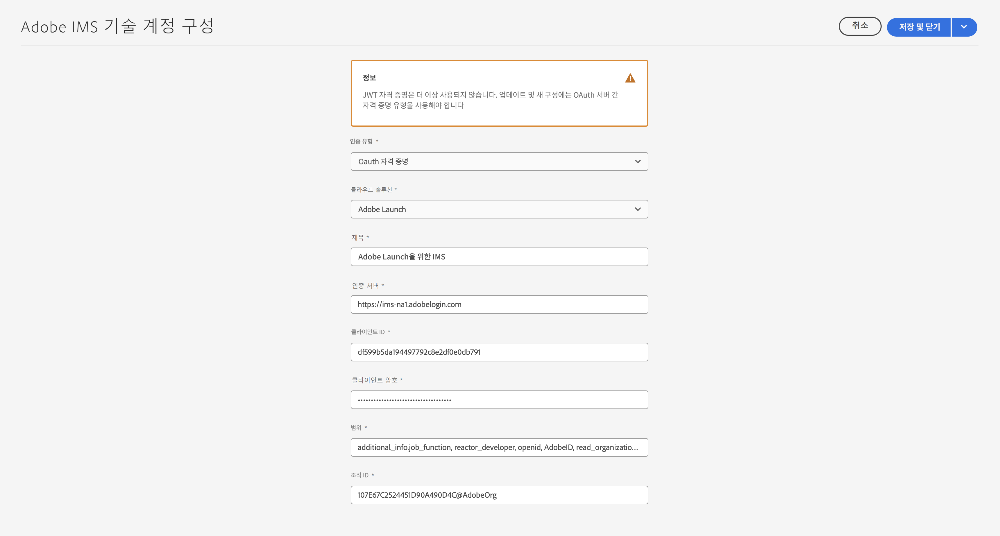

# AEM as a Cloud Service에 대한 IMS 통합 설정 {#setting-up-ims-integrations-for-aemaacs}

Adobe Experience Manager(AEM) as a Cloud Service은 다른 많은 Adobe 솔루션과 통합할 수 있습니다. 예를 들어 Adobe Target, Adobe Analytics 등이 있습니다.

통합은 S2S OAuth로 구성된 IMS 통합을 사용합니다.

* 생성 후:

   * [개발자 콘솔의 자격 증명](#credentials-in-the-developer-console)

* 그런 다음 다음을 수행할 수 있습니다.

   * (신규) 만들기 [OAuth 구성](#creating-oauth-configuration)

   * [기존 JWT 구성을 OAuth 구성으로 마이그레이션](#migrating-existing-JWT-configuration-to-oauth)

>[!CAUTION]
>
>이전에는으로 구성되었습니다. [이제 Adobe Developer 콘솔에서 더 이상 사용되지 않는 JWT 자격 증명](/help/security/jwt-credentials-deprecation-in-adobe-developer-console.md).
>
>이러한 구성은 더 이상 만들거나 업데이트할 수 없지만 OAuth 구성으로 마이그레이션할 수 있습니다.

## 개발자 콘솔의 자격 증명 {#credentials-in-the-developer-console}

첫 번째 단계로 Adobe Developer 콘솔에서 OAuth 자격 증명을 구성해야 합니다.

이 작업을 수행하는 방법에 대한 자세한 내용은 요구 사항에 따라 Developer Console 설명서를 참조하십시오.

* 개요:

   * [서버 간 인증](https://developer.adobe.com/developer-console/docs/guides/authentication/ServerToServerAuthentication/)

* 새 OAuth 자격 증명 만들기:

   * [OAuth 서버 간 자격 증명 구현 안내서](https://developer.adobe.com/developer-console/docs/guides/authentication/ServerToServerAuthentication/implementation/)

* 기존 JWT 자격 증명을 OAuth 자격 증명으로 마이그레이션:

   * [JWT(서비스 계정) 자격 증명에서 OAuth 서버 간 자격 증명으로 마이그레이션](https://developer.adobe.com/developer-console/docs/guides/authentication/ServerToServerAuthentication/migration/)

예:

## OAuth 구성 만들기 {#creating-oauth-configuration}

OAuth를 사용하여 새 Adobe IMS 통합을 만들려면 다음 작업을 수행하십시오.

1. AEM에서 다음 위치로 이동합니다. **도구**, **보안**, **Adobe IMS 통합**.

1. **만들기**&#x200B;를 선택합니다.

1. 의 세부 사항을 기반으로 구성을 완료합니다. [개발자 콘솔](https://developer.adobe.com/developer-console/docs/guides/authentication/ServerToServerAuthentication/implementation/). 예:

   

1. **저장** 변경 사항.

## 기존 JWT 구성을 OAuth 구성으로 마이그레이션 {#migrating-existing-JWT-configuration-to-oauth}

JWT 자격 증명을 기반으로 기존 Adobe IMS 통합을 마이그레이션하려면 다음을 수행하십시오.

>[!NOTE]
>
>이 예에서는 Launch IMS 구성을 보여 줍니다.

1. AEM에서 다음 위치로 이동합니다. **도구**, **보안**, **Adobe IMS 통합**.

1. 마이그레이션해야 하는 JWT 구성을 선택합니다. JWT 구성이 경고로 표시됨 **JWT 자격 증명(더 이상 사용되지 않음)**.

1. 선택 **속성**:

   

1. 구성이 읽기 전용으로 열립니다.

   

1. 선택 **OAuth** 다음에서 **인증 유형** 드롭다운:

   

1. 사용 가능한 속성이 업데이트됩니다. Developer Console의 세부 정보를 사용하여 다음을 완료합니다.

   

1. 사용 **저장 및 닫기** 을 클릭하여 업데이트를 유지합니다.
콘솔로 돌아가면 **JWT 자격 증명(더 이상 사용되지 않음)** 경고가 사라집니다.