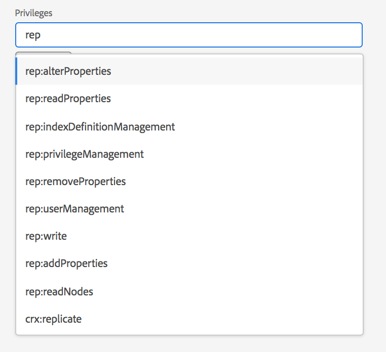
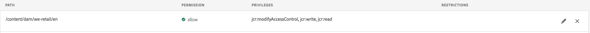
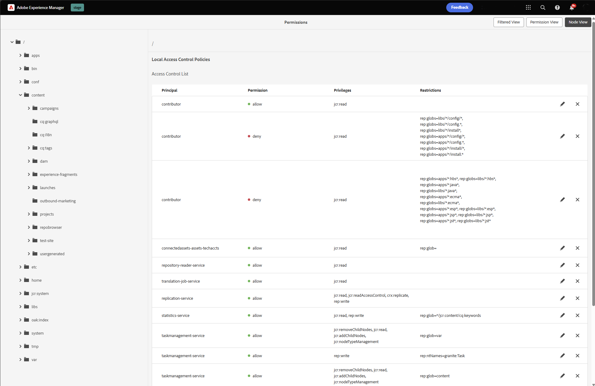

# 권한 관리에 대한 보안 주체 보기 {#principal-view-for-permissions-management}

## 개요 {#overview}

AEM에서는 사용자 및 그룹에 대한 권한 관리를 도입했습니다. 기본 기능은 클래식 UI와 동일하게 유지되지만 보다 사용자 친화적이고 효율적입니다.

## UI 액세스 {#accessing-the-ui}

새 UI 기반 권한 관리는 아래와 같이 보안 아래의 권한 카드를 통해 액세스할 수 있습니다.

새 보기를 사용하면 명시적으로 권한이 부여된 모든 경로에서 특정 주체에 대한 전체 권한 및 제한 사항을 보다 쉽게 볼 수 있습니다. 이렇게 하면 (으)로 이동할 필요가 없습니다.

고급 권한 및 제한 사항을 관리하는 CRXDE입니다. 동일한 보기로 통합되었습니다.

사용자가 주도자 유형을 선택하여 **사용자**, **그룹** 또는 **모든**&#x200B;을(를) 확인하고 주도자를 검색&#x200B;**할 수 있도록 허용하는 필터가 있습니다.**

## 주체에 대한 권한 보기 {#viewing-permissions-for-a-principal}

왼쪽의 프레임을 사용하면 아래와 같이 아래로 스크롤하여 주체를 찾거나 선택한 필터를 기반으로 그룹 또는 사용자를 검색할 수 있습니다.

이름을 클릭하면 오른쪽에 할당된 권한이 표시됩니다. 권한 창에는 구성된 제한 사항과 함께 특정 경로의 액세스 제어 항목 목록이 표시됩니다.

## 주체에 대한 새 액세스 제어 항목 추가 {#adding-new-access-control-entry-for-a-principal}

액세스 제어 항목을 추가하여 새 권한을 추가할 수 있습니다. ACE 추가 버튼을 클릭하면 됩니다.

이렇게 하면 아래에 표시된 창이 나타나며, 다음 단계는 권한을 구성해야 하는 경로를 선택하는 것입니다.

여기에서 **dam-users**&#x200B;에 대한 권한을 구성할 수 있는 경로를 선택합니다.

경로를 선택하면 워크플로가 이 화면으로 돌아갑니다. 그러면 사용자는 아래와 같이 사용 가능한 네임스페이스(`jcr`, `rep` 또는 `crx` 등)에서 하나 이상의 권한을 선택할 수 있습니다.

텍스트 필드를 사용하여 검색한 다음 목록에서 선택하여 권한을 추가할 수 있습니다.

>[!NOTE]
>
>권한 및 설명의 전체 목록은 [사용자, 그룹 및 액세스 권한 관리](https://experienceleague.adobe.com/en/docs/experience-manager-65/content/security/user-group-ac-admin#access-right-management)를 참조하십시오.

 

권한 목록을 선택한 후 사용자는 아래와 같이 권한 유형: 거부 또는 허용 을 선택할 수 있습니다.

 

## 제한 사용 {#using-restrictions}

지정된 경로에 대한 권한 목록 및 권한 유형 외에도 이 화면에서는 아래와 같이 세분화된 액세스 제어에 대한 제한을 추가할 수 있습니다.

>[!NOTE]
>
>각 제한의 의미에 대한 자세한 내용은 [Jackrabbit Oak 설명서](https://jackrabbit.apache.org/oak/docs/security/authorization/restriction.html)를 참조하세요.

제한 유형을 선택하고 값을 입력한 다음 **+** 아이콘을 눌러 아래와 같이 제한을 추가할 수 있습니다.

 

새 ACE는 아래와 같이 액세스 제어 목록에 반영됩니다. `jcr:write`은(는) 위에 추가된 `jcr:removeNode`을(를) 포함하는 집계 권한이지만, 아래에 `jcr:write`에서 다루는 항목으로 표시되지 않습니다.

## ACE 편집 {#editing-aces}

주도자를 선택하고 편집할 ACE를 선택하여 액세스 제어 항목을 편집할 수 있습니다.

예를 들어 오른쪽에 있는 연필 아이콘을 클릭하여 **dam-users**&#x200B;의 아래 항목을 편집할 수 있습니다.

편집 화면은 구성된 ACE가 미리 선택된 상태로 표시되며, 이 ACE 옆에 있는 교차 아이콘을 클릭하여 삭제하거나 아래와 같이 주어진 경로에 대해 새 권한을 추가할 수 있습니다.

여기에 지정된 경로의 **dam-users**&#x200B;에 대한 `addChildNodes` 권한이 추가됩니다.

오른쪽 상단의 **저장** 단추를 클릭하여 변경 사항을 저장할 수 있으며, 변경 사항은 아래와 같이 **dam-users**&#x200B;에 대한 새 권한에 반영됩니다.

## ACE 삭제 {#deleting-aces}

액세스 제어 항목을 삭제하여 특정 경로의 사용자에게 부여된 모든 권한을 제거할 수 있습니다. ACE 옆에 있는 X 아이콘을 사용하여 아래와 같이 삭제할 수 있습니다.

 

## 권한 보기 {#permissions-view}

### Touch UI 권한 보기 {#touch-ui-permisions-view}

관리자는 AEM 내의 보안 및 관리를 향상시키기 위해 노드 수준에서 권한 할당에 대한 보다 세부적인 제어 및 가시성이 필요합니다. 이전에는 사용자 기반 권한 보기만 사용할 수 있어서 ACL이 특정 노드 또는 필터링된 보기에 적용되는 방식을 확인하는 기능이 제한되었습니다. 새 노드 및 필터링된 보기는 권한 할당에 대한 상세하고 컨텍스트화된 관점을 제공하므로 보안 구성을 보다 효율적으로 관리하고 감사할 수 있습니다. 이 기능은 관리 감독을 강화하고 권한 관리를 간소화하며, 보안을 강화하고, 잘못된 구성을 줄이며, AEM에서 사용자 액세스 제어를 간소화합니다.

아래와 같이 **도구 - 보안 - 권한**&#x200B;을 클릭하여 권한 Touch UI 보기에 액세스할 수 있습니다.

권한 보기를 시작하면 기본 설정에 따라 화면 오른쪽 상단의 **노드 보기** 또는 **필터링된 보기**&#x200B;를 클릭할 수 있습니다.

#### 노드 보기

이 보기에서 각 개별 노드(경로)에 대해 ACL이 표시됩니다. 다음 항목에 대한 정보를 제공합니다.

선택한 노드에 대한 로컬 ACL.
루트(&quot;/&quot;)까지 각 상위 노드에 적용된 ACL을 포함하는 유효 ACL.
사용자는 ACL을 추가, 제거 또는 업데이트할 수 있습니다. 경로를 클릭하면 왼쪽 창에 하위 항목이 표시되고, 오른쪽에는 해당 경로와 연관된 모든 ACL의 테이블 보기가 표시됩니다.

#### 필터링된 보기

이 보기를 통해 사용자는 지정된 경로 및 주도자에 대한 권한을 효율적으로 검색할 수 있습니다. 이 보기에서 사용자는 선택한 경로에 대해 주도자 그룹에 부여된 권한 유형을 쉽게 결정할 수 있습니다.
또한 필터링된 보기는 유효한 ACL에 대한 통찰력을 제공합니다. 선택된 주도자 및 공통 주도자를 고려하여 선택된 경로의 상위 노드와 연관된 ACL이 표시됩니다.

### 저장소 브라우저 권한 보기 {#the-repository-browser-permissions-view}

권한 보기는 [저장소 브라우저](/help/implementing/developing/tools/repository-browser.md)를 통해서도 액세스할 수 있습니다.

다음 방법으로 액세스할 수 있습니다.

1. 개발자 콘솔을 열고 **저장소 브라우저** 탭을 클릭한 다음 **저장소 브라우저 열기**&#x200B;를 클릭합니다.

   

1. 저장소 브라우저에서 **권한** 탭을 클릭합니다

   

**참고**: 사용 권한을 보려면 관리자 권한이 필요합니다. 권한에 액세스하려면 [여기](/help/implementing/developing/tools/repository-browser.md#navigate-the-hierarchy-navigate-the-hierarchy)에서 언급된 단계를 따르십시오.

## 클래식 UI 권한 조합 {#classic-ui-privilege-combinations}

새 권한 UI는 부여된 정확한 기본 권한을 반영하지 않는 사전 정의된 조합 대신 기본 권한 집합을 명시적으로 사용합니다.

이는 정확히 무엇을 구성하고 있는지에 대한 혼동을 유발하였다. 다음 표에는 기본 UI에서 해당 권한을 구성하는 실제 권한으로의 권한 조합 간의 매핑이 나열되어 있습니다.

<table>
 <tbody>
  <tr>
   <th>클래식 UI 권한 조합</th>
   <th>권한 UI 권한</th>
  </tr>
  <tr>
   <td>읽기</td>
   <td><code>jcr:read</code></td>
  </tr>
  <tr>
   <td>수정</td>
   <td>
<code>jcr:modifyProperties</code>
 
<code>jcr:lockManagement</code>
 
<code>jcr:versionManagement</code>
 </td>
  </tr>
  <tr>
   <td>만들기</td>
   <td>
<code>jcr:addChildNodes</code>
 
<code>jcr:nodeTypeManagement</code>
 </td>
  </tr>
  <tr>
   <td>삭제</td>
   <td>
<code>jcr:removeNode</code>
 
<code>jcr:removeChildNodes</code>
 </td>
  </tr>
  <tr>
   <td>ACL 읽기</td>
   <td><code>jcr:readAccessControl</code></td>
  </tr>
  <tr>
   <td>ACL 편집</td>
   <td><code>jcr:modifyAccessControl</code></td>
  </tr>
  <tr>
   <td>복제</td>
   <td><code>crx:replicate</code></td>
  </tr>
 </tbody>
</table>
