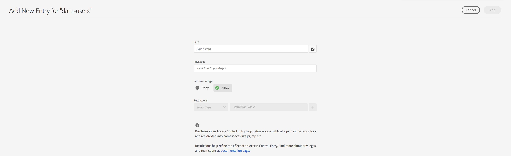

# 권한 관리를 위한 주요 보기 {#principal-view-for-permissions-management}

## 개요 {#overview}

AEM은 사용자 및 그룹에 대한 권한 관리 기능을 도입합니다. 주요 기능은 기존 UI와 동일하지만, 사용자 친화성과 효율성이 향상되었습니다.

## UI에 액세스 {#accessing-the-ui}

새로운 UI 기반 권한 관리 기능은 아래와 같이 보안 섹션의 권한 카드에서 액세스할 수 있습니다.

새로운 보기를 사용하면 권한이 명시적으로 부여된 모든 경로에서 주어진 주체에 대한 전체 권한 및 제한 세트를 한눈에 확인할 수 있습니다. 이제 고급 권한 및 제한을 관리하기 위해

CRXDE로 이동할 필요가 없습니다. 모든 기능이 동일한 보기에 통합되었습니다.

사용자는 필터를 사용하여 **사용자**, **그룹** 또는 **전체** 등 주체 유형을 선택하고, 원하는 주체를 검색할 수 있습니다&#x200B;**.**

## 주체에 대한 권한 보기 {#viewing-permissions-for-a-principal}

왼쪽 프레임에서 사용자는 아래로 스크롤하여 원하는 주체를 찾거나, 아래에 표시된 대로 선택한 필터를 기준으로 그룹이나 사용자를 검색할 수 있습니다.

이름을 클릭하면 오른쪽에 할당된 권한이 표시됩니다. 권한 패널에는 특정 경로에 대한 액세스 제어 항목 목록과 구성된 제한 사항이 표시됩니다.

## 주체에 대한 새 액세스 제어 항목 추가 {#adding-new-access-control-entry-for-a-principal}

새 권한은 액세스 제어 항목을 추가하여 부여할 수 있습니다. ACE 추가 버튼을 클릭하면 됩니다.

이렇게 하면 아래에 표시된 창이 표시되고, 다음 단계에서는 권한을 구성해야 하는 경로를 선택합니다.

여기에서는 **dam-users**&#x200B;에 대한 권한을 구성할 수 있는 경로가 선택됩니다.

경로를 선택하면 워크플로가 이 화면으로 돌아오며, 여기에서 사용자는 아래에 표시된 대로 사용 가능한 네임스페이스(`jcr`, `rep`, `crx` 등)에서 하나 이상의 권한을 선택할 수 있습니다.

텍스트 필드에서 권한을 검색한 후 목록에서 선택하여 권한을 추가할 수 있습니다.

>[!NOTE]
>
>권한 및 설명의 전체 목록은 [사용자, 그룹 및 액세스 권한 관리](https://experienceleague.adobe.com/ko/docs/experience-manager-65/content/security/user-group-ac-admin#access-right-management)를 참조하십시오.

 

권한 목록을 선택한 후 사용자는 아래에 표시된 대로 ‘거부’ 또는 ‘허용’ 중 권한 유형을 지정할 수 있습니다.

 

## 제한 사용 {#using-restrictions}

이 화면에서는 지정된 경로에 대한 권한 유형과 권한 목록 외에도 아래에 표시된 대로 세분화된 액세스 제어에 대한 제한을 추가할 수 있습니다.

:

>[!NOTE]
>
>각 제한 사항이 의미하는 바에 대한 자세한 내용은 [Jackrabbit Oak 설명서](https://jackrabbit.apache.org/oak/docs/security/authorization/restriction.html)를 참조하십시오.

제한을 추가하려면 제한 유형을 선택하고 값을 입력한 뒤 **+** 아이콘을 클릭합니다.

 

새로운 ACE는 아래와 같이 액세스 제어 목록에 반영됩니다. `jcr:write`는 위에 추가된 `jcr:removeNode`를 포함하는 집계된 권한이며, `jcr:write` 아래에는 해당 권한이 포함되어 있지 않으므로 표시되지 않습니다.

## ACE 편집 {#editing-aces}

액세스 제어 항목은 주체를 선택한 다음 편집하려는 ACE를 선택하여 편집할 수 있습니다.

예를 들어, 여기에서 오른쪽에 있는 연필 아이콘을 클릭하여 **dam-users**&#x200B;에 대한 아래 항목을 편집할 수 있습니다.

:

편집 화면에는 구성된 ACE가 미리 선택된 상태로 표시됩니다. 해당 항목 옆의 십자 아이콘을 클릭하여 삭제할 수 있으며, 아래에 표시된 대로 지정된 경로에 새로운 권한을 추가할 수도 있습니다.

여기에서는 지정된 경로에 대한 **dam-users**&#x200B;에 `addChildNodes` 권한이 추가됩니다.

오른쪽 상단의 **저장** 버튼을 클릭하여 변경사항을 저장할 수 있으며, 아래와 같이 **dam-users**&#x200B;에 대한 새로운 권한에 해당 변경사항이 반영됩니다.

## ACE 삭제 {#deleting-aces}

액세스 제어 항목을 삭제하면 특정 경로에 대해 주체에 부여된 모든 권한이 제거됩니다. 아래와 같이 ACE 옆에 있는 X 아이콘을 클릭하여 해당 ACE를 삭제할 수 있습니다.

 

## 권한 보기 {#permissions-view}

### Touch UI 권한 보기 {#touch-ui-permisions-view}

관리자는 AEM 내에서 보안 및 관리를 개선하기 위해 노드 수준에서의 권한 할당에 대해 보다 세분화된 제어와 가시성이 필요합니다. 이전에는 주체 기반 권한 보기만 제공되어, 특정 노드나 필터링된 보기에 ACL이 어떻게 적용되는지 확인하는 데 한계가 있었습니다. 새로운 노드 및 필터링된 보기는 권한 할당에 대한 상세하고 컨텍스트화된 관점을 제공하여 보안 구성의 관리 및 감사를 보다 효과적으로 수행할 수 있게 합니다. 이 기능은 관리 감독을 강화하고, 권한 관리를 단순화하며, 보안을 개선하고, 구성 오류를 줄이고, AEM에서 사용자 액세스 제어를 효율화합니다.

아래와 같이 **도구 - 보안 - 권한**&#x200B;을 클릭하면 권한 Touch UI 보기에 액세스할 수 있습니다.

권한 보기를 실행한 후 화면 오른쪽 상단에서 **노드 보기** 또는 **필터링된 보기**&#x200B;를 클릭하여 원하는 보기를 선택할 수 있습니다.

#### 노드 보기

이 보기에서는 각 개별 노드(경로)에 대한 ACL이 표시됩니다. 다음에 대한 정보가 제공됩니다.

선택한 노드에 대한 로컬 ACL.
루트(“/”)까지 각 상위 노드에 적용된 ACL을 포함하는 효과적인 ACL.
사용자는 ACL을 추가하고, 제거하고, 업데이트할 수 있습니다. 경로를 클릭하면 왼쪽 창에 해당 경로의 하위 노드가 표시되고, 오른쪽 창에는 그 경로에 연관된 모든 ACL이 테이블 보기로 표시됩니다.

#### 필터링된 보기

이 보기를 통해 사용자는 지정된 경로 및 주체에 대한 권한을 효율적으로 검색할 수 있습니다. 이 보기에서는 사용자가 선택된 경로에 대해 주체 그룹에 부여된 권한 유형을 손쉽게 확인할 수 있습니다.
또한, 필터링된 보기는 효과적인 ACL에 대한 인사이트를 제공합니다. 이 보기에서는 선택한 주체 및 공통 주체를 고려하여, 선택한 경로의 상위 노드에 연결된 ACL을 표시합니다.

### 저장소 브라우저 권한 보기 {#the-repository-browser-permissions-view}

권한 보기는 [저장소 브라우저](/help/implementing/developing/tools/repository-browser.md)를 통해서도 액세스할 수 있습니다.

다음을 통해 액세스할 수 있습니다.

1. 개발자 콘솔을 열고, **저장소 브라우저** 탭을 클릭한 다음, **저장소 브라우저 열기**&#x200B;를 클릭합니다.

   

1. 저장소 브라우저에 진입한 후, **권한** 탭을 클릭합니다.

   

**참고**: 권한을 보기 위해서는 관리자 권한이 필요합니다. [여기](/help/implementing/developing/tools/repository-browser.md#navigate-the-hierarchy-navigate-the-hierarchy)에 언급된 단계를 따라 권한에 액세스할 수 있습니다.

## 클래식 UI 권한 조합 {#classic-ui-privilege-combinations}

새로운 권한 UI는 실제로 부여된 하위 권한을 정확하게 반영하지 않는 미리 정의된 조합 대신 기본 권한 집합을 명시적으로 사용합니다.

이전에는 정확히 어떤 권한이 구성되고 있는지 혼란이 발생했습니다. 다음 표에는 클래식 UI의 권한 조합과 이를 구성하는 실제 권한 간의 매핑이 나와 있습니다.

<table>
 <tbody>
  <tr>
   <th>클래식 UI 권한 조합</th>
   <th>권한 UI 권한</th>
  </tr>
  <tr>
   <td>읽기</td>
   <td><code>jcr:read</code></td>
  </tr>
  <tr>
   <td>수정</td>
   <td>
<code>jcr:modifyProperties</code>
 
<code>jcr:lockManagement</code>
 
<code>jcr:versionManagement</code>
 </td>
  </tr>
  <tr>
   <td>만들기</td>
   <td>
<code>jcr:addChildNodes</code>
 
<code>jcr:nodeTypeManagement</code>
 </td>
  </tr>
  <tr>
   <td>삭제</td>
   <td>
<code>jcr:removeNode</code>
 
<code>jcr:removeChildNodes</code>
 </td>
  </tr>
  <tr>
   <td>ACL 읽기</td>
   <td><code>jcr:readAccessControl</code></td>
  </tr>
  <tr>
   <td>ACL 편집</td>
   <td><code>jcr:modifyAccessControl</code></td>
  </tr>
  <tr>
   <td>복제</td>
   <td><code>crx:replicate</code></td>
  </tr>
 </tbody>
</table>
