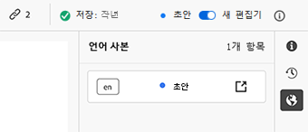

# 콘텐츠 조각 작성 {#authoring-content-fragments}

콘텐츠 조각 작성은 Headless 게재와 페이지 작성 모두에 중점을 두고 있습니다.

콘텐츠 조각에 사용할 수 있는 편집기가 두 개 있습니다. 이 섹션에서 편집기는 다음과 같이 설명합니다.

* Headless 콘텐츠 게재를 맞게 개발(단, 모든 시나리오에서 사용 가능)
* **콘텐츠 조각** 콘솔에서 사용 가능

이 편집기는 다음 기능을 제공합니다.

* [자동 저장](#saving-autosaving)을 통해 실수로 편집된 내용이 손실되는 일이 없도록 합니다.
* 먼저 자산 DAM에 업로드하지 않고 [자산을 콘텐츠 참조로 인라인 업로드할 수 있습니다](#reference-images).
* 콘텐츠 조각을 통해 게재된 렌더링된 경험을 [미리보기](#preview-content-fragment)할 수 있습니다.
* 편집기에서 [게시](#publish-content-fragment) 및 [게시 취소](#unpublish-content-fragment)할 수 있습니다.
* 편집기에서 연결된 [언어 사본을 보고 열](#view-language-copies) 수 있습니다.
* 편집기에서 [버전 세부 사항을 볼](#view-version-history) 수 있습니다.
   * 선택한 버전으로 되돌릴 수도 있습니다.
* [상위 참조를 보고 열](#view-parent-references) 수 있습니다.
* [구조 트리](#structure-tree)를 사용하여 콘텐츠 조각과 해당 참조의 계층적 보기를 실행할 수 있습니다.

>[!CAUTION]
>
>이 섹션에서 설명하는 편집기는 *온라인* Adobe Experience Manager(AEM) as a Cloud Service *에서만* 사용할 수 있습니다.

>[!CAUTION]
>
>콘텐츠 조각을 편집하려면 [적절한 권한](/help/implementing/developing/extending/content-fragments-customizing.md#asset-permissions)이 있어야 합니다. 문제가 발생하는 경우, 시스템 관리자에게 문의하십시오.
> 
>예: `edit` 권한이 없는 경우, 편집기는 읽기 전용입니다.

>[!NOTE]
>
>[원본 콘텐츠 조각 편집기](/help/assets/content-fragments/content-fragments-variations.md)에 대한 자세한 내용은 자산 설명서를 참조하십시오. **자산** 콘솔과 **콘텐츠 조각** 콘솔 모두에서 사용할 수 있습니다.

>[!NOTE]
>
>프로젝트 팀은 필요한 경우 편집기를 사용자 정의할 수 있습니다. 자세한 내용은 [콘텐츠 조각 콘솔 및 편집기 사용자 정의](/help/implementing/developing/extending/content-fragments-console-and-editor.md)를 참조하십시오.

## 콘텐츠 조각 편집기 {#content-fragment-editor}

콘텐츠 조각 편집기를 처음 열면 다음 네 가지 주요 영역이 표시됩니다.

* 상단 도구 모음: 주요 정보 및 작업용도
   * 콘텐츠 조각 콘솔에 대한 링크(홈 아이콘)
   * 모델 및 폴더에 대한 정보
   * [(모델에 대해 기본 미리보기 URL 패턴이 구성된 경우) 미리보기](/help/sites-cloud/administering/content-fragments/content-fragment-models.md#content-fragment-model-properties)에 대한 링크
   * [게시](#publish-content-fragment) 및 [게시 취소](#unpublish-content-fragment) 작업
   * **상위 참조**&#x200B;를 모두 표시하는 옵션(링크 아이콘)
   * 조각 **[상태](/help/sites-cloud/administering/content-fragments/managing.md#statuses-content-fragments)** 및 마지막으로 저장한 정보
   * 원본(자산 기반) 편집기로 전환할 수 있는 기능
* 왼쪽 패널: 콘텐츠 조각 및 해당 **필드**&#x200B;의 **[변형](#variations)** 표시:
   * 이 링크를 사용하여 [콘텐츠 조각 구조 탐색](#navigate-structure)
* 오른쪽 패널: [속성(메타데이터) 및 태그](#view-properties-tags), [버전 내력](#view-version-history)에 대한 정보와 모든 [언어 사본](#view-language-copies)과 관련된 정보를 표시하는 탭 제공
   * **속성** 탭에서 조각 또는 **변형**&#x200B;에 대한 **제목** 및 **설명**&#x200B;을 업데이트할 수 있습니다.
* 중앙 패널: 선택한 변형의 실제 필드와 콘텐츠 표시
   * 콘텐츠 편집 허용
   * **탭 플레이스홀더** 필드가 여기에 표시된 모델 내에서 정의되고 탐색에 사용될 수 있는 경우, 가로 또는 드롭다운 목록 중 하나로 표시됩니다.

>[!CAUTION]
>
>콘텐츠 조각 모델은 종종 **제목**&#x200B;과 **설명**&#x200B;으로 이름이 지정된 데이터 필드를 정의할 수 있습니다. 이러한 필드가 존재하는 경우, 해당 필드는 사용자 정의 필드이고 조각을 편집할 때 *중앙 패널*&#x200B;에서 업데이트할 수 있습니다.
>
>또한 콘텐츠 조각과 변형에는 **제목** 및 **설명**&#x200B;이라는 메타데이터 필드(변형 속성)가 있습니다. 이 필드는 콘텐츠 조각의 필수 부분이며 처음 조각이 생성될 때 정의됩니다. 조각을 편집할 때 *오른쪽 패널*&#x200B;에서 업데이트할 수 있습니다.

## 콘텐츠 조각 구조 탐색 {#navigate-structure}

단일 콘텐츠 조각,

* 다음 두 가지 수준으로 구성됩니다.

   * 조각 콘텐츠의 **[변형](#variations)**
   * **필드** - 콘텐츠 조각 모델에 의해 정의되고 모든 변형에서 사용됨

* 다양한 참고를 포함할 수 있습니다.

### 변형 및 필드 {#variations-and-fields}

왼쪽 패널에 다음이 표시될 수 있습니다.

* 이 조각에 맞게 만들어진 **[변형](#variations)** 목록:
   * **기본**&#x200B;은 콘텐츠 조각을 처음 만들 때 존재하는 변형으로 나중에 다른 조각을 추가할 수 있습니다.
   * 편집을 위해 변형을 선택하고 열 수 있습니다.
   * [변형을 만들](#create-variation) 수도 있습니다.
* 조각 및 변형 내 **필드**:
   * 아이콘은 [데이터 형식](/help/sites-cloud/administering/content-fragments/content-fragment-models.md#data-types)을 표시합니다.
   * 텍스트는 필드 이름임
   * 이와 함께 중앙 패널의 필드 콘텐츠에 직접 연결되는 링크 제공(현재 변형의 경우)

### 링크 팔로우 {#follow-links}

편집기의 다양한 부분에 링크 아이콘이 표시됩니다. 이를 사용하여 표시된 항목을 열 수 있습니다(예: 콘텐츠 조각 모델, 상위 참조 또는 참조되는 조각).

### 구조 트리 {#structure-tree}

편집기 도구 모음에서 **구조 트리** 탭을 열어 콘텐츠 조각의 계층 구조와 해당 참조를 표시합니다. 링크 아이콘을 사용하여 참고를 탐색합니다.

>[!NOTE]
>
>자세한 내용은 [콘텐츠 조각 구조 분석 - 구조 트리](/help/sites-cloud/administering/content-fragments/analysis.md#structure-tree)를 참조하십시오.

## 저장 및 자동 저장 {#saving-autosaving}

<!-- CHECK: cannot be saved, no undo, redo -->

업데이트할 때마다 콘텐츠 조각이 자동으로 저장됩니다. 마지막으로 저장한 시간이 상단 도구 모음에 표시됩니다.

## 변형 {#variations}

[변형](/help/sites-cloud/administering/content-fragments/overview.md#main-and-variations)은 AEM 콘텐츠 조각의 중요한 기능입니다. 특정 채널 및 시나리오에서 사용할 **기본** 콘텐츠의 사본을 만들고 편집할 수 있어 Headless 콘텐츠 게재와 페이지 작성을 보다 유연하게 해 줍니다.

편집기에서 다음 작업을 수행할 수 있습니다.

* **기본** 콘텐츠의 [변형 만들기](#create-variation)

* 콘텐츠 편집에 필요한 변형 선택

* [변형 이름 바꾸기](#rename-variation)

* [변형 삭제](#delete-variation)

### 변형 만들기 {#create-variation}

콘텐츠 조각의 변형을 만들려면

1. 왼쪽 패널에서 **변형** 오른쪽에 있는 **더하기 기호(+)**(**변형 만들기**)를 선택합니다.

   >[!NOTE]
   >
   >첫 번째 변형을 만든 후에는 기존 변형이 동일한 패널에 표시됩니다.

   

1. 원하는 경우 대화 상자에서 변형에 대한 **제목**&#x200B;과 **설명**&#x200B;을 입력합니다.

   

1. 변형 **만들기**. 목록에 표시됩니다.

### 변형 이름 바꾸기 {#rename-variation}

**변형** 이름을 바꾸려면

1. 필요한 변형을 선택합니다.

1. 오른쪽 패널에서 **속성** 탭을 엽니다.

1. 변형 **제목**&#x200B;을 업데이트합니다.

1. **반환**&#x200B;을 누르거나 다른 필드로 이동하여 변경 내용을 자동 저장합니다. 왼쪽의 **변형** 패널에서 제목이 업데이트됩니다.

### 변형 삭제 {#delete-variation}

콘텐츠 조각의 변형을 삭제하려면

>[!NOTE]
>
>**기본**&#x200B;을 삭제할 수 없습니다.

1. 변형을 선택합니다.

1. **변형** 패널에서 삭제 아이콘(휴지통)을 선택합니다.

   

1. 대화 상자가 열립니다. **삭제**&#x200B;를 선택하여 작업을 확인합니다.

## 여러 줄 텍스트 필드 편집 - 일반 텍스트 또는 Markdown {#edit-multi-line-text-fields-plaintext-markdown}

**[여러 줄 텍스트](/help/sites-cloud/administering/content-fragments/content-fragment-models.md#data-types)** 필드는 다음 세 가지 포맷 중 하나일 수 있습니다.

* 일반 텍스트
* [Markdown](/help/sites-cloud/administering/content-fragments/markdown.md)
* [리치 텍스트](#edit-multi-line-text-fields-rich-text)

일반 텍스트 또는 Markdown으로 정의된 필드에는 (화면에) 서식 지정 옵션이 없는 간단한 텍스트 상자가 있습니다.

## 여러 줄 텍스트 필드 편집 - 리치 텍스트 {#edit-multi-line-text-fields-rich-text}

**리치 텍스트**&#x200B;로 정의된 **[여러 줄 텍스트](/help/sites-cloud/administering/content-fragments/content-fragment-models.md#data-types)** 필드의 경우 다양한 기능을 사용할 수 있습니다.

* 콘텐츠 편집:
   * 실행 취소/다시 실행
   * 붙여넣기/텍스트로 붙여넣기
   * 복사
   * 단락 형식 선택
   * 테이블 만들기/관리
   * 텍스트 서식 지정: 볼드체, 이탤릭체, 밑줄, 색상
   * 단락 정렬 설정
   * 목록 만들기/관리: 글머리 기호 또는 번호 매기기
   * 텍스트 들여쓰기: 증가, 감소
   * 현재 텍스트 서식 지우기
   * 링크 삽입
   * 이미지 자산에 대한 참조 선택 및 삽입
   * 특수 문자 추가
* [전체 화면 편집기](#full-screen-editor-rich-text) - 전체 화면과 인플로우 간 전환
* [통계](#statistics-rich-text)
* [비교 및 동기화](#compare-and-synchronize-rich-text)

예:

>[!NOTE]
>
>여러 줄 텍스트 필드는 **필드 패널**&#x200B;의 해당 [아이콘](#fields-datatypes-icons)으로도 표시됩니다.

### 전체 화면 편집기 - 리치 텍스트 {#full-screen-editor-rich-text}

전체 화면 편집기는 유입 상태와 동일한 편집 옵션을 제공하되 텍스트에 추가 공간을 제공합니다.

예:

### 통계 - 리치 텍스트 {#statistics-rich-text}

작업 **통계**&#x200B;에는 여러 줄 필드의 텍스트에 대한 다양한 정보가 표시됩니다.

예:

### 비교 및 동기화 - 리치 텍스트 {#compare-and-synchronize-rich-text}

**변형**&#x200B;이 열리면 작업 **비교**&#x200B;는 여러 줄 필드에서 사용할 수 있습니다.

전체 화면에서 여러 줄 필드가 열리면

* 차이가 강조 표시되면 동시에 **기본**&#x200B;과 현재 **변형** 모두의 콘텐츠가 표시됩니다.

* 차이가 색상별로 표시됩니다.

   * 녹색은 변형에 추가된 콘텐츠를 나타냅니다.
   * 빨간색은 변형에서 제거된 콘텐츠를 나타냅니다.
   * 파란색은 대체된 텍스트를 나타냅니다.

* **기본**&#x200B;의 콘텐츠를 현재 변형으로 동기화하는 **동기화** 작업을 제공합니다.

   * **기본**&#x200B;이 업데이트된 경우, 이러한 변경 사항이 변형으로 전송될 수 있습니다.
   * 변형이 업데이트된 경우, 이러한 변경 사항은 **기본**&#x200B;의 콘텐츠로 덮어씁니다.

  >[!CAUTION]
  >
  >*동기화는&#x200B;**기본**의 변경 내용을 변형*&#x200B;에 복사하는 데에만 사용할 수 있습니다.
  >
  >*변형의 변경 내용을&#x200B;**기본***에 전송하는 선택은 할 수 없습니다.

예: 변형 콘텐츠를 완전히 다시 작성하여 동기화를 통해 새 콘텐츠를 **기본** 콘텐츠로 대체할 수 있는 시나리오:

## 참조 관리 {#manage-references}

### 조각 참조 {#fragment-references}

[조각 참조](/help/sites-cloud/administering/content-fragments/content-fragment-models.md#fragment-reference-nested-fragments)를 사용하여 다음 작업을 수행할 수 있습니다.

* [기존 콘텐츠 조각에 대한 참조 만들기](#create-reference-existing-content-fragment)
* [콘텐츠 조각을 만든 다음 참조하기](#create-reference-content-fragment)

#### 기존 콘텐츠 조각에 대한 참조 만들기 {#create-reference-existing-content-fragment}

기존 콘텐츠 조각에 대한 참조를 만들려면

1. 필드를 선택합니다.
1. **기존 조각 추가**&#x200B;를 선택합니다.
1. 조각 선택기에서 필요한 조각을 선택합니다.

   >[!NOTE]
   >
   >한 번에 한 개의 조각만 선택할 수 있습니다.

#### 콘텐츠 조각 만들기 및 참조 {#create-reference-content-fragment}

또는 [**새 조각 만들기**&#x200B;를 선택하여 **만들기** 대화 상자를 열 수 있습니다](/help/sites-cloud/administering/content-fragments/managing.md#creating-a-content-fragment). 만든 후에, 이 조각을 참조합니다.

### 콘텐츠 참조 {#content-references}

[콘텐츠 참조](/help/sites-cloud/administering/content-fragments/content-fragment-models.md#content-reference)를 사용하여 이미지, 페이지와 경험 조각 등 다른 AEM 콘텐츠 유형을 참조합니다.

#### 이미지 참조 {#reference-images}

**콘텐츠 참조** 필드에서 다음 두 가지 작업을 수행할 수 있습니다.

* 저장소에 이미 존재하는 자산 참조
* 필드에 직접 업로드하면 업로드할 **자산** 콘솔을 사용할 필요가 없습니다.

  >[!NOTE]
  >
  >이미지를 **콘텐츠 참조** 필드에 직접 업로드하려면 다음 작업을 **수행해야 합니다**.
  >
  >* ([콘텐츠 조각 모델](/help/sites-cloud/administering/content-fragments/content-fragment-models.md#content-reference)에서) **루트 경로**&#x200B;를 정의합니다. 이는 이미지를 저장할 위치를 지정합니다.
  >* 허용된 콘텐츠 유형 목록에 **이미지**&#x200B;가 포함됩니다.

자산을 추가하려면 다음 중 하나를 수행할 수 있습니다.

* 새 자산 파일을 직접(예: 파일 시스템에서) **콘텐츠 참조** 필드에 드래그 앤 드롭합니다.
* **자산 추가** 작업을 사용한 다음 **자산 검색**&#x200B;을 선택하거나 **업로드**&#x200B;하여 사용할 적절한 선택기를 엽니다.

  

#### 참조 페이지 {#reference-pages}

참조를 AEM 페이지, 경험 조각 또는 기타 콘텐츠 유형에 추가하려면

1. **콘텐츠 경로 추가**&#x200B;를 선택합니다.

1. 입력 필드에서 필요한 경로를 추가합니다.

1. **추가**&#x200B;를 선택하여 확인합니다.

### 상위 참조 보기 {#view-parent-references}

상단 도구 모음에서 링크 아이콘을 선택하면 상위 참조 목록이 모두 열립니다.

예:

모든 관련 참조를 표시하는 창이 열립니다. 참조를 열려면 이름이나 제목 또는 링크 아이콘을 선택합니다.

예:

## 속성 및 태그 보기 {#view-properties-tags}

오른쪽 패널의 속성 탭에서 속성(메타데이터)과 태그를 볼 수 있습니다. 속성은 다음 용도 중 하나일 수 있습니다.

* **콘텐츠 조각**&#x200B;용 - **기본**&#x200B;이 현재 선택되는 경우
* 특정 **변형**&#x200B;용

### 속성 및 태그 편집 {#edit-properties-tags}

속성 탭(오른쪽 패널)에서 다음을 편집할 수도 있습니다.

* **제목**
* **설명**
* **태그**: 드롭다운 또는 선택 대화 상자 사용

  

### 콘텐츠 조각 모델 열기 {#open-content-fragment-model}

**기본**&#x200B;이 선택되면 기본 콘텐츠 조각 모델의 이름이 속성 섹션에 표시됩니다. 링크 아이콘을 선택하면 별도의 탭에서 모델이 열립니다.

예:

## 버전 내역 보기 {#view-version-history}

오른쪽 패널의 **버전 내력** 탭에는 현재 및 이전 버전의 세부 정보가 표시됩니다.

>[!NOTE]
>
>콘텐츠 조각이 게시되면 새 버전이 생성됩니다.

### 버전으로 되돌리기 {#revert-version}

모든 버전으로 되돌릴 수 있습니다.

특정 버전으로 되돌리려면

1. 버전 옆에 있는 점 세 개 아이콘을 선택합니다.

1. **되돌리기**&#x200B;를 선택합니다.

## 언어 사본 보기 {#view-language-copies}

**언어 속성** 탭에는 관련 언어 사본의 세부 정보가 표시됩니다. 링크 아이콘을 선택하면 별도의 탭에서 사본이 열립니다.

예:

>[!NOTE]
>
>콘텐츠 조각 번역과 언어 사본 만들기에 대한 자세한 내용은 [AEM Headless 번역 여정](/help/journey-headless/translation/overview.md)을 참조하십시오.

## 조각 미리보기 {#preview-content-fragment}

콘텐츠 조각 편집기는 작성자가 외부 프론트엔드 애플리케이션에서 편집된 내용을 미리보기할 수 있는 옵션입니다.

이 기능을 사용하려면 먼저 다음 작업을 수행해야 합니다.

* IT 팀과의 협력을 통해 JSON 출력을 사용하여 콘텐츠 조각을 렌더링할 외부 프론트엔드 애플리케이션을 설정합니다.
* 외부 프론트엔드 애플리케이션이 설정되면 **기본 미리보기 URL 패턴**&#x200B;을 [적절한 콘텐츠 조각 모델의 속성](/help/sites-cloud/administering/content-fragments/content-fragment-models.md#properties)으로 정의해야 합니다.

URL이 정의되면 **미리보기** 버튼이 활성화됩니다. 이 버튼을 선택하여 콘텐츠 조각을 렌더링할 수 있는 외부 애플리케이션(별도의 탭에서)을 실행할 수 있습니다.

## 조각 게시 {#publish-content-fragment}

다음 중 하나에 조각을 **게시**&#x200B;할 수 있습니다.

* 미리보기 인스턴스
* 게시 인스턴스

편집기 또는 콘솔 중 하나에서 조각을 게시할 수 있습니다. 자세한 내용은 [조각 게시 및 미리보기](/help/sites-cloud/administering/content-fragments/managing.md#publishing-and-previewing-a-fragment)를 참조하십시오.

## 조각 게시 취소 {#unpublish-content-fragment}

다음 중 하나에서 조각 **게시를 취소**&#x200B;할 수도 있습니다.

* 미리보기 인스턴스
* 게시 인스턴스

편집기 또는 콘솔 중 하나에서 조각 게시를 취소할 수 있습니다. 자세한 내용은 [조각 게시 취소](/help/sites-cloud/administering/content-fragments/managing.md#unpublishing-a-fragment)를 참조하십시오.

## 필드, 데이터 유형 및 아이콘 {#fields-datatypes-icons}

**필드** 패널에는 콘텐츠 조각 내 모든 필드가 표시됩니다. 아이콘은 **[데이터 형식](/help/sites-cloud/administering/content-fragments/content-fragment-models.md#data-types)**&#x200B;을 표시합니다.

<table style="table-layout:auto">
 <tbody>
  <tr>
   <td>
<b>한 줄 텍스트</b>
 </td>
   <td>
  
</td>
  </tr>
  <tr>
   <td>
<b>여러 줄 텍스트</b>
 </td>
   <td>
  
</td>
  </tr>
  <tr>
   <td>
<b>숫자</b>
 </td>
   <td>
  
</td>
  </tr>
  <tr>
   <td>
<b>부울</b>
 </td>
   <td>
  
</td>
  </tr>
  <tr>
   <td>
<b>날짜 및 시간</b>
 </td>
   <td>
  
</td>
  </tr>
  <tr>
   <td>
<b>열거</b>
 </td>
   <td>
  
</td>
  </tr>
  <tr>
   <td>
<b>태그</b>
 </td>
   <td>
  
</td>
  </tr>
  <tr>
   <td>
<b>콘텐츠 참조</b>
 </td>
   <td>
  
</td>
  </tr>
  <tr>
   <td>
<b>조각 참조</b>
 </td>
   <td>
  
</td>
  </tr>
  <tr>
   <td>
<b>JSON 오브젝트</b>
 </td>
   <td>
  
</td>
  </tr>
  <tr>
   <td>
<b>탭 플레이스홀더</b>

실제 아이콘으로 표시되지 않지만 <b>탭 자리 표시자</b> 왼쪽 패널에 표시됩니다.  또한 표시된 대로 가로로 중앙 패널에 표시되거나, 가로로 표시할 내용이 너무 많을 경우 드롭다운 목록에 표시됩니다.
 </td>
   <td>
  
</td>
  </tr>
 </tbody>
</table>
