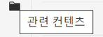
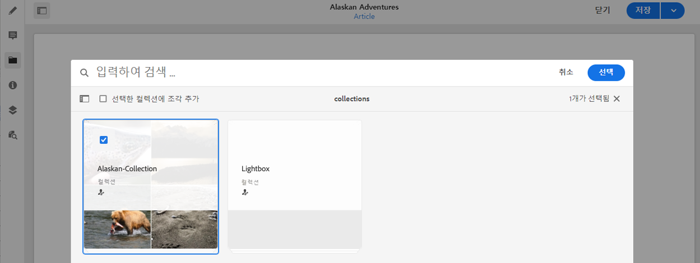
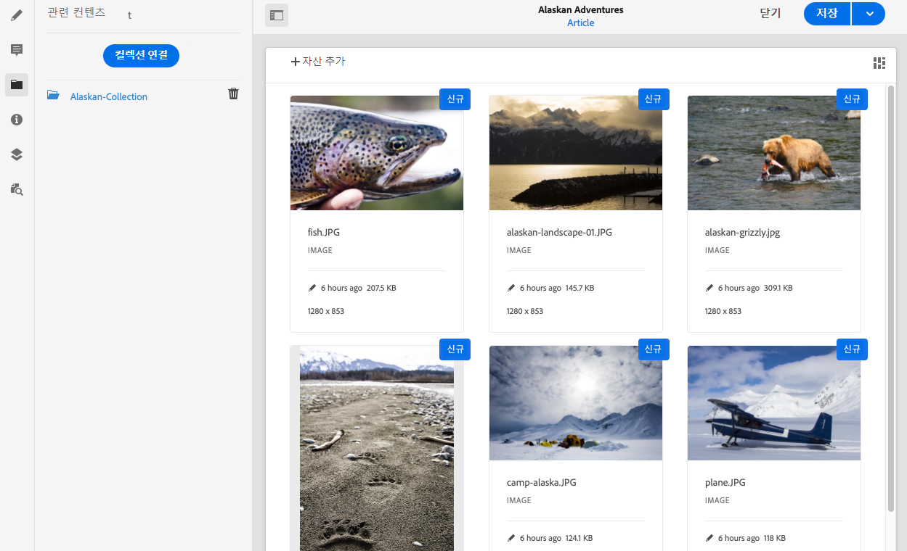

# 관련 콘텐츠{#associated-content}

<!--
hide: yes
index: no
hidefromtoc: yes
-->

AEM의 관련 콘텐츠 기능은 [페이지에서 콘텐츠 조각을 사용할 때 액세스할 수 있는 다양한 자산을 제공](/help/sites-cloud/authoring/fundamentals/content-fragments.md#using-associated-content)함으로써 콘텐츠 페이지에 자산을 추가할 때 조각과 함께 해당 자산을 선택적으로 사용할 수 있도록 하는 연결을 제공합니다. 이를 통해 적절한 자산을 검색하는 데 필요한 시간을 절약할 수도 있습니다. Headless 콘텐츠 게재를 위한 유연성도 제공합니다.

## 관련 콘텐츠 추가 {#adding-associated-content}

>[!NOTE]
>
>[시각적 자산(예: 이미지)](/help/sites-cloud/administering/content-fragments/content-fragments.md#fragments-with-visual-assets)을 조각 및/또는 페이지에 추가하는 다양한 방법이 있습니다.

연결하려면 먼저 [미디어 자산을 컬렉션에 추가](/help/assets/manage-collections.md)해야 합니다. 이러한 작업을 마치면 다음과 같은 작업을 수행할 수 있습니다.

1. 조각을 열고 사이드 패널에서 **관련 콘텐츠**&#x200B;를 선택합니다.

   

1. 컬렉션이 이미 연결되어 있는지 여부에 따라 다음 중 하나를 선택합니다.

   * **콘텐츠 연결** - 첫 번째 연결된 컬렉션
   * **컬렉션 연결** - 연결된 컬렉션이 구성되어 있는 경우 이 옵션을 선택합니다.

1. 필요한 컬렉션을 선택합니다.

   원할 경우 선택한 컬렉션에 조각 자체를 추가할 수도 있습니다. 이렇게 하면 추적에 유용합니다.

   

1. **선택**&#x200B;을 사용하여 확인합니다. 컬렉션이 연결된 것으로 표시됩니다.

   

## 관련 콘텐츠 편집 {#editing-associated-content}

컬렉션을 연결하면 다음 작업을 수행할 수 있습니다.

* 연결 **제거**
* 컬렉션에 **자산 추가**
* 추가 작업을 위한 자산 선택
* 자산 편집
