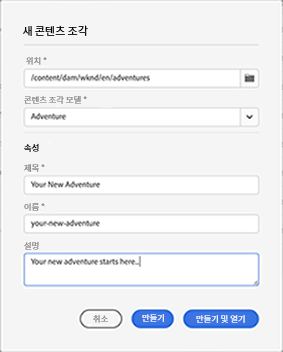

# 컨텐츠 조각 콘솔  {#content-fragments-console}

컨텐츠 조각 콘솔에서 컨텐츠 조각에 대한 액세스를 최적화하는 방법을 알아보고, 게시, 게시 취소, 복사와 같은 관리 작업을 수행하여 컨텐츠 조각을 만들고, 검색하고, 관리할 수 있습니다.

컨텐츠 조각 콘솔은 컨텐츠 조각을 관리, 검색 및 만드는 데 사용됩니다. 헤드리스 컨텍스트에서 사용하도록 최적화되었지만 페이지 작성에서 사용할 컨텐츠 조각을 만들 때도 사용됩니다.

>[!NOTE]
>
>이 콘솔에는 컨텐츠 조각만 표시됩니다. 이미지 및 비디오와 같은 다른 자산 유형은 표시되지 않습니다.

>[!NOTE]
>
>현재 다음을 통해 컨텐츠 조각에 액세스할 수 있습니다.
>
>* 이 **컨텐츠 조각** 콘솔
>* a **자산** 콘솔 - 다음을 참조하십시오. [컨텐츠 조각 관리](/help/assets/content-fragments/content-fragments-managing.md)

컨텐츠 조각 콘솔은 전역 탐색의 최상위 수준에서 직접 액세스할 수 있습니다.

선택 **컨텐츠 조각** 새 탭에서 콘솔을 엽니다.

여기에서 세 가지 주요 영역이 있음을 볼 수 있습니다.

* 상단 도구 모음
   * 표준 AEM 기능 제공
   * 또한 IMS 조직을 표시합니다
* 왼쪽 패널
   * 여기에서 폴더 트리를 숨기거나 표시할 수 있습니다
   * 트리의 특정 분기를 선택할 수 있습니다
* 기본/오른쪽 패널 - 여기에서 다음 작업을 수행할 수 있습니다.
   * 트리의 선택한 분기에 있는 모든 컨텐츠 조각 목록을 참조하십시오
      * 위치는 탐색 표시로 표시됩니다. 위치를 변경하는 데에도 사용할 수 있습니다
      * 선택한 폴더의 컨텐츠 조각이 표시되고 모든 하위 폴더가 표시됩니다
         * 컨텐츠 조각에 대한 다양한 정보 필드에서 링크를 제공합니다. 편집기에서 적절한 조각을 열 수 있습니다
      * 열 헤더를 선택하여 해당 열에 따라 테이블을 정렬할 수 있습니다. 오름차순과 내림차순 간을 전환하려면 다시 선택하십시오.
   * **[만들기](#creating-new-content-fragment)** 새 컨텐츠 조각
   * [필터](#filtering-fragments) 선택 가능한 설명 내용에 따라 컨텐츠 조각을 수집하고 나중에 사용할 수 있도록 필터를 저장합니다
   * [검색](#searching-fragments) 컨텐츠 조각
   * 선택한 정보 열을 표시하도록 테이블 보기를 사용자 지정합니다
   * 사용 **자산에서 열기** 에서 현재 위치를 직접 열려면 **자산** 콘솔.

      >[!NOTE]
      >
      >다음 **자산** 콘솔은 이미지, 비디오 등과 같은 자산에 액세스하는 데 사용됩니다.  이 콘솔은 다음과 같이 액세스할 수 있습니다.
      >
      >* 사용 **자산에서 열기** 링크(컨텐츠 조각 콘솔에서)
      >* 전역 탐색 창에서 바로 액세스

특정 조각을 선택하면 해당 조각에 사용할 수 있는 작업에 초점을 둔 도구 모음이 열립니다. 여러 조각을 선택할 수도 있습니다. 그에 따라 작업 선택이 조정됩니다.

## 새 컨텐츠 조각 만들기 {#creating-new-content-fragment}

선택 **만들기** 콤팩트 열기 **새 컨텐츠 조각** 대화 상자:

## 조각 필터링 {#filtering-fragments}

필터 패널에서는 다음을 제공합니다.

* 선택 및 결합할 수 있는 선택 설명
* 기회 **저장** 구성
* 재사용을 위해 저장된 검색 필터를 검색하는 옵션

## 조각 검색 {#searching-fragments}

검색 상자는 전체 텍스트 검색을 지원합니다. 검색 상자에 검색어를 입력합니다.

선택한 결과를 제공합니다.

검색 상자에서도 빠른 액세스 권한을 제공합니다. **최근 컨텐츠 조각** 및 **저장된 검색**:

