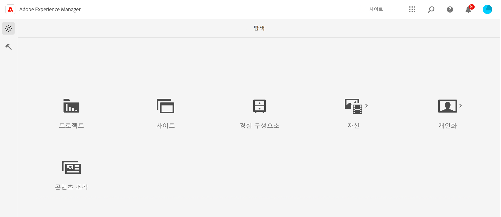
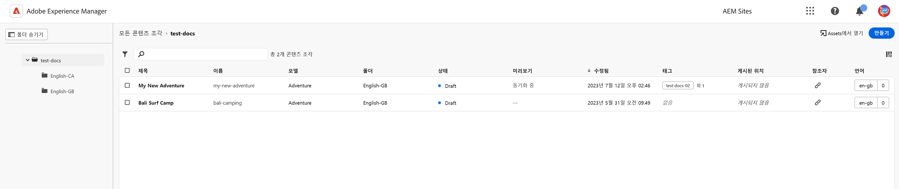
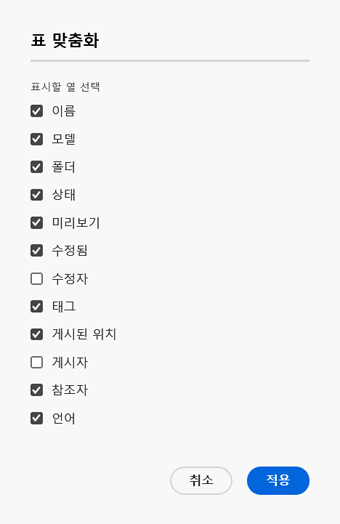

# 콘텐츠 조각 콘솔  {#content-fragments-console}

콘텐츠 조각 콘솔에서 콘텐츠 조각에 대한 액세스를 최적화하여 게시, 게시 취소, 복사와 같은 관리 작업을 수행하여 콘텐츠 조각을 만들고, 검색하고, 관리하는 방법에 대해 알아봅니다.

콘텐츠 조각 콘솔은 콘텐츠 조각을 관리, 검색 및 생성하는 데 사용됩니다. Headless 컨텍스트에서 사용하도록 최적화되었지만 페이지 작성 시 사용할 콘텐츠 조각을 만들 때도 사용됩니다.

>[!NOTE]
>
>이 콘솔에는 콘텐츠 조각만 표시됩니다. 이미지 및 비디오와 같은 다른 에셋 유형은 표시되지 않습니다.

>[!NOTE]
>
>현재 다음을 통해 콘텐츠 조각에 액세스할 수 있습니다.
>
>* 이 **콘텐츠 조각** 콘솔
>* **에셋** 콘솔 - [콘텐츠 조각 관리](/help/assets/content-fragments/content-fragments-managing.md) 참조

>[!NOTE]
>
>몇 가지 [키보드 단축키를 이 콘솔에서 사용할 수 있습니다](/help/sites-cloud/administering/content-fragments/content-fragments-console-keyboard-shortcuts.md).

>[!NOTE]
>
>프로젝트 팀은 필요한 경우 콘솔을 사용자 정의할 수 있습니다. 자세한 내용은 [콘텐츠 조각 콘솔 사용자 정의](/help/implementing/developing/extending/content-fragment-console-customizing.md)를 참조하십시오.

콘텐츠 조각 콘솔은 전역 탐색의 최상위 수준에서 직접 액세스할 수 있습니다.

## 콘솔의 기본 구조 및 처리 {#basic-structure-handling-content-fragments-console}

**콘텐츠 조각**&#x200B;을 선택하면 새 탭에서 콘솔이 열립니다.

여기에서 세 가지 주요 영역을 확인할 수 있습니다.

* 상단 도구 모음
   * 표준 AEM 기능을 제공합니다.
   * IMS 조직도 표시합니다.
* 왼쪽 패널
   * 여기에서 폴더 트리를 숨기거나 표시할 수 있습니다.
   * 트리의 특정 분기를 선택할 수 있습니다.
* 기본/오른쪽 패널 - 여기에서 다음 작업을 수행할 수 있습니다.
   * 선택한 트리 분기에 있는 모든 콘텐츠 조각 목록 표시:
      * 위치는 탐색 표시로 표시됩니다. 위치를 변경하는 데에도 사용할 수 있습니다.
      * 선택한 폴더의 콘텐츠 조각이 표시되고 모든 하위 폴더가 표시됩니다.:
         * 콘텐츠 조각에 대한 [다양한 정보 필드](#selectuse-available-columns)에서 링크가 제공됩니다. 필드에 따라 다음 작업을 수행할 수 있습니다.
            * 편집기에서 적절한 조각 열기
            * 참조에 대한 정보 표시
            * 조각의 언어 버전에 대한 정보 표시
         * [하나 이상의 콘텐츠 조각을 선택하여 사용 가능한 작업을 표시](#actions-selected-content-fragment)할 수 있습니다.
      * 열 헤더를 선택하여 해당 열에 따라 테이블을 정렬할 수 있습니다. 오름차순과 내림차순 간을 전환하려면 다시 선택하십시오. 현재 정렬은 **제목**, **수정일** 및 **수정한 사람** 열에서 지원됩니다.
   * 새 콘텐츠 조각 **[만들기](#creating-new-content-fragment)**
   * 다양한 술어에 따라 콘텐츠 조각을 [필터링](#filtering-fragments)하고 나중에 사용할 수 있도록 해당 필터 저장
   * 콘텐츠 조각 [검색](#searching-fragments)
   * [선택한 정보 열을 표시하도록 테이블 보기 맞춤화](#select-available-columns)
   * **에셋에서 열기**&#x200B;를 사용하여 **에셋** 콘솔에서 현재 위치를 바로 열 수 있습니다

      >[!NOTE]
      >
      >**에셋** 콘솔을 사용하여 이미지, 비디오 등의 에셋에 액세스할 수 있습니다.  이 콘솔은 다음과 같은 방법으로 액세스할 수 있습니다.
      >
      >* 콘텐츠 조각 콘솔에서 **에셋에서 열기** 링크 사용
      >* 전역 탐색 창에서 바로 액세스

## (선택한) 콘텐츠 조각 작업 {#actions-selected-content-fragment}

특정 조각을 선택하면 해당 조각에 사용할 수 있는 작업에 초점을 둔 도구 모음이 열립니다. 여러 조각을 선택할 수도 있습니다. 그에 따라 작업 선택이 조정됩니다.

* **열기**
* **게시** (및 **게시 취소**)
* **복사**
* **이동**
* **이름 변경**
* **삭제**

>[!NOTE]
>
>게시, 게시 취소, 삭제, 이동, 이름 변경, 복사, 비동기 작업 트리거와 같은 작업입니다. AEM 비동기 작업 UI를 통해 해당 작업의 진행 상태를 모니터링할 수 있습니다.

## 콘텐츠 조각에 대한 정보 제공 {#information-content-fragments}

콘솔의 기본/오른쪽 패널(테이블 보기)에 콘텐츠 조각에 대한 다양한 정보가 표시됩니다. 일부 항목에서는 추가 작업 및/또는 정보로 직접 연결될 수도 있습니다.

* **이름**
   * 편집기에서 조각 열기 링크 제공.
* **모델**
   * 편집기에서 조각 열기 링크 제공.
* **폴더**
   * 콘솔에서 폴더 열기 링크 제공.
폴더 이름에 마우스를 가져다 대면 JCR 경로가 표시됩니다.
* **상태**
   * 정보만
* **수정됨**
   * 정보만
* **수정한 사람**
   * 정보만
* **게시일**
   * 정보만
* **게시자**
   * 정보만
* **참조자**

   * 해당 조각의 모든 상위 참조를 표시하는 대화 상자를 여는 링크가 제공됩니다. 여기에는 콘텐츠 조각, 경험 조각 및 페이지 참조가 포함됩니다. 특정 참조를 열려면 대화 상자에서 **제목**&#x200B;을 클릭합니다.

      

* **언어**

   * 콘텐츠 조각과 관련된 총 로케일/언어 사본 수와 함께 콘텐츠 조각 로케일을 표시합니다.

      

      * 개수를 클릭/탭하여 모든 언어 사본을 표시하는 대화 상자를 엽니다. 특정 언어 사본을 열려면 대화 상자에서 **제목**&#x200B;을 클릭합니다.

         

## 사용 가능한 열 선택 {#select-available-columns}

다른 콘솔과 마찬가지로 다음 작업에 표시된 열을 구성할 수 있습니다.

숨기거나 표시할 수 있는 열 목록이 나타납니다.

## 새 콘텐츠 조각 만들기 {#creating-new-content-fragment}

**만들기**&#x200B;를 선택하면 간결한 **새 콘텐츠 조각** 대화 상자가 열립니다.

## 조각 필터링 {#filtering-fragments}

필터 패널에서는 다음을 제공합니다.

* 선택 및 결합이 가능한 다양한 술어
* 구성 **저장** 옵션
* 재사용을 위해 저장된 검색 필터를 검색할 수 있는 옵션

## 조각 검색 {#searching-fragments}

검색 상자는 전체 텍스트 검색을 지원합니다. 검색 상자에 검색어를 입력합니다.

선택한 결과가 제공됩니다.

검색 상자도 **최근 콘텐츠 조각** 및 **저장된 검색**&#x200B;에 대한 빠른 액세스를 제공합니다.

