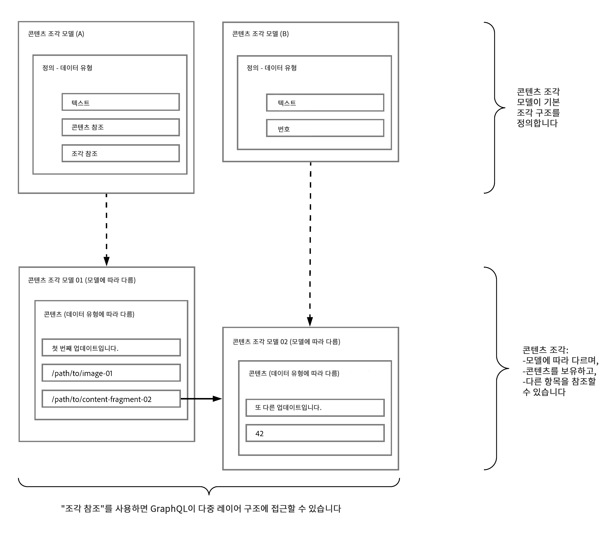

# GraphQL을 통해 콘텐츠 조각을 사용하여 Headless 콘텐츠 전달 {#headless-content-delivery-using-content-fragments-with-graphQL}

콘텐츠 조각 및 GraphQL API를 통해 Adobe Experience Manager(AEM) as a Cloud Service를 Headless CMS(콘텐츠 관리 시스템)로 사용할 수 있습니다.

이는 콘텐츠 조각과 AEM GraphQL API(표준 GraphQL 기반의 맞춤화된 구현)를 함께 사용하여 애플리케이션에서 사용할 구조화된 콘텐츠를 Headless 방식으로 제공함으로써 수행할 수 있습니다. 단일 API 쿼리 맞춤화 기능을 사용하면 렌더링하려는 단일 API 쿼리에 대한 응답으로서 특정 콘텐츠를 검색하고 전달할 수 있습니다.

>[!NOTE]
>
>또한 Headless 개념 및 용어 소개가 포함되어 있는
>
>* [Headless 소개](/help/headless/what-is-headless.md)를 참조하십시오.
>
>* [Headless 및 AEM](/help/headless/introduction.md): AEM Sites as a Cloud Service용 Headless 개발을 소개합니다.

>[!NOTE]
>
>GraphQL은 현재 Adobe Experience Manager(AEM) as a Cloud Service의 두 가지 (별도) 시나리오에서 사용됩니다.
>
>* [AEM Commerce는 GraphQL을 통해 상거래 플랫폼의 데이터를 사용합니다](/help/commerce-cloud/integrating/magento.md).
>* [AEM 콘텐츠 조각은 AEM GraphQL API(표준 GraphQL 기반의 맞춤화된 구현)와 함께 작동하여 애플리케이션에서 사용할 구조화된 콘텐츠를 제공합니다](/help/headless/graphql-api/content-fragments.md).

>[!CONTEXTUALHELP]
>id="aemcloud_sites_trial_admin_content_fragments_graphql"
>title="GraphQL API를 사용하여 컨텐츠 추출"
>abstract="이 단원에서는 컨텐츠 조각 및 GraphQL API를 헤드리스 컨텐츠 관리 시스템으로 사용하는 방법을 알아봅니다."

## Headless CMS {#headless-cms}

Headless 콘텐츠 관리 시스템(CMS)은 철저하게 콘텐츠 저장소로 디자인 및 구축된 백엔드 전용 콘텐츠 관리 시스템으로, API를 통해 콘텐츠에 액세스하여 이를 모든 디바이스에 표시할 수 있도록 합니다.

AEM에서의 콘텐츠 조각 작성 측면에서 볼 때 이는 다음을 의미합니다.

* 콘텐츠 조각을 사용하여 주로 서식이 지정된 페이지에 직접 게시(1:1)되지 않는 콘텐츠를 작성할 수 있습니다.

* 콘텐츠 조각의 콘텐츠는 콘텐츠 조각 모델에 따라 사전 결정된 방식으로 구조화됩니다. 이렇게 하면 애플리케이션의 액세스를 간소화할 수 있으므로 콘텐츠가 더 많이 처리됩니다.

## GraphQL - 개요 {#graphql-overview}

GraphQL은

* “*...API용 쿼리 언어 및 기존 데이터로 이러한 쿼리를 수행하기 위한 런타임입니다.*”

   [GraphQL.org](https://graphql.org)를 참조하십시오.

[AEM GraphQL API](#aem-graphql-api)를 사용하면 [콘텐츠 조각](/help/sites-cloud/administering/content-fragments/content-fragments.md)에서 (복잡한) 쿼리를 수행할 수 있습니다(각 쿼리는 특정 모델 유형에 따라 다름). 그런 다음 반환된 콘텐츠를 애플리케이션에서 사용할 수 있습니다.

## AEM GraphQL API {#aem-graphql-api}

Adobe Experience as a Cloud Experience를 위해 표준 GraphQL API의 맞춤화된 구현이 개발되었습니다. 자세한 내용은 [콘텐츠 조각과 함께 사용하기 위한 AEM GraphQL API](/help/headless/graphql-api/content-fragments.md)를 참조하십시오.

AEM GraphQL API 구현은 [GraphQL Java 라이브러리](https://graphql.org/code/#java)를 기반으로 합니다.

## AEM GraphQL API과 함께 사용하기 위한 콘텐츠 조각 {#content-fragments-use-with-aem-graphql-api}

[콘텐츠 조각](#content-fragments)은 다음과 같이 AEM 쿼리를 위한 GraphQL의 기반으로 사용할 수 있습니다.

* 이를 통해 페이지 독립적 콘텐츠를 디자인, 작성, 선별 및 게시할 수 있습니다.
* [콘텐츠 조각 모델](#content-fragments-models)은 정의된 데이터 유형을 통해 필요한 구조를 제공합니다.
* 모델을 정의할 때 사용할 수 있는 [조각 참조](#fragment-references)를 사용하여 구조 계층을 추가로 정의할 수 있습니다.

### 콘텐츠 조각 {#content-fragments}

콘텐츠 조각:

* 구조화된 콘텐츠를 포함합니다.

* 최종 조각의 구조를 사전 정의하는 [콘텐츠 조각 모델](#content-fragments-models)을 기반으로 합니다.

### 콘텐츠 조각 모델 {#content-fragments-models}

이러한 [콘텐츠 조각 모델](/help/sites-cloud/administering/content-fragments/content-fragments-models.md)은:

* **활성화** 시 [스키마](https://graphql.org/learn/schema/)를 생성하는 데 사용됩니다.

* GraphQL에 필요한 데이터 유형과 필드를 제공합니다. 애플리케이션이 가능한 요청만 수행하고 예상되는 내용을 수신하도록 합니다.

* **[조각 참조](#fragment-references)** 데이터 유형은 다른 콘텐츠 조각을 참조하여 추가적인 구조 수준을 가져오도록 모델에서 사용할 수 있습니다.

### 조각 참조 {#fragment-references}

**[조각 참조](/help/sites-cloud/administering/content-fragments/content-fragments-models.md#fragment-reference-nested-fragments)**:

* 특히 GraphQL과 함께 유용하게 사용할 수 있습니다.

* 콘텐츠 조각 모델을 정의할 때 사용할 수 있는 특정 데이터 유형입니다.

* 특정 콘텐츠 조각 모델에 따라 다른 조각을 참조합니다.

* 구조화된 데이터를 검색할 수 있습니다.

   * **다중 피드**&#x200B;로 정의된 경우 주요 조각에서 여러 하위 조각을 참조(검색)할 수 있습니다.

### JSON 미리보기 {#json-preview}

콘텐츠 조각 모델 디자인 및 개발을 지원하기 위해 [JSON 출력](/help/sites-cloud/administering/content-fragments/content-fragments-json-preview.md)을 미리 볼 수 있습니다.

## AEM을 통해 GraphQL을 사용하는 방법 알아보기 - 샘플 콘텐츠 및 쿼리 {#learn-graphql-with-aem-sample-content-queries}

AEM GraphQL API 사용에 대한 소개는 [AEM을 통해 GraphQL을 사용하는 방법 알아보기 - 샘플 콘텐츠 및 쿼리](/help/headless/graphql-api/sample-queries.md)를 참조하십시오.

## 튜토리얼 - AEM Headless 및 GraphQL 시작하기

실습형 튜토리얼을 찾고 계십니까? Headless CMS 시나리오에서, AEM의 GraphQL API를 사용하여 콘텐츠를 구축하고 노출하고 외부 앱에서 사용하는 방법을 보여 주는 [AEM Headless 및 GraphQL 시작하기](https://experienceleague.adobe.com/docs/experience-manager-learn/getting-started-with-aem-headless/graphql/overview.html) 엔드투엔드 튜토리얼을 확인하십시오.
