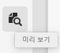
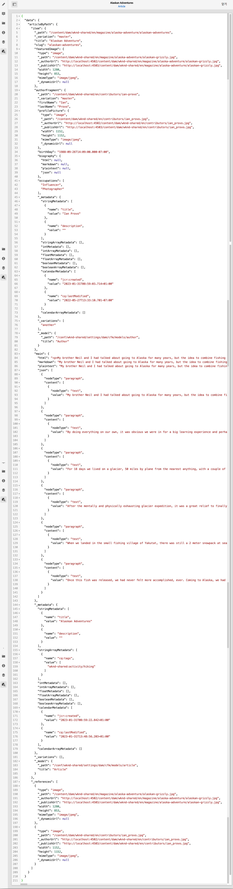

# 미리보기 - JSON 표현식 {#preview-json-representation}

AEM Headless 구현의 일부로 콘텐츠 조각용 모델을 개발할 때, 모델을 기반으로 콘텐츠 조각에 대한 샘플 JSON 출력을 볼 수 있습니다. 예를 들어 최종 출력이 어떻게 표시될지 확인할 수 있습니다. 이 기능은 데이터 유형별 기본 샘플 콘텐츠와 함께 모델 JSON 구조의 유효성을 검사할 때 유용합니다.

**미리보기** 아이콘을 사용하여

현재 조각의 JSON 표현식을 볼 수 있습니다. 예:

<!--
**Copy URL** lets you copy to clipboard the URL for either author or publish.
-->
