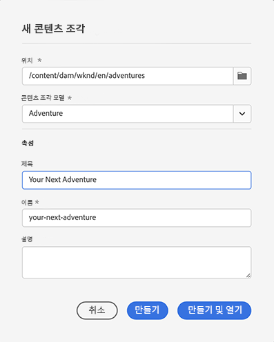
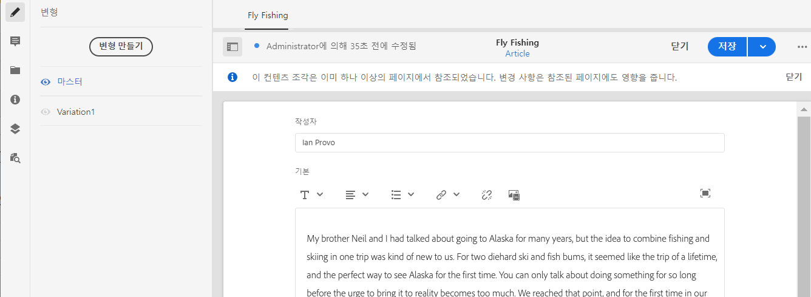
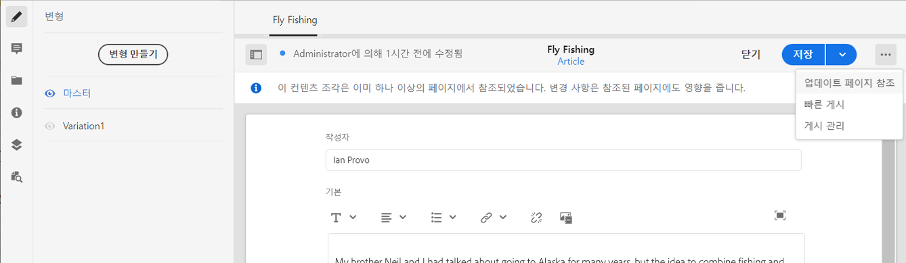
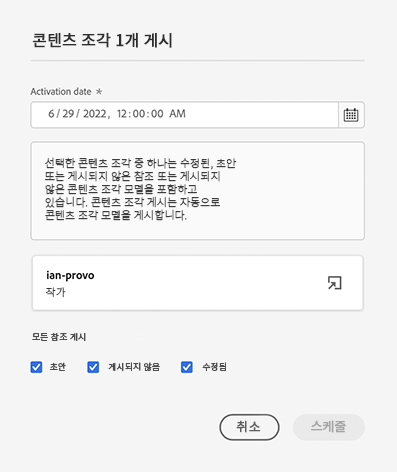
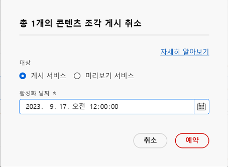
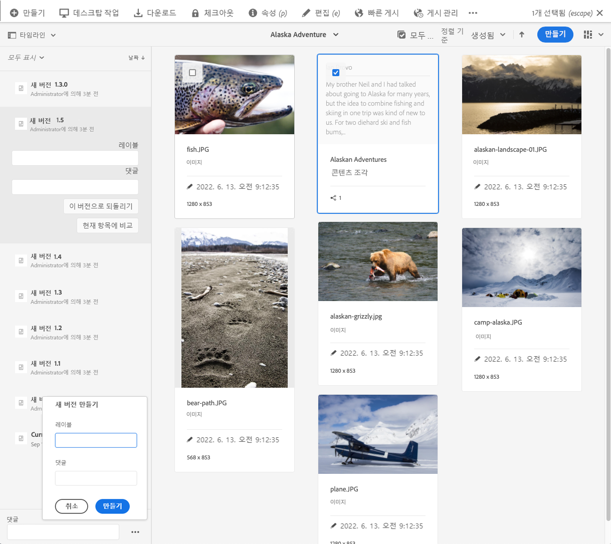
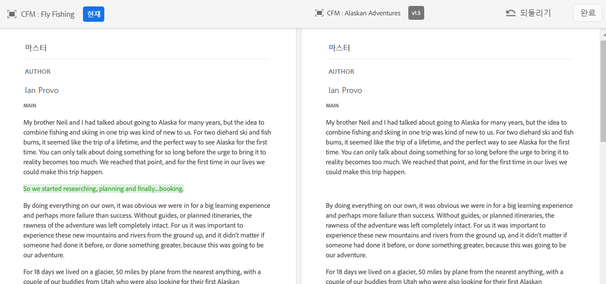

# 콘텐츠 조각 관리 {#managing-content-fragments}

<!--
hide: yes
index: no
hidefromtoc: yes
-->

**콘텐츠 조각** 콘솔을 사용하여 AEM 콘텐츠 조각을 관리하는 방법에 대해 알아봅니다. 페이지 작성에 사용하거나 Headless 콘텐츠의 기반으로 사용할 수 있습니다.

[콘텐츠 조각 모델](#creating-a-content-model)을 정의한 후 이를 사용하여 [콘텐츠 조각을 작성할](#creating-a-content-fragment) 수 있습니다.

[콘텐츠 조각 편집기](#opening-the-fragment-editor)는 다음과 같은 작업을 수행할 수 있는 다양한 [모드](#modes-in-the-content-fragment-editor)를 제공합니다.

* [콘텐츠 편집](#editing-the-content-of-your-fragment) 및 [변형 관리](#creating-and-managing-variations-within-your-fragment)
* [조각에 주석 달기](/help/sites-cloud/administering/content-fragments/content-fragments-variations.md#annotating-a-content-fragment)
* [조각과 콘텐츠 연결](#associating-content-with-your-fragment)
* [메타데이터 구성](#viewing-and-editing-the-metadata-properties-of-your-fragment)
* [구조 트리 보기](/help/sites-cloud/administering/content-fragments/content-fragments-structure-tree.md)
* [JSON 표현식 미리보기](/help/sites-cloud/administering/content-fragments/content-fragments-json-preview.md)

>[!NOTE]
>
>다음과 같은 경우 콘텐츠 조각을 사용할 수 있습니다.
>
>* 페이지 작성 시([콘텐츠 조각을 사용하여 페이지 작성](/help/sites-cloud/authoring/fundamentals/content-fragments.md) 참조)
>* [GraphQL을 통해 콘텐츠 조각을 사용하여 Headless 콘텐츠 게재](/help/sites-cloud/administering/content-fragments/content-fragments-graphql.md) 시

>[!NOTE]
>
>콘텐츠 조각은 **자산**&#x200B;으로 저장됩니다. 주로 **콘텐츠 조각** 콘솔에서 관리되지만 [자산](/help/assets/content-fragments/content-fragments-managing.md) 콘솔에서도 관리할 수 있습니다.

## 콘텐츠 조각 콘솔 {#content-fragments-console}

콘텐츠 조각 콘솔에서 조각 및 관련 작업에 직접 액세스할 수 있습니다. 자세한 내용은 다음을 참조하십시오.

* [콘텐츠 조각 콘솔의 기본 구조 및 처리](/help/sites-cloud/administering/content-fragments/content-fragments-console.md#basic-structure-handling-content-fragments-console)

* [콘텐츠 조각에 대한 정보 제공](/help/sites-cloud/administering/content-fragments/content-fragments-console.md#information-content-fragments)

* [콘텐츠 조각 콘솔의 콘텐츠 조각에 대한 작업](/help/sites-cloud/administering/content-fragments/content-fragments-console.md#actions-selected-content-fragment)

* [콘텐츠 조각 콘솔에서 사용 가능한 열 맞춤화](/help/sites-cloud/administering/content-fragments/content-fragments-console.md#select-available-columns)

* [콘텐츠 조각 콘솔에서 검색 및 필터링](/help/sites-cloud/administering/content-fragments/content-fragments-console.md#filtering-fragments)

## 콘텐츠 조각 만들기 {#creating-content-fragments}

### 콘텐츠 모델 만들기 {#creating-a-content-model}

구조화된 콘텐츠를 사용하여 콘텐츠 조각을 생성하기 전에 [콘텐츠 조각 모델](/help/sites-cloud/administering/content-fragments/content-fragments-models.md)을 활성화하고 생성할 수 있습니다.

### 콘텐츠 조각 만들기 {#creating-a-content-fragment}

콘텐츠 조각을 만들려면 다음 작업을 수행하십시오.

1. **콘텐츠 조각** 콘솔에서 **만들기**&#x200B;를 선택합니다(오른쪽 상단).

   >[!NOTE]
   >
   >새 조각의 위치를 미리 정의하려면 조각을 만들려는 폴더로 이동하거나 생성 프로세스 중에 위치를 지정할 수 있습니다.

1. **새 콘텐츠 조각** 대화 상자가 열리면 여기에서 다음을 지정할 수 있습니다.

   * **위치** - 현재 위치로 자동 완성되지만 필요한 경우 다른 위치를 선택할 수 있음
   * **콘텐츠 조각 모델** - 드롭다운 목록에서 조각 기반으로 사용할 모델을 선택합니다.
   * **제목**
   * **이름** - **제목**&#x200B;을 기반으로 자동 완성되지만 필요한 경우 편집할 수 있음
   * **설명**

   

1. 정의를 유지하려면 **만들기** 또는 **만들기 및 열기**&#x200B;를 선택합니다.

## 콘텐츠 조각 상태 {#statuses-content-fragments}

콘텐츠 조각은 존재하는 동안 [콘텐츠 조각 콘솔](/help/sites-cloud/administering/content-fragments/content-fragments-console.md)에 표시되는 것과 같이 여러 상태를 가질 수 있습니다.

* **새로 만들기**
콘텐츠 조각 편집기에서 새 콘텐츠 조각을 만들었지만 편집하거나 열지 않았습니다.
* **초안**
누군가 콘텐츠 조각 편집기에서 (새) 콘텐츠 조각을 편집하거나 열었지만 아직 게시되지 않았습니다.
* **게시됨**
콘텐츠 조각이 게시되었습니다.
* **수정됨**
콘텐츠 조각이 게시된 후 수정을 게시하기 전에 편집되었습니다.
* **게시 취소됨**
콘텐츠 조각의 게시가 취소되었습니다.

## 조각 편집기 열기 {#opening-the-fragment-editor}

편집할 조각을 열려면

>[!CAUTION]
>
>콘텐츠 조각을 편집하려면 [적절한 권한](/help/implementing/developing/extending/content-fragments-customizing.md#asset-permissions)이 있어야 합니다. 문제가 발생하는 경우 시스템 관리자에게 문의하십시오.

1. **콘텐츠 조각** 콘솔을 사용하여 콘텐츠 조각의 위치로 이동합니다.
1. 조각을 선택한 다음 도구 모음에서 **열기**&#x200B;를 선택하여 편집할 조각을 엽니다.

1. 조각 편집기가 열립니다. 필요에 따라 변경합니다.

   

1. 변경 내용을 적용한 후 필요에 따라 **저장**, **저장 및 닫기** 또는 **닫기**&#x200B;를 사용합니다.

   >[!NOTE]
   >
   >**저장 및 닫기**&#x200B;는 **저장** 드롭다운을 통해 사용할 수 있습니다.

   >[!NOTE]
   >
   >**저장 및 닫기** 및 **닫기**&#x200B;는 모두 편집기를 종료합니다. 콘텐츠 조각에 대해 다양한 옵션이 작동하는 방법에 대한 자세한 내용은 [저장, 닫기 및 버전](#save-close-and-versions)을 참조하십시오.

## 콘텐츠 조각 편집기의 모드 및 작업 {#modes-actions-content-fragment-editor}

콘텐츠 조각 편집기에서 사용할 수 있는 모드 및 작업은 다양합니다.

### 콘텐츠 조각 편집기의 모드 {#modes-in-the-content-fragment-editor}

사이드 패널의 아이콘을 사용하여 다양한 모드를 통해 탐색합니다.

* 변형: [콘텐츠 편집](#editing-the-content-of-your-fragment) 및 [변형 관리](#creating-and-managing-variations-within-your-fragment)

* [주석](/help/sites-cloud/administering/content-fragments/content-fragments-variations.md#annotating-a-content-fragment)
* [관련 콘텐츠](#associating-content-with-your-fragment)
* [메타데이터](#viewing-and-editing-the-metadata-properties-of-your-fragment)
* [구조 트리](/help/sites-cloud/administering/content-fragments/content-fragments-structure-tree.md)
* [미리보기](/help/sites-cloud/administering/content-fragments/content-fragments-json-preview.md)

### 콘텐츠 조각 편집기의 도구 모음 작업 {#toolbar-actions-in-the-content-fragment-editor}

상단 도구 모음의 일부 기능은 여러 모드에서 사용할 수 있습니다.

* 이미 콘텐츠 페이지에서 조각을 참조 중이면 메시지가 표시됩니다. 메시지를 **닫을** 수 있습니다.

* 사이드 패널은 **사이드 패널 전환** 아이콘을 사용하여 숨기거나 표시할 수 있습니다.

* 조각 이름 아래에 현재 조각 생성에 사용 중인 [콘텐츠 조각 모델](/help/sites-cloud/administering/content-fragments/content-fragments-models.md)의 이름이 표시됩니다.

   * 이 이름은 모델 편집기를 여는 링크이기도 합니다.

* 조각 상태(예: 생성, 수정 또는 게시된 시기에 대한 정보)를 확인합니다. 상태도 색상으로 구분됩니다.

   * **새로 만들기**: 회색
   * **초안**: 파란색
   * **게시됨**: 녹색
   * **수정됨**: 주황색
   * **비활성화됨**: 빨간색

* **저장**&#x200B;은 **저장 및 닫기** 옵션에 대한 액세스를 제공합니다.

* 점 세 개(**...**) 드롭다운에서 추가 작업에 액세스할 수 있습니다.
   * **페이지 참조 업데이트**
      * 모든 페이지 참조가 업데이트됩니다.
   * **[빠른 게시](/help/assets/manage-publication.md#quick-publish)**
   * **[게시 관리](/help/assets/manage-publication.md#manage-publication)**

<!--
This updates any page references and ensures that the Dispatcher is flushed as required. -->

## 저장, 닫기 및 버전 {#save-close-and-versions}

>[!NOTE]
>
>버전은 [타임라인에서 만들고, 비교하고, 되돌릴](/help/sites-cloud/administering/content-fragments/content-fragments-managing.md#timeline-for-content-fragments) 수도 있습니다.

편집기에는 다양한 옵션이 있습니다.

* **저장** 및 **저장 및 닫기**

   * **저장**&#x200B;을 선택하면 마지막 변경 내용이 저장되고 편집기에 계속 남아 있을 수 있습니다.
   * **저장 및 닫기**&#x200B;를 선택하면 마지막 변경 내용이 저장되고 편집기가 종료됩니다.

  >[!CAUTION]
  >
  >콘텐츠 조각을 편집하려면 [적절한 권한](/help/implementing/developing/extending/content-fragments-customizing.md#asset-permissions)이 있어야 합니다. 문제가 발생하는 경우 시스템 관리자에게 문의하십시오.

  >[!NOTE]
  >
  >저장하기 전에 일련의 변경 내용을 적용한 다음 편집기에 남아 있을 수 있습니다.

  >[!CAUTION]
  >
  >이 작업은 변경 내용을 저장하는 것 이외에도 모든 참조도 업데이트하며 필요에 따라 Dispatcher를 플러시합니다. 이러한 변경 사항은 처리에 시간이 걸릴 수 있습니다. 이로 인해 대형/복합/부하가 큰 시스템의 성능에 영향이 있을 수 있습니다.
  >
  >**저장 및 닫기**&#x200B;를 사용한 다음, 조각 편집기로 빠르게 다시 들어가 이후 변경 내용을 적용하고 저장할 때 이 프로세스 시간을 염두에 두십시오.

* **닫기**

  마지막 변경 내용(마지막 **저장** 이후에 적용된 변경 내용)을 저장하지 않고 편집기를 종료합니다.

콘텐츠 조각을 편집하는 동안 AEM은 자동으로 버전을 만들어 변경 내용을 취소한 경우(저장하지 않고 **닫기** 사용) 이전 콘텐츠를 복원할 수 있도록 합니다.

1. 편집하기 위해 콘텐츠 조각을 열면 AEM에서는 *편집 세션*&#x200B;이 존재하는지 여부를 나타내는 쿠키 기반 토큰이 있는지 확인합니다.

   1. 토큰을 찾으면 조각은 기존 편집 세션의 일부로 간주됩니다.
   2. 토큰을 사용할 수 *없고* 사용자가 콘텐츠 편집을 시작하는 경우에는 버전이 만들어지고 이 새 편집 세션에 대한 토큰이 클라이언트에 보내져 거기에서 쿠키에 저장됩니다.

2. *활성* 편집 세션이 있는 동안 편집되는 콘텐츠는 600초(기본값)마다 자동으로 저장됩니다.

   >[!NOTE]
   >
   >자동 저장 간격은 `/conf` 메커니즘을 사용하여 구성할 수 있습니다.
   >
   >기본값을 알려면 다음을 참조하십시오.
   >  `/libs/settings/dam/cfm/jcr:content/autoSaveInterval`

3. 사용자가 편집을 취소하면 편집 세션 시작 시 생성된 버전이 복원되고 토큰이 제거되어 편집 세션이 종료됩니다.
4. 사용자가 편집 내용을 **저장**&#x200B;하도록 선택하면 업데이트된 요소/변형이 유지되고 토큰이 제거되어 편집 세션이 종료됩니다.

## 조각 콘텐츠 편집 {#editing-the-content-of-your-fragment}

조각을 열면 [변형](/help/sites-cloud/administering/content-fragments/content-fragments-variations.md) 탭을 사용하여 콘텐츠를 작성할 수 있습니다.

## 조각 내 변형 생성 및 관리 {#creating-and-managing-variations-within-your-fragment}

마스터 콘텐츠를 만들면 해당 콘텐츠의 [변형](/help/sites-cloud/administering/content-fragments/content-fragments-variations.md)을 만들고 관리할 수 있습니다.

## 조각과 콘텐츠 연결 {#associating-content-with-your-fragment}

조각과 [콘텐츠를 연결](/help/sites-cloud/administering/content-fragments/content-fragments-assoc-content.md)할 수도 있습니다. 이렇게 하면 조각이 콘텐츠 페이지에 추가될 때 자산(예: 이미지)을 조각과 함께 필요에 따라 사용할 수 있도록 연결을 제공합니다.

## 조각의 메타데이터(속성) 보기 및 편집 {#viewing-and-editing-the-metadata-properties-of-your-fragment}

[메타데이터](/help/sites-cloud/administering/content-fragments/content-fragments-metadata.md) 탭을 사용하여 조각의 속성을 보고 편집할 수 있습니다.

## 조각 게시 및 미리보기 {#publishing-and-previewing-a-fragment}

콘텐츠 조각을 다음에 게시할 수 있습니다.

* **[게시 서비스](/help/overview/architecture.md#runtime-architecture)** - 전체 공개 액세스용

* **[미리보기 서비스](/help/overview/architecture.md#runtime-architecture)** - 정식 출시 전 콘텐츠 미리보기용

  >[!CAUTION]
  >
  >**게시** 액션을 통해 [콘텐츠 조각 콘솔](/help/sites-cloud/administering/content-fragments/content-fragments-console.md)에서만 **미리보기 서비스**&#x200B;에 콘텐츠 조각을 게시할 수 있습니다.

  >[!NOTE]
  >
  >미리보기 환경에 대한 자세한 내용은 다음을 참조하십시오.
  >
  >* [환경 관리](/help/implementing/cloud-manager/manage-environments.md#access-preview-service)
  >* [미리보기 계층을 위한 OSGi 설정 구성](/help/implementing/preview-tier/preview-tier-configuring-osgi.md#configuring-osgi-settings-for-the-preview-tier)
  >* [Developer Console을 사용하여 미리보기 디버깅](/help/implementing/preview-tier/preview-tier-configuring-osgi.md#debugging-preview-using-the-developer-console)

[콘텐츠 조각 콘솔](/help/sites-cloud/administering/content-fragments/content-fragments-console.md#actions-selected-content-fragment)의 도구 모음에서 **게시** 옵션을 사용하여 콘텐츠 조각을 게시하는 경우

>[!CAUTION]
>
>조각이 모델을 기반으로 한다면 [모델이 게시되었는지](/help/sites-cloud/administering/content-fragments/content-fragments-models.md#publishing-a-content-fragment-model) 확인해야 합니다.
>
>모델이 아직 게시되지 않은 콘텐츠 조각을 게시하는 경우, 선택 목록에 이것이 표시되고 모델이 조각과 함께 게시됩니다.

1. 목록에서 하나 이상의 조각을 선택합니다.

1. 도구 모음에서 **게시**&#x200B;를 선택하고 다음 중 하나를 선택하여 적절한 대화 상자를 엽니다.

   * **지금** - **게시 서비스** 또는 **미리보기 서비스** 중 하나를 선택하면 확인 후 조각이 즉시 게시됩니다.
   * **예약** - 필수 서비스 외에 조각을 게시할 날짜 및 시간을 선택할 수도 있음

   필요한 경우, 게시할 참조를 지정해야 합니다. 기본적으로 미리보기 서비스에도 참조를 게시하여 콘텐츠에 브레이크가 없는지 확인합니다.
예: 예약된 게시 요청의 경우
   

1. 게시 액션을 확인합니다.

다음을 사용하여 [콘텐츠 조각 편집기](#toolbar-actions-in-the-content-fragment-editor)에서 **게시 서비스**&#x200B;에 게시할 수도 있습니다.
* **빠른 게시**
* **게시 관리**

>[!NOTE]
>
>[조각을 사용하는 페이지를 게시](/help/sites-cloud/authoring/fundamentals/content-fragments.md#publishing)한 후 페이지 참조에 조각이 나열됩니다.

>[!CAUTION]
>
>조각이 게시 및/또는 참조된 후 작성자가 편집을 위해 조각을 다시 열면 AEM에 경고가 표시됩니다. 작성자는 조각에 대한 변경 사항이 참조된 페이지에도 영향을 미칠 것이라는 경고를 받습니다.

## 조각 게시 취소 {#unpublishing-a-fragment}

콘텐츠 조각 게시를 취소하려면 하나 이상의 조각을 선택한 다음 [콘텐츠 조각 콘솔](/help/sites-cloud/administering/content-fragments/content-fragments-console.md#actions-selected-content-fragment)의 도구 모음에서 **게시 취소**&#x200B;합니다. **지금** 또는 **예약됨**&#x200B;을 선택할 수 있습니다.

관련 대화 상자가 열리면 적절한 서비스를 선택할 수 있습니다.

>[!NOTE]
>
>게시된 조각을 사용할 수 있는 경우에만 **게시 취소** 작업이 표시됩니다.

>[!CAUTION]
>
>다른 조각 또는 페이지에서 조각이 이미 참조된 경우 경고 메시지가 나타나고 계속 진행할지 확인해야 합니다.

## 조각 삭제 {#deleting-a-fragment}

조각을 삭제하려면 다음 작업을 수행합니다.

1. **콘텐츠 조각** 콘솔에서 콘텐츠 조각의 위치로 이동합니다.
2. 조각을 선택합니다.

   >[!NOTE]
   >
   >**삭제** 작업은 빠른 작업으로 사용할 수 없습니다.

3. 도구 모음에서 **삭제**&#x200B;를 선택합니다.
4. **삭제** 작업을 확인합니다.

   >[!CAUTION]
   >
   >다른 조각 또는 페이지에서 조각이 이미 참조된 경우 경고 메시지가 나타나고 **강제 삭제**&#x200B;를 진행할지 확인해야 합니다. 해당 콘텐츠 조각 구성 요소와 함께 조각이 모든 콘텐츠 페이지에서 삭제됩니다.

## 조각의 상위 참조 찾기 {#parent-references-fragment}

상위 참조에 대한 세부 정보는 [콘텐츠 조각 콘솔](/help/sites-cloud/administering/content-fragments/content-fragments-console.md#information-content-fragments)의 **참조** 열에서 액세스할 수 있습니다.

## 조각의 언어 사본 찾기 {#language-copies-fragment}

언어 사본에 대한 세부 정보는 [콘텐츠 조각 콘솔](/help/sites-cloud/administering/content-fragments/content-fragments-console.md#information-content-fragments)의 **언어** 열에서 액세스할 수 있습니다.

## 콘텐츠 조각 타임라인 {#timeline-for-content-fragments}

>[!NOTE]
>
>이 기능은 **자산** 콘솔에서만 사용할 수 있습니다.

표준 옵션뿐만 아니라 [타임라인](/help/assets/manage-digital-assets.md#timeline)도 콘텐츠 조각과 관련된 정보와 작업을 모두 제공합니다.

* 버전, 댓글 및 주석에 대한 정보 보기
* 버전에 대한 작업

   * **[이 버전으로 되돌리기](#reverting-to-a-version)** (기존 조각을 선택한 후 특정 버전을 선택합니다.)

   * **[현재 항목에 비교](#comparing-fragment-versions)** (기존 조각을 선택한 후 특정 버전을 선택합니다.)

   * **레이블** 및/또는 **댓글** 추가 (기존 조각을 선택한 후 특정 버전을 선택합니다.)

   * **다른 버전으로 저장** (기존 조각을 선택한 후 타임라인 하단의 위쪽 화살표를 선택합니다.)

* 주석에 대한 작업

   * **삭제**

>[!NOTE]
>
>댓글은
>
>* 모든 자산에 대한 표준 기능입니다.
>* 타임라인에서 만들어집니다.
>* 조각 자산과 관련되어 있습니다.
>
>주석(콘텐츠 조각)은
>
>* 조각 편집기에서 입력됩니다.
>* 조각 내의 선택된 텍스트 세그먼트에 대한 것입니다.
>

예:

## 조각 버전 비교 {#comparing-fragment-versions}

>[!NOTE]
>
>이 기능은 **자산** 콘솔에서만 사용할 수 있습니다.

**현재 항목에 비교** 작업은 특정 버전을 선택한 후 [타임라인](/help/sites-cloud/administering/content-fragments/content-fragments-managing.md#timeline-for-content-fragments)에서 사용할 수 있습니다.

이 옵션을 선택하면 다음 항목이 열립니다.

* **현재** (최신) 버전 (왼쪽)

* 선택한 버전 **v&lt;*x.y*>** (오른쪽)

이는 나란히 표시되며, 여기에서

* 다른 곳들은 모두 강조 표시됩니다.

   * 삭제된 텍스트 - 빨간색
   * 삽입된 텍스트 - 녹색
   * 대체된 텍스트 - 파란색

* 전체 화면 아이콘을 사용하면 두 버전 중 하나를 자체적으로 열 수 있습니다. 그런 다음 병렬 보기로 다시 전환할 수 있습니다.
* 특정 버전으로 **되돌릴** 수 있습니다.
* **완료**&#x200B;를 선택하면 콘솔로 돌아갑니다.

>[!NOTE]
>
>조각을 비교할 때에는 조각 콘텐츠를 편집할 수 없습니다.

## 버전으로 되돌리기  {#reverting-to-a-version}

>[!NOTE]
>
>이 기능은 **자산** 콘솔에서만 사용할 수 있습니다.

조각을 특정 버전으로 되돌릴 수 있습니다.

* [타임라인](/help/sites-cloud/administering/content-fragments/content-fragments-managing.md#timeline-for-content-fragments)에서 바로 되돌릴 수 있습니다.

  필요한 버전을 선택한 후 **이 버전으로 되돌리기** 작업을 선택합니다.

* [버전을 현재 버전과 비교](/help/sites-cloud/administering/content-fragments/content-fragments-managing.md#comparing-fragment-versions)하는 동안 선택한 버전으로 **되돌릴** 수 있습니다.
