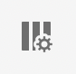
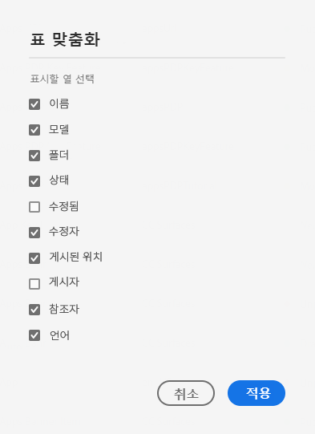
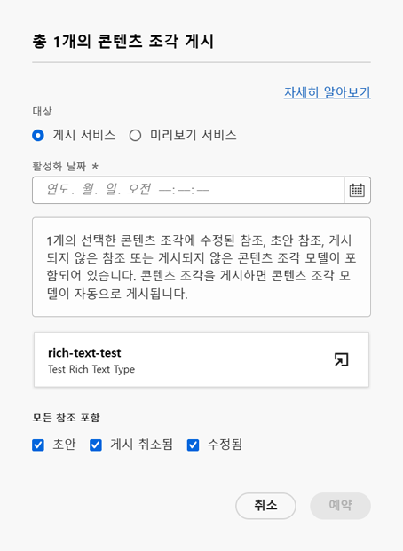

# 콘텐츠 조각 관리 {#managing-content-fragments}

사용 방법을 알아봅니다 **컨텐츠 조각** 콘솔을 사용하여 AEM 컨텐츠 조각을 관리할 수 있습니다. 이러한 매개 변수는 페이지 작성에 사용하거나 헤드리스 컨텐츠의 기반으로 사용할 수 있습니다.

을 정의한 후 [컨텐츠 조각 모델](#creating-a-content-model) 다음 작업을 수행할 수 있습니다. [컨텐츠 조각 만들기](#creating-a-content-fragment).

다음 [컨텐츠 조각 편집기](#opening-the-fragment-editor) 다양한 제공 [모드](#modes-in-the-content-fragment-editor) 다음을 수행할 수 있습니다.

* [컨텐츠 편집](#editing-the-content-of-your-fragment) 및 [변형 관리](#creating-and-managing-variations-within-your-fragment)
* [조각에 주석 달기](/help/sites-cloud/administering/content-fragments/content-fragments-variations.md#annotating-a-content-fragment)
* [조각과 컨텐츠 연결](#associating-content-with-your-fragment)
* [메타데이터 구성](#viewing-and-editing-the-metadata-properties-of-your-fragment)
* [구조 트리 보기](/help/sites-cloud/administering/content-fragments/content-fragments-structure-tree.md)
* [JSON 표현 미리 보기](/help/sites-cloud/administering/content-fragments/content-fragments-json-preview.md)

>[!NOTE]
>
>컨텐츠 조각은 다음 방법으로 사용할 수 있습니다.
>
>* 페이지를 작성할 때 참조 [컨텐츠 조각으로 페이지 작성](/help/sites-cloud/authoring/fundamentals/content-fragments.md).
>* 대상 [GraphQL에서 컨텐츠 조각을 사용하여 헤드리스 컨텐츠 전달](/help/sites-cloud/administering/content-fragments/content-fragments-graphql.md).

>[!NOTE]
>
>컨텐츠 조각은 **자산**. 주로 **컨텐츠 조각** 콘솔에서 관리할 수도 있습니다. **자산** 콘솔.

## 컨텐츠 조각 만들기 {#creating-content-fragments}

### 컨텐츠 모델 만들기 {#creating-a-content-model}

구조화된 컨텐츠와 함께 컨텐츠 조각을 생성하기 전에 [컨텐츠 조각 모델](/help/sites-cloud/administering/content-fragments/content-fragments-models.md)을 활성화하고 생성할 수 있습니다.

### 콘텐츠 조각 만들기 {#creating-a-content-fragment}

컨텐츠 조각을 생성하려면 다음을 수행하십시오.

1. 에서 **컨텐츠 조각** 콘솔, 선택 **만들기** (오른쪽 상단).

   >[!NOTE]
   >
   >새 조각의 위치를 미리 정의하려면 조각을 만들려는 폴더로 이동하거나 생성 프로세스 중에 위치를 지정할 수 있습니다.

1. 다음 **새 컨텐츠 조각** 대화 상자가 열리면 여기에서 다음을 지정할 수 있습니다.

   * **위치** - 현재 위치로 자동 완료되지만 필요한 경우 다른 위치를 선택할 수 있습니다
   * **컨텐츠 조각 모델** - 드롭다운 목록에서 조각의 기반으로 사용할 모델을 선택합니다
   * **제목**
   * **이름** - 다음을 기반으로 자동으로 완료됩니다. **제목**&#x200B;로 설정되지만 필요한 경우 편집할 수 있습니다
   * **설명**

   

1. 선택 **만들기**, 또는 **만들기 및 열기** 정의를 유지합니다.

## 컨텐츠 조각 상태 {#statuses-content-fragments}

컨텐츠 조각이 있는 동안에 와 같이 여러 상태가 있을 수 있습니다. [컨텐츠 조각 콘솔](/help/sites-cloud/administering/content-fragments/content-fragments-console.md):

* **새로 만들기**
컨텐츠 조각 편집기에서 새 컨텐츠 조각을 만들었지만 편집하거나 열지 않았습니다.
* **초안**
누군가 컨텐츠 조각 편집기에서 (새) 컨텐츠 조각을 편집하거나 열었지만 아직 게시되지 않았습니다.
* **게시됨**
컨텐츠 조각이 게시되었습니다.
* **수정됨**
컨텐츠 조각 은 게시된 후(수정 사항을 게시하기 전) 편집되었습니다.
* **게시 취소됨**
컨텐츠 조각 의 게시가 취소되었습니다.

## 컨텐츠 조각 콘솔의 컨텐츠 조각에 대한 작업 {#actions-content-fragment-console}

에서 **컨텐츠 조각** 콘솔에서 도구 모음의 컨텐츠 조각에 다양한 작업을 사용할 수 있습니다.

* **자산에서 열기**
* **만들기**
* 다음 **참조자** 열은 해당 조각의 모든 상위 참조를 표시하는 직접 링크도 제공합니다. 컨텐츠 조각, 경험 조각 및 페이지 참조 포함.
* 폴더 이름을 마우스로 가리키면 JCR 경로가 표시됩니다.

조각을 선택한 후 모든 적절한 작업을 사용할 수 있습니다.

* **열기**
* **게시** (및 **게시 취소**)
* **복사**
* **이동**
* **이름 변경**
* **삭제**

>[!NOTE]
>
>게시, 게시 취소, 삭제, 이동, 이름 변경, 복사, 비동기 작업 트리거와 같은 작업입니다. AEM 비동기 작업 UI를 통해 해당 작업의 진행 상태를 모니터링할 수 있습니다.

## 컨텐츠 조각 콘솔에서 보기 사용자 지정 {#viewing-content-fragment-console}

콘솔에는 현재 폴더 및 모든 하위 폴더에 있는 컨텐츠 조각에 대한 정보가 표시됩니다.

을 사용하여 표시되는 정보를 사용자 지정할 수 있습니다. **테이블 사용자 지정** 아이콘:

이 옵션을 선택하면 **테이블 사용자 지정** 사용 가능한 열을 선택/선택 취소할 수 있는 대화 상자:

## 컨텐츠 조각 콘솔에서 검색 및 필터링 {#search-filter-content-fragment-console}

콘솔에 표시할 컨텐츠 조각을 검색 및/또는 필터링할 수 있습니다.

다음과 같은 작업을 수행할 수 있습니다.

* 필요한 폴더 선택
* 을 사용하여 필터 선택 **필터 표시** 아이콘을 클릭하고 검색 상자를 동시에 사용합니다.

다양한 필터를 사용할 수 있습니다.

나중에 참조할 수 있도록 필터 및 검색 조합을 저장할 수도 있습니다.

## 조각 편집기 열기 {#opening-the-fragment-editor}

편집할 조각을 열려면

>[!CAUTION]
>
>컨텐츠 조각을 편집하려면 [적절한 권한](/help/implementing/developing/extending/content-fragments-customizing.md#asset-permissions)이 있어야 합니다. 문제가 발생하는 경우 시스템 관리자에게 문의하십시오.

1. 를 사용하십시오 **컨텐츠 조각** 콘솔 을 클릭하여 컨텐츠 조각의 위치로 이동합니다.
1. 조각을 선택하여 편집할 조각을 엽니다 **열기** 를 클릭합니다.

1. 조각 편집기가 열립니다. 필요에 따라 변경합니다.

   

1. 변경한 후 **저장**, **저장 및 닫기** 또는 **닫기** 필요한 경우.

   >[!NOTE]
   >
   >**저장 및 닫기** 는 **저장** 드롭다운.

   >[!NOTE]
   >
   >둘 다 **저장 및 닫기** 및 **닫기** 편집기가 종료됩니다. [저장, 닫기 및 버전](#save-close-and-versions) 컨텐츠 조각에 대해 다양한 옵션이 작동하는 방식에 대한 자세한 내용을 살펴보십시오.

## 컨텐츠 조각 편집기의 모드 및 작업 {#modes-actions-content-fragment-editor}

컨텐츠 조각 편집기에서 사용할 수 있는 다양한 모드 및 작업이 있습니다.

### 컨텐츠 조각 편집기의 모드 {#modes-in-the-content-fragment-editor}

사이드 패널의 아이콘을 사용하여 다양한 모드를 탐색합니다.

* 변형: [컨텐츠 편집](#editing-the-content-of-your-fragment) 및 [변형 관리](#creating-and-managing-variations-within-your-fragment)

* [주석](/help/sites-cloud/administering/content-fragments/content-fragments-variations.md#annotating-a-content-fragment)
* [관련 컨텐츠](#associating-content-with-your-fragment)
* [메타데이터](#viewing-and-editing-the-metadata-properties-of-your-fragment)
* [구조 트리](/help/sites-cloud/administering/content-fragments/content-fragments-structure-tree.md)
* [미리보기](/help/sites-cloud/administering/content-fragments/content-fragments-json-preview.md)

### 컨텐츠 조각 편집기의 도구 모음 작업 {#toolbar-actions-in-the-content-fragment-editor}

상단 도구 모음의 일부 기능은 여러 모드에서 사용할 수 있습니다.

* 이미 컨텐츠 페이지에서 조각을 참조 중이면 메시지가 표시됩니다. 다음을 수행할 수 있습니다 **닫기** 메시지를 표시합니다.

* 사이드 패널은 **사이드 패널 전환** 아이콘을 사용하여 숨기거나 표시할 수 있습니다.

* 조각 이름 아래에 의 이름이 표시됩니다 [컨텐츠 조각 모델](/help/sites-cloud/administering/content-fragments/content-fragments-models.md) 현재 조각을 만드는 데 사용됩니다.

   * 이 이름은 모델 편집기를 여는 링크이기도 합니다.

* 조각의 상태를 참조하십시오. 예를 들어 생성, 수정 또는 게시된 시기에 대한 정보입니다. 상태도 색상으로 구분됩니다.

   * **새로 만들기**: 회색
   * **초안**: 파란색
   * **게시됨**: 녹색
   * **수정됨**: 주황
   * **비활성화됨**: 빨간색

* **저장** 에 대한 액세스 권한 제공 **저장 및 닫기** 선택 사항입니다.

* 세 점(**...**) 드롭다운에서 추가 작업에 액세스할 수 있습니다.
   * **업데이트 페이지 참조**
      * 그러면 모든 페이지 참조가 업데이트됩니다.
   * **[빠른 게시](#publishing-and-referencing-a-fragment)**
   * **[게시 관리](#publishing-and-referencing-a-fragment)**

<!--
This updates any page references and ensures that the Dispatcher is flushed as required. -->

## 저장, 닫기 및 버전 {#save-close-and-versions}

>[!NOTE]
>
>버전은 [타임라인에서 만들고, 비교하고, 되돌릴](/help/sites-cloud/administering/content-fragments/content-fragments-managing.md#timeline-for-content-fragments) 수도 있습니다.

편집기에는 다음과 같은 다양한 옵션이 있습니다.

* **저장** 및 **저장 및 닫기**

   * **저장** 은 최신 변경 사항을 저장하고 편집기에 유지됩니다.
   * **저장 및 닫기** 최신 변경 사항을 저장하고 편집기를 종료합니다.

   >[!CAUTION]
   >
   >컨텐츠 조각을 편집하려면 [적절한 권한](/help/implementing/developing/extending/content-fragments-customizing.md#asset-permissions)이 있어야 합니다. 문제가 발생하는 경우 시스템 관리자에게 문의하십시오.

   >[!NOTE]
   >
   >저장하기 전에 편집기에 남아서 일련의 변경 작업을 수행할 수 있습니다.

   >[!CAUTION]
   >
   >작업은 변경 사항을 저장할 뿐만 아니라 모든 참조를 업데이트하고 필요에 따라 Dispatcher를 초기화시킵니다. 이러한 변경 사항은 처리에 시간이 걸릴 수 있습니다. 이로 인해 대형/복합/부하가 큰 시스템의 성능에 영향이 있을 수 있습니다.
   >
   >사용 시 이것을 명심하십시오 **저장 및 닫기** 그런 다음 조각 편집기를 신속하게 다시 입력하여 추가 변경 작업을 수행하고 저장합니다.

* **닫기**

   최신 변경 사항을 저장하지 않고 편집기를 종료합니다(즉, 마지막 변경 사항 이후에 수행됩니다.) **저장**).

컨텐츠 조각을 편집하는 동안 AEM은 변경 사항을 취소(사용)할 경우 이전 컨텐츠를 복원할 수 있도록 자동으로 버전을 생성합니다. **닫기** 저장 안 함):

1. 편집하기 위해 컨텐츠 조각을 열면 AEM에서는 *편집 세션*&#x200B;이 존재하는지 여부를 나타내는 쿠키 기반 토큰이 있는지 확인합니다.

   1. 토큰을 찾으면 조각은 기존 편집 세션의 일부로 간주됩니다.
   2. 토큰을 사용할 수 *없고* 사용자가 컨텐츠 편집을 시작하는 경우에는 버전이 만들어지고 이 새 편집 세션에 대한 토큰이 클라이언트에 보내져 거기에서 쿠키에 저장됩니다.

2. *활성* 편집 세션이 있는 동안 편집되는 컨텐츠는 600초(기본값)마다 자동으로 저장됩니다.

   >[!NOTE]
   >
   >자동 저장 간격은 `/conf` 메커니즘을 사용하여 구성할 수 있습니다.
   >
   >기본값을 알려면 다음을 참조하십시오.
   >  `/libs/settings/dam/cfm/jcr:content/autoSaveInterval`

3. 사용자가 편집을 취소하면 편집 세션이 시작될 때 만들어진 버전이 복원되고 토큰이 제거되어 편집 세션이 종료됩니다.
4. 사용자가 편집 내용을 **저장**&#x200B;하도록 선택하면 업데이트된 요소/변형이 유지되고 토큰이 제거되어 편집 세션이 종료됩니다.

## 조각의 컨텐츠 편집 {#editing-the-content-of-your-fragment}

조각을 열면 [변형](/help/sites-cloud/administering/content-fragments/content-fragments-variations.md) 탭을 사용하여 컨텐츠를 작성할 수 있습니다.

## 조각 내 변형 생성 및 관리 {#creating-and-managing-variations-within-your-fragment}

마스터 컨텐츠를 만들면 해당 컨텐츠의 [변형](/help/sites-cloud/administering/content-fragments/content-fragments-variations.md)을 만들고 관리할 수 있습니다.

## 조각과 컨텐츠 연결 {#associating-content-with-your-fragment}

조각과 [컨텐츠를 연결](/help/sites-cloud/administering/content-fragments/content-fragments-assoc-content.md)할 수도 있습니다. 이렇게 하면 조각이 컨텐츠 페이지에 추가될 때 자산(즉, 이미지)을 조각과 함께 필요에 따라 사용할 수 있도록 연결을 제공합니다.

## 조각의 메타데이터(속성) 보기 및 편집 {#viewing-and-editing-the-metadata-properties-of-your-fragment}

[메타데이터](/help/sites-cloud/administering/content-fragments/content-fragments-metadata.md) 탭을 사용하여 조각의 속성을 보고 편집할 수 있습니다.

## 조각 게시 및 참조 {#publishing-and-referencing-a-fragment}

>[!CAUTION]
조각이 모델을 기반으로 한다면 [모델이 게시되었는지](/help/sites-cloud/administering/content-fragments/content-fragments-models.md#publishing-a-content-fragment-model) 확인해야 합니다.
모델이 아직 게시되지 않은 컨텐츠 조각을 게시하는 경우 선택 목록에 이것이 표시되고 모델이 조각과 함께 게시됩니다.

게시 환경에서 사용하려면 컨텐츠 조각을 게시해야 합니다. 이 작업은 표준 자산 기능을 사용하여 수행됩니다

* 에서 **게시** 옵션( [컨텐츠 조각 콘솔](#actions-content-fragment-console)
   * **지금** - 확인 후 조각이 즉시 게시됩니다
   * **예약** - 조각을 게시할 날짜 및 시간을 선택할 수 있습니다

   필요한 경우 **활성화 날짜** 게시할 참조 및 예:
   

* 에서 [컨텐츠 조각 편집기](#toolbar-actions-in-the-content-fragment-editor)
   * [**빠른 게시**](/help/assets/manage-publication.md#quick-publish)
   * [**게시 관리**](/help/assets/manage-publication.md#manage-publication)

또한 [조각을 사용하는 페이지 게시](/help/sites-cloud/authoring/fundamentals/content-fragments.md#publishing); 페이지 참조에 조각이 나열됩니다.

>[!CAUTION]
조각이 게시 및/또는 참조된 후 작성자가 편집을 위해 조각을 다시 열면 AEM에 경고가 표시됩니다. 조각 변경 사항이 참조된 페이지에도 영향을 준다는 것을 경고하기 위한 것입니다.

## 조각 게시 취소 {#unpublishing-a-fragment}

컨텐츠 조각 게시를 취소하려면 하나 이상의 조각을 선택한 다음, **게시 취소**.

>[!NOTE]
다음 **게시 취소** 게시된 조각을 사용할 수 있으면 작업이 표시됩니다.

>[!CAUTION]
조각이 이미 다른 조각에서 참조되었거나 페이지에서 참조되어 있다면 경고 메시지가 표시되고 진행하겠다고 확인해야 합니다.

## 조각 삭제 {#deleting-a-fragment}

조각을 삭제하려면

1. 에서 **컨텐츠 조각** 콘솔은 컨텐츠 조각의 위치로 이동합니다.
2. 조각을 선택합니다.

   >[!NOTE]
   **삭제** 작업은 빠른 작업으로 사용할 수 없습니다.

3. 도구 모음에서 **삭제**&#x200B;를 선택합니다.
4. **삭제** 작업을 확인합니다.

   >[!CAUTION]
   조각이 이미 다른 조각에서 참조되었거나 페이지에서 참조되어 있다면 경고 메시지가 표시되고 을 진행하겠다고 확인해야 합니다 **강제 삭제**. 해당 컨텐츠 조각 구성 요소와 함께 조각이 모든 컨텐츠 페이지에서 삭제됩니다.

## 컨텐츠 조각에 대한 타임라인 {#timeline-for-content-fragments}

>[!NOTE]
이 기능은 **자산** 콘솔

표준 옵션뿐만 아니라 [타임라인](/help/assets/manage-digital-assets.md#timeline)도 컨텐츠 조각과 관련된 정보와 작업을 모두 제공합니다.

* 버전, 댓글 및 주석에 대한 정보 보기
* 버전에 대한 작업

   * **[이 버전으로 되돌리기](#reverting-to-a-version)**(기존 조각을 선택한 후 특정 버전을 선택합니다.)

   * **[현재 항목에 비교](#comparing-fragment-versions)**(기존 조각을 선택한 후 특정 버전을 선택합니다.)

   * **레이블** 및/또는 **댓글** 추가(기존 조각을 선택한 후 특정 버전을 선택합니다.)

   * **다른 버전으로 저장**(기존 조각을 선택한 후 타임라인 하단의 위쪽 화살표를 선택합니다.)

* 주석에 대한 작업

   * **삭제**

>[!NOTE]
댓글은
* 모든 자산에 대한 표준 기능입니다.
* 타임라인에서 만들어집니다.
* 조각 자산과 관련되어 있습니다.
>
주석(컨텐츠 조각)은
* 조각 편집기에서 입력됩니다.
* 조각 내의 선택된 텍스트 세그먼트에 대한 것입니다.
>

예:

## 조각 버전 비교 {#comparing-fragment-versions}

>[!NOTE]
이 기능은 **자산** 콘솔

**현재 항목에 비교** 작업은 특정 버전을 선택한 후 [타임라인](/help/sites-cloud/administering/content-fragments/content-fragments-managing.md#timeline-for-content-fragments)에서 사용할 수 있습니다.

이 옵션을 선택하면 다음 항목이 열립니다.

* **현재**(최신) 버전(왼쪽)

* 선택한 버전 **v&lt;*x.y*>**(오른쪽)

나란히 표시되며, 여기에서

* 다른 곳들은 모두 강조 표시됩니다.

   * 삭제된 텍스트 - 빨간색
   * 삽입된 텍스트 - 녹색
   * 대체된 텍스트 - 파란색

* 전체 화면 아이콘을 사용하면 두 버전 중 하나를 자체적으로 열 수 있습니다. 그런 다음 병렬 보기로 다시 전환할 수 있습니다.
* 특정 버전으로 **되돌릴** 수 있습니다.
* **완료**&#x200B;를 선택하면 콘솔로 돌아갑니다.

>[!NOTE]
조각을 비교할 때에는 조각 컨텐츠를 편집할 수 없습니다.

## 버전으로 되돌리기  {#reverting-to-a-version}

>[!NOTE]
이 기능은 **자산** 콘솔

조각을 특정 버전으로 되돌릴 수 있습니다.

* [타임라인](/help/sites-cloud/administering/content-fragments/content-fragments-managing.md#timeline-for-content-fragments)에서 바로 되돌릴 수 있습니다.

   필요한 버전을 선택한 후 **이 버전으로 되돌리기** 작업을 선택합니다.

* [버전을 현재 버전과 비교](/help/sites-cloud/administering/content-fragments/content-fragments-managing.md#comparing-fragment-versions)하는 동안 선택한 버전으로 **되돌릴** 수 있습니다.

