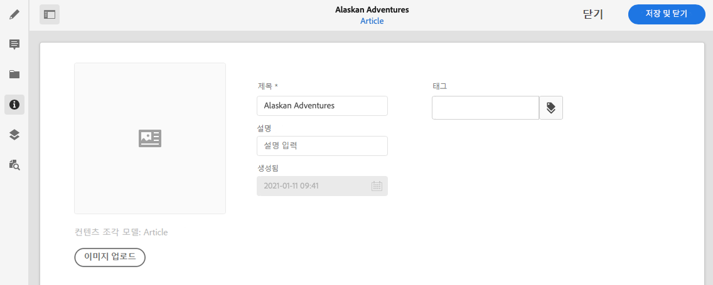

# 메타데이터 - 조각 속성 {#metadata-fragment-properties}

AEM 콘텐츠 조각에 대한 메타데이터 속성을 보고 편집하는 방법에 대해 알아봅니다.

## 속성/메타데이터 편집 {#editing-properties-meta-data}

콘텐츠 조각에 대한 메타데이터(속성)를 보고 편집할 수 있습니다.

1. **자산** 콘솔에서 콘텐츠 조각의 위치로 이동합니다.
2. 다음 중 하나를 선택합니다.

   * [**속성 보기**&#x200B;를 선택하여 대화 상자를 엽니다](/help/assets/manage-digital-assets.md#editing-properties). 볼 수도 있도록 열리면 편집할 수도 있습니다.
   * 편집할 콘텐츠 조각을 연 다음 사이드 패널에서 **메타데이터**&#x200B;를 선택합니다.

   

3. **기본** 탭에는 다음과 같이 보거나 편집할 수 있는 옵션이 있습니다.

   * 썸네일 - 여기에 사용할 **이미지를 업로드**&#x200B;할 수 있습니다.
   * **콘텐츠 조각 모델**&#x200B;은 현재 조각을 만드는 데 사용되는 모델을 나타냅니다.
   * **제목**
   * **설명**
   * **태그**
      * [태그](/help/sites-cloud/authoring/features/tags.md)는 콘텐츠 분류 및 분류법에 사용될 수 있으므로 조각을 구성할 때 특히 유용합니다. 태그는 태그별로 콘텐츠를 찾고 일괄 작업을 적용하는 데 사용할 수 있습니다.
예를 들어 관련 조각에 “크리스마스 런치”로 태그를 지정하여 하위 집합으로만 검색할 수 있도록 하거나, 새 폴더에서 향후 실행 시 사용할 수 있도록 복사할 수 있습니다.

        >[!NOTE]
        >
        >[변형 콘텐츠 작성](/help/assets/content-fragments/content-fragments-variations.md#authoring-your-content) 및 [변형 생성](/help/assets/content-fragments/content-fragments-variations.md#creating-a-variation) 시 **태그**&#x200B;를 추가할 수도 있습니다.

   * **작성일**(표시만)

   예:
   
