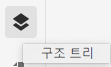
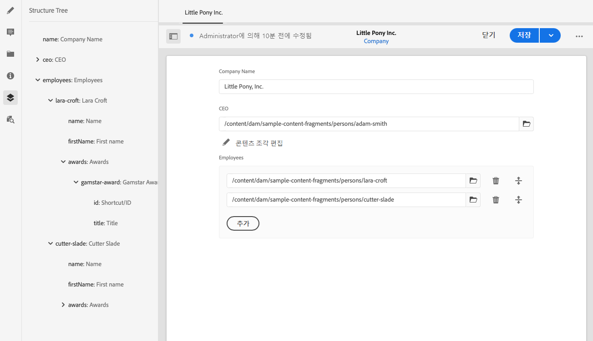

# 콘텐츠 조각 구조 트리 {#content-fragment-structure-tree}

AEM의 콘텐츠 조각 편집기의 구조 트리 기능을 사용하여 Headless 콘텐츠를 이해할 수 있습니다.

콘텐츠 조각 편집기에서 [구조 트리] 아이콘을 선택할 수 있습니다.

이렇게 하면 왼쪽 창에서 조각 구조의 표현식이 열립니다. 이를 사용하여 참조된 조각을 탐색할 수 있습니다. 참조를 선택하면 편집용 조각이 열립니다.

>[!NOTE]
>
>기본 패널에서 탐색 표시를 사용하여 시작점으로 돌아갈 수 있습니다.

