# 변형 - 조각 콘텐츠 작성{#variations-authoring-fragment-content}

<!--
hide: yes
index: no
hidefromtoc: yes
-->

[변형](/help/sites-cloud/administering/content-fragments/content-fragments.md#constituent-parts-of-a-content-fragment)은 특정 채널 및/또는 시나리오에서 사용할 마스터 콘텐츠의 사본을 만들고 편집할 수 있는 AEM 콘텐츠 조각의 중요한 기능으로, 페이지 작성과 Headless 콘텐츠 게재를 보다 유연하게 해 줍니다.

**변형** 탭에서는 다음 작업을 수행할 수 있습니다.

* 조각에 사용할 [콘텐츠 입력](#authoring-your-content),
* [마스터](#managing-variations) 콘텐츠의 **변형 만들기 및 관리**

편집 중인 데이터 유형에 따라 다양한 다른 작업을 수행하십시오. 예를 들면 다음과 같습니다.

* [조각에 시각적 자산 삽입](#inserting-assets-into-your-fragment)(이미지)

* 편집을 위해 [리치 텍스트](#rich-text), [일반 텍스트](#plain-text) 및 [Markdown](#markdown) 중 선택

* [콘텐츠 업로드](#uploading-content)

* [주요 통계 보기](#viewing-key-statistics)(여러 줄 텍스트에 대한 정보)

* [텍스트 요약](#summarizing-text)

* [변형을 마스터 콘텐츠와 동기화](#synchronizing-with-master)

>[!CAUTION]
>
>조각이 게시 및/또는 참조된 후 작성자가 편집을 위해 조각을 다시 열면 AEM에 경고가 표시됩니다. 조각 변경 사항이 참조된 페이지에도 영향을 준다는 것을 경고하기 위한 것입니다.

## 콘텐츠 작성 {#authoring-your-content}

편집할 콘텐츠 조각을 열면 기본적으로 **변형** 탭이 열립니다. 보유하고 있는 마스터 또는 변형에 사용할 콘텐츠를 여기에서 작성할 수 있습니다. 구조화된 조각은 콘텐츠 모델에서 정의된 다양한 데이터 유형의 다양한 필드를 포함합니다.

예:

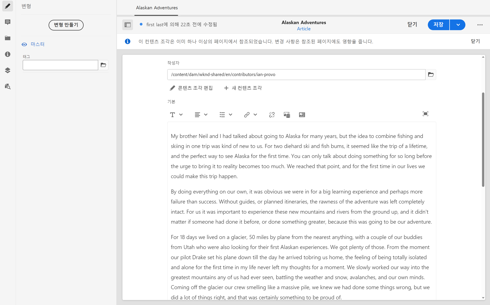

다음과 같은 작업을 수행할 수 있습니다.

* **변형** 탭에서 직접 콘텐츠를 편집합니다. 각 데이터 유형은 다음 예와 같이 다양한 편집 옵션을 제공합니다.

   * **여러 줄 텍스트** 필드의 경우 [전체 화면 편집기](#full-screen-editor)를 열어 다음과 같은 작업을 수행할 수 있습니다.

      * [형식](#formats) 선택
      * 더 많은 편집 옵션 보기([리치 텍스트](#rich-text) 형식)
      * 다양한 [작업](#actions) 액세스

   * **조각 참조** 필드의 경우 모델 정의에 따라 [콘텐츠 조각 편집](#fragment-references-edit-content-fragment) 옵션을 사용할 수 있습니다.

* 현재 변형에 **태그** 할당: 태그는 추가, 업데이트 및 제거될 수 있음

   * [태그](/help/sites-cloud/authoring/features/tags.md)는 콘텐츠 분류 및 분류법에 사용될 수 있으므로 조각을 구성할 때 특히 유용합니다. 태그는 태그별로 콘텐츠를 찾고 일괄 작업을 적용하는 데 사용할 수 있습니다.

      * 태그를 검색하면 태그된 변형이 강조 표시되면서 조각이 반환됩니다.
      * 변형 이름을 사용하는 대신 변형 태그를 사용하여 특정 CDN(Content Delivery Network) 프로필(CDN 캐싱용)의 변형을 그룹화할 수도 있습니다.

     예를 들어 관련 조각에 “크리스마스 론치“로 태그를 지정하여 하위 집합으로만 검색할 수 있도록 하거나, 새 폴더에서 향후 실행 시 사용할 수 있도록 복사할 수 있습니다.

  >[!NOTE]
  >
  >[메타데이터](/help/sites-cloud/administering/content-fragments/content-fragments-metadata.md)의 일부로 (**마스터** 변형에) **태그**&#x200B;가 추가될 수 있음

* [마스터](#managing-variations) 콘텐츠의 **변형 만들기 및 관리.**

### 전체 화면 편집기 {#full-screen-editor}

여러 줄 텍스트 필드를 편집할 때 전체 화면 편집기를 열 수 있습니다. 실제 텍스트 내에서 탭하거나 클릭한 후 다음 작업 아이콘을 선택합니다.

이렇게 하면 전체 화면 텍스트 편집기가 열립니다.

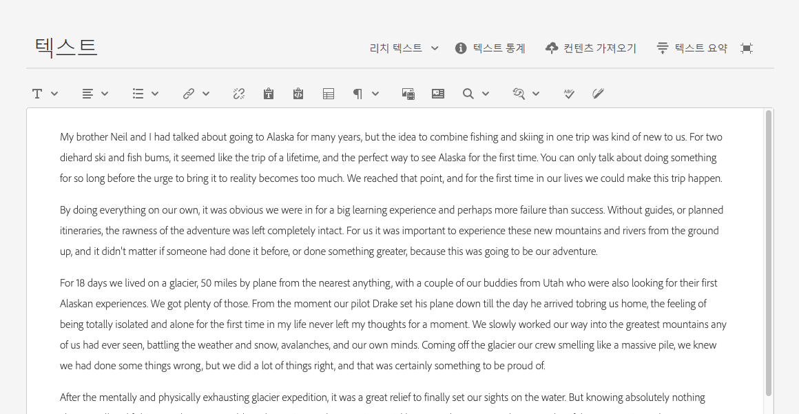

전체 화면 텍스트 편집기에서 제공하는 사항:

* 다양한 [작업](#actions)에 대한 액세스
* [형식](#formats)에 따라 추가적인 형식 옵션([리치 텍스트](#rich-text))

### 액션 {#actions}

전체 화면 편집기(즉, 여러 줄 텍스트)가 열려 있는 경우 다음 작업도(모든 [형식](#formats)) 사용할 수 있습니다.

* [형식](#formats) 선택([리치 텍스트](#rich-text), [일반 텍스트](#plain-text), [Markdown](#markdown))

* [콘텐츠 업로드](#uploading-content)

* [텍스트 통계 표시](#viewing-key-statistics)

* [마스터와 동기화](#synchronizing-with-master)(변형 편집 시)

* [텍스트 요약](#summarizing-text)

### 형식 {#formats}

여러 줄 텍스트를 편집하는 옵션은 선택한 형식에 따라 다릅니다.

* [리치 텍스트](#rich-text)
* [일반 텍스트](#plain-text)
* [Markdown](#markdown)

형식은 전체 화면 편집기를 사용할 때 선택할 수 있습니다.

### 리치 텍스트 {#rich-text}

서식 있는 텍스트 편집을 통해 다음 포맷을 지정할 수 있습니다.

* 굵게
* 기울임체
* 밑줄
* 정렬: 왼쪽, 가운데, 오른쪽
* 글머리 기호 목록
* 번호 매기기 목록
* 들여쓰기: 증가, 감소
* 하이퍼링크 만들기/제거
* 텍스트/Word에서 붙여넣기
* 표 삽입
* 단락 스타일: 단락, 제목 1/2/3
* [자산 삽입](#inserting-assets-into-your-fragment)
* 전체 화면 편집기를 엽니다. 여기에서 다음 형식 옵션을 사용할 수 있습니다.
   * 검색
   * 찾기/바꾸기
   * 맞춤법 검사기
   * [주석](/help/sites-cloud/administering/content-fragments/content-fragments-variations.md#annotating-a-content-fragment)
* [콘텐츠 조각 삽입](#inserting-content-fragment-into-your-fragment): **여러 줄 텍스트** 필드가 **조각 참조 허용**&#x200B;으로 구성된 경우 사용할 수 있습니다.

[작업](#actions)은 전체 화면 편집기에서 액세스할 수도 있습니다.

### 일반 텍스트 {#plain-text}

일반 텍스트를 사용하면 형식이나 Markdown 정보 없이 콘텐츠를 신속하게 입력할 수 있습니다. 전체 화면 편집기를 열어 추가 [작업](#actions)을 수행할 수도 있습니다.

>[!CAUTION]
>
>**일반 텍스트**&#x200B;를 선택하면 형식 지정, Markdown 및/또는 **리치 텍스트**&#x200B;나 **Markdown**&#x200B;으로 삽입한 자산을 잃을 수 있습니다.

### Markdown {#markdown}

>[!NOTE]
>
>자세한 내용은 [Markdown](/help/sites-cloud/administering/content-fragments/content-fragments-markdown.md) 설명서를 참조하십시오.

Markdown을 사용하여 텍스트 서식을 지정할 수 있습니다. 다음과 같은 항목을 정의할 수 있습니다.

* 제목
* 단락 및 줄 바꿈
* 링크
* 이미지
* 블록 인용
* 목록
* 강조
* 코드 블록
* 백슬래시 이스케이프

전체 화면 편집기를 열어 추가 [작업](#actions)을 수행할 수도 있습니다.

>[!CAUTION]
>
>**리치 텍스트**&#x200B;와 **Markdown** 간을 전환하는 경우 이 두 형식은 처리 방식에 차이가 있을 수 있으므로, 블록 인용과 코드 블록 사용과 관련하여 예기치 않은 효과가 발생할 수 있습니다.

### 조각 참조 {#fragment-references}

콘텐츠 조각 모델에 조각 참조가 포함되어 있는 경우 조각 작성자는 추가 옵션을 사용할 수 있습니다.

* [콘텐츠 조각 편집](#fragment-references-edit-content-fragment)
* [새 콘텐츠 조각](#fragment-references-new-content-fragment)

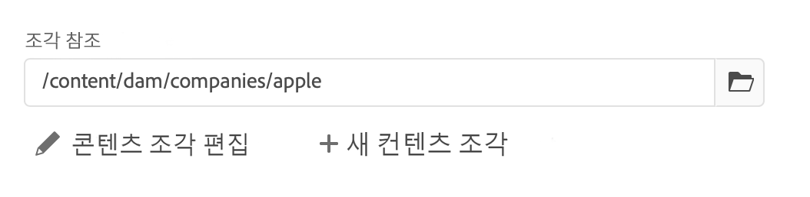

#### 콘텐츠 조각 편집 {#fragment-references-edit-content-fragment}

**콘텐츠 조각 편집** 옵션을 사용하면 새 편집기 탭(동일한 브라우저 탭 내)에서 해당 조각이 열립니다.

원본 탭을 다시 선택하면(예: **Little Pony Inc.**) 이 보조 탭이 닫힙니다(이 경우 **Adam Smith**).

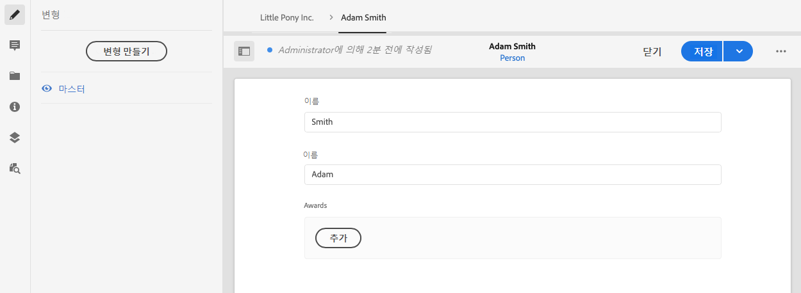

#### 새 콘텐츠 조각 {#fragment-references-new-content-fragment}

**새 콘텐츠 조각** 옵션을 사용하면 완전히 새로운 조각을 만들 수 있습니다. 이를 위해 편집기에서 콘텐츠 조각 만들기 마법사의 변형이 열립니다.

그 후 다음 작업을 수행하여 새 조각을 만들 수 있습니다.

1. 필요한 폴더로 이동한 다음 선택합니다.
1. **다음**&#x200B;을 선택합니다.
1. 속성을 지정합니다(예: **제목**).
1. **만들기**&#x200B;를 선택합니다.
1. 마지막으로
   1. **완료**:
      * (원래 조각으로) 반환
      * 새 조각 참조
   1. **열기**:
      * 새 조각 참조
      * 편집을 위해 새 브라우저 탭에서 새 조각 열기

### 주요 통계 보기 {#viewing-key-statistics}

전체 화면 편집기가 열리면 **텍스트 통계** 작업에 텍스트에 대한 다양한 정보가 표시됩니다.

예:

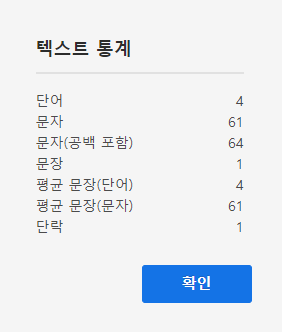

### 콘텐츠 업로드 {#uploading-content}

콘텐츠 조각 작성 프로세스를 간소화하기 위해 외부 편집기에서 준비한 텍스트를 업로드하고 조각에 바로 추가할 수 있습니다.

### 텍스트 요약 {#summarizing-text}

텍스트 요약 기능은 사용자가 주요 포인트와 전반적인 의미를 유지하면서도 텍스트의 길이를 사전 정의된 단어 수로 줄이는 데 도움이 되도록 설계되었습니다.

>[!NOTE]
>
>기술적인 수준에서 이 시스템은 특정 알고리즘에 따라 *정보 밀도와 고유성의 최상의 비율*&#x200B;을 제공하는 것으로 평가되는 문장을 유지합니다.

>[!CAUTION]
>
>콘텐츠 조각에는 상위 언어 폴더로 유효한 언어 폴더(ISO 코드)가 있어야 합니다. 이 폴더는 사용할 언어 모델을 결정하는 데 사용됩니다.
>
>예를 들어 다음 경로에서 `en/`과 같습니다.
>
>  `/content/dam/my-brand/en/path-down/my-content-fragment`

>[!CAUTION]
>
>영어는 즉시 이용 가능합니다.
>
>다른 언어는 소프트웨어 배포의 언어 모델 패키지로 사용할 수 있습니다.
>
>* [프랑스어(fr)](https://experience.adobe.com/#/downloads/content/software-distribution/en/aem.html?package=/content/software-distribution/en/details.html/content/dam/aem/public/adobe/packages/cq630/product/smartcontent-model-fr)
>* [독일어(de)](https://experience.adobe.com/#/downloads/content/software-distribution/en/aem.html?package=/content/software-distribution/en/details.html/content/dam/aem/public/adobe/packages/cq630/product/smartcontent-model-de)
>* [이탈리아어(it)](https://experience.adobe.com/#/downloads/content/software-distribution/en/aem.html?package=/content/software-distribution/en/details.html/content/dam/aem/public/adobe/packages/cq630/product/smartcontent-model-it)
>* [스페인어(es)](https://experience.adobe.com/#/downloads/content/software-distribution/en/aem.html?package=/content/software-distribution/en/details.html/content/dam/aem/public/adobe/packages/cq630/product/smartcontent-model-es)
>

1. **마스터** 또는 필요한 변형을 선택합니다.
1. 전체 화면 편집기를 엽니다.

1. 도구 모음에서 **Summarize text**&#x200B;를 선택합니다.

   

1. 타겟 단어 수를 지정하고 **시작**&#x200B;을 선택합니다.
1. 원래 텍스트는 제안된 요약과 나란히 표시됩니다.

   * 제거할 문장은 빨간색으로 강조 표시되며 취소선이 그어져 있습니다.
   * 요약된 콘텐츠로 유지하려면 강조 표시된 문장을 클릭하십시오.
   * 제거하려면 강조 표시되지 않은 문장을 클릭하십시오.

1. **요약**&#x200B;을 선택하여 변경 내용을 확인합니다.

1. 원래 텍스트는 제안된 요약과 나란히 표시됩니다.

   * 제거할 문장은 빨간색으로 강조 표시되며 취소선이 그어져 있습니다.
   * 요약된 콘텐츠로 유지하려면 강조 표시된 문장을 클릭하십시오.
   * 제거하려면 강조 표시되지 않은 문장을 클릭하십시오.
   * **실제** 및 **대상** 요약 통계가 표시됩니다.
   * 변경 내용을 **미리보기**&#x200B;할 수 있습니다.

   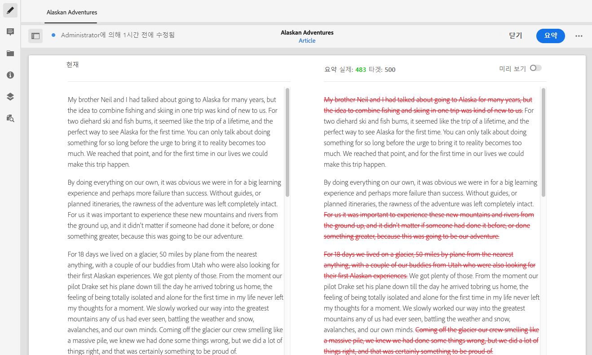

### 콘텐츠 조각에 주석 달기 {#annotating-a-content-fragment}

조각에 주석을 달려면

1. **마스터** 또는 필요한 변형을 선택합니다.

1. 전체 화면 편집기를 엽니다.

1. **주석 달기** 아이콘은 맨 위 도구 모음에서 사용할 수 있습니다. 필요한 경우 텍스트를 선택할 수 있습니다.

   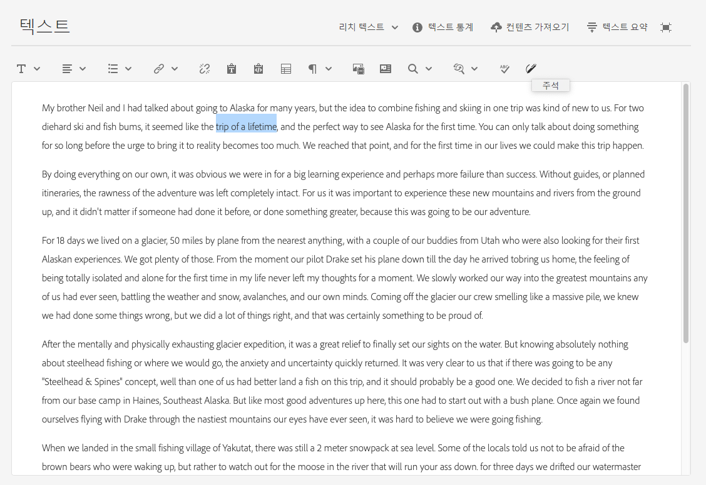

1. 대화 상자가 열립니다. 여기에서 주석을 입력할 수 있습니다.

   

1. 대화 상자에서 **적용**&#x200B;을 선택합니다.

   

   주석이 선택한 텍스트에 적용된 경우 해당 텍스트가 강조 표시된 상태로 유지됩니다.

   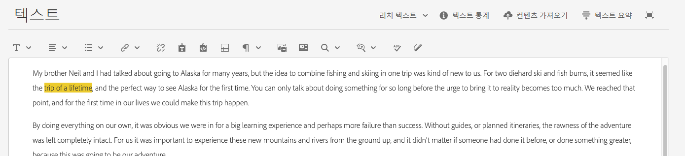

1. 전체 화면 편집기를 닫아도 주석은 여전히 강조 표시됩니다. 선택한 경우 주석을 추가로 편집할 수 있는 대화 상자가 열립니다.

1. **저장**&#x200B;을 선택합니다.

1. 전체 화면 편집기를 닫아도 주석은 여전히 강조 표시됩니다. 선택한 경우 주석을 추가로 편집할 수 있는 대화 상자가 열립니다.

   

### 주석 보기, 편집, 삭제 {#viewing-editing-deleting-annotations}

주석:

* 편집기의 전체 화면과 일반 모드 모두에서 텍스트 상의 강조 표시로 표시됩니다. 그러면 강조 표시된 텍스트를 클릭하여 대화 상자가 다시 열고 주석의 전체 세부 사항을 보거나, 편집하거나, 삭제할 수 있습니다.

  >[!NOTE]
  >
  >여러 개의 주석이 하나의 텍스트에 적용된 경우 드롭다운 선택기가 제공됩니다.

* 주석이 적용된 전체 텍스트를 삭제하면 주석도 삭제됩니다.

* 조각 편집기에서 **주석** 탭을 선택하여 나열하거나 삭제할 수 있습니다.

  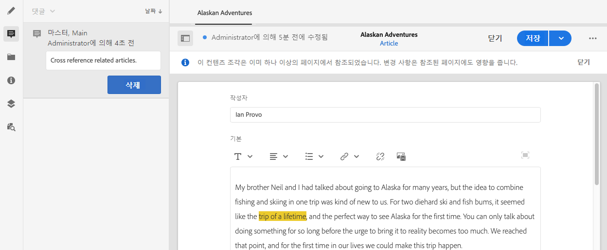

* 선택한 조각에 대한 [타임라인](/help/sites-cloud/administering/content-fragments/content-fragments-managing.md#timeline-for-content-fragments)에서 보고 삭제할 수 있습니다.

### 조각에 자산 삽입 {#inserting-assets-into-your-fragment}

콘텐츠 조각 작성 프로세스를 간소화하기 위해 [자산](/help/assets/manage-digital-assets.md)(이미지)을 조각에 바로 추가할 수 있습니다.

자산은 형식을 지정하지 않고 조각의 단락 시퀀스에 추가됩니다. [페이지에서 조각을 사용/참조](/help/sites-cloud/authoring/fundamentals/content-fragments.md)할 때 형식을 지정할 수 있습니다.

>[!CAUTION]
>
>참조 페이지에서 이러한 자산을 이동하거나 삭제할 수 없습니다. 이러한 작업은 조각 편집기에서 수행해야 합니다.
>
>그러나 자산의 형식 지정(예: 크기)은 [페이지 편집기](/help/sites-cloud/authoring/fundamentals/content-fragments.md)에서 수행해야 합니다. 조각 편집기의 자산 표현은 순전히 콘텐츠 흐름을 작성하기 위한 것입니다.

>[!NOTE]
>
>[이미지](/help/sites-cloud/administering/content-fragments/content-fragments.md#fragments-with-visual-assets)를 조각 및/또는 페이지에 추가하는 방법은 다양합니다.

1. 이미지를 추가할 위치에 커서를 놓습니다.
1. **자산 삽입** 아이콘을 사용하여 검색 대화 상자를 엽니다.

   

1. 대화 상자에서 다음 작업 중 하나를 수행할 수 있습니다.

   * DAM에서 필요한 자산으로 이동
   * DAM에서 자산 검색

   찾으면 썸네일을 클릭하여 필요한 자산을 선택합니다.

1. **선택**&#x200B;을 사용하여 자산을 현재 위치에서 콘텐츠 조각의 단락 시스템에 추가합니다.

   >[!CAUTION]
   >
   >자산을 추가한 후 형식을 다음과 같이 변경하는 경우
   >
   >* **일반 텍스트**: 자산이 조각에서 완전히 손실됩니다.
   >* **Markdown**: 자산이 표시되진 않지만 **리치 텍스트**&#x200B;로 돌아가면 계속 표시됩니다.

### 조각에 콘텐츠 조각 삽입 {#inserting-content-fragment-into-your-fragment}

콘텐츠 조각 작성 프로세스를 간소화하기 위해 조각에 다른 콘텐츠 조각을 추가할 수도 있습니다.

조각의 현재 위치에서 참조로 추가됩니다.

>[!NOTE]
>
>이 옵션은 **여러 줄 텍스트**&#x200B;가 **조각 참조 허용**&#x200B;으로 구성된 경우 사용할 수 있습니다.

>[!CAUTION]
>
>참조 페이지에서 이러한 자산을 이동하거나 삭제할 수 없습니다. 이러한 작업은 조각 편집기에서 수행해야 합니다.
>
>그러나 자산의 형식 지정(예: 크기)은 [페이지 편집기](/help/sites-cloud/authoring/fundamentals/content-fragments.md)에서 수행해야 합니다. 조각 편집기의 자산 표현은 순전히 콘텐츠 흐름을 작성하기 위한 것입니다.

>[!NOTE]
>
>[이미지](/help/sites-cloud/administering/content-fragments/content-fragments.md#fragments-with-visual-assets)를 조각 및/또는 페이지에 추가하는 방법은 다양합니다.

1. 조각을 추가하고자 하는 위치에 커서를 놓습니다.
1. **콘텐츠 조각 삽입** 아이콘을 사용하여 검색 대화 상자를 엽니다.

   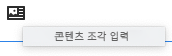

1. 대화 상자에서 다음 작업 중 하나를 수행할 수 있습니다.

   * 자산 폴더에서 필요한 조각으로 이동
   * 조각 검색

   찾은 다음 썸네일에서 필요한 조각을 클릭하여 선택합니다.

1. **선택**&#x200B;을 사용하여 선택한 콘텐츠 조각에 대한 참조를 현재 콘텐츠 조각(현재 위치)에 추가합니다.

   >[!CAUTION]
   >
   >다른 조각에 대한 참조를 추가한 후 형식을 다음과 같이 변경하는 경우
   >
   >* **일반 텍스트**: 참조가 조각에서 완전히 손실됩니다.
   >* **Markdown**: 참조가 유지됩니다.

## 변형 관리 {#managing-variations}

>[!CONTEXTUALHELP]
>id="aemcloud_sites_contentfragments_variations"
>title="변형 - 조각 콘텐츠 작성"
>abstract="특정 채널에서 사용할 다양한 콘텐츠를 만드는 방법을 알아봅니다."
>additional-url="https://video.tv.adobe.com/v/333295" text="콘텐츠 조각 변형"

### 변형 만들기 {#creating-a-variation}

변형을 사용하면 **마스터** 콘텐츠를 표시하고 목적에 따라 변경할 수 있습니다(필요한 경우).

새 변형을 만들려면

1. 조각을 열고 사이드 패널이 표시되는지 확인합니다.
1. 사이드 패널의 아이콘 막대에서 **변형**&#x200B;을 선택합니다.
1. **변형 만들기**&#x200B;를 선택합니다.
1. 대화 상자가 열리면 새 변형에 대한 **제목** 및 **설명**&#x200B;을 지정합니다.
1. **추가**&#x200B;를 선택합니다. 조각 **마스터**&#x200B;가 현재[편집](#editing-a-variation)을 위해 열려 있는 새 변형에 복사됩니다.

   >[!NOTE]
   >
   >새 변형을 만들 때 새 변형은 현재 열려 있는 변형이 아니라 항상 복사되어 있는 **마스터**&#x200B;입니다.

   >[!NOTE]
   >
   >변형을 새로 만들면 **마스터** 변형에 현재 할당된 모든 **태그**&#x200B;가 새 변형에 복사됩니다.

### 변형 편집 {#editing-a-variation}

다음 작업 중 하나를 수행한 후 변형 콘텐츠를 변경할 수 있습니다.

* [변형 만들기](#creating-a-variation)
* 기존 조각을 연 후 사이드 패널에서 필요한 변형 선택

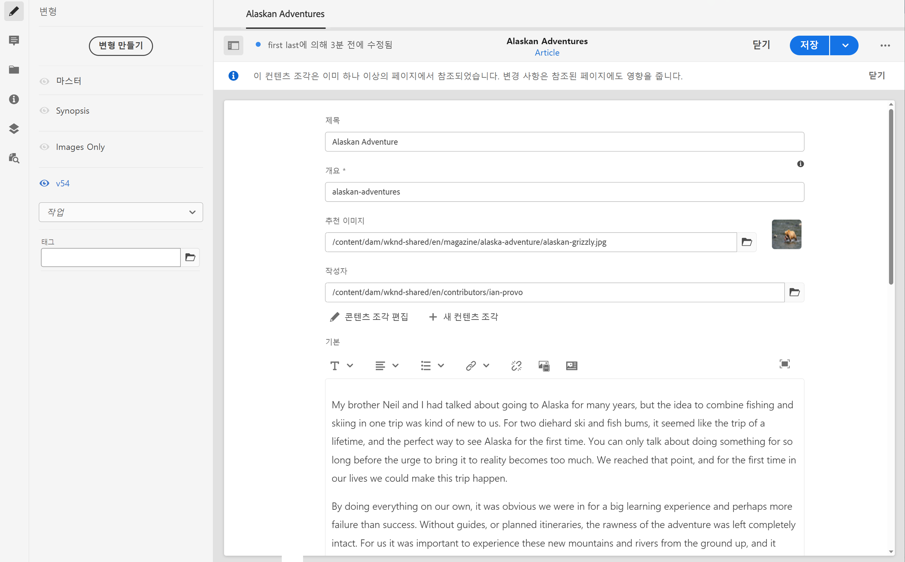

### 변형 이름 바꾸기 {#renaming-a-variation}

기존 변형의 이름을 변경하려면

1. 조각을 열고 사이드 패널에서 **변형**&#x200B;을 선택합니다.
1. 필요한 변형을 선택합니다.
1. **작업** 드롭다운에서 **이름 바꾸기**&#x200B;를 선택합니다.

1. 결과 대화 상자에서 새 **제목** 및/또는 **설명** 을 입력합니다.

1. **이름 바꾸기** 작업을 확인합니다.

>[!NOTE]
>
>이 작업은 변형 **제목**&#x200B;에만 영향을 줍니다.

### 변형 삭제 {#deleting-a-variation}

기존 변형을 삭제하려면

1. 조각을 열고 사이드 패널에서 **변형**&#x200B;을 선택합니다.
1. 필요한 변형을 선택합니다.
1. **작업** 드롭다운에서 **삭제**&#x200B;를 선택합니다.

1. 대화 상자에서 **삭제** 작업을 확인합니다.

>[!NOTE]
>
>**마스터**&#x200B;는 삭제할 수 없습니다.

### 마스터와 동기화 {#synchronizing-with-master}

**마스터**&#x200B;는 콘텐츠 조각의 필수적인 부분이며, 정의에 따라 콘텐츠의 마스터 사본은 보존되지만 변형에는 해당 콘텐츠의 개별 업데이트 및 맞춤화 버전이 포함됩니다. 마스터가 업데이트되면 이러한 변경 내용이 변형과 관련이 있으므로 이들 변경 내용을 해당 변형으로 전파해야 합니다.

변형을 편집할 때 변형의 현재 요소를 마스터와 동기화하는 작업을 수행할 수 있습니다. 이렇게 하면 마스터에 수행된 변경 내용을 필요한 변형에 자동으로 복사할 수 있습니다.

>[!CAUTION]
>
>동기화는 **마스터**&#x200B;의 변경 내용을 변형에 복사하는 데에만&#x200B;*사용할 수 있습니다.*
>
>변형의 현재 요소만 동기화됩니다.
>
>동기화는 **여러 줄 텍스트** 데이터 유형에서만 작동합니다.
>
>*변형의 변경 내용을&#x200B;**마스터***에 전송하는 선택은 할 수 없습니다.

1. 조각 편집기에서 콘텐츠 조각을 엽니다. **마스터**&#x200B;가 편집되었는지 확인합니다.

1. 특정 변형을 선택한 후 다음 중 하나에서 적절한 동기화 작업을 선택합니다.

   * **작업** 드롭다운 선택기 - **현재 요소를 마스터와 동기화**

     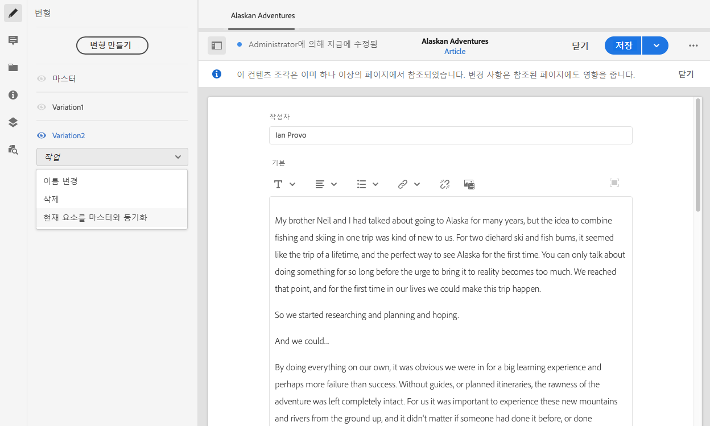

   * 전체 화면 편집기의 도구 모음 - **마스터와 동기화**

     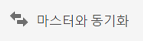

1. 마스터와 변형이 나란히 표시됩니다.

   * 녹색은 변형에 추가된 콘텐츠를 나타냅니다.
   * 빨간색은 변형에서 제거된 콘텐츠를 나타냅니다.
   * 파란색은 대체된 텍스트를 나타냅니다.

   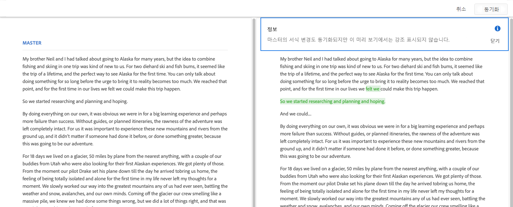

1. **동기화**&#x200B;를 선택하면 변형이 업데이트되고 표시됩니다.
