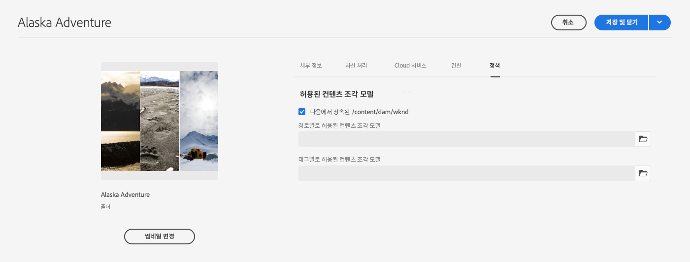
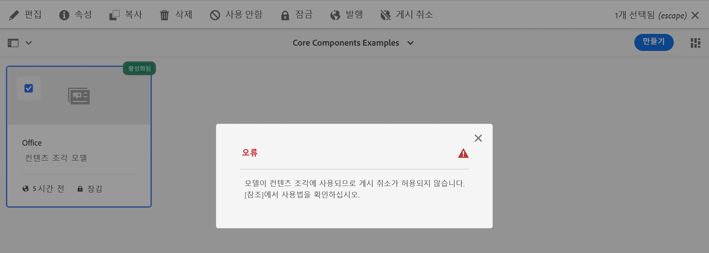
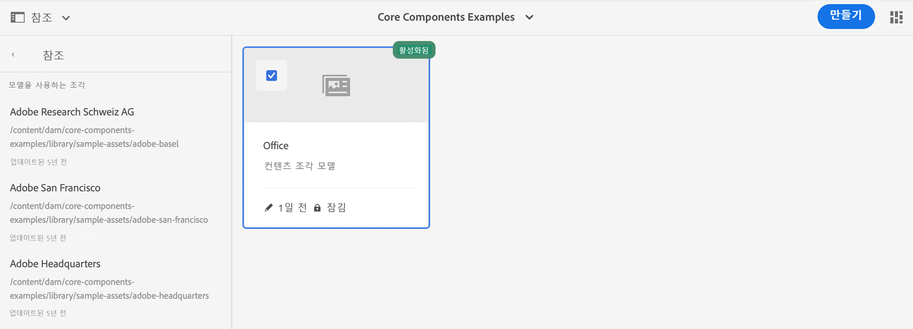
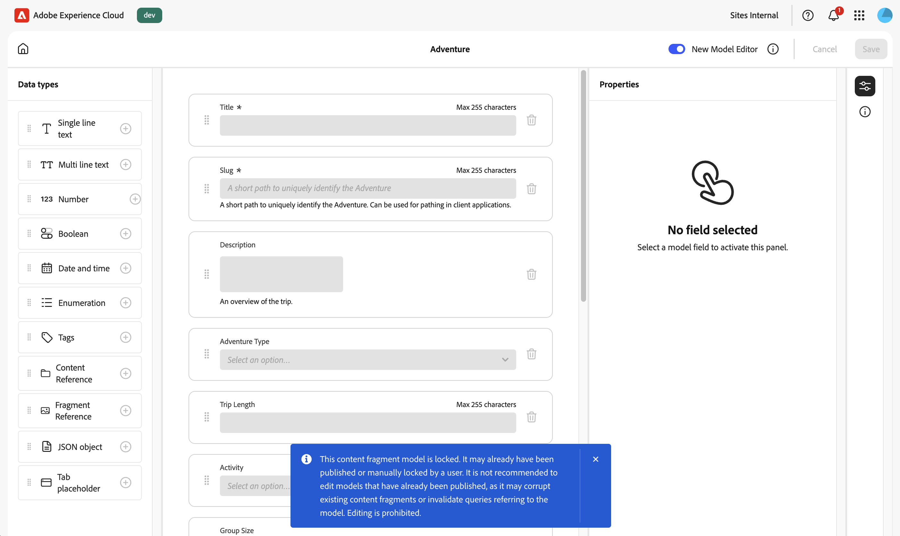

# 콘텐츠 조각 모델 관리 {#managing-content-fragment-models}

콘텐츠 조각 콘솔에서 콘텐츠 조각 모델을 관리한 다음 [편집기를 열고](/help/sites-cloud/administering/content-fragments/content-fragment-models.md) 구조를 정의할 수 있습니다.

Adobe Experience Manager(AEM) as a Cloud Service의 콘텐츠 조각 모델은 [콘텐츠 조각](/help/sites-cloud/administering/content-fragments/overview.md)의 콘텐츠 구조를 정의합니다. 그런 다음 이러한 조각을 Headless 콘텐츠 또는 페이지 작성의 기반으로 사용할 수 있습니다.

>[!IMPORTANT]
>
>콘텐츠 조각 콘솔의 다양한 기능은 얼리어답터 프로그램을 통해 사용할 수 있습니다.
>
>상태 및 관심 있는 경우 적용 방법을 보려면 [릴리스 정보](/help/release-notes/release-notes-cloud/release-notes-current.md)를 확인하세요.

>[!NOTE]
>
>이 페이지에서는 콘텐츠 조각 모델을 표시하는 콘솔 섹션을 다룹니다. 다른 패널의 경우 다음을 참조하십시오.
>
>* [콘텐츠 조각 관리](/help/sites-cloud/administering/content-fragments/managing.md)
>* [콘텐츠 조각 콘솔에서 Assets 보기 및 관리](/help/sites-cloud/administering/content-fragments/assets-content-fragments-console.md)

>[!NOTE]
>
>콘텐츠 조각은 **자산**&#x200B;으로 저장됩니다. 콘텐츠 조각 모델은 주로 **콘텐츠 조각** 콘솔에서 관리되지만 [Assets](/help/assets/content-fragments/content-fragments-managing.md) 콘솔 및 **도구** - **일반**&#x200B;에서 사용할 수 있는 옵션 [콘텐츠 조각 모델](/help/assets/content-fragments/content-fragments-models.md)에서도 관리할 수 있습니다.

## 콘텐츠 조각 모델을 사용하여 작업하는 방법 {#how-to-work-with-content-fragment-models}

매우 빠른 개요로서, 콘텐츠 조각 모델 을 사용하여 작업하려면 다음 작업을 수행하십시오.

1. [인스턴스에 대해 콘텐츠 조각 모델 기능 활성화](/help/sites-cloud/administering/content-fragments/setup.md)
1. 콘텐츠 조각 모델을 [만들기](#creating-a-content-fragment-model)합니다.
   * 이 시점에서 모델을 **활성화**&#x200B;할 수도 있습니다(콘텐츠 조각을 만들 때 사용).
1. 모델의 구조를 [정의](/help/sites-cloud/administering/content-fragments/content-fragment-models.md#defining-your-content-fragment-model)합니다.
1. 아직 수행하지 않았다면 [콘텐츠 조각 모델을 활성화](#enabling-a-content-fragment-model)합니다.
1. **정책**&#x200B;을 구성하여 [필요한 자산 폴더에서 콘텐츠 조각 모델 허용](#allowing-content-fragment-models-assets-folder)

## 콘솔의 콘텐츠 조각 모델 기본 구조 및 처리 {#basic-structure-handling-content-fragment-models-console}

[콘텐츠 조각 콘솔](/help/sites-cloud/administering/content-fragments/overview.md#content-fragments-console)의 맨 왼쪽 패널을 사용하여 **콘텐츠 조각 모델**&#x200B;을(를) 리소스 유형으로 선택하여 보고, 찾아보고, 관리할 수 있습니다.

이렇게 하면 콘텐츠 조각 모델에 대한 보기가 열립니다.

여기에서 세 가지 주요 영역을 확인할 수 있습니다.

* 상단 도구 모음
   * 표준 AEM 기능을 제공합니다.
   * IMS 조직도 표시합니다.
   * 다양한 [작업](#actions-unselected) 제공
* 왼쪽 패널
   * 폴더로 나열된 모든 [구성](/help/sites-cloud/administering/content-fragments/setup.md#enable-content-fragment-functionality-configuration-browser)을 표시합니다.
   * 여기에서 폴더 트리를 숨기거나 표시할 수 있습니다.
   * 트리의 특정 폴더를 선택할 수 있습니다
   * 중첩된 폴더(하위 구성)를 표시하도록 크기를 조정할 수 있습니다.
   * 콘텐츠 조각 모델뿐만 아니라 [콘텐츠 조각](/help/sites-cloud/administering/content-fragments/managing.md) 또는 [Assets](/help/sites-cloud/administering/content-fragments/assets-content-fragments-console.md)을 볼 수 있습니다. 패널에 연결된 링크를 압축하거나 확장할 수도 있습니다
* 기본/오른쪽 패널 - 여기에서 다음 작업을 수행할 수 있습니다.
   * 선택한 폴더 아래에 있는 모든 콘텐츠 조각 모델 목록을 참조하십시오.
      * 선택한 폴더의 콘텐츠 조각 모델 및 모든 하위 폴더가 표시됩니다.
         * 위치는 이동 경로로 표시됩니다. 위치를 변경하는 데에도 사용할 수 있습니다.
      * [각 모델에 대한 정보가 표시됩니다](#information-content-fragment-models)
         * [표시할 열을 선택할 수 있습니다.](#select-columns-console)
      * 콘텐츠 조각 모델에 대한 [다양한 정보 필드](#information-content-fragment-models)에서 링크를 제공합니다. 필드에 따라 다음 작업을 수행할 수 있습니다.
         * 편집기에서 적절한 모델을 엽니다
         * 구성에 대한 정보 표시
         * 모델 상태에 대한 정보 표시
      * [콘텐츠 조각 모델에 대한 다른 특정 정보 필드](#information-content-fragments)를 [빠른 필터링](#fast-filtering)에 사용할 수 있습니다.
         * 열에서 값을 선택하면 필터로 즉시 적용됩니다
         * **수정자**, **게시자** 및 **상태** 열에 대해 빠른 필터링이 지원됩니다.
      * 열 머리글 위로 마우스를 가져가면 드롭다운 작업 선택기와 폭 슬라이더가 표시됩니다. 이를 사용하면 다음 작업을 수행할 수 있습니다.
         * 정렬 - 오름차순 또는 내림차순에 적합한 작업 선택
이렇게 하면 해당 열에 따라 전체 테이블이 정렬됩니다. 정렬은 해당 열에서만 사용할 수 있습니다.
         * 열 크기 조정 - 작업 또는 폭 슬라이더 사용
      * 추가 [작업](#actions-selected-content-fragment-models)에 대해 하나 이상의 모델을 선택하십시오.
   * [필터 패널](#filter-content-fragment-models) 열기
   * 몇 가지 키보드 단축키를 이 콘솔에서 사용할 수 있습니다.

## 콘텐츠 조각 모델에 대해 제공된 정보 {#information-content-fragment-models}

콘솔의 기본/오른쪽 패널(테이블 보기)에는 콘텐츠 조각 모델에 대한 다양한 정보가 제공됩니다. 일부 항목에서는 추가 작업 및/또는 정보로 직접 연결될 수도 있습니다.

* **이름**
   * 편집기에서 모델을 여는 링크를 제공합니다.
* 잠김
   * 모델이 잠기면 자물쇠 아이콘으로 표시됩니다.
* **구성**
   * 콘솔에서 구성을 여는 링크를 제공합니다.
폴더 이름에 마우스를 가져다 대면 JCR 경로가 표시됩니다.
* **상태**
   * 정보만.
   * [빠른 필터링](#fast-filtering)에 사용할 수 있습니다.
* **수정됨**
   * 정보만.
* **수정한 사람**
   * 정보만.
   * [빠른 필터링](#fast-filtering)에 사용할 수 있습니다.
* **태그**
   * 정보만.
   * 모델과 관련된 모든 태그를 표시합니다.
   * [빠른 필터링](#fast-filtering)에 사용할 수 있습니다.
* **게시일**
   * 정보만.
* **게시자**
   * 정보만.
   * [빠른 필터링](#fast-filtering)에 사용할 수 있습니다.

## 모델 속성 {#model-properties}

특정 모델을 선택하면 해당 모델의 속성이 표시됩니다([모델을 만들 때](#creating-a-content-fragment-model) 정의). 모델이 **잠김**&#x200B;이 아니면 일부 항목을 업데이트할 수 있습니다. 모델 **제목** 옆의 정보 아이콘을 사용하여 이 정보 패널을 열고 닫을 수도 있습니다.

* **[구성](/help/sites-cloud/administering/content-fragments/setup.md#enable-content-fragment-functionality-configuration-browser)**
* **[상태](#enabling-a-content-fragment-model)**
* **제목**
* **태그**
* **설명**
* **URL 패턴 미리 보기**

  콘텐츠 조각 모델을 사용하면 작성자가 외부 프론트엔드 애플리케이션에서 콘텐츠를 **미리 보기**&#x200B;할 수 있습니다. **미리보기 서비스**&#x200B;가 구성되면 프론트엔드 애플리케이션의 URL을 추가합니다.

  미리보기 URL은 이 패턴을 따라야 합니다.
    `https://<preview_url>?param=${expression}`

  사용 가능한 표현식은 다음과 같습니다.

   * `${contentFragment.path}`
   * `${contentFragment.model.path}`
   * `${contentFragment.model.name}`
   * `${contentFragment.variation}`
   * `${contentFragment.id}`

<!-- CHECK: currently under FT -->
<!--
* **GraphQL**
  Define names relevant for GraphQL.
  Changing the GraphQL API Name, or Query field names will impact client applications.
  * **API Name**
    Represents the GraphQL type and query field names in the GraphQL schema.
  * **Single Query Field Name**
    Represents the GraphQL single query field name in the GraphQL schema.
  * **Multiple Query Field Name**
    Represents the GraphQL multiple query field name in the GraphQL schema.
-->

## 액션 {#actions}

왼쪽 패널에서 폴더를 선택하면 바로 또는 특정 모델을 선택한 후에 사용할 수 있는 다양한 작업이 있습니다.

* 다양한 작업이 [ 콘솔에서 사용 가능](#actions-unselected)합니다.
* [하나 이상의 콘텐츠 조각 모델을 선택하여 적절한 작업을 표시할 수 있습니다](#actions-selected-content-fragment)

### 작업 (선택되지 않음) {#actions-unselected}

특정 작업은 콘솔에서 사용할 수 있습니다. 폴더를 선택한 후에는 특정 콘텐츠 조각 모델을 선택하지 않아도 됩니다.

* 새(빈) 모델을 **[만들기](#creating-a-content-fragment-model)**

### 콘텐츠 조각 콘솔의 콘텐츠 조각 모델에 대한 작업 {#actions-selected-content-fragment-models}

특정 모델을 선택하면 해당 모델에 사용할 수 있는 작업에 초점을 둔 도구 모음이 열립니다. 여러 모델을 선택할 수도 있습니다. 사용 가능한 작업은 그에 따라 조정됩니다.

* 콘텐츠 조각 모델을 정의하려면 **[편집](/help/sites-cloud/administering/content-fragments/content-fragment-models.md)**&#x200B;하십시오.
* [게시](/help/implementing/cloud-manager/manage-environments.md#environment-types) 또는 [미리 보기](/help/implementing/cloud-manager/manage-environments.md#access-preview-service) 계층에 **게시**&#x200B;합니다.
* 사용자가 모델을 수정할 수 있는지 여부를 제어하려면 **잠금**/**잠금 해제**&#x200B;하세요.
* 사용자가 이 모델을 기반으로 콘텐츠 조각을 만들 수 있는지 여부를 제어하려면 **[사용](#enabling-a-content-fragment-model)**/**[사용 안 함](#disabling-a-content-fragment-model)**&#x200B;을 사용하세요.

단일 모델을 선택하면 오른쪽 패널에 [모델 속성](#properties)도 표시됩니다.

## 콘솔에 표시된 열 선택 {#select-columns-console}

다른 콘솔과 마찬가지로 다음 작업에 표시된 열을 구성할 수 있습니다.

숨기거나 표시할 수 있는 열 목록이 표시됩니다.

## 콘텐츠 조각 모델 필터링 {#filter-content-fragment-models}

필터 패널에서는 다음과 같은 항목을 제공합니다.

* 조건자 선택
   * 상태 필드, 태그, 사용자 등 포함
   * 하나 이상의 조건자를 선택하고 결합하여 필터를 만들 수 있음

<!--
* the opportunity to **Save** your filter
* the option to retrieve a saved search filter for reuse
-->

선택하면 **필터링 기준** 옵션이 기본 패널 상단에 표시됩니다. 여기에서 선택을 취소할 수 있습니다. 예:

### 빠른 필터링 {#fast-filtering}

목록에서 특정 열 값을 클릭하여 조건자를 선택할 수도 있습니다. 하나 이상의 값을 선택하여 조건자를 결합할 수 있습니다.

예를 들어 **상태** 열에서 **사용**&#x200B;을 선택합니다. 선택하면 필터 술어로 표시되며 목록은 그에 따라 필터링됩니다.

>[!NOTE]
>
>빠른 필터링은 **상태**, **수정자**, **태그** 및 **게시자** 열에서만 지원됩니다.

>[!NOTE]
>
>빠른 필터링은 콘솔의 [콘텐츠 조각](/help/sites-cloud/administering/content-fragments/managing.md#fast-filtering)과 같은 방식으로 작동합니다.

## 콘텐츠 조각 모델 만들기 {#creating-a-content-fragment-model}

1. [구성 또는 하위 구성](/help/sites-cloud/administering/content-fragments/setup.md)에 적합한 폴더로 이동합니다.
1. **만들기**&#x200B;를 사용하여 대화 상자를 엽니다.

   >[!CAUTION]
   >
   >**만들기** 옵션만 사용할 수 있습니다.
   >
   >* [콘텐츠 조각 모델 사용이 활성화된 경우](/help/sites-cloud/administering/content-fragments/setup.md)
   >* 모델을 만들 폴더를 선택했을 때

1. **구성**&#x200B;을(를) 선택하고 **이름**&#x200B;을(를) 지정하십시오.

   >[!NOTE]
   >
   >구성은 현재 구성(현재 있는 폴더)으로 자동 채워집니다.
   >
   >폴더 아이콘을 클릭하여 구성을 변경할 수도 있습니다.

   다양한 속성을 정의할 수도 있습니다.

   * **제목**
먼저 **제목**&#x200B;을 입력하면 **이름**&#x200B;이(가) 생성됩니다.
   * **설명**
   * **모델 사용** 및 [모델 사용](#enabling-disabling-a-content-fragment-model)

   >[!NOTE]
   >
   >자세한 내용은 [콘텐츠 조각 모델 - 속성](#model-properties)을 참조하십시오.

   

1. **만들기**&#x200B;를 사용하여 빈 모델을 저장하거나 **만들기 및 열기**&#x200B;를 사용합니다.

### 콘텐츠 조각 모델 활성화 {#enabling-a-content-fragment-model}

모델을 만든 후에는 모델을 활성화해야 합니다. 활성화한 모델은

* 콘텐츠 조각을 만들 때 선택할 수 있습니다.
* 콘텐츠 조각 모델 내에서 참조할 수 있습니다.
* GraphQL에서 사용할 수 있습니다. 그 결과 스키마가 생성됩니다.

모델을 **사용**&#x200B;할 수 있습니다.

* 새 모델을 만들 때
   * 대화 상자에 옵션이 표시됩니다.
* 모델이 특히 **비활성화됨**&#x200B;인 경우
   * 필요한 모델을 선택하면 상단 도구 모음에서 **사용** 작업을 사용할 수 있습니다.

### 콘텐츠 조각 모델 비활성화 {#disabling-a-content-fragment-model}

모델을 비활성화하여

* 해당 모델을 더 이상 *새* 콘텐츠 조각 생성을 위한 기반으로 사용하지 않도록 할 수 있습니다.
* 하지만
   * GraphQL 스키마는 JSON API에 영향을 주지 않도록 계속 생성되며 계속 쿼리할 수 있습니다.
   * 해당 모델을 기반으로 하는 모든 콘텐츠 조각은 여전히 GraphQL 엔드포인트에서 쿼리하고 반환할 수 있습니다.
* 해당 모델은 더 이상 참조할 수 없지만 기존 참조는 그대로 유지되므로 GraphQL 엔드포인트에서 쿼리하고 반환할 수 있습니다.

**활성화됨**(으)로 플래그가 지정된 모델을 비활성화하려면 다음에서 **비활성화** 옵션을 사용합니다.

* (필요한 모델이 선택되어 있는 경우) 상단 도구 모음

## 자산 폴더에서 콘텐츠 조각 모델 허용 {#allowing-content-fragment-models-assets-folder}

콘텐츠 거버넌스를 구현하기 위해 자산 폴더에서 **정책**&#x200B;을 구성하여 해당 폴더에서 조각 생성에 허용되는 콘텐츠 조각 모델을 제어할 수 있습니다.

>[!NOTE]
>
>이 메커니즘은 페이지의 고급 속성에서 페이지 및 그 하위 페이지에 대해 [페이지 템플릿을 허용](/help/sites-cloud/authoring/page-editor/templates.md#allowing-a-template-author)하는 것과 유사합니다.

**허용되는 콘텐츠 조각 모델**&#x200B;에 대해 **정책**&#x200B;을 구성하려면 다음 작업을 수행합니다.

1. 필요한 자산 폴더의 **속성**&#x200B;으로 이동하여 엽니다.

1. 다음을 구성할 수 있는 **정책** 탭을 엽니다.

   * **상속 위치`<folder>`**

     새 하위 폴더를 만들 때 정책이 자동으로 상속됩니다. 하위 폴더에서 상위 폴더와 다른 모델을 허용해야 하는 경우 정책을 다시 구성(및 상속 중단)할 수 있습니다.

   * **경로에 의해 허용된 콘텐츠 조각 모델**

     여러 모델을 사용할 수 있습니다.

   * **태그에 의해 허용된 콘텐츠 조각 모델**

     여러 모델을 사용할 수 있습니다.

   

1. 모든 변경 내용을 **저장**&#x200B;합니다.

폴더에 대해 허용되는 콘텐츠 조각 모델은 다음과 같이 해결됩니다.

* **허용되는 콘텐츠 조각 모델**&#x200B;에 대한 **정책**
* 비어 있는 경우 상속 규칙을 사용하여 정책을 결정하십시오.
* 상속 체인이 결과를 전달하지 않는 경우 해당 폴더에 대한 **Cloud Services** 구성을 살펴보십시오(처음에는 직접, 그 다음에는 상속을 통해).
* 어느 것도 결과를 전달하지 않는 경우에는 해당 폴더에 대해 허용되는 모델이 없음을 의미합니다.

<!--
## Deleting a Content Fragment Model {#deleting-a-content-fragment-model}

>[!CAUTION]
>
>Deleting a Content Fragment model can impact dependent fragments.

To delete a Content Fragment model:

1. Navigate to, and select your Content Fragment Model. You can select multiple models.

1. Select **Delete** from the toolbar.

   >[!NOTE]
   >
   >If the model is referenced a warning is given, so that you can take appropriate action.
-->

## 콘텐츠 조각 모델 게시 {#publishing-a-content-fragment-model}

콘텐츠 조각 모델은 종속된 콘텐츠 조각이 게시될 때/게시되기 전에 게시해야 합니다.

콘텐츠 조각 모델을 게시하려면 다음 작업을 수행하십시오.

1. 콘텐츠 조각 모델로 이동하여 선택합니다. 여러 모델을 선택할 수 있습니다.

1. 도구 모음에서 **게시**&#x200B;를 선택합니다.

1. 게시 대화 상자에서 **대상**&#x200B;을 선택합니다.

   * **서비스 게시**
   * **미리보기 서비스**

1. 선택한 모델 및 해당 참조를 게시하는 워크플로가 시작됩니다. 그러면 게시된 상태가 콘솔에 표시됩니다.

<!--
## Unpublishing a Content Fragment Model {#unpublishing-a-content-fragment-model}

Content Fragment Models can be unpublished if they are not referenced by any fragments.

To unpublish a Content Fragment Model:

1. Navigate to, and select your Content Fragment Model.
1. Select **Unpublish** from the toolbar.
   The published status is indicated in the console. 

If you try to unpublish a model that is currently used by one or more fragments, then an error warning is shown. For example: 

The message suggests that you check the [References](/help/sites-cloud/authoring/basic-handling.md#references) panel to investigate further:

-->

## 잠긴 콘텐츠 조각 모델 {#locked-content-fragment-models}

이 기능을 통해 모델을 업데이트할 수 있는지 여부를 제어할 수 있지만, 게시된 콘텐츠 조각 모델에 대한 거버넌스도 제공합니다.

### 과제 {#the-challenge}

* 콘텐츠 조각 모델은 AEM에서 GraphQL 쿼리에 대한 스키마를 결정합니다.

   * AEM GraphQL 스키마는 콘텐츠 조각 모델 생성 직후 생성되며 작성자 및 게시 환경 모두에 존재할 수 있습니다.

   * 게시의 스키마는 JSON 형식으로 콘텐츠 조각 콘텐츠를 실시간으로 게재할 수 있는 기반을 제공하므로 가장 중요합니다.

* 콘텐츠 조각 모델을 수정할 때, 즉 편집할 때 문제가 발생할 수 있습니다. 즉, 스키마가 변경되어 기존 GraphQL 쿼리에 영향을 줄 수 있습니다.

* 일반적으로 콘텐츠 조각 모델에 새 필드를 추가해도 유해한 영향을 미치지 않아야 합니다. 그러나 기존 데이터 필드(예: 이름)를 수정하거나 필드 정의를 삭제하면 이러한 필드를 요청할 때 기존 GraphQL 쿼리가 중단됩니다.

### 요구 사항 {#the-requirements}

* 사용자가 라이브 콘텐츠 게재에 이미 사용된 모델(즉, 게시된 모델)을 편집할 때의 위험을 인식하도록 합니다.

* 또한 의도하지 않은 변경을 피하도록 합니다.

이러한 기준으로 수정된 모델을 다시 게시하는 경우 쿼리가 중단될 수 있습니다.

### 솔루션 {#the-solution}

이러한 문제를 해결하기 위해 콘텐츠 조각 모델은 게시되는 즉시 작성자의 읽기 전용 모드로 *잠깁니다*. 이 상태는 **잠김**(으)로 표시됩니다.

모델이 읽기 전용 모드에서 **잠김**&#x200B;인 경우 모델의 콘텐츠 및 구조를 볼 수 있지만 이를 편집할 수는 없습니다.

콘솔 또는 모델 편집기에서 **잠긴** 모델을 관리할 수 있습니다.

* 콘솔

  콘솔에서 도구 모음의 **잠금 해제** 및 **잠금** 액션을 사용하여 읽기 전용 모드를 관리할 수 있습니다.

   * 편집 사용을 위해 모델의 **잠금을 해제**&#x200B;할 수 있습니다.

     **잠금 해제**&#x200B;를 선택하면 경고가 표시되며 **잠금 해제** 동작을 확인해야 합니다.

     그런 다음 편집할 모델을 열 수 있습니다.

   * 이후에 모델을 **잠글** 수도 있습니다.
   * 모델을 다시 게시하면 모델이 즉시 **잠김**(일기 전용) 모드로 반환됩니다.

* 모델 편집기

   * 잠긴 모델을 열면 경고가 표시되며 다음 세 가지 작업이 표시됩니다. **취소**, **읽기 전용 보기**, **편집**.

   * **읽기 전용 보기**&#x200B;를 선택하면 모델의 내용과 구조를 확인할 수 있습니다.

   * **편집**&#x200B;을 선택하는 경우, 업데이트를 편집하고 저장할 수 있습니다.

     

     >[!NOTE]
     >
     >맨 위에는 여전히 경고가 표시될 수 있지만, 이는 모델이 기존 콘텐츠 조각에서 이미 사용 중임을 의미합니다.

   * **취소**&#x200B;를 선택하면 콘솔로 돌아갑니다.
