# 콘텐츠 조각 관리 {#managing-content-fragments}

전용 [콘텐츠 조각 콘솔](#content-fragments-console)과 [콘텐츠 조각 편집기](/help/sites-cloud/administering/content-fragments/authoring.md#content-fragment-editor)에서 Adobe Experience Manager(AEM) as a Cloud Service의 **콘텐츠 조각**&#x200B;을 관리하는 방법에 대해 알아봅니다. 이 콘텐츠 조각을 Headless 콘텐츠 기반 또는 페이지 작성에 사용할 수 있습니다.

>[!NOTE]
>
>필요한 경우 프로젝트 팀이 콘솔 및 편집기를 사용자 지정할 수 있습니다. 자세한 내용은 [콘텐츠 조각 콘솔 및 편집기 사용자 정의](/help/implementing/developing/extending/content-fragments-console-and-editor.md)를 참조하십시오.

[콘텐츠 조각 모델](#creating-a-content-model)을 정의한 후 이를 사용하여 다음과 같은 작업을 수행할 수 있습니다.

* [콘텐츠 조각을 만듭니다](#creating-a-content-fragment).
* 그런 다음 [콘텐츠 조각 편집기](#opening-the-fragment-editor)를 열어 [콘텐츠를 작성하고 변형을 관리합니다](#editing-the-content-of-your-fragment).
* [태그 관리](#manage-tags)
* [속성(메타데이터) 보기 및 편집](#viewing-and-editing-properties)
* [구조 트리 보기](/help/sites-cloud/administering/content-fragments/authoring.md#structure-tree)

>[!NOTE]
>
>다음과 같은 경우 콘텐츠 조각을 사용할 수 있습니다.
>
>* [GraphQL을 통해 콘텐츠 조각을 사용하여 Headless 콘텐츠 게재](/help/sites-cloud/administering/content-fragments/content-delivery-with-graphql.md) 시,
>* 페이지 작성 시([콘텐츠 조각을 사용하여 페이지 작성](/help/sites-cloud/authoring/fundamentals/content-fragments.md) 참조).

>[!NOTE]
>
>콘텐츠 조각은 **자산**&#x200B;으로 저장됩니다. 주로 **콘텐츠 조각** 콘솔에서 관리되지만 [자산](/help/assets/content-fragments/content-fragments-managing.md) 콘솔에서도 관리할 수 있습니다.

## 콘텐츠 조각 콘솔 {#content-fragments-console}

콘텐츠 조각 콘솔은 콘텐츠 조각을 관리, 검색 및 생성하는 데 사용됩니다. Headless 컨텍스트에서 사용하도록 최적화되었지만 페이지 작성 시 사용할 콘텐츠 조각을 만들 때도 사용됩니다.

콘텐츠 조각 콘솔에서 조각 및 관련 작업에 직접 액세스할 수 있습니다. 콘솔은 전역 탐색의 최상위 수준에서 직접 액세스할 수 있습니다.

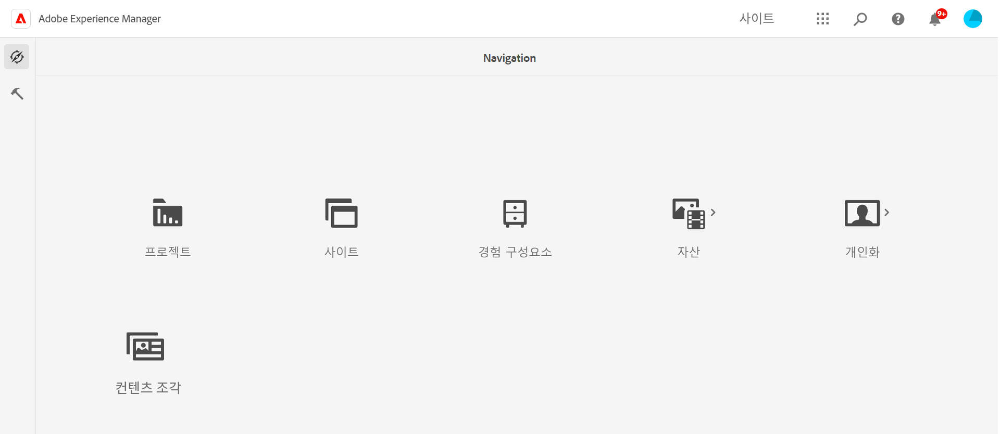

자세한 내용은 다음을 참조하십시오.

* [콘텐츠 조각 콘솔의 기본 구조 및 처리](#basic-structure-handling-content-fragments-console)

* [콘텐츠 조각에 대한 정보 제공](#information-content-fragments)

* [콘텐츠 조각 콘솔의 콘텐츠 조각에 대한 작업](#actions-selected-content-fragment)

* [콘솔에 표시된 열 선택](#select-columns-console)

* [콘텐츠 조각 콘솔에서 검색 및 필터링](#filtering-fragments)

* 몇 가지 키보드 단축키를 이 콘솔에서 사용할 수 있습니다.

>[!NOTE]
>
>이 콘솔에는 콘텐츠 조각만 표시됩니다. 이미지 및 비디오와 같은 다른 자산 유형은 표시되지 않습니다.

>[!CAUTION]
>
>이 콘솔은 온라인 Adobe Experience Manager(AEM) as a Cloud Service *에서만* 사용할 수 있습니다.

### 콘솔의 기본 구조 및 처리 {#basic-structure-handling-content-fragments-console}

선택 **컨텐츠 조각** 새 탭에서 콘솔을 엽니다.

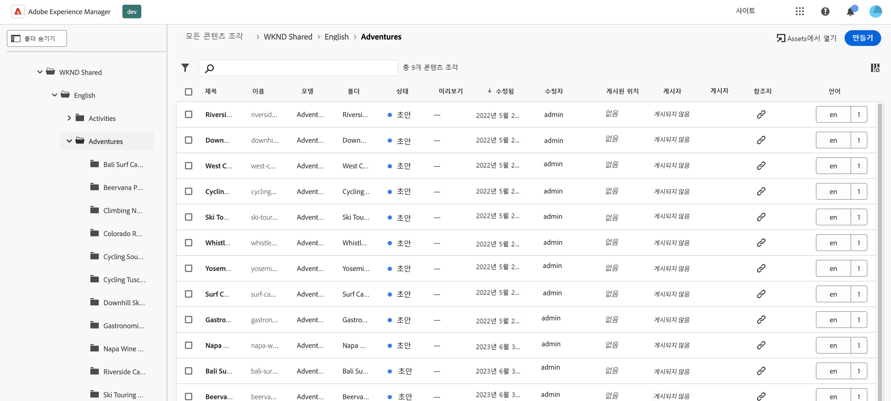

여기에서 세 가지 주요 영역을 확인할 수 있습니다.

* 상단 도구 모음
   * 표준 AEM 기능을 제공합니다.
   * IMS 조직도 표시합니다.
   * 다양한 [작업](#actions-unselected) 제공
* 왼쪽 패널
   * 여기에서 폴더 트리를 숨기거나 표시할 수 있습니다.
   * 트리의 특정 분기를 선택할 수 있습니다.
   * 중첩된 폴더를 표시하도록 크기를 조정할 수 있습니다.
* 기본/오른쪽 패널 - 여기에서 다음 작업을 수행할 수 있습니다.
   * 선택한 트리 분기에 있는 모든 콘텐츠 조각 목록 표시:
      * 선택한 폴더의 콘텐츠 조각이 표시되고 모든 하위 폴더가 표시됩니다.
         * 위치는 이동 경로로 표시됩니다. 위치를 변경하는 데에도 사용할 수 있습니다.
      * [각 조각에 대한 정보가 표시됩니다.](#information-content-fragments)
         * [표시할 열을 선택할 수 있습니다.](#select-columns-console)
      * 콘텐츠 조각에 대한 [다양한 정보 필드](#information-content-fragments)에서 링크가 제공됩니다. 필드에 따라 다음 작업을 수행할 수 있습니다.
         * 편집기에서 적절한 조각 열기
         * 참조에 대한 정보 표시
         * 조각의 언어 버전에 대한 정보 표시
      * 콘텐츠 조각에 대한 [기타 특정 정보 필드](#information-content-fragments)를 [빠른 필터링](#fast-filtering)에 사용할 수 있습니다.
         * 열에서 값을 선택하면 필터에 즉시 적용됩니다.
         * **모델**, **상태**, **수정자**, **태그** 및 **게시자** 열에 대해 빠른 필터링이 지원됩니다.
      * 열 머리글 위로 마우스를 가져가면 드롭다운 작업 선택기와 폭 슬라이더가 표시됩니다. 이를 사용하면 다음 작업을 수행할 수 있습니다.
         * 정렬 - 오름차순 또는 내림차순에 적합한 작업 선택
이렇게 하면 해당 열에 따라 전체 테이블이 정렬됩니다. 정렬은 해당 열에서만 사용할 수 있습니다.
         * 열 크기 조정 - 작업 또는 폭 슬라이더 사용
      * 추가 [작업](#actions-selected-content-fragment)에 하나 이상의 조각을 선택합니다.
   * [검색](#searching-fragments) 상자 사용
   * [필터 패널](#filtering-fragments) 열기

### 액션 {#actions}

콘솔에는 직접 또는 특정 조각을 선택한 후에 사용할 수 있는 다양한 작업이 있습니다.

* 다양한 작업이 [ 콘솔에서 사용 가능](#actions-unselected)합니다.
* [하나 이상의 콘텐츠 조각을 선택하여 적합한 작업을 표시](#actions-selected-content-fragment)할 수 있습니다.

#### 작업 (선택되지 않음) {#actions-unselected}

특정 콘텐츠 조각을 선택하지 않고 콘솔에서 특정 작업을 수행할 수 있습니다.

* 새 콘텐츠 조각 **[만들기](#creating-a-content-fragment)**
* 다양한 조건자에 따라 콘텐츠 조각을 [필터링](#filtering-fragments)하고 나중에 사용할 수 있도록 해당 필터 저장
* 콘텐츠 조각 [검색](#searching-fragments)
* [선택한 정보 열을 표시하도록 테이블 보기 맞춤화](#select-columns-console)
* **자산에서 열기**&#x200B;를 사용하여 **자산** 콘솔에서 현재 위치를 바로 열 수 있습니다

  >[!NOTE]
  >
  >다음 **에셋** 콘솔은 이미지, 비디오 등의 에셋에 액세스하는 데 사용됩니다.  이 콘솔은 다음과 같은 방법으로 액세스할 수 있습니다.
  >
  >* 콘텐츠 조각 콘솔에서 **자산에서 열기** 링크 사용
  >* 전역 **탐색** 창에서 바로 액세스

#### (선택한) 콘텐츠 조각 작업 {#actions-selected-content-fragment}

특정 조각을 선택하면 해당 조각에 사용할 수 있는 작업에 초점을 둔 도구 모음이 열립니다. 여러 조각을 선택할 수도 있습니다. 그에 따라 작업 선택이 조정됩니다.

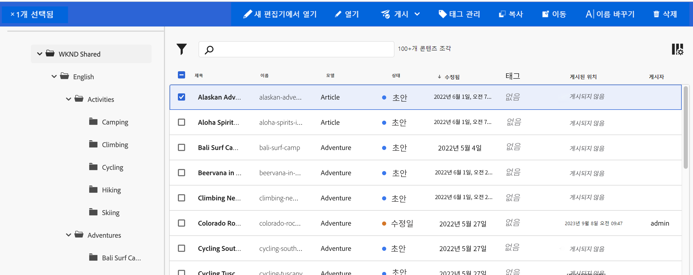

* **[새 편집기에서 열기](#editing-the-content-of-your-fragment)**
* (원본 편집기에서) **[열기](/help/assets/content-fragments/content-fragments-variations.md)**
* **[게시](#publishing-and-previewing-a-fragment)** (및 **[게시 취소](#unpublishing-a-fragment)**)
* **[태그 관리](#manage-tags)**
* **[복사](/help/assets/manage-digital-assets.md)**
* **[이동](/help/assets/manage-digital-assets.md)**
* **[이름 바꾸기](/help/assets/manage-digital-assets.md)**
* **[삭제](#deleting-a-fragment)**
* **[바꾸기](#find-and-replace)**

>[!NOTE]
>
>**열기**&#x200B;를 사용하여 *원본* 편집기에서 선택한 조각을 엽니다.

>[!NOTE]
>
>게시, 게시 취소, 삭제, 이동, 이름 바꾸기 및 복사와 같은 작업과 비동기 작업 트리거와 같은 작업입니다. AEM 비동기 작업 UI를 통해 해당 작업의 진행 상태를 모니터링할 수 있습니다.

### 콘텐츠 조각에 대한 정보 제공 {#information-content-fragments}

콘솔의 기본/오른쪽 패널(테이블 보기)에 콘텐츠 조각에 대한 다양한 정보가 표시됩니다. 일부 항목에서는 추가 작업 및/또는 정보로 직접 연결될 수도 있습니다.

* **이름**
   * 편집기에서 조각 열기 링크 제공.
* **모델**
   * 정보만.
   * [빠른 필터링](#fast-filtering)에 사용할 수 있습니다.
* **폴더**
   * 콘솔에서 폴더 열기 링크 제공.
폴더 이름에 마우스를 가져다 대면 JCR 경로가 표시됩니다.
* **상태**
   * 정보만.
   * [빠른 필터링](#fast-filtering)에 사용할 수 있습니다.
* **미리보기**
   * 정보만:
      * **동기화 상태**: 콘텐츠 조각은 **작성** 및 **미리보기** 서비스에서 동기화 상태입니다.
      * **비동기화 상태**: 콘텐츠 조각은 **작성** 및 **미리보기** 서비스에서 비동기화 상태입니다. 두 인스턴스가 동기화 상태로 반환되도록 **미리보기**&#x200B;에 **게시**&#x200B;해야 합니다.
      * 빈 상태: 콘텐츠 조각은 **미리보기** 서비스에 존재하지 않습니다.
* **수정됨**
   * 정보만.
* **수정한 사람**
   * 정보만.
   * [빠른 필터링](#fast-filtering)에 사용할 수 있습니다.
* **태그**
   * 정보만.
   * 기본과 변형 모두에 대해 콘텐츠 조각과 관련된 모든 태그를 표시합니다.
   * [빠른 필터링](#fast-filtering)에 사용할 수 있습니다.
* **게시일**
   * 정보만.
* **게시자**
   * 정보만.
   * [빠른 필터링](#fast-filtering)에 사용할 수 있습니다.
* **참조자**:
   * 해당 조각의 모든 [상위 참조](#parent-references-fragment)를 표시하는 대화 상자를 여는 링크가 제공됩니다. 여기에는 콘텐츠 조각, 경험 조각 및 페이지 참조가 포함됩니다. 특정 참조를 열려면 **제목** 을 클릭합니다.

     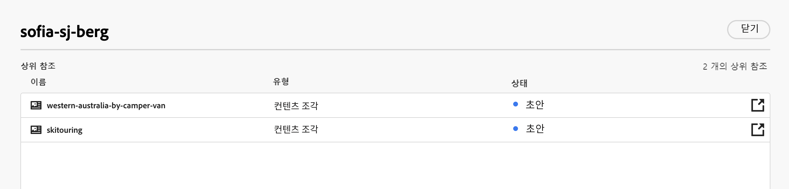

* **언어**: 다음을 나타냅니다. [언어](#language-copies-fragment) 사본

   * 콘텐츠 조각과 관련된 총 로컬/[언어](#language-copies-fragment) 사본 수와 함께 콘텐츠 조각 로케일을 표시합니다.

     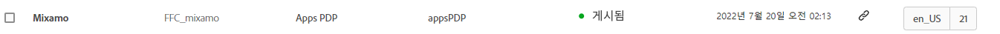

   * 카운트를 선택하여 모든 언어 사본을 표시하는 대화 상자를 엽니다. 특정 언어 사본을 열려면 **제목** 을 클릭합니다.

     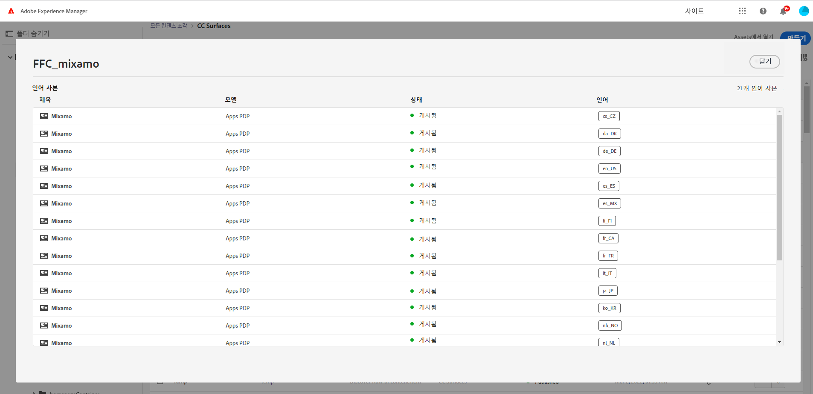

## 콘텐츠 조각 만들기 {#creating-content-fragments}

콘텐츠 조각을 만들기 전에 기본 콘텐츠 조각 모델을 만들어야 합니다.

### 콘텐츠 모델 만들기 {#creating-a-content-model}

구조화된 콘텐츠와 함께 콘텐츠 조각을 만들기 전에 [콘텐츠 조각 모델](/help/sites-cloud/administering/content-fragments/content-fragment-models.md)을 활성화하고 만들어야 합니다.

### 콘텐츠 조각 만들기 {#creating-a-content-fragment}

콘텐츠 조각을 만들려면 다음 작업을 수행하십시오.

1. **콘텐츠 조각** 콘솔에서 **만들기**&#x200B;를 선택합니다(오른쪽 상단).

   >[!NOTE]
   >
   >새 조각의 위치를 미리 정의하려면 조각을 만들려는 폴더로 이동하거나 생성 프로세스 중에 위치를 지정할 수 있습니다.

1. 다음 **새 콘텐츠 조각** 대화 상자가 열리면 여기에서 다음을 지정할 수 있습니다.

   * **위치** - 현재 위치로 자동 완성되지만 필요한 경우 다른 위치를 선택할 수 있습니다.
   * **콘텐츠 조각 모델** - 드롭다운 목록에서 조각의 기반으로 사용할 모델을 선택합니다.
   * **제목**
   * **이름** - 다음을 기반으로 자동 완성됨: **제목**, 그러나 필요한 경우 편집할 수 있습니다
   * **설명**

   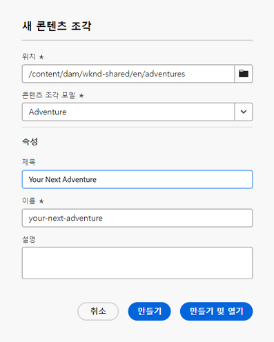

1. 정의를 유지하려면 **만들기** 또는 **만들기 및 열기**&#x200B;를 선택합니다.

## 콘텐츠 조각 상태 {#statuses-content-fragments}

콘텐츠 조각은 존재하는 동안 [콘텐츠 조각 콘솔](/help/sites-cloud/administering/content-fragments/managing.md#content-fragments-console)과 [콘텐츠 조각 편집기](/help/sites-cloud/administering/content-fragments/authoring.md)에 표시되는 것과 같이 여러 상태를 가질 수 있습니다.

* **새로 만들기**(회색)
콘텐츠 조각 편집기에서 새 콘텐츠 조각을 만들었지만 편집 또는 열리지 않는 콘텐츠는 없습니다.
* **초안**(파란색)
누군가 콘텐츠 조각 편집기에서 (새) 콘텐츠 조각을 편집하거나 열었지만 아직 게시되지 않았습니다.
* **게시됨**(녹색)
콘텐츠 조각이 게시되었습니다.
* **수정됨**(주황색)
콘텐츠 조각이 게시된 후 수정을 게시하기 전에 편집되었습니다.
* **게시 취소됨**(빨간색)
콘텐츠 조각의 게시가 취소되었습니다.

## 조각(및 변형)의 콘텐츠 편집 {#editing-the-content-of-your-fragment}

>[!IMPORTANT]
>
>자세한 내용은 [콘텐츠 조각 작성 참조](/help/sites-cloud/administering/content-fragments/authoring.md)

편집할 조각을 열려면

1. **콘텐츠 조각** 콘솔을 사용하여 콘텐츠 조각의 위치로 이동합니다.
1. 조각을 선택한 다음 도구 모음의 새 편집기에서 **열기**&#x200B;를 선택하여 편집할 조각을 엽니다.

1. 조각 편집기가 열립니다. 필요한 **변형**&#x200B;을 선택한 다음 필요에 따라 변경 작업을 수행합니다(자동 저장됨).

   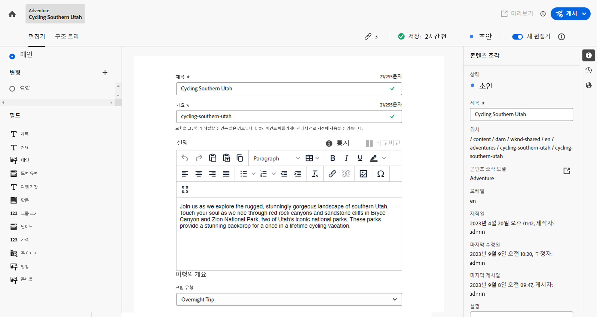

## 태그 보기 및 관리 {#manage-tags}

[열이 표시되고 있는지](#select-columns-console) 확인한 다음 콘텐츠 조각 콘솔에서 **태그** 열에 적용된 모든 태그를 볼 수 있습니다.

### 태그 관리(콘솔) {#manage-tags-console}

태그를 관리하려면

1. 콘텐츠 조각 콘솔로 이동합니다.
1. 콘텐츠 조각을 선택합니다.
1. 도구 모음에서 **태그 관리**&#x200B;를 선택합니다.
1. 태그 선택기를 사용하여 적용 또는 제거할 태그를 선택합니다.

   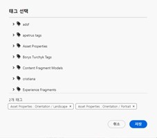

1. 업데이트를 **저장**&#x200B;합니다. 이를 선택하면 콘솔로 돌아갑니다.

### 태그 보기 및 편집(편집기) {#viewing-and-editing-tags}

편집기의 [속성](/help/sites-cloud/administering/content-fragments/authoring.md) 탭을 사용하여 조각에 적용된 태그를 보고 편집할 수도 있습니다. 표시되는 정보는 **기본**&#x200B;과 모든 **변형** 간에 다릅니다.

## 속성 보기 및 편집(편집기) {#viewing-and-editing-properties}

편집기의 [속성](/help/sites-cloud/administering/content-fragments/authoring.md) 탭을 사용하여 조각의 속성(메타데이터)을 보고 편집할 수 있습니다. 표시되는 정보는 **기본**&#x200B;과 모든 **변형** 간에 다릅니다.

## 조각 게시 및 미리보기 {#publishing-and-previewing-a-fragment}

콘텐츠 조각을 다음에 게시할 수 있습니다.

* **[게시 서비스](/help/headless/deployment/architecture.md)** - 전체 공개 액세스용

* **[미리보기 서비스](/help/headless/deployment/architecture.md)** - 정식 출시 전 콘텐츠 미리보기용

  >[!CAUTION]
  >
  >**게시** 작업을 통해 콘텐츠 조각 콘솔에서만 **미리보기 서비스**&#x200B;에 콘텐츠 조각을 게시할 수 있습니다.

  >[!NOTE]
  >
  >환경 미리보기에 대한 자세한 내용은 다음을 참조하십시오.
  >
  >* [환경 관리](/help/implementing/cloud-manager/manage-environments.md#access-preview-service)
  >* [미리보기 계층을 위한 OSGi 설정 구성](/help/implementing/preview-tier/preview-tier-configuring-osgi.md#configuring-osgi-settings-for-the-preview-tier)
  >* [Developer Console을 사용하여 미리보기 디버깅](/help/implementing/preview-tier/preview-tier-configuring-osgi.md#debugging-preview-using-the-developer-console)

>[!CAUTION]
>
>조각이 모델을 기반으로 한다면 [모델이 게시되었는지](/help/sites-cloud/administering/content-fragments/content-fragment-models.md#publishing-a-content-fragment-model) 확인해야 합니다.
>
>모델이 아직 게시되지 않은 콘텐츠 조각을 게시하는 경우 선택 목록에 이것이 표시되고 모델이 조각과 함께 게시됩니다.

### 게시 {#publishing}

다음 중 하나의 **게시** 옵션을 사용하여 콘텐츠 조각을 게시할 수 있습니다.

* [콘텐츠 조각 콘솔](#actions-selected-content-fragment)의 도구 모음

   * 목록에서 하나 이상의 조각을 선택합니다.

* [콘텐츠 조각 편집기](/help/sites-cloud/administering/content-fragments/authoring.md#content-fragment-editor)의 도구 모음

**게시** 작업을 선택한 후에

1. 다음 옵션 중 하나를 선택하여 적절한 대화 상자를 엽니다.

   * **지금** - **게시 서비스** 또는 **미리보기 서비스** 중 하나를 선택하면 확인 후 조각이 즉시 게시됩니다.
   * **예약** - 필수 서비스 외에 조각을 게시할 날짜 및 시간을 선택할 수도 있습니다.

1. 대화 상자에 모든 세부 정보를 입력합니다. 예: 예약된 게시 요청의 경우

   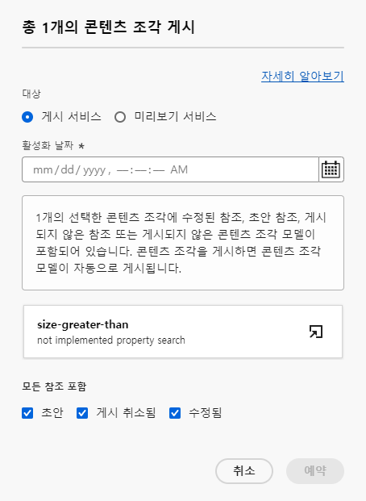

   >[!NOTE]
   >
   >필요한 경우 게시할 참조를 지정해야 합니다. 기본적으로 미리보기 서비스에도 참조를 게시하여 콘텐츠에 브레이크가 없는지 확인합니다.

1. 게시 작업을 확인합니다.

게시 후 조각 상태는 업데이트되고 편집기와 콘솔에 표시됩니다. 예약된 게시를 지정한 경우 정보가 표시됩니다.

>[!NOTE]
>
>또한 [조각을 사용하는 페이지를 게시](/help/sites-cloud/authoring/fundamentals/content-fragments.md#publishing)하면 해당 조각은 페이지 참조에 나열됩니다.

## 조각 게시 취소 {#unpublishing-a-fragment}

콘텐츠 조각을 게시 취소할 수 있습니다.

* [콘텐츠 조각 콘솔](#actions-selected-content-fragment)의 도구 모음

   * 목록에서 하나 이상의 조각을 선택합니다.

* [콘텐츠 조각 편집기](/help/sites-cloud/administering/content-fragments/authoring.md#content-fragment-editor)의 도구 모음

두 사례에서 도구 모음에서 **게시 취소**&#x200B;를 선택한 다음 **지금** 또는 **예약됨** 중 하나를 선택합니다.

관련 대화 상자가 열리면 적절한 서비스를 선택할 수 있습니다.

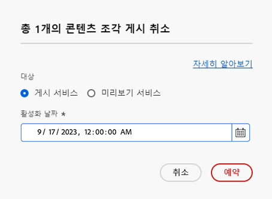

>[!NOTE]
>
>게시된 조각을 사용할 수 있는 경우에만 **게시 취소** 작업이 표시됩니다.

>[!CAUTION]
>
>다른 조각 또는 페이지에서 조각이 이미 참조된 경우 경고 메시지가 나타나고 계속 진행할지 확인해야 합니다.

## 찾기 및 바꾸기 {#find-and-replace}

다음 **바꾸기** 맨 위 도구 모음에서 작업을 사용하여 선택한 콘텐츠 조각에서 지정된 텍스트를 찾고 바꿀 수 있습니다.

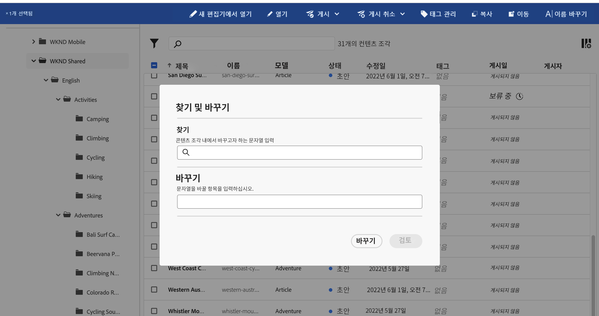

바꾸기 전에 검증 기준을 확인하고 충돌이 발생하면 사용자에게 알려 주기 때문에 교체 문자열을 변경하거나 검증된 인스턴스만 바꿀 수 있습니다.

>[!NOTE]
>
>찾기 및 바꾸기 작업은 선택한 최대 20개의 콘텐츠 조각에서만 수행할 수 있습니다(한 번에).
>
>콘텐츠 조각을 20개 이상 선택하면 메시지가 표시됩니다 **찾거나 바꿀 수 없음**.

## 조각 삭제 {#deleting-a-fragment}

조각을 삭제하려면 다음 작업을 수행합니다.

1. **콘텐츠 조각** 콘솔에서 콘텐츠 조각의 위치로 이동합니다.
1. 조각을 선택합니다.
1. 도구 모음에서 **삭제**&#x200B;를 선택합니다.
1. **삭제** 작업을 확인합니다.

>[!NOTE]
>
>**삭제**&#x200B;는 현재 게시된 조각에서 사용할 수 없으므로 먼저 게시를 취소해야 합니다.

## 조각의 상위 참조 찾기 {#parent-references-fragment}

상위 참조에 대한 세부 정보는 다음에서 액세스할 수 있습니다.

* 콘텐츠 조각 콘솔의 **참조** 열
* [콘텐츠 조각 편집기의 상단 도구 모음에 있는 상위 참조 링크](/help/sites-cloud/administering/content-fragments/authoring.md#view-parent-references)

두 참조를 통해 해당 조각의 모든 상위 참조를 표시하는 대화 상자를 여는 링크가 제공됩니다. 여기에는 콘텐츠 조각, 경험 조각 및 페이지 참조가 포함됩니다. 특정 참조를 열려면 **제목**&#x200B;또는 대화 상자에서 링크 아이콘 을 클릭합니다.

예:

## 조각의 언어 사본 찾기 {#language-copies-fragment}

언어 사본에 대한 세부 정보는 다음에서 액세스할 수 있습니다.

* [콘텐츠 조각 콘솔](#information-content-fragments)의 **언어** 열
* [콘텐츠 조각 편집기의 언어 사본 탭](/help/sites-cloud/administering/content-fragments/authoring.md#view-language-copies)

아이콘은 콘텐츠 조각과 관련된 총 로케일/언어 사본 수와 함께 콘텐츠 조각 로케일을 표시합니다. 예: 콘솔에서 표시:

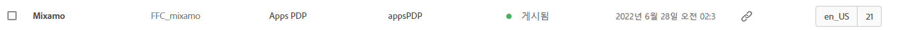

카운트를 선택하여 모든 언어 사본을 표시하는 대화 상자를 엽니다. 특정 언어 사본을 열려면 **제목** 을 클릭합니다.

## 콘솔에 표시된 열 선택 {#select-columns-console}

다른 콘솔과 마찬가지로 다음 작업에 표시된 열을 구성할 수 있습니다.

숨기거나 표시할 수 있는 열 목록이 표시됩니다.

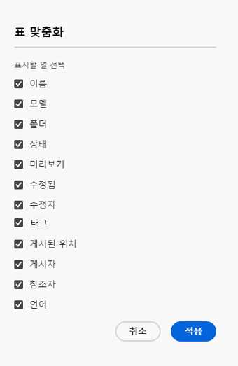

## 조각 필터링 {#filtering-fragments}

필터 패널에서는 다음과 같은 항목을 제공합니다.

* 조건자 선택
   * 콘텐츠 조각 모델, 지역화, 태그, 상태 필드 등 포함
   * 하나 이상의 조건자를 선택하고 결합하여 필터를 만들 수 있음
* 구성 **저장** 옵션
* 재사용을 위해 저장된 검색 필터를 검색할 수 있는 옵션

선택하면 **필터링 기준** 옵션이 표시됩니다(검색 상자 아래). 여기에서 선택을 취소할 수 있습니다. 예:

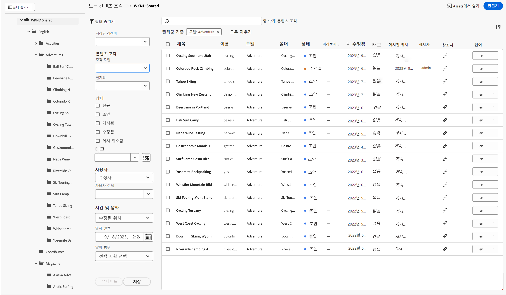

### 빠른 필터링 {#fast-filtering}

목록에서 특정 열 값을 클릭하여 조건자를 선택할 수도 있습니다. 하나 이상의 값을 선택하여 조건자를 결합할 수 있습니다.

예를 들어 **상태** 열에서 **게시됨**&#x200B;을 선택합니다.

>[!NOTE]
>
>빠른 필터링은 **모델**, **상태**, **수정자**, **태그** 및 **게시자** 열에 대해서만 지원됩니다.

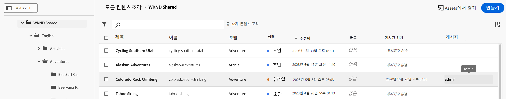

선택하면 필터 술어로 표시되고 그에 따라 목록이 필터링됩니다.

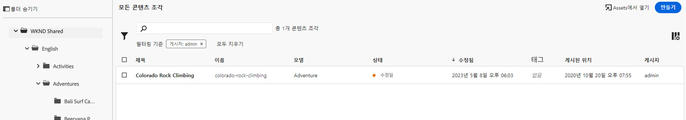

## 조각 검색 {#searching-fragments}

검색 상자는 전체 텍스트 검색을 지원합니다. 검색 상자에 검색어를 입력합니다.

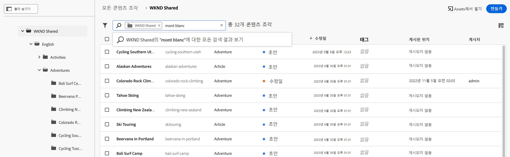

선택한 결과가 제공됩니다.

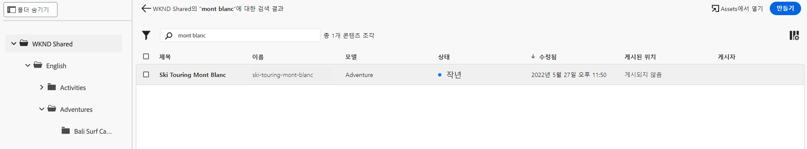

검색 상자도 **최근 콘텐츠 조각** 및 **저장된 검색**&#x200B;에 대한 빠른 액세스를 제공합니다.

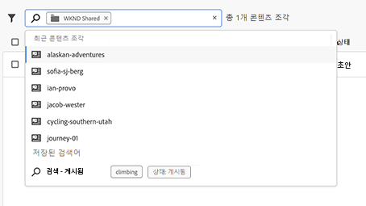
