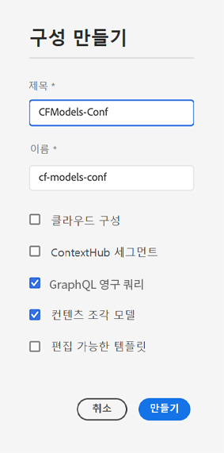
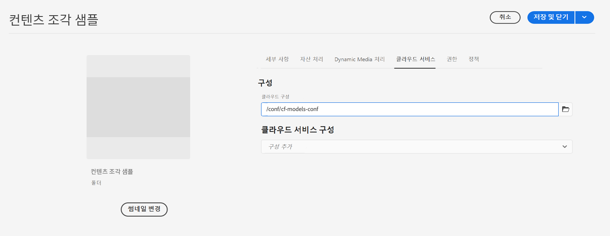

# 콘텐츠 조각 - 설정 {#content-fragments-setup}

Adobe Experience Manager(AEM) as a Cloud Service 내의 콘텐츠 조각을 통해 여러 위치와 여러 채널에서 사용할 수 있는 콘텐츠를 준비할 수 있습니다. 이는 Headless 게재와 페이지 작성에 이상적입니다.

콘텐츠 조각 기능에 대해 인스턴스를 활성화하려면 다음을 활성화해야 합니다.

* **콘텐츠 조각 모델** - 필수

  >[!CAUTION]
  >
  >**콘텐츠 조각 모델**&#x200B;을 활성화하지 않는 경우
  >
  >* 모델을 만들 때 **만들기** 옵션을 사용할 수 없습니다.
  >* [Sites 구성을 선택하여 관련 엔드포인트를 생성](/help/headless/graphql-api/graphql-endpoint.md)할 수 없습니다.

* **GraphQL 지속 쿼리** - 옵션

다음을 통해 인스턴스 설정을 수행합니다.

* [구성 브라우저에서 기능을 활성화](#enable-content-fragment-functionality-configuration-browser)한 다음
* [개별 자산 폴더에 구성 적용](#apply-the-configuration-to-your-folder)

## 구성 브라우저에서 콘텐츠 조각 기능 활성화 {#enable-content-fragment-functionality-configuration-browser}

콘텐츠 조각 모델 및 GraphQL 지속 쿼리의 콘텐츠 조각 기능을 사용하려면 먼저 **구성 브라우저**&#x200B;를 통해 활성화&#x200B;**해야 합니다**.

>[!NOTE]
>
>자세한 내용은 [구성 브라우저](/help/implementing/developing/introduction/configurations.md#using-configuration-browser)를 참조하십시오.

>[!NOTE]
>
>[하위 구성](/help/implementing/developing/introduction/configurations.md#configuration-resolution)(다른 구성 내에 중첩된 구성)은 콘텐츠 조각, 콘텐츠 조각 모델 및 GraphQL 쿼리와 함께 사용할 수 있도록 완전히 지원됩니다.
>
>다음을 참고하십시오.
>
>* 하위 구성에서 모델을 생성한 후에는 해당 모델을 다른 하위 구성으로 이동하거나 복사할 수 없습니다.
>
>* GraphQL 엔드포인트는 상위(루트) 구성을 기반으로 합니다.
>
>* 지속 쿼리는 상위(루트) 구성과 관련하여 저장됩니다.

1. **도구**, **일반**&#x200B;으로 이동한 다음 **구성 브라우저**&#x200B;를 엽니다.

1. **만들기**&#x200B;를 사용하여 대화 상자를 열고 여기에서

   1. **제목**&#x200B;을 지정합니다.
   1. 생성 시 **이름**은 저장소의 노드 이름이 됩니다.
이름을 입력할 수 있습니다. 필드를 비워두면 제목을 기반으로 자동 생성되고 [AEM 명명 규칙](/help/implementing/developing/introduction/naming-conventions.md)에 따라 조정됩니다. 필요한 경우 결과를 조정할 수 있습니다.
   1. 사용을 활성화하려면 다음을 선택합니다.
      * **콘텐츠 조각 모델**
      * **GraphQL 지속 쿼리**

      

1. **만들기**&#x200B;를 선택하여 정의를 저장합니다.

## 폴더에 구성 적용 {#apply-the-configuration-to-your-folder}

콘텐츠 조각 구성에 대해 **전역** 구성이 활성화된 경우, **자산** 콘솔을 통해 액세스할 수 있는 모든 자산 폴더에 적용됩니다.

비슷한 자산 폴더와 함께 다른 구성(그 결과 전역 제외)을 사용하려면 연결을 정의해야 합니다. 이를 위해 해당 폴더 내 **폴더 속성**&#x200B;의 **클라우드 서비스** 탭에서 적절한 **구성**&#x200B;을 선택하면 됩니다.

