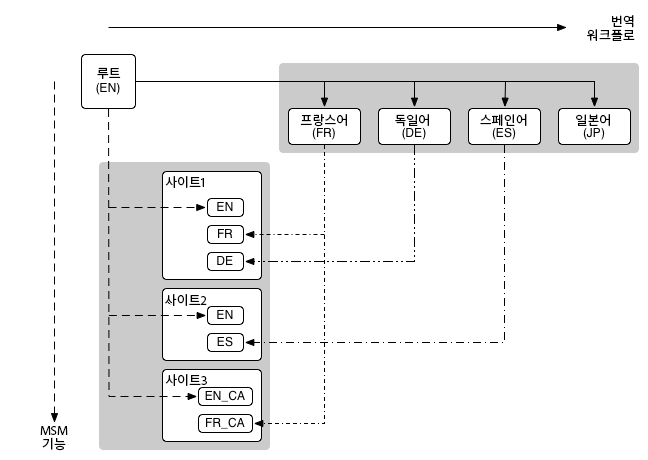

# 다중 사이트 관리자 및 번역 {#msm-and-translation}

Adobe Experience Manager의 내장 다중 사이트 관리자 및 번역 도구는 콘텐츠 현지화를 간소화합니다.

* 다중 사이트 관리자(MSM) 및 라이브 카피 기능을 사용하면 다양한 변형을 활용함과 동시에 여러 지역에서 동일한 사이트 콘텐츠를 사용할 수 있습니다.
   * [콘텐츠 재사용: 다중 사이트 관리자 및 라이브 카피](msm/overview.md)
* 번역을 통해 페이지 콘텐츠 번역을 자동화하여 다국어 웹 사이트를 만들고 관리할 수 있습니다.
   * [다국어 사이트를 위한 콘텐츠 번역](translation/overview.md)

이러한 두 가지 기능을 결합하여 [다국적 및 다국어](#multinational-and-multilingual-sites) 웹 사이트를 지원할 수 있습니다.

>[!TIP]
>
>콘텐츠 번역이 처음이라면 다음을 참조하십시오. [사이트 번역 여정](/help/journey-sites/translation/overview.md). AEM의 강력한 번역 도구를 사용하여 AEM Sites 콘텐츠를 번역하는 방법을 안내하는 경로입니다. AEM 또는 번역 경험이 없는 사용자에게 이상적입니다.

## 다국적 및 다국어 사이트 {#multinational-and-multilingual-sites}

다중 사이트 관리자 및 번역 워크플로를 결합하여 사용함으로써 다국적 및 다국어 사이트를 위한 콘텐츠를 효율적으로 만들 수 있습니다.

일반적으로 특정 국가의 언어로 기본 사이트를 만든 다음 필요한 경우 번역을 사용하여 해당 콘텐츠를 다른 사이트의 기초로 사용합니다.

1. [번역](translation/overview.md) 기본 사이트를 다른 언어로 만듭니다.
1. [다중 사이트 관리자](msm/overview.md)를 사용하여 다음과 같은 작업을 수행합니다.
   1. 기본 사이트 및 번역의 콘텐츠를 재사용하여 다른 국가 및 문화에 대한 사이트를 만듭니다.
   1. 필요한 경우 라이브 카피의 요소를 분리하여 현지화 세부 사항을 추가합니다.

>[!TIP]
>
>다중 사이트 관리자의 사용을 하나의 언어 내 콘텐츠로 제한합니다.
>
>예를 들어 기본 영어를 사용하여 미국, 캐나다 및 영국 페이지의 영어 페이지 버전을 제작합니다. 그런 다음 기본 프랑스어를 사용하여 프랑스, 스위스, 캐나다 등의 프랑스어 페이지 버전을 만듭니다.

다음 다이어그램은 주요 개념이 어떻게 교차하는지를 보여 줍니다(모든 수준/요소를 포함하지는 않음).

이 시나리오 및 이와 유사한 시나리오에서 MSM은 이와 같이 서로 다른 언어 버전을 관리하지 않습니다.

* [MSM](msm/overview.md) 는 언어 경계 내에서 블루프린트(즉, 기본 전역)에서 라이브 카피(즉, 로컬 사이트)로의 번역된 콘텐츠 배포를 관리합니다.
* 다음 [번역](translation/overview.md) AEM의 통합 기능은 서드파티 번역 관리 서비스와 함께 다양한 언어 및 콘텐츠 번역을 관리합니다.

고급 사용 사례의 경우 기본 언어 간에도 MSM을 사용할 수 있습니다.

>[!TIP]
>
>모든 사용 사례는 다음 모범 사례를 읽어보시기 바랍니다.
>
>* [MSM 모범 사례](msm/best-practices.md)
>* [번역 모범 사례](translation/best-practices.md)
