# Live Copy 생성 및 동기화 {#creating-and-synchronizing-live-copies}

페이지 또는 블루프린트 구성으로 Live Copy를 만들어 사이트 간 콘텐츠를 재사용할 수 있습니다. 상속 및 동기화를 관리하여 콘텐츠에 대한 변경 내용이 적용되는 방법을 제어할 수 있습니다.

## 블루프린트 구성 관리 {#managing-blueprint-configurations}

블루프린트 구성은 사용자가 하나 이상의 Live Copy 페이지에 대한 소스로 사용하고자 하는 기존 웹 사이트를 식별합니다.

>[!TIP]
>
>블루프린트 구성을 통해 콘텐츠 변경 내용을 Live Copy로 푸시할 수 있습니다. [Live Copy - 소스, 블루프린트 및 블루프린트 구성](overview.md#source-blueprints-and-blueprint-configurations)을 참조하십시오.

블루프린트 구성을 만들 때는 블루프린트 내부 구조를 정의하는 템플릿을 선택해야 합니다. 기본 블루프린트 템플릿은 소스 웹 사이트가 다음과 같은 속성을 가지고 있다고 가정합니다.

* 웹 사이트에 루트 페이지가 있음
* 루트 페이지의 직접적인 하위 페이지는 웹 사이트의 언어 분기임 Live Copy 생성 시 언어는 사본에 포함할 선택적 콘텐츠로 표시됩니다.
* 각 언어 분기의 루트는 하나 이상의 하위 페이지를 가짐 Live Copy 생성 시 Live Copy에 포함할 수 있도록 하위 페이지가 표시됩니다.

>[!NOTE]
>
>서로 다른 구조에는 서로 다른 블루프린트 템플릿이 필요합니다.

블루프린트 구성을 만든 후에는 다음과 같은 속성을 구성하게 됩니다.

* **이름**: 블루프린트 구성의 이름
* **소스 경로**: 소스(블루프린트)로 사용 중인 사이트 루트 페이지의 경로
* **설명**. (옵션) 블루프린트에 대한 설명으로, 사이트를 만들 때 선택할 수 있는 블루프린트 구성 목록에 표시됩니다.

블루프린트 구성 사용 시 이를 소스/블루프린트 Live Copy의 동기화 방법을 결정하는 롤아웃 구성과 연결할 수 있습니다. [사용할 롤아웃 구성 지정](live-copy-sync-config.md#specifying-the-rollout-configurations-to-use)을 참조하십시오.

### 블루프린트 구성 만들기 및 편집 {#creating-editing-blueprint-configurations}

블루프린트 구성은 변경 불가능한 데이터로 간주되므로 런타임 시 편집할 수 없습니다. 따라서 모든 구성 변경 내용은 CI/CD 파이프라인을 사용하는 Git을 통해 배포해야 합니다.

추가 정보는 [Adobe Experience Manager(AEM) as a Cloud Service의 주요 변경 내용](/help/release-notes/aem-cloud-changes.md)에서 찾을 수 있습니다.

다음 단계는 로컬 개발 인스턴스의 관리자가 테스트 및 개발 목적으로만 사용할 수 있습니다. AEMaaCS 클라우드 인스턴스에서는 이들 옵션을 사용할 수 없습니다.

#### 로컬에서 블루프린트 구성 만들기 {#creating-a-blueprint-configuration}

블루프린트 구성을 만들려면 다음 작업을 수행하십시오.

1. **도구** 메뉴로 [이동](/help/sites-cloud/authoring/getting-started/basic-handling.md#global-navigation)한 다음 **사이트** 메뉴를 선택합니다.
1. **블루프린트**&#x200B;를 선택하여 **블루프린트 구성** 콘솔을 엽니다.

   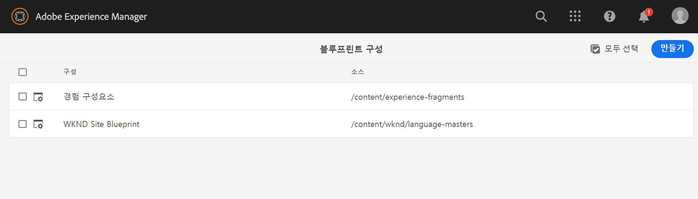

1. **만들기**&#x200B;를 선택합니다.
1. 블루프린트 템플릿을 선택하고 **다음**&#x200B;을 선택하여 계속합니다.
1. 블루프린트로 사용할 소스 페이지를 선택하고 **다음**&#x200B;을 선택하여 계속합니다.
1. 다음을 정의합니다.

   * **제목**: 블루프린트의 필수 제목
   * **설명**: 자세한 내용을 제공하는 선택적 설명

1. **만들기**&#x200B;를 선택하면 사용자의 사양을 기반으로 블루프린트 구성이 생성됩니다.

### 로컬에서 블루프린트 구성 편집 또는 삭제{#editing-or-deleting-a-blueprint-configuration}

기존 블루프린트 구성을 편집하거나 삭제할 수 있습니다.

1. **도구** 메뉴로 [이동](/help/sites-cloud/authoring/getting-started/basic-handling.md#global-navigation)한 다음 **사이트** 메뉴를 선택합니다.
1. **블루프린트**&#x200B;를 선택하여 **블루프린트 구성** 콘솔을 엽니다.

   

1. 필요한 블루프린트 구성을 선택하면 도구 모음에 적절한 작업이 제공됩니다.

   * **속성**: 구성의 속성을 보고 편집할 수 있습니다.
   * **삭제**

## Live Copy 만들기 {#creating-a-live-copy}

다양한 방법을 통해 Live Copy를 만들 수 있습니다.

### 페이지의 Live Copy 만들기 {#creating-a-live-copy-of-a-page}

페이지 또는 분기의 Live Copy를 만들 수 있습니다. Live Copy 생성 시 콘텐츠를 동기화하는 데 사용할 롤아웃 구성을 지정할 수 있습니다.

* 선택한 롤아웃 구성은 Live Copy 페이지 및 하위 페이지에 적용됩니다.
* 롤아웃 구성을 지정하지 않은 경우 MSM이 사용할 롤아웃 구성을 결정합니다. [사용할 롤아웃 구성 지정](live-copy-sync-config.md#specifying-the-rollout-configurations-to-use)을 참조하십시오.

원하는 모든 페이지의 Live Copy를 만들 수 있습니다.

* [블루프린트 구성](#creating-a-blueprint-configuration)에서 참조하는 페이지
* 및 구성에 연결되어 있지 않은 페이지
* 다른 Live Copy 페이지 내의 Live Copy([중첩된 Live Copy](overview.md#nested-live-copies))

유일한 차이점은 소스/블루프린트 페이지의 **롤아웃** 명령의 가용성이 블루프린트에서 소스를 참조하는지 여부에 따라 달라진다는 점입니다.

* 블루프린트 구성에서 **참조하는** 소스 페이지로 Live Copy를 만드는 경우, 소스/블루프린트 페이지에서 롤아웃 명령을 사용할 수 있습니다.
* 블루프린트 구성에서 **참조하지 않는** 소스 페이지로 Live Copy를 만드는 경우 소스/블루프린트 페이지에서 롤아웃 명령을 사용할 수 없습니다.

Live Copy를 만들려면 다음 작업을 수행하십시오.

1. **사이트** 콘솔에서 **만들기**&#x200B;를 선택한 다음 **Live Copy**&#x200B;를 선택합니다.

   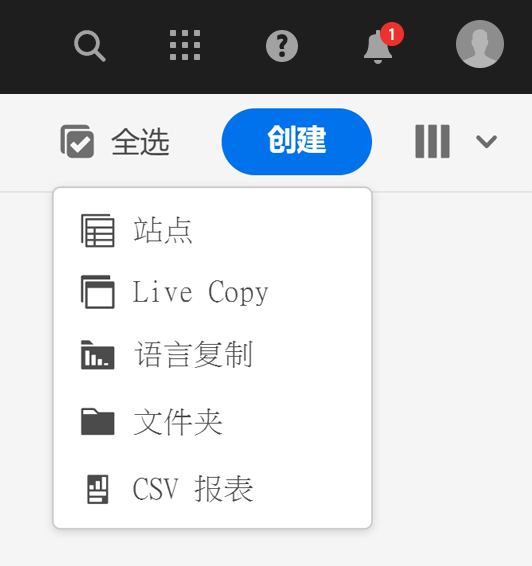

1. 소스 페이지를 선택하고 **다음**&#x200B;을 클릭하거나 탭합니다. 예:

   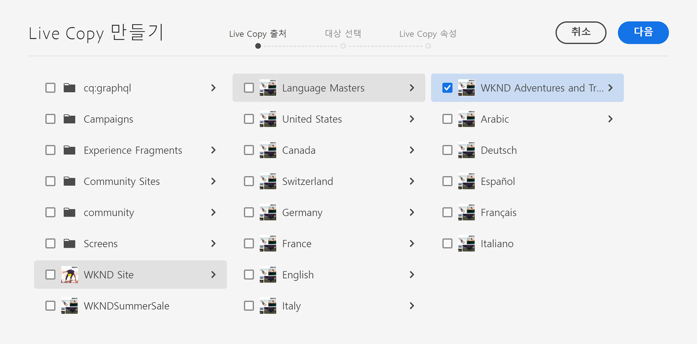

1. Live Copy의 대상 경로를 지정하고(Live Copy의 상위 폴더/페이지 열기) **다음**&#x200B;을 클릭하거나 탭합니다.

   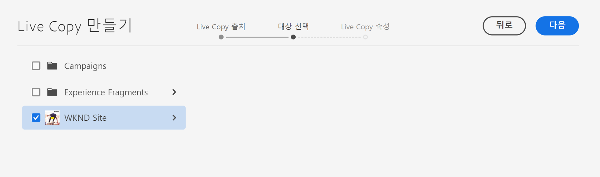

   >[!NOTE]
   >
   >대상 경로는 소스 경로 내에 있을 수 없습니다.

1. 다음을 입력합니다.

   * 페이지 **제목**
   * URL에 사용할 **이름**

   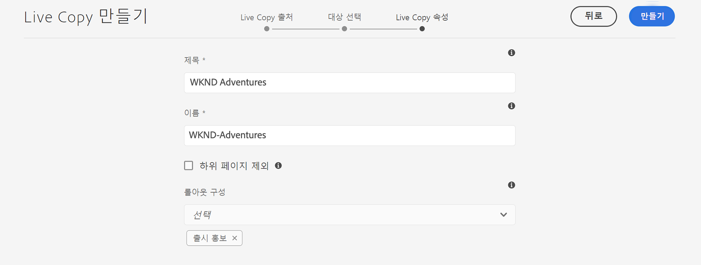

1. **하위 페이지 제외** 확인란을 사용하여 다음 중 하나를 수행합니다.

   * 선택됨: 선택한 페이지의 Live Copy만 생성(약식 Live Copy)
   * 선택되지 않음: 선택한 페이지의 모든 하위 항목을 포함하는 Live Copy 생성(딥 Live Copy)

1. (옵션) Live Copy에 사용할 롤아웃 구성을 하나 이상 지정하려면 **롤아웃 구성** 드롭다운 목록을 사용하여 선택하십시오. 선택한 구성은 드롭다운 선택기 아래에 표시됩니다.
1. **만들기**&#x200B;를 클릭하거나 탭합니다. 표시되는 확인 메시지에서 **열기** 또는 **완료** 중 하나를 선택할 수 있습니다.

   >[!NOTE]
   >
   >“양식 제출 실패” 메시지와 함께 오류 대화 상자가 나타날 수 있습니다. 네트워크 시간 초과로 인해 오류가 발생합니다. 단, Live Copy 생성 프로세스는 배경에서 실행 중입니다. 몇 분 후에 Live Copy 페이지가 제대로 생성되었는지 확인합니다.

### 블루프린트 구성으로 사이트의 Live Copy 만들기 {#creating-a-live-copy-of-a-site-from-a-blueprint-configuration}

블루프린트 구성을 사용하여 Live Copy를 만들어 블루프린트(소스) 콘텐츠를 기반으로 사이트를 만들 수 있습니다. 블루프린트 구성으로 Live Copy를 만들 때는 복사할 블루프린트 소스의 언어 분기를 하나 이상 선택한 다음 언어 분기에서 복사할 챕터를 선택해야 합니다. [블루프린트 구성 만들기](#creating-a-blueprint-configuration)를 참조하십시오.

Live Copy에서 일부 언어 분기를 생략할 경우 이를 나중에 추가할 수 있습니다. 자세한 내용은 [Live Copy(블루프린트 구성) 내부에 Live Copy 만들기](#creating-a-live-copy-inside-a-live-copy-blueprint-configuration)를 참조하십시오.

>[!CAUTION]
>
>블루프린트 소스에 다른 분기의 단락을 대상으로 하는 링크 및 참조가 포함된 경우 해당 대상은 Live Copy 페이지에 업데이트되지 않지만 원본 대상에 지정된 상태는 그대로 유지됩니다.

사이트 생성 시 다음과 같은 속성의 값을 입력하십시오.

* **초기 언어**: Live Copy에 포함할 블루프린트 소스의 언어 분기
* **초기 챕터**: Live Copy에 포함할 블루프린트 언어 분기의 하위 페이지
* **대상 경로**: Live Copy 사이트의 루트 페이지 위치
* **제목**: Live Copy 사이트의 루트 페이지 제목
* **이름**: (옵션) Live Copy의 루트 페이지를 저장하는 JCR 노드의 이름(기본 값은 제목을 기반으로 함)
* **사이트 소유자**: (옵션) Live Copy의 담당 역할에 대한 정보
* **Live Copy**: 소스 사이트와 라이브 관계를 설정하려면 이 옵션을 선택하십시오. 이 옵션을 선택하지 않으면 블루프린트의 사본이 생성되지만 이후 소스와 동기화되지 않습니다.
* **롤아웃 구성**: (옵션) Live Copy 동기화에 사용할 하나 이상의 롤아웃 구성을 선택하십시오. 기본적으로 롤아웃 구성은 블루프린트에서 상속됩니다. 자세한 내용은 [사용할 롤아웃 구성 지정](live-copy-sync-config.md#specifying-the-rollout-configurations-to-use)을 참조하십시오.

블루프린트 구성으로 사이트의 Live Copy를 만들려면 다음 작업을 수행하십시오.

1. **Sites** 콘솔에서 **만들기**&#x200B;를 선택한 다음, 드롭다운 선택기에서 **사이트**&#x200B;를 선택합니다.
1. Live Copy의 소스로 사용할 블루프린트 구성을 선택하고 **다음**&#x200B;을 선택하여 진행합니다.

   

1. **초기 언어** 선택기를 사용하여 Live Copy에 사용할 블루프린트 사이트의 언어를 지정합니다.

   기본적으로 사용할 수 있는 모든 언어가 선택되어 있습니다. 언어를 제거하려면 해당 언어 옆에 나타나는 **X**&#x200B;를 클릭하거나 탭합니다.

   예:

   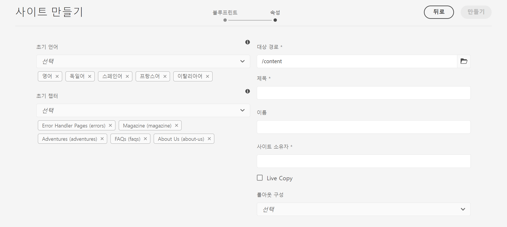

1. **초기 챕터** 드롭다운을 사용하여 Live Copy에 포함할 블루프린트의 섹션을 선택합니다. 기본적으로 사용할 수 있는 모든 챕터가 포함되어 있지만 필요하지 않은 챕터를 제거할 수 있습니다.
1. 나머지 속성의 값을 입력한 다음 **만들기**&#x200B;를 선택합니다. 확인 대화 상자에서 **완료**&#x200B;를 선택하여 **사이트** 콘솔로 돌아가거나 **사이트 열기**&#x200B;를 선택하여 사이트의 루트 페이지를 엽니다.

### Live Copy(블루프린트 구성) 내부에 Live Copy 만들기 {#creating-a-live-copy-inside-a-live-copy-blueprint-configuration}

블루프린트 구성을 사용하여 만든 기존 Live Copy 내부에 새 Live Copy를 만들 때, 처음 Live Copy를 만들 때 포함되지 않은 언어 사본 또는 챕터를 삽입할 수 있습니다.

## Live Copy 모니터링 {#monitoring-your-live-copy}

### Live Copy 상태 보기 {#seeing-the-status-of-a-live-copy}

Live Copy 페이지의 속성에는 다음과 같은 Live Copy에 대한 정보가 표시됩니다.

* **소스**: Live Copy 페이지의 소스 페이지
* **상태**: Live Copy의 동기화 상태(예: Live Copy가 소스로 업데이트되었는지 여부, 마지막으로 동기화된 시기 및 동기화를 수행한 사용자)
* **구성**:

   * 페이지가 여전히 Live Copy 상속 대상인지 여부
   * 구성이 상위 페이지에서 상속되는지 여부
   * Live Copy가 사용하는 롤아웃 구성

속성을 보려면 다음 작업을 수행하십시오.

1. **사이트** 콘솔에서 Live Copy 페이지를 선택한 다음 속성을 엽니다.
1. **Live Copy** 탭을 선택합니다.

   예:

   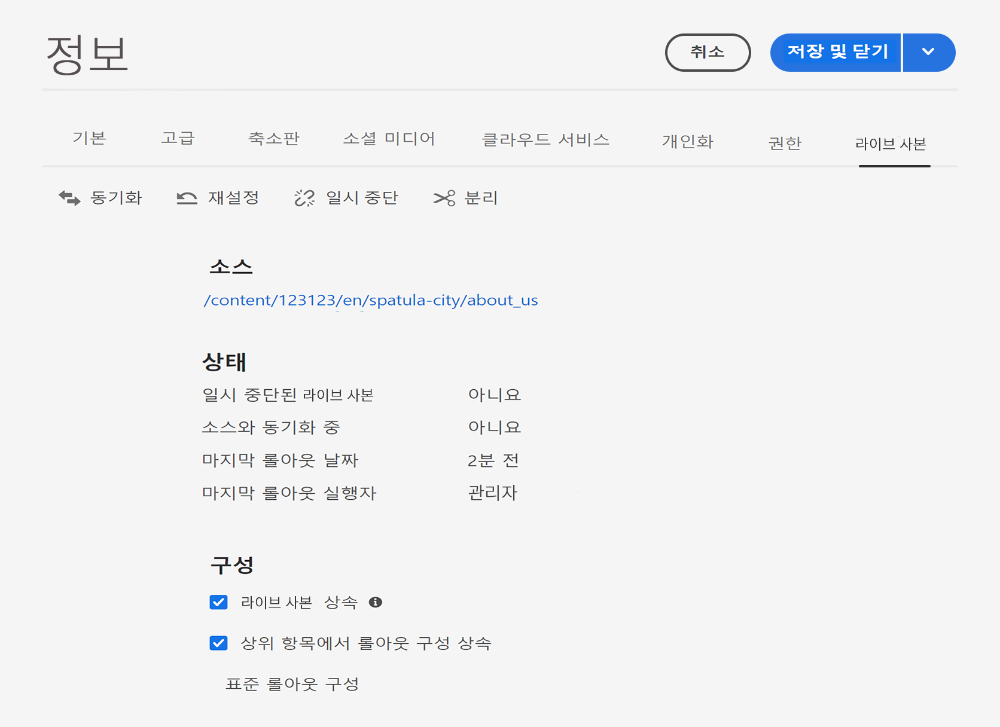

   자세한 내용은 Live Copy 개요 콘솔 문서의 [Live Copy 사용 개요](live-copy-overview.md#using-the-live-copy-overview) 섹션을 참조하십시오.

### 블루프린트 페이지의 Live Copy 보기 {#seeing-the-live-copies-of-a-blueprint-page}

블루프린트 구성에서 참조하는 블루프린트 페이지는 현재 (블루프린트) 페이지를 소스로 사용하는 Live Copy 페이지 목록을 제공합니다. 이 목록을 사용하여 Live Copy를 계속 추적할 수 있습니다. 이 목록은 [페이지 속성](/help/sites-cloud/authoring/fundamentals/page-properties.md)의 **블루프린트** 탭에 표시됩니다.

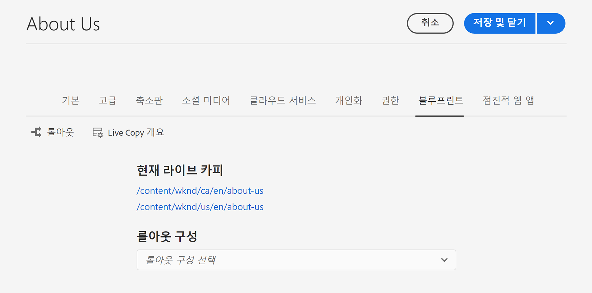

## Live Copy 동기화 {#synchronizing-your-live-copy}

다양한 방법을 통해 Live Copy를 동기화할 수 있습니다.

### 블루프린트 롤아웃 {#rolling-out-a-blueprint}

블루프린트 페이지를 롤아웃하여 콘텐츠 변경 내용을 Live Copy로 푸시할 수 있습니다. **롤아웃** 작업은 [롤아웃 시](live-copy-sync-config.md#rollout-triggers) 트리거를 사용하는 롤아웃 구성을 실행합니다.

>[!NOTE]
>
>블루프린트 분기 및 종속 Live Copy 분기 모두에서 동일한 페이지 이름의 새 페이지를 만들면 충돌이 발생할 수 있습니다.
>
>이러한 [충돌은 롤아웃 시 처리 및 해결해야 합니다](rollout-conflicts.md).

#### 페이지 속성에서 블루프린트 롤아웃 {#rolling-out-a-blueprint-from-page-properties}

1. **사이트** 콘솔에서 블루프린트의 페이지를 선택한 다음 속성을 엽니다.
1. **블루프린트** 탭을 엽니다.
1. **롤아웃**&#x200B;을 선택합니다.

   

1. 페이지 및 하위 페이지를 지정한 다음 확인 표시를 클릭하여 확인합니다.

   

1. 롤아웃 작업을 즉시 실행할지(**지금**) 또는 다른 날짜/시간에 실행할지(**나중에**) 지정합니다.

   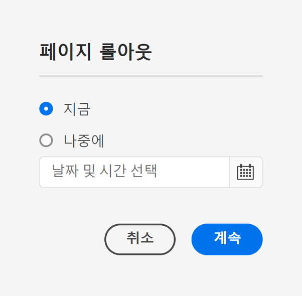

롤아웃은 비동기 작업으로 처리되며 [***비동기 작업 상태** 페이지에서 확인할 수 있습니다](/help/operations/asynchronous-jobs.md#monitor-the-status-of-asynchronous-operations).

#### 참조 레일에서 블루프린트 롤아웃 {#roll-out-a-blueprint-from-the-reference-rail}

1. **사이트** 콘솔에서 Live Copy의 페이지를 선택한 다음 도구 모음에서 **[참조](/help/sites-cloud/authoring/getting-started/basic-handling.md#references)** 패널을 엽니다.
1. 목록에서 **블루프린트** 옵션을 선택하여 이 페이지와 연결된 블루프린트를 표시합니다.
1. 목록에서 필요한 블루프린트를 선택합니다.
1. **롤아웃**&#x200B;을 클릭하거나 탭합니다.

   

1. 롤아웃 세부 정보를 확인하라는 메시지가 표시됩니다.

   * **롤아웃 범위**:

     선택한 페이지에 대한 범위만 지정할지 또는 범위에 하위 페이지를 포함할지 여부를 지정합니다.

   * **일정**:

     롤아웃 작업을 즉시 실행할지(**지금**) 또는 이후의 날짜/시간에 실행할지(**나중에**) 지정합니다.

     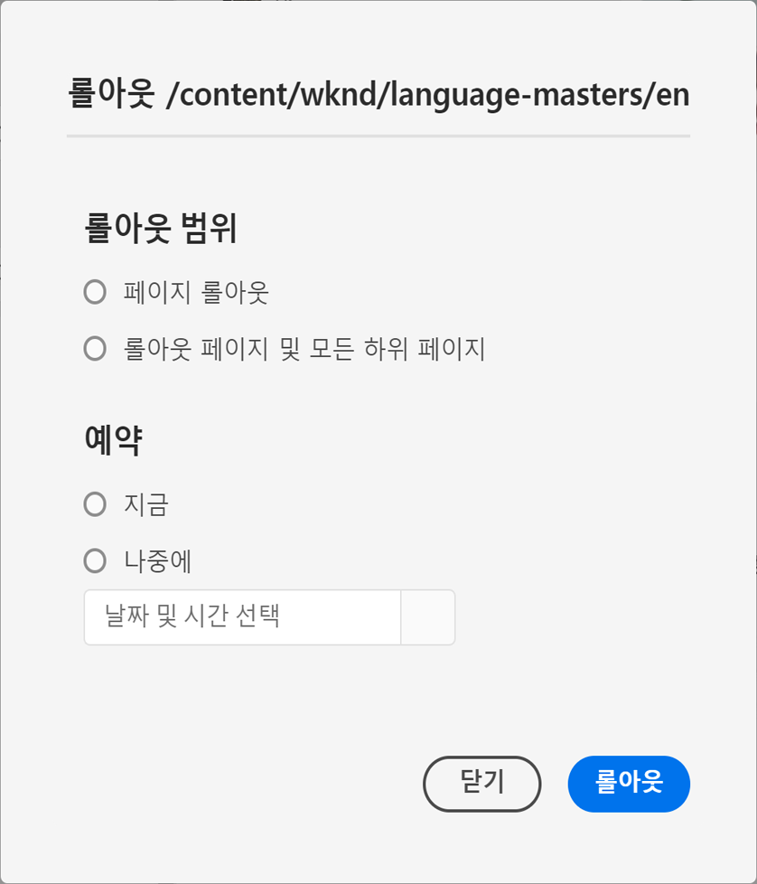

1. 이러한 세부 정보를 확인한 다음에는 **롤아웃**&#x200B;을 선택하여 작업을 수행합니다.

롤아웃은 비동기 작업으로 처리되며 [**비동기 작업 상태** 페이지에서 확인할 수 있습니다](/help/operations/asynchronous-jobs.md#monitor-the-status-of-asynchronous-operations).

#### Live Copy 개요에서 블루프린트 롤아웃 {#roll-out-a-blueprint-from-the-live-copy-overview}

블루프린트 페이지를 선택하면 Live Copy 개요](live-copy-overview.md#using-the-live-copy-overview)에서도 [**롤아웃** 작업을 사용할 수 있습니다.

1. [Live Copy 개요](live-copy-overview.md#using-the-live-copy-overview)를 연 다음 블루프린트 페이지를 선택합니다.
1. 도구 모음에서 **롤아웃**&#x200B;을 선택합니다.

   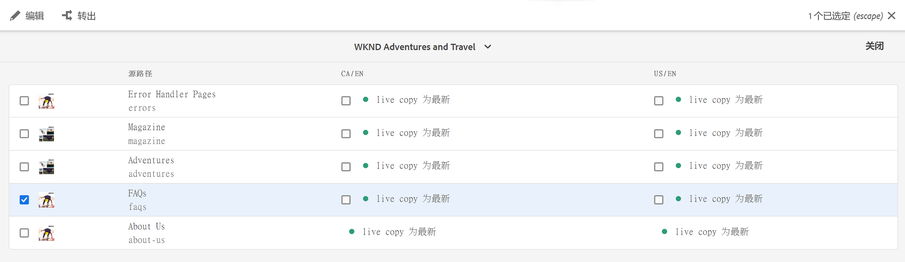

1. 페이지 및 하위 페이지를 지정한 다음 확인 표시를 클릭하여 확인합니다.

   

1. 롤아웃 작업을 즉시 실행할지(**지금**) 또는 다른 날짜/시간에 실행할지(**나중에**) 지정합니다.

   

롤아웃은 비동기 작업으로 처리되며 [**비동기 작업 상태** 페이지에서 확인할 수 있습니다](/help/operations/asynchronous-jobs.md#monitor-the-status-of-asynchronous-operations).

### Live Copy 동기화 {#synchronizing-a-live-copy}

Live Copy 페이지를 동기화하여 소스에서 Live Copy로 콘텐츠 변경 내용을 가져올 수 있습니다.

#### 페이지 속성에서 Live Copy 동기화 {#synchronize-a-live-copy-from-page-properties}

Live Copy를 동기화하여 소스에서 Live Copy로 변경 내용을 가져올 수 있습니다.

>[!NOTE]
>
>동기화는 [롤아웃 시](live-copy-sync-config.md#rollout-triggers) 트리거를 사용하는 롤아웃 구성을 실행합니다.

1. **사이트** 콘솔에서 Live Copy 페이지를 선택한 다음 속성을 엽니다.
1. **Live Copy** 탭을 엽니다.
1. **동기화**&#x200B;를 클릭하거나 탭합니다.

   

   확인을 요청하는 메시지가 표시됩니다. 계속하려면 **동기화**&#x200B;를 사용하십시오.

#### Live Copy 개요에서 Live Copy 동기화 {#synchronize-a-live-copy-from-the-live-copy-overview}

Live Copy 페이지를 선택하면 [Live Copy 개요에서도 동기화 작업을 사용](live-copy-overview.md#using-the-live-copy-overview)할 수 있습니다.

1. [Live Copy 개요](live-copy-overview.md#using-the-live-copy-overview)를 연 다음 Live Copy 페이지를 선택합니다.
1. 도구 모음에서 **동기화**&#x200B;를 선택합니다.
1. 다음을 포함할지 여부를 지정한 다음 대화 상자에서 **롤아웃** 작업을 확인합니다.

   * **페이지 및 하위 페이지**
   * **페이지만**

   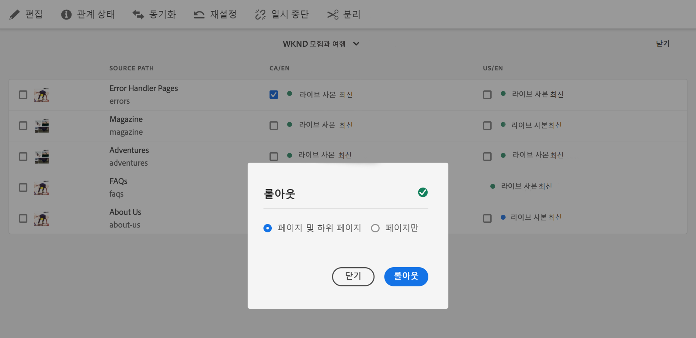

## Live Copy 콘텐츠 변경 {#changing-live-copy-content}

Live Copy 콘텐츠를 변경하기 위해 다음과 같은 작업을 수행할 수 있습니다.

* 페이지에 단락을 추가합니다.
* 페이지 또는 구성 요소에 대한 Live Copy 상속을 해제하여 기존 콘텐츠를 업데이트합니다.

>[!TIP]
>
>수동으로 Live Copy에 새 페이지를 만드는 경우 새 페이지는 Live Copy에만 적용됩니다. 즉, 해당 페이지와 연결되는 소스 페이지는 존재하지 않습니다.
>
>관계의 일부인 로컬 페이지를 만들 수 있는 가장 좋은 방법은 소스에 로컬 페이지를 만든 다음 딥 롤아웃을 수행하는 것입니다. 이렇게 하면 페이지가 로컬에서 Live Copy로 생성됩니다.

>[!NOTE]
>
>블루프린트 분기 및 종속 Live Copy 분기 모두에서 동일한 페이지 이름의 새 페이지를 만들면 충돌이 발생할 수 있습니다.
>
>이러한 [충돌은 롤아웃 시 처리 및 해결해야 합니다](rollout-conflicts.md).

### Live Copy 페이지에 구성 요소 추가 {#adding-components-to-a-live-copy-page}

언제든지 Live Copy 페이지에 구성 요소를 추가할 수 있습니다. Live Copy 및 그 단락 시스템의 상속 상태는 구성 요소를 추가하는 작업에 영향을 미치지 않습니다.

Live Copy 페이지를 소스 페이지와 동기화하면 추가된 구성 요소는 변경되지 않습니다. [Live Copy 페이지에서 구성 요소 순서 변경](#changing-the-order-of-components-on-a-live-copy-page)을 참조하십시오.

>[!TIP]
>
>컨테이너로 표시된 구성 요소에 로컬로 적용되는 변경 내용은 롤아웃 시 블루프린트의 콘텐츠로 덮어쓰이지 않습니다. 자세한 내용은 [MSM 모범 사례](best-practices.md#components-and-container-synchronization)를 참조하십시오.

### 페이지 상속 일시 중단 {#suspending-inheritance-for-a-page}

Live Copy 생성 시 Live Copy 구성은 복사되는 페이지의 루트 페이지에 저장됩니다. 루트 페이지의 모든 하위 페이지는 Live Copy 구성을 상속합니다. Live Copy 페이지의 구성 요소도 Live Copy 구성을 상속합니다.

Live Copy 페이지에 대한 Live Copy 상속을 일시 중단하여 페이지 속성 및 구성 요소를 변경할 수 있습니다. 상속을 일시 중단하면 페이지 속성 및 구성 요소는 더 이상 소스와 동기화되지 않습니다.

>[!TIP]
>
>블루프린트와 [Live Copy를 분리](#detaching-a-live-copy)하여 모든 연결을 제거할 수도 있습니다. 상속 일시 중단과 달리 분리 작업은 영구적이며 취소가 불가능합니다.

#### 페이지 속성에서 상속 일시 중단 {#suspending-inheritance-from-page-properties}

페이지에서 상속을 일시 중단하려면 다음 작업을 수행하십시오.

1. **사이트** 콘솔의 **속성 보기** 명령 또는 페이지 도구 모음의 **페이지 정보**&#x200B;를 사용하여 Live Copy 페이지의 속성을 엽니다.
1. **Live Copy** 탭을 클릭하거나 탭합니다.
1. 도구 모음에서 **일시 중단**&#x200B;을 선택합니다. 그런 다음 둘 중 하나를 선택할 수 있습니다.

   * **일시 중단**: 현재 페이지만 일시 중단합니다.
   * **하위 일시 중단**: 현재 페이지 및 하위 페이지를 일시 중단합니다.

1. 확인 대화 상자에서 **일시 중단**&#x200B;을 선택합니다.

#### Live Copy 개요에서 상속 일시 중단 {#suspending-inheritance-from-the-live-copy-overview}

Live Copy 페이지를 선택하면 [Live Copy 개요에서도 일시 중단 작업을 사용](live-copy-overview.md#using-the-live-copy-overview)할 수 있습니다.

1. [Live Copy 개요](live-copy-overview.md#using-the-live-copy-overview)를 연 다음 Live Copy 페이지를 선택합니다.
1. 도구 모음에서 **일시 중단**&#x200B;을 선택합니다.
1. 다음 중 적절한 옵션을 선택합니다.

   * **일시 중단**
   * **하위 일시 중단**

   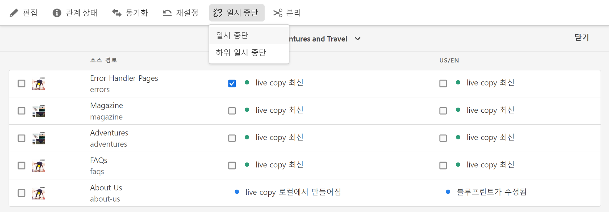

1. **Live Copy 일시 중단** 대화 상자에서 **일시 중단** 작업을 확인합니다.

   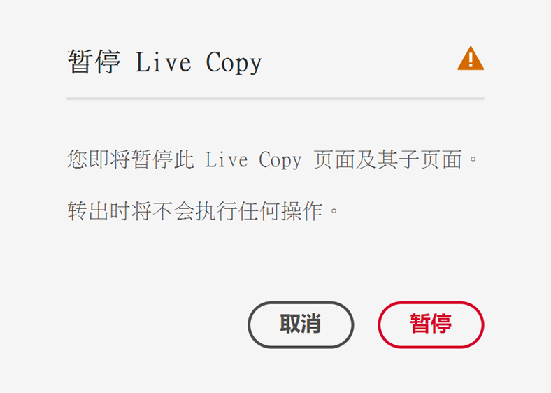

### 페이지 상속 다시 시작 {#resuming-inheritance-for-a-page}

페이지에 대한 Live Copy 상속을 일시 중단하는 것은 임시적인 작업입니다. 일시 중단하면 라이브 관계를 복원할 수 있는 **다시 시작** 작업을 사용할 수 있게 됩니다.

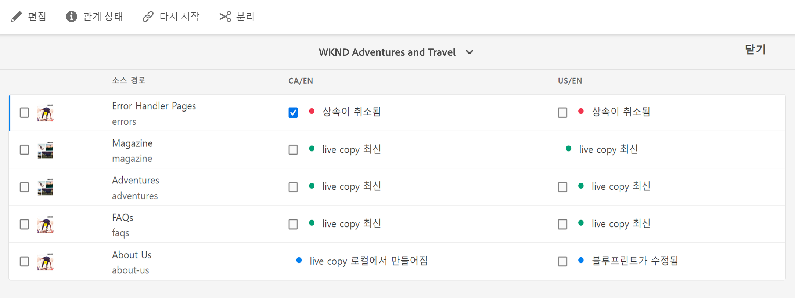

상속을 다시 시작해도 페이지는 자동으로 소스와 동기화되지 않습니다. 필요한 경우

* **다시 시작**/**되돌리기** 대화 상자에서 동기화를 요청할 수 있습니다. 예:

  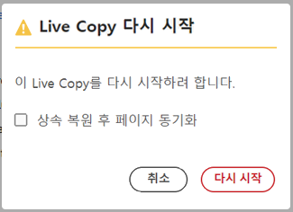

* 나중에 수동으로 동기화 작업을 선택하여 상속을 다시 시작하고 동기화할 수 있습니다.

>[!NOTE]
>
>상속을 다시 시작해도 페이지는 자동으로 소스와 동기화되지 않습니다. 필요한 경우 다시 시작할 때 또는 나중에 수동으로 동기화를 요청할 수 있습니다.

#### 페이지 속성에서 상속 다시 시작 {#resuming-inheritance-from-page-properties}

[일시 중단](#suspending-inheritance-from-page-properties)하면 페이지 속성의 도구 모음에서 **다시 시작** 작업을 사용할 수 있게 됩니다.

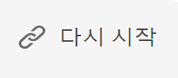

이 옵션을 선택하면 대화 상자가 표시됩니다. 필요한 경우 동기화를 선택한 다음 작업을 확인할 수 있습니다.

#### Live Copy 개요에서 Live Copy 페이지 다시 시작 {#resume-a-live-copy-page-from-the-live-copy-overview}

Live Copy 페이지를 선택하면 [Live Copy 개요에서도 다시 시작 작업을 사용](live-copy-overview.md#using-the-live-copy-overview)할 수 있습니다.

1. [Live Copy 개요](live-copy-overview.md#using-the-live-copy-overview)를 연 다음 일시 중단된 Live Copy 페이지를 선택합니다. 이 페이지는 **상속 취소됨**&#x200B;으로 표시됩니다.
1. 도구 모음에서 **다시 시작**&#x200B;을 선택합니다.
1. 상속을 되돌린 후 페이지를 동기화할 것인지 여부를 표시한 다음 **Live Copy 다시 시작** 대화 상자에서 **다시 시작** 작업을 확인합니다.

### 상속 깊이 변경(약식/딥) {#changing-inheritance-depth-shallow-deep}

기존 Live Copy에서 페이지의 깊이, 즉 하위 페이지 포함 여부를 변경할 수 있습니다.

* 약식 Live Copy로 전환하면 다음과 같은 결과가 발생합니다.

   * 변경 내용이 즉시 적용되며 취소가 불가능합니다.

   * 하위 페이지가 Live Copy에서 명시적으로 분리됩니다. 실행 취소 시 하위 항목에 대한 이후의 수정 내용은 유지되지 않습니다.

   * 중첩된 `LiveCopies`가 있는 경우에도 모든 하위 `LiveRelationships`가 제거됩니다.

* 딥 Live Copy로 전환하면 다음과 같은 결과가 발생합니다.

   * 하위 페이지는 그대로 유지됩니다.
   * 전환 효과를 확인하려면 롤아웃을 수행하면 됩니다. 롤아웃 구성에 따라 모든 콘텐츠 수정 내용이 적용됩니다.

* 약식 Live Copy로 전환한 다음 딥으로 다시 전환하면 다음과 같은 결과가 발생합니다.

   * (이전의) 약식 Live Copy의 모든 하위 항목이 수동으로 생성된 것처럼 처리되므로 `[oldname]_msm_moved name`을 사용하여 멀리 이동합니다.

깊이를 지정하거나 변경하려면 다음 작업을 수행하십시오.

1. **사이트** 콘솔의 **속성 보기** 명령 또는 페이지 도구 모음의 **페이지 정보**&#x200B;를 사용하여 Live Copy 페이지의 속성을 엽니다.
1. **Live Copy** 탭을 클릭하거나 탭합니다.
1. **구성** 섹션에서 하위 페이지 포함 여부에 따라 **Live Copy 상속** 옵션을 설정하거나 지웁니다.

   * 선택함 - 딥 Live Copy(하위 페이지 포함)
   * 선택하지 않음 - 약식 Live Copy(하위 페이지 제외)

   >[!CAUTION]
   >
   >약식 Live Copy로 전환하면 변경 내용이 즉시 적용되며 취소가 불가능합니다.
   >
   >자세한 내용은 [Live Copy - 구성](overview.md#live-copies-composition)을 참조하십시오.

1. **저장**&#x200B;을 클릭하거나 탭하여 업데이트를 지속합니다.

### 구성 요소 상속 취소 {#cancelling-inheritance-for-a-component}

구성 요소에 대한 Live Copy 상속을 취소하여 해당 구성 요소가 소스 구성 요소와 더 이상 동기화되지 않도록 할 수 있습니다. 필요한 경우 나중에 상속을 활성화할 수 있습니다.

>[!NOTE]
>
>상속을 다시 시작해도 구성 요소는 자동으로 소스와 동기화되지 않습니다. 필요한 경우 수동으로 동기화를 요청할 수 있습니다.

상속을 취소하여 구성 요소 콘텐츠를 변경하거나 구성 요소를 삭제할 수 있습니다.

1. 상속을 취소하려는 구성 요소를 클릭하거나 탭합니다.

   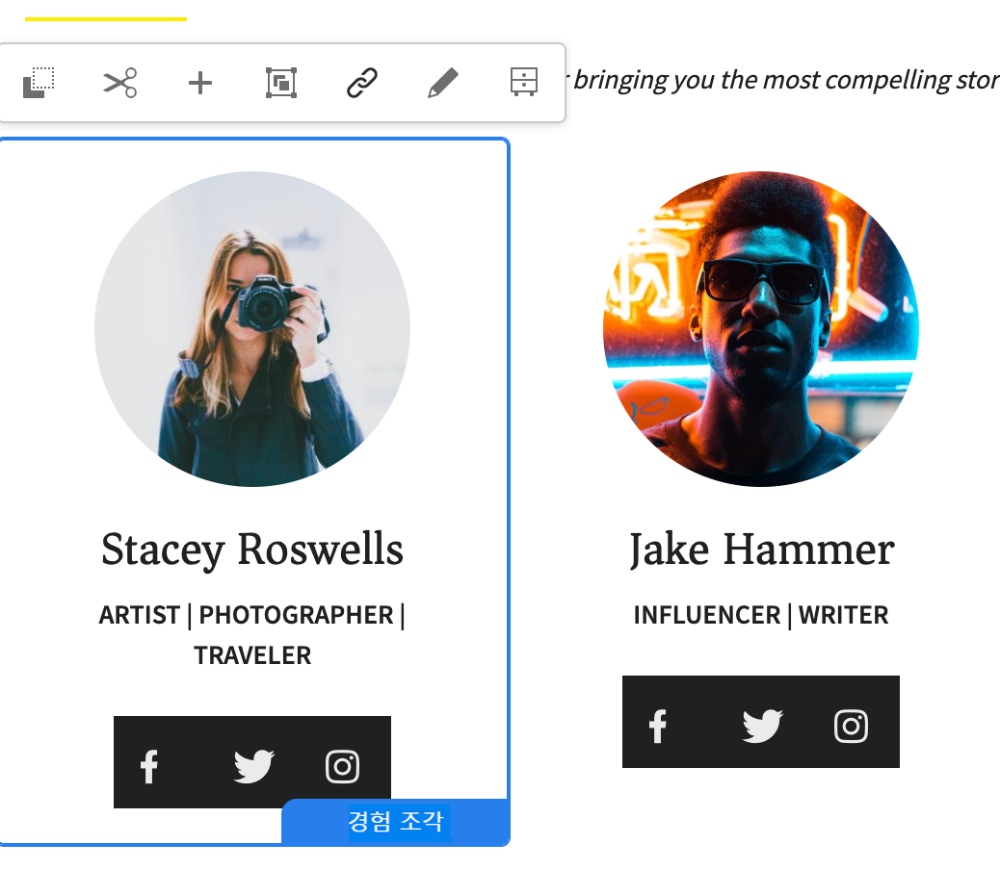

1. 구성 요소 도구 모음에서 **상속 취소** 아이콘을 클릭하거나 탭합니다.

   

1. 상속 취소 대화 상자에서 **예**&#x200B;를 선택하여 작업을 확인합니다.

   구성 요소 도구 모음이 모든 적절한 편집 명령을 포함하도록 업데이트됩니다.

### 구성 요소 상속 다시 활성화 {#re-enabling-inheritance-for-a-component}

구성 요소의 상속을 활성화하려면 구성 요소 도구 모음에서 **상속 다시 활성화** 아이콘을 클릭하거나 탭합니다.

### Live Copy 페이지에서 구성 요소 순서 변경 {#changing-the-order-of-components-on-a-live-copy-page}

Live Copy에 단락 시스템의 일부인 구성 요소가 포함된 경우, 해당 단락 시스템의 상속은 다음 규칙을 따릅니다.

* 상속된 단락 시스템의 구성 요소 순서는 상속이 설정된 경우에도 수정할 수 있습니다.
* 롤아웃 시 블루프린트에서 구성 요소 순서를 복원할 수 있습니다. 롤아웃 전에 Live Copy에 새 구성 요소를 추가하면 추가된 구성 요소는 기존 구성 요소와 함께 순서가 변경됩니다.
* 단락 시스템의 상속을 취소하면 구성 요소 순서는 롤아웃 시 복원되지 않고 Live Copy에서 그대로 유지됩니다.

>[!NOTE]
>
>단락 시스템에서 취소된 상속을 되돌리면 구성 요소 순서는 블루프린트에서 **자동으로 복원되지 않습니다**. 필요한 경우 수동으로 동기화를 요청할 수 있습니다.

다음 절차에 따라 단락 시스템의 상속을 취소할 수 있습니다.

1. Live Copy 페이지를 엽니다.
1. 기존 구성 요소를 페이지의 새 위치로 드래그합니다.
1. **상속 취소** 대화 상자에서 **예**&#x200B;를 선택하여 작업을 확인합니다.

### Live Copy 페이지 속성 재정의 {#overriding-properties-of-a-live-copy-page}

Live Copy 페이지의 페이지 설정은 기본적으로 소스 페이지에서 상속되며 편집할 수 없습니다.

Live Copy의 속성 값을 변경해야 하는 경우 속성의 상속을 취소할 수 있습니다. 링크 아이콘은 상속이 속성에 대해 활성화되어 있음을 나타냅니다.

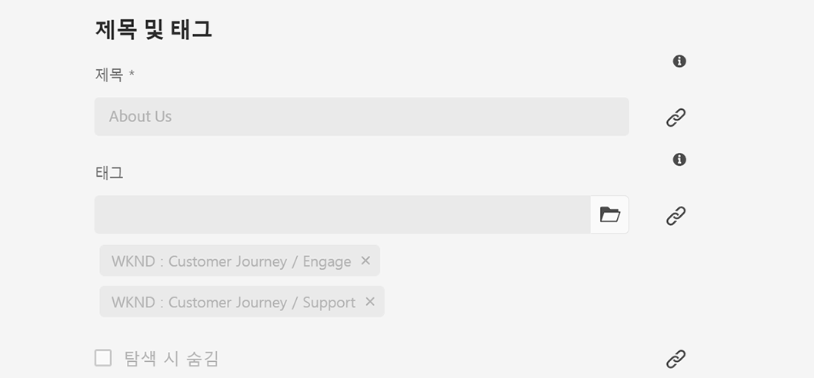

상속을 취소하면 속성 값을 변경할 수 있습니다. 끊어진 링크 아이콘은 상속이 취소되었음을 나타냅니다.

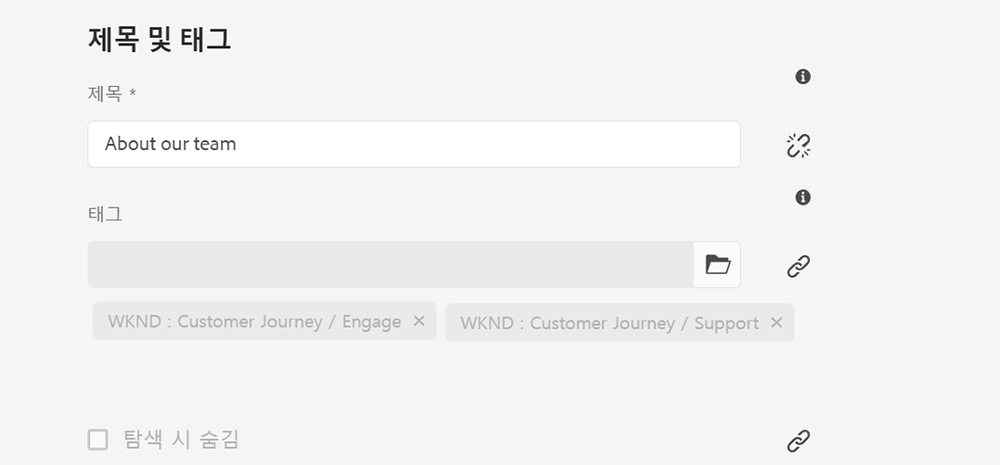

필요한 경우 나중에 상속을 속성에 대해 다시 활성화할 수 있습니다.

>[!NOTE]
>
>상속을 다시 시작해도 Live Copy 페이지 속성은 자동으로 소스 속성과 동기화되지 않습니다. 필요한 경우 수동으로 동기화를 요청할 수 있습니다.

1. **사이트** 콘솔의 **속성 보기** 옵션 또는 페이지 도구 모음의 **페이지 정보** 아이콘을 사용하여 Live Copy 페이지의 속성을 엽니다.
1. 속성의 상속을 취소하려면 속성 오른쪽에 나타나는 링크 아이콘을 클릭하거나 탭합니다.

   

1. **상속 취소** 확인 대화 상자에서 **예**&#x200B;를 클릭하거나 탭합니다.

### Live Copy 페이지 속성 되돌리기 {#revert-properties-of-a-live-copy-page}

속성의 상속을 활성화하려면 속성 옆에 나타나는 **상속 되돌리기** 아이콘을 클릭하거나 탭합니다.

### Live Copy 페이지 재설정 {#resetting-a-live-copy-page}

Live Copy 페이지를 재설정하여 다음과 같은 작업을 수행할 수 있습니다.

* 모든 상속 취소 제거 및
* 페이지를 소스 페이지와 동일한 상태로 되돌리기

재설정하면 페이지 속성, 단락 시스템 및 구성 요소에 적용한 변경 내용에 영향을 미칩니다.

#### 페이지 속성에서 Live Copy 페이지 재설정 {#reset-a-live-copy-page-from-the-page-properties}

1. **사이트** 콘솔에서 Live Copy 페이지를 선택한 다음 **속성 보기**&#x200B;를 선택합니다.
1. **Live Copy** 탭을 엽니다.
1. 도구 모음에서 **재설정**&#x200B;을 선택합니다.

   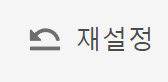

1. **Live Copy 재설정** 대화 상자에서 **재설정**&#x200B;을 선택하여 확인합니다.

#### Live Copy 개요에서 Live Copy 페이지 재설정 {#reset-a-live-copy-page-from-the-live-copy-overview}

Live Copy 페이지를 선택하면 Live Copy 개요](live-copy-overview.md#using-the-live-copy-overview)에서도 [**재설정** 작업을 사용할 수 있습니다.

1. [Live Copy 개요](live-copy-overview.md#using-the-live-copy-overview)를 연 다음 Live Copy 페이지를 선택합니다.
1. 도구 모음에서 **재설정**&#x200B;을 선택합니다.
1. **Live Copy 재설정** 대화 상자에서 **재설정** 작업을 확인합니다.

   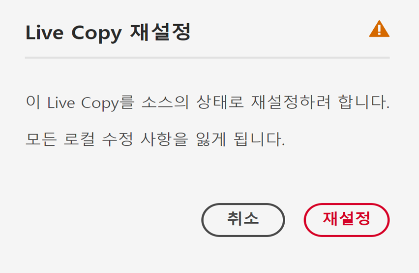

## Live Copy 페이지와 블루프린트 페이지 비교 {#comparing-a-live-copy-page-with-a-blueprint-page}

적용한 변경 내용을 추적하기 위해 **참조**&#x200B;에서 블루프린트 페이지를 확인하고 이를 Live Copy 페이지와 비교할 수 있습니다.

1. **사이트** 콘솔에서 [블루프린트 또는 Live Copy 페이지를 검색한 다음 선택합니다](/help/sites-cloud/authoring/getting-started/basic-handling.md#viewing-and-selecting-resources).
1. **[참조](/help/sites-cloud/authoring/getting-started/basic-handling.md#references)** 패널을 연 다음 컨텍스트에 따라 다음 중 하나를 선택합니다.

   * **블루프린트**
   * **Live Copy**

1. 특정 Live Copy를 선택한 다음 컨텍스트에 따라 다음 중 하나를 선택합니다.

   * **블루프린트와 비교**
   * **Live Copy와 비교**

   예:

   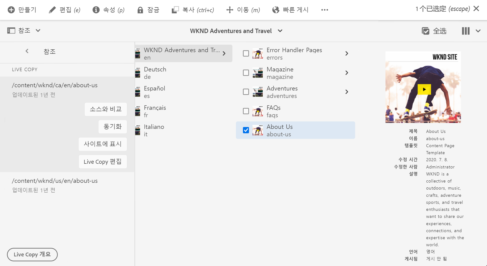

1. Live Copy 및 블루프린트 페이지가 나란히 열립니다.

   비교 기능 사용에 대한 전체 정보는 [페이지 비교](/help/sites-cloud/authoring/features/page-diff.md)를 참조하십시오.

## Live Copy 분리 {#detaching-a-live-copy}

분리 작업은 Live Copy와 소스/블루프린트 페이지 간의 라이브 관계를 영구적으로 제거합니다. 모든 MSM 관련 속성이 Live Copy에서 제거되며 Live Copy 페이지는 독립형 사본이 됩니다.

>[!CAUTION]
>
>Live Copy를 분리한 후에는 라이브 관계를 복원할 수 없습니다.
>
>라이브 관계를 제거하여 나중에 복원할 수 있도록 하려면 페이지의 [Live Copy 상속을 취소](#suspending-inheritance-for-a-page)하면 됩니다.

트리 내에서 **분리**&#x200B;를 사용하는 위치에 따른 영향은 다음과 같습니다.

* **Live Copy의 루트 페이지에서 분리**

  이 작업을 Live Copy의 루트 페이지에서 수행하면 블루프린트의 모든 페이지와 Live Copy 간의 라이브 관계가 제거됩니다.

  이후 블루프린트의 페이지에 적용되는 변경 내용은 Live Copy에 영향을 **미치지 않습니다**.

* **Live Copy의 하위 페이지에서 분리**

  이 작업을 Live Copy 내 하위 페이지(또는 분기)에서 수행하면 다음과 같은 결과가 발생합니다.

   * 해당 하위 페이지(또는 분기)에 대한 라이브 관계가 제거되며
   * Live Copy 분기의 (하위) 페이지는 수동으로 생성된 것처럼 처리됩니다.

  단, 하위 페이지에는 여전히 상위 분기의 라이브 관계가 적용되어 이후의 블루프린트 페이지를 롤아웃하면 다음과 같은 결과가 발생합니다.

   1. 분리된 페이지의 이름이 변경됩니다.

      * MSM이 해당 페이지가 생성하려는 Live Copy 페이지와 이름이 동일하여 이를 충돌을 발생시키는 수동으로 생성된 페이지로 간주하기 때문입니다.

   1. 롤아웃의 변경 내용이 포함된, 고유한 이름이 있는 새 Live Copy 페이지가 생성됩니다.

  >[!NOTE]
  >
  >이러한 상황에 대한 자세한 내용은 [MSM 롤아웃 충돌](rollout-conflicts.md)을 참조하십시오.

### 페이지 속성에서 Live Copy 페이지 분리 {#detach-a-live-copy-page-from-the-page-properties}

Live Copy를 분리하려면 다음 작업을 수행하십시오.

1. **사이트** 콘솔에서 Live Copy 페이지를 선택한 다음 **속성 보기**&#x200B;를 클릭하거나 탭합니다.
1. **Live Copy** 탭을 엽니다.
1. 도구 모음에서 **분리**&#x200B;를 선택합니다.

   

1. 표시되는 확인 대화 상자에서 **분리**&#x200B;를 선택하여 작업을 완료합니다.

### Live Copy 개요에서 Live Copy 페이지 분리 {#detach-a-live-copy-page-from-the-live-copy-overview}

Live Copy 페이지를 선택하면 [Live Copy 개요에서도 분리 작업을 사용](live-copy-overview.md#using-the-live-copy-overview)할 수 있습니다.

1. [Live Copy 개요](live-copy-overview.md#using-the-live-copy-overview)를 연 다음 Live Copy 페이지를 선택합니다.
1. 도구 모음에서 **분리**&#x200B;를 선택합니다.
1. **Live Copy 분리** 대화 상자에서 **분리** 작업을 확인합니다.

   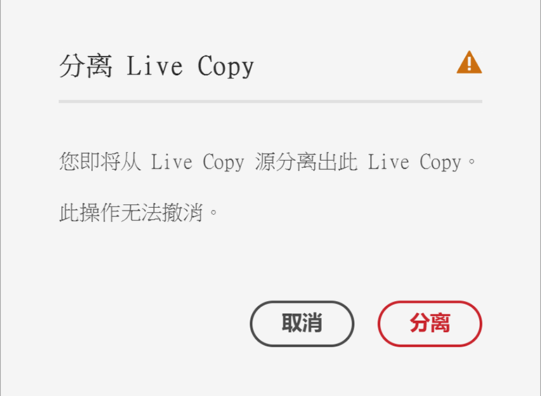
