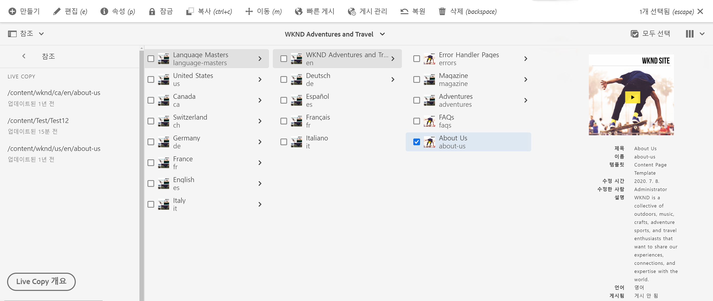
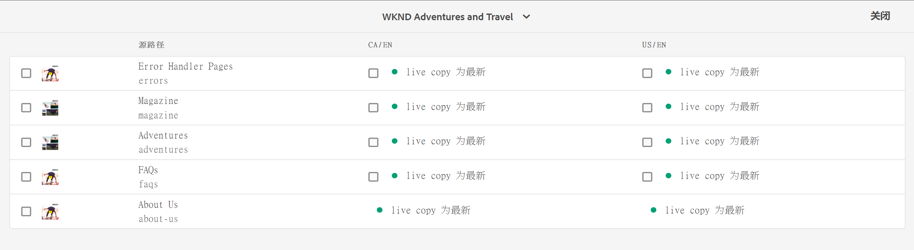
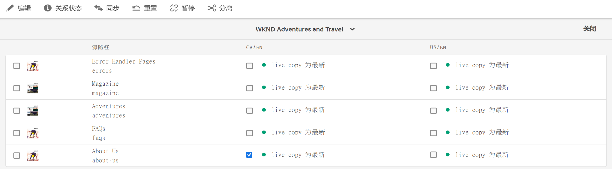
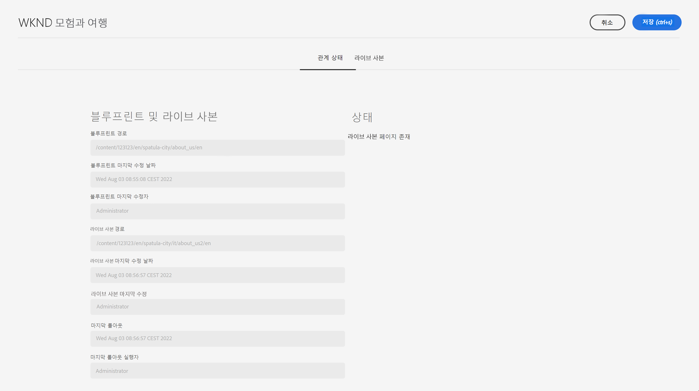
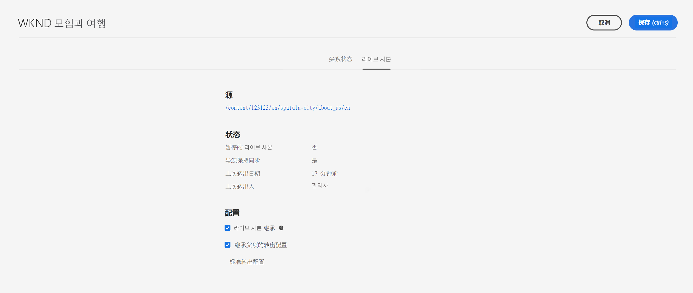

# Live Copy 개요 콘솔 {#live-copy-overview-console}

**Live Copy 개요** 콘솔을 사용하여 다음 작업을 수행할 수 있습니다.

* 사이트 전체에 걸쳐 상속을 조회/관리합니다.
   * 블루프린트 트리 및 해당하는 Live Copy 구조를 상속 상태와 함께 조회합니다.
   * 일시 중단 및 다시 시작과 같은 상속 상태를 변경합니다.
   * 블루프린트 및 Live Copy 속성을 조회합니다.
* 롤아웃 작업을 수행합니다.

## Live Copy 개요 열기 {#opening-the-live-copy-overview}

다음 위치에서 Live Copy 개요를 열 수 있습니다.

* [블루프린트 페이지의 참조 측면 패널(Sites 콘솔)](#opening-live-copy-overview-references-for-a-blueprint-page)
* [블루프린트 페이지 속성](#opening-live-copy-overview-properties-of-a-blueprint-page)

### 블루프린트 페이지에 대한 참조 {#references-to-a-blueprint-page}

**사이트** 콘솔의 **참조** 측면 패널에서 **Live Copy 개요**&#x200B;를 열 수 있습니다.

1. **사이트** 콘솔에서 [블루프린트 페이지를 검색한 다음 선택합니다](/help/sites-cloud/authoring/basic-handling.md#viewing-and-selecting-resources).
1. **[참조](/help/sites-cloud/authoring/basic-handling.md#references)** 레일을 연 다음 **Live Copy**&#x200B;를 선택합니다.

   

   >[!TIP]
   >
   >먼저 참조를 연 다음 블루프린트를 선택할 수도 있습니다.

1. **Live Copy 개요**&#x200B;를 선택하여 선택한 블루프린트와 관련된 모든 Live Copy의 개요를 표시하고 사용합니다.
1. 종료하고 **사이트** 콘솔로 돌아가려면 **닫기**&#x200B;를 사용합니다.

### 블루프린트 페이지 속성 {#properties-of-a-blueprint-page}

블루프린트 페이지 속성을 볼 때 **Live Copy 개요**&#x200B;를 열 수 있습니다.

1. 적절한 블루프린트 페이지에 대한 **속성**&#x200B;을 엽니다.
1. **블루프린트** 탭을 열면 **Live Copy 개요** 옵션이 상단 도구 모음에 표시됩니다.

   

1. **Live Copy 개요**&#x200B;를 선택하여 현재 블루프린트와 관련된 모든 Live Copy의 개요를 표시하고 사용합니다.

1. 종료하고 **사이트** 콘솔로 돌아가려면 **닫기**&#x200B;를 사용합니다.

## Live Copy 개요 사용 {#using-the-live-copy-overview}

**Live Copy 개요** 창은 선택한 페이지와 관련된 Live Copy의 상태를 제공합니다.

롤아웃은 특정 롤아웃 구성에 정의된 동기화 작업에 따라 달라집니다. 일부 작업은 콘텐츠에 대한 수정 사항에 의존합니다. 그러나 콘텐츠에 대한 수정 사항에 의존하지 않고 페이지 활성화와 같은 이벤트에 의존하는 수행도 많습니다. 이러한 이벤트는 콘텐츠를 수정하지는 않지만 해당 콘텐츠와 관련된 내부 속성을 수정합니다.

또한 상태 필드는 특정 롤아웃 구성에 정의된 동기화 작업에 따라 달라지며, 마지막 정상적인 롤아웃 이후 블루프린트 또는 Live Copy에 대해 이러한 작업이 수행되었는지 여부를 나타냅니다. 상태 필드는 특정 롤아웃 구성의 작업만 반영합니다. Live Copy에서 롤아웃이 정상적으로 수행된 적이 없는 경우 상태는 항상 최신 상태로 표시됩니다.

예를 들어 롤아웃 구성은 `targetActivate`로 정의되어 있습니다. 따라서 롤아웃은 전적으로 활성화 이벤트에만 의존합니다. 상태 필드에는 마지막 정상적인 롤아웃 이후 활성화 이벤트가 발생했는지 여부만 표시됩니다.

**Live Copy 개요**&#x200B;를 사용하여 Live Copy에서 작업을 수행할 수도 있습니다.

1. **Live Copy 개요**&#x200B;를 엽니다.
1. 필요한 블루프린트 또는 Live Copy 페이지를 선택하면 도구 모음이 업데이트되어 사용할 수 있는 작업을 표시합니다. 사용할 수 있는 [작업](overview.md#terms-used)은 [블루프린트](#actions-for-a-blueprint-page) 페이지를 선택했는지 또는 [Live Copy](#actions-for-a-live-copy-page) 페이지를 선택했는지 여부에 따라 달라집니다.

### 블루프린트 페이지에 대한 작업 {#actions-for-a-blueprint-page}

블루프린트 페이지를 선택하면 다음과 같은 작업을 사용할 수 있습니다.

* **편집** - 편집할 블루프린트 페이지를 엽니다.
* **[롤아웃](overview.md#rollout-and-synchronize)** - 롤아웃을 수행하여 소스에서 Live Copy로 변경 내용을 푸시합니다.

### Live Copy 페이지에 대한 작업 {#actions-for-a-live-copy-page}

Live Copy 페이지를 선택하면 다음과 같은 작업을 사용할 수 있습니다.

* **편집** - 편집할 Live Copy 페이지를 엽니다.
* **[관계 상태](#relationship-status)** - 상태 및 상속에 대한 정보를 확인합니다.
* **[동기화](overview.md#rollout-and-synchronize)** - Live Copy를 동기화하여 소스에서 Live Copy로 변경 내용을 가져옵니다.
* **[재설정](creating-live-copies.md#resetting-a-live-copy-page)** - Live Copy 페이지를 재설정하여 모든 상속 취소를 제거하고 페이지를 소스 페이지와 동일한 상태로 되돌립니다.
* **[일시 중단](overview.md#suspending-and-cancelling-inheritance-and-synchronization)** - Live Copy와 해당 블루프린트 페이지 간의 라이브 관계를 일시적으로 비활성화합니다.
* **[다시 시작](creating-live-copies.md#resuming-inheritance-for-a-page)** - 일시 중단된 관계를 복원할 수 있습니다.
* **[분리](overview.md#detaching-a-live-copy)** - Live Copy와 블루프린트 페이지 간의 라이브 관계를 영구적으로 제거합니다.

## 관계 상태 {#relationship-status}

**관계 상태** 콘솔에는 다양한 기능을 제공하는 두 가지 탭이 있습니다.

* [관계 상태](#relationship-status-tab)
* [Live Copy](#live-copy-tab)

### 관계 상태 {#relationship-status-tab}

이 탭은 블루프린트와 Live Copy 간의 관계 상태에 대한 상세 정보를 제공합니다.

### Live Copy {#live-copy-tab}

이 탭을 사용하면 Live Copy 구성을 조회하고 편집할 수 있습니다.

