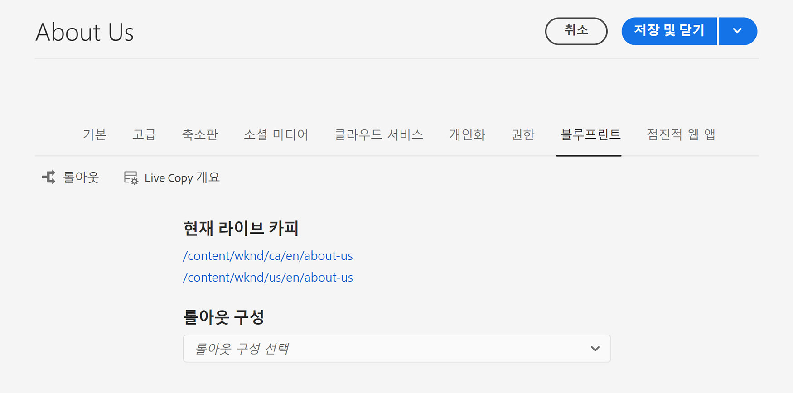

# Live Copy 개요 콘솔 {#live-copy-overview-console}

**Live Copy 개요** 콘솔을 사용하여 다음을 수행할 수 있습니다.

* 사이트에서 상속을 보고 관리합니다.
   * 상속 상태와 함께 블루프린트 트리 및 해당 Live Copy 구조 보기
   * 일시 중단 및 다시 시작 등 상속 상태 변경
   * 블루프린트 및 Live Copy 속성 보기
* 롤아웃 작업을 수행합니다.

## Live Copy 개요 열기 {#opening-the-live-copy-overview}

다음 위치에서 Live Copy 개요를 열 수 있습니다.

* [블루프린트 페이지의 참조 사이드 패널(사이트 콘솔)](#opening-live-copy-overview-references-for-a-blueprint-page)
* [블루프린트 페이지의 속성](#opening-live-copy-overview-properties-of-a-blueprint-page)

### 블루프린트 페이지에 대한 참조 {#references-to-a-blueprint-page}

**Live Copy 개요**&#x200B;는 **사이트** 콘솔의 **참조** 사이드 패널에서 열 수 있습니다.

1. **사이트** 콘솔에서 [블루프린트 페이지로 이동하여 선택합니다.](/help/sites-cloud/authoring/getting-started/basic-handling.md#viewing-and-selecting-resources)
1. **[참조](/help/sites-cloud/authoring/getting-started/basic-handling.md#references)** 레일을 열고 **Live Copy**&#x200B;를 선택합니다.

   

   >[!TIP]
   >
   >먼저 참조를 연 다음 블루프린트를 선택할 수도 있습니다.

1. 선택한 블루프린트와 관련된 모든 Live Copy의 개요를 표시하고 사용하려면 **Live Copy 개요**&#x200B;를 선택합니다.
1. **닫기**&#x200B;를 사용하여 **사이트** 콘솔을 종료하고 돌아옵니다.

### 블루프린트 페이지 {#properties-of-a-blueprint-page} 속성

블루프린트 페이지의 속성을 볼 때 **Live Copy 개요**&#x200B;를 열 수 있습니다.

1. 적절한 블루프린트 페이지에 대해 **속성**&#x200B;을 엽니다.
1. **블루프린트** 탭을 엽니다. 위쪽 도구 모음에 **Live Copy 개요** 옵션이 표시됩니다.

   

1. 현재 블루프린트와 관련된 모든 Live Copy 개요를 표시하고 사용하려면 **Live Copy 개요**&#x200B;를 선택합니다.

1. **닫기**&#x200B;를 사용하여 **사이트** 콘솔을 종료하고 돌아옵니다.

## Live Copy 개요 사용 {#using-the-live-copy-overview}

**Live Copy 개요** 창은 선택한 페이지와 관련된 Live Copy의 상태에 대한 개요를 제공합니다.

롤아웃은 특정 롤아웃 구성에 정의된 동기화 작업에 따라 달라집니다. 일부 작업은 컨텐츠 수정에 따라 달라집니다. 그러나 컨텐츠 수정에 의존하지 않고 페이지 활성화와 같은 이벤트에 의존하는 많은 작업도 있습니다. 이러한 이벤트는 컨텐츠를 수정하지 않고 콘텐트와 관련된 내부 속성을 수정합니다.

상태 필드는 특정 롤아웃 구성에 정의된 동기화 작업에 따라 달라지며 마지막 롤아웃 성공 이후 블루프린트나 Live Copy에 이러한 작업이 있는지 여부를 나타냅니다. 상태 필드는 특정 롤아웃 구성의 작업만 반영합니다. Live Copy에 대해 성공적인 롤아웃을 수행한 적이 없는 경우 상태는 항상 최신 상태로 표시됩니다.

예를 들어 롤아웃 구성은 `targetActivate`으로 정의됩니다. 따라서 롤아웃은 활성화 이벤트에만 따라 다릅니다. 상태 필드는 마지막 롤아웃 성공 이후 활성화 이벤트가 발생했는지 여부만 표시합니다.

**Live Copy 개요**&#x200B;도 Live Copy에서 작업을 수행하는 데 사용할 수 있습니다.

1. **Live Copy 개요**&#x200B;를 엽니다.
1. 필요한 블루프린트 또는 Live Copy 페이지를 선택하면 사용 가능한 작업을 표시하도록 도구 모음이 업데이트됩니다. 사용 가능한 [작업](overview.md#terms-used)은 [블루프린트](#actions-for-a-blueprint-page) 또는 [Live Copy](#actions-for-a-live-copy-page) 페이지를 선택하는지에 따라 다릅니다.

### 블루프린트 페이지에 대한 작업 {#actions-for-a-blueprint-page}

블루프린트 페이지를 선택하면 다음 작업을 사용할 수 있습니다.

* **편집**  - 편집할 블루프린트 페이지를 엽니다.
* **[롤아웃](overview.md#rollout-and-synchronize)**  - 출처에서 Live Copy로의 푸시 변경 사항을 수행하는 롤아웃을 수행합니다.

### Live Copy 페이지에 대한 작업 {#actions-for-a-live-copy-page}

Live Copy 페이지를 선택하면 다음 작업을 사용할 수 있습니다.

* **편집**  - 편집할 Live Copy 페이지를 엽니다.
* **[관계 상태](#relationship-status)**  - 상태 및 상속에 대한 정보를 봅니다.
* **[동기화](overview.md#rollout-and-synchronize)**  - Live Copy를 동기화하여 소스에서 Live Copy로 변경 내용을 가져옵니다.
* **[재설정](creating-live-copies.md#resetting-a-live-copy-page)**  - Live Copy 페이지를 재설정하여 모든 상속 취소를 제거하고 페이지를 소스 페이지와 동일한 상태로 되돌립니다.
* **[일시 중단](overview.md#suspending-and-cancelling-inheritance-and-synchronization)**  - Live Copy와 블루프린트 페이지 간의 라이브 관계를 일시적으로 비활성화합니다.
* **[재시작](creating-live-copies.md#resuming-inheritance-for-a-page)**  - 재개하면 일시 중단된 관계를 복원할 수 있습니다.
* **[분리](overview.md#detaching-a-live-copy)**  - Live Copy와 블루프린트 페이지 간의 라이브 관계를 영구적으로 제거합니다.

## 관계 상태 {#relationship-status}

**관계 상태** 콘솔에는 다양한 기능을 제공하는 2개의 탭이 있습니다.

* [관계 상태](#relationship-status-tab)
* [Live Copy](#live-copy-tab)

### 관계 상태 {#relationship-status-tab}

이 탭에서는 블루프린트와 Live Copy 간의 관계 상태에 대한 자세한 정보를 제공합니다.

### Live Copy {#live-copy-tab}

이 탭에서는 Live Copy 구성을 보고 편집할 수 있습니다.

