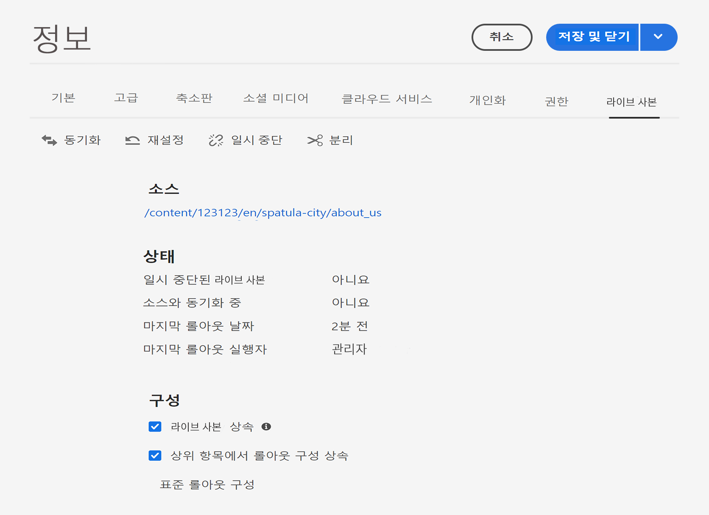

# Live Copy 동기화 구성 {#configuring-live-copy-synchronization}

Adobe Experience Manager는 다양하고 획기적인 동기화 구성을 제공합니다. Live Copy를 사용하기 전에, 다음 사항을 고려하여 Live Copy를 소스 콘텐츠와 동기화할 방법 및 시기를 정의해야 합니다.

1. 기존 롤아웃 구성이 요구 사항을 충족하는지 여부를 결정합니다.
1. 기존 롤아웃 구성이 요구 사항을 충족하지 않는 경우 나만의 롤아웃 구성을 만들어야 하는지 여부를 결정하십시오.
1. Live Copy에 사용할 롤아웃 구성을 지정합니다.

## 설치된 롤아웃 구성 및 사용자 정의 롤아웃 구성 {#installed-and-custom-rollout-configurations}

이 섹션에서는 설치된 롤아웃 구성 및 롤아웃 구성에서 사용하는 동기화 작업과 필요한 경우 사용자 정의 구성을 생성하는 방법에 대한 정보를 제공합니다.

>[!CAUTION]
>
>기본 롤아웃 구성은 업데이트하거나 변경하지 **않는** 것이 좋습니다. 사용자 정의 라이브 작업에 대한 요구 사항이 있는 경우 사용자 정의 롤아웃 구성에 추가해야 합니다.

### 롤아웃 트리거 {#rollout-triggers}

각 롤아웃 구성은 롤아웃이 발생하도록 하는 롤아웃 트리거를 사용합니다. 롤아웃 구성은 다음 트리거 중 하나를 사용할 수 있습니다.

* **롤아웃 시**: 블루프린트 페이지의 **롤아웃** 명령이 사용되거나 Live Copy 페이지의 **동기화** 명령이 사용됩니다.
* **수정 시**: 소스 페이지가 수정됩니다.
* **활성화 시**: 소스 페이지가 활성화됩니다.
* **비활성화 시**: 소스 페이지가 비활성화됩니다.

>[!NOTE]
>
>**수정 시** 트리거를 사용하면 성능에 영향을 줄 수 있습니다. 자세한 내용은 [MSM 모범 사례](best-practices.md#onmodify)를 참조하십시오.

### 롤아웃 구성 {#rollout-configurations}

다음 표에는 AEM을 통해 즉시 사용할 수 있도록 제공되는 롤아웃 구성이 나열되어 있습니다. 표에는 각 롤아웃 구성의 트리거 및 동기화 작업이 포함되어 있습니다.

<!--
If the installed rollout configuration actions do not meet your requirements, you can [create a new rollout configuration](#creating-a-rollout-configuration).
-->

| 이름 | 설명 | 트리거 | [동기화 작업](#synchronization-actions) |
|---|---|---|---|
| 표준 롤아웃 구성 | 롤아웃 트리거 시 롤아웃 프로세스를 시작할 수 있도록 하고 작업을 실행(콘텐츠 생성, 업데이트, 삭제 및 하위 노드 순서 지정)하는 표준 롤아웃 구성 | 롤아웃 시 | `contentUpdate` `contentCopy` `contentDelete` `referencesUpdate` `productUpdate` `orderChildren` |
| 블루프린트 활성화에서 활성화 | 소스가 게시되면 Live Copy 게시 | 활성화 시 | `targetActivate` |
| 블루프린트 비활성화에서 비활성화 | 소스가 비활성화되면 Live Copy 비활성화 | 비활성화 시 | `targetDeactivate` |
| 수정되면 푸시 | 소스가 수정되면 콘텐츠를 Live Copy로 푸시합니다. 이 롤아웃 구성은 수정 시 트리거를 사용하므로 제한적으로 사용하십시오. | 수정 시 | `contentUpdate` `contentCopy` `contentDelete` `referencesUpdate` `orderChildren` |
| 수정되면 푸시(약식) | 블루프린트 페이지가 수정되면 참조(예: 약식 사본 참조)를 업데이트하지 않고 콘텐츠를 Live Copy로 푸시합니다. 이 롤아웃 구성은 수정 시 트리거를 사용하므로 제한적으로 사용하십시오. | 수정 시 | `contentUpdate` `contentCopy` `contentDelete` `orderChildren` |
| 출시 홍보 | 시작 페이지를 홍보하기 위한 표준 롤아웃 구성입니다. | 롤아웃 시 | `contentUpdate` `contentCopy` `contentDelete` `referencesUpdate` `orderChildren` `markLiveRelationship` |

### 동기화 작업 {#synchronization-actions}

다음 표에는 AEM을 통해 즉시 사용할 수 있도록 제공되는 동기화 작업이 나열되어 있습니다.

<!--If the installed actions do not meet your requirements, you can [Create a New Synchronization Action](/help/sites-developing/extending-msm.md#creating-a-new-synchronization-action).-->

| 작업 이름 | 설명 | 속성 |
|---|---|---|
| `contentCopy` | Live Copy에 소스 노드가 없는 경우 이 작업은 Live Copy에 노드를 복사합니다. [**CQ MSM 콘텐츠 복사 작업** 서비스](#excluding-properties-and-node-types-from-synchronization)를 구성하여 제외할 노드 유형, 단락 항목 및 페이지 속성을 지정합니다. |  |
| `contentDelete` | 이 작업은 소스에 존재하지 않는 Live Copy의 노드를 삭제합니다. [**CQ MSM 콘텐츠 삭제 작업** 서비스](#excluding-properties-and-node-types-from-synchronization)를 구성하여 제외할 노드 유형, 단락 항목 및 페이지 속성을 지정합니다. |  |
| `contentUpdate` | 이 작업은 Live Copy 콘텐츠를 소스의 변경 내용으로 업데이트합니다. [**CQ MSM 콘텐츠 업데이트 작업** 서비스](#excluding-properties-and-node-types-from-synchronization)를 구성하여 제외할 노드 유형, 단락 항목 및 페이지 속성을 지정합니다. |  |
| `editProperties` | 이 작업은 Live Copy의 속성을 편집합니다. `editMap` 속성은 편집할 속성 및 해당 값을 결정합니다. `editMap` 속성 값은 다음 형식을 사용해야 합니다.  `[property_name_n]#[current_value]#[new_value]` `current_value` 및 `new_value`(정규 표현식) `n`(증분 정수) 예를 들어 `editMap`에 대한 다음 값을 고려해 보겠습니다. `sling:resourceType#/(contentpage`‖`homepage)#/mobilecontentpage,cq:template#/contentpage#/mobilecontentpage` 이 값은 Live Copy 노드의 속성을 다음과 같이 편집합니다. `contentpage` 또는 `homepage`로 설정되어 있는 `sling:resourceType` 속성은 `mobilecontentpage`로 설정됩니다. `contentpage`로 설정되어 있는 `cq:template` 속성은 `mobilecontentpage`로 설정됩니다. | `editMap: (String)`은 속성, 현재 값 및 새 값을 식별합니다. 자세한 내용은 설명서를 참조하십시오. |
| `notify` | 이 작업은 페이지가 롤아웃되었다는 페이지 이벤트를 전송합니다. 알림을 받으려면 먼저 롤아웃 이벤트를 구독해야 합니다. |  |
| `orderChildren` | 이 작업은 블루프린트의 순서를 기반으로 하위 노드의 순서를 지정합니다. |  |
| `referencesUpdate` | 이 동기화 작업은 Live Copy의 참조를 업데이트합니다. Live Copy에서 블루프린트 내 리소스를 나타내는 경로를 검색합니다. 경로를 찾으면 Live Copy 내에서 관련 리소스를 나타내는 경로를 업데이트합니다. 대상이 블루프린트 외부에 있는 참조는 변경되지 않습니다.  [**CQ MSM 참조 업데이트 작업** 서비스](#excluding-properties-and-node-types-from-synchronization)를 구성하여 제외할 노드 유형, 단락 항목 및 페이지 속성을 지정합니다. |  |
| `targetVersion` | 이 작업은 Live Copy의 버전을 생성합니다. 이 작업은 롤아웃 구성에 포함된 유일한 동기화 작업이어야 합니다. |  |
| `targetActivate` | 이 작업은 Live Copy를 활성화합니다. 이 작업은 롤아웃 구성에 포함된 유일한 동기화 작업이어야 합니다. |  |
| `targetDeactivate` | 이 작업은 Live Copy를 비활성화합니다. 이 작업은 롤아웃 구성에 포함된 유일한 동기화 작업이어야 합니다. |  |
| `workflow` | 이 작업은 대상 속성에 의해 정의된 워크플로(페이지만 해당)를 시작하고 Live Copy를 페이로드로 가져옵니다. 대상 경로는 모델 노드의 경로입니다. | `target: (String)`은 워크플로 모델의 경로입니다. |
| `mandatory` | 이 작업은 특정 사용자 그룹에 대해 라이브 복사 페이지에 있는 일부 ACL의 권한을 읽기 전용으로 설정합니다. 다음과 같은 ACL이 구성됩니다. `ActionSet.ACTION_NAME_REMOVE` `ActionSet.ACTION_NAME_SET_PROPERTY` `ActionSet.ACTION_NAME_ACL_MODIFY` 이 작업은 페이지에만 사용하십시오. | `target: (String)`은 권한 설정 중인 그룹의 ID입니다. |
| `mandatoryContent` | 이 작업은 특정 사용자 그룹에 대해 라이브 복사 페이지에 있는 일부 ACL의 권한을 읽기 전용으로 설정합니다. 다음과 같은 ACL이 구성됩니다. `ActionSet.ACTION_NAME_SET_PROPERTY` `ActionSet.ACTION_NAME_ACL_MODIFY` 이 작업은 페이지에만 사용하십시오. | `target: (String)`은 권한 설정 중인 그룹의 ID입니다. |
| `mandatoryStructure` | 이 작업은 특정 사용자 그룹에 대해 라이브 복사 페이지에 있는 `ActionSet.ACTION_NAME_REMOVE` ACL의 권한을 읽기 전용으로 설정합니다. 이 작업은 페이지에만 사용하십시오. | `target: (String)`은 권한 설정 중인 그룹의 ID입니다. |
| `VersionCopyAction` | 블루프린트/소스 페이지가 한 번 이상 게시된 경우 이 작업은 게시된 버전을 사용하여 Live Copy 페이지를 생성합니다. 참고: 이 작업은 게시된 소스 페이지를 기반으로 하는 Live Copy 페이지를 만드는 데만 사용할 수 있으며, 기존 Live Copy 페이지를 업데이트하는 데는 사용할 수 없습니다. |  |
| `PageMoveAction` | `PageMoveAction`은 페이지가 블루프린트에서 이동된 경우 적용됩니다. 이 작업은 (관련) Live Copy 페이지를 한 위치에서 다른 위치로 이동하지 않고 복사합니다. `PageMoveAction`은 이동 전 위치에서 Live Copy 페이지를 변경하지 않습니다. 따라서 연속된 롤아웃 구성은 블루프린트가 없는 라이브 관계 상태를 가집니다.제외할 노드 유형, 단락 항목 및 페이지 속성을 지정하도록  [**** CQ MSM 페이지 이동 작업 서비스를 구성](#excluding-properties-and-node-types-from-synchronization)합니다. 이 작업은 롤아웃 구성에 포함된 유일한 동기화 작업이어야 합니다. | `prop_referenceUpdate: (Boolean)`을 true(기본값)으로 설정하여 참조를 업데이트합니다. |
| `markLiveRelationship` | 이 작업은 론치가 생성한 콘텐츠에 대해 라이브 관계가 존재함을 나타냅니다. |  |

<!--
### Creating a Rollout Configuration {#creating-a-rollout-configuration}

You can [create a rollout configuration](/help/sites-developing/extending-msm.md#creating-a-new-rollout-configuration) when the installed rollout configurations do not meet your application requirements by performing the following steps.

1. [Create the rollout configuration](/help/sites-developing/extending-msm.md#create-the-rollout-configuration).
1. [Add synchronization actions to the rollout configuration](/help/sites-developing/extending-msm.md#add-synchronization-actions-to-the-rollout-configuration).

The new rollout configuration is then available to you when configuring rollout configurations on a blueprint or Live Copy page.
-->

### 동기화에서 속성 및 노드 유형 제외 {#excluding-properties-and-node-types-from-synchronization}

특정 노드 유형 및 속성에 영향을 주지 않도록 해당 동기화 작업을 지원하는 여러 OSGi 서비스를 구성할 수 있습니다. 예를 들면 AEM의 내부 기능과 관련된 많은 속성 및 하위 노드를 Live Copy에 포함할 수 없습니다. 페이지 사용자와 관련된 콘텐츠만 복사할 수 있습니다.

AEM을 사용하여 작업할 때 이러한 서비스에 대한 구성 설정을 관리할 수 있는 방법에는 몇 가지가 있습니다. 자세한 내용 및 권장 사례를 확인하려면 [OSGi 구성](/help/implementing/deploying/configuring-osgi.md)을 참조하십시오.

다음 표에는 제외할 노드를 지정할 수 있는 동기화 작업이 나열되어 있습니다. 이 표는 웹 콘솔을 사용하여 구성할 서비스의 이름 및 저장소 노드를 사용하여 구성할 PID를 제공합니다.

| 동기화 작업 | 웹 콘솔의 서비스 이름 | 서비스 PID |
|---|---|---|
| `contentCopy` | CQ MSM 콘텐츠 복사 작업 | `com.day.cq.wcm.msm.impl.actions.ContentCopyActionFactory` |
| `contentDelete` | CQ MSM 콘텐츠 삭제 작업 | `com.day.cq.wcm.msm.impl.actions.ContentDeleteActionFactory` |
| `contentUpdate` | CQ MSM 콘텐츠 업데이트 작업 | `com.day.cq.wcm.msm.impl.actions.ContentUpdateActionFactory` |
| `PageMoveAction` | CQ MSM 페이지 이동 작업 | `com.day.cq.wcm.msm.impl.actions.PageMoveActionFactory` |
| `referencesUpdate` | CQ MSM 참조 업데이트 작업 | `com.day.cq.wcm.msm.impl.actions.ReferencesUpdateActionFactory` |

다음 표는 구성할 수 있는 속성을 설명합니다.

| 웹 콘솔 속성 | OSGi 속성 | 설명 |
|---|---|---|
| 제외된 노드 유형 | `cq.wcm.msm.action.excludednodetypes` | 동기화 작업에서 제외할 노드 유형과 일치하는 정규 표현식 |
| 제외된 단락 항목 | `cq.wcm.msm.action.excludedparagraphitems` | 동기화 작업에서 제외할 단락 항목과 일치하는 정규 표현식 |
| 제외된 페이지 속성 | `cq.wcm.msm.action.excludedprops` | 동기화 작업에서 제외할 페이지 속성과 일치하는 정규 표현식 |
| 무시된 믹스인 노드 유형 | `cq.wcm.msm.action.ignoredMixin` | 동기화 작업에서 제외할 믹스인 노드 유형의 이름과 일치하는 정규 표현식(`contentUpdate` 작업에만 사용 가능) |

#### CQ MSM 콘텐츠 업데이트 작업 - 제외 {#cq-msm-content-update-action-exclusions}

일부 속성 및 노드 유형은 기본적으로 제외되며, 이들은 **제외된 페이지 속성** 아래에 있는 **CQ MSM 콘텐츠 업데이트 작업**&#x200B;의 OSGi 구성에 정의되어 있습니다.

기본적으로 다음 정규 표현식과 일치하는 속성은 롤아웃 시 제외됩니다(즉, 업데이트되지 않음).

필요에 따라 제외 목록을 정의하는 표현식을 변경할 수 있습니다.

예를 들어 페이지 **제목**&#x200B;을 롤아웃 변경 내용에 포함하려면 제외에서 `jcr:title`을 제거합니다. 예를 들어 정규 표현식은 다음과 같습니다.

`jcr:(?!(title)$).*`

### 참조를 업데이트하도록 동기화 구성 {#configuring-synchronization-for-updating-references}

참조 업데이트와 관련된 해당 동기화 작업을 지원하는 여러 OSGi 서비스를 구성할 수 있습니다.

AEM을 사용하여 작업할 때 이러한 서비스에 대한 구성 설정을 관리할 수 있는 방법에는 몇 가지가 있습니다. 자세한 내용 및 권장 사례를 확인하려면 [OSGi 구성](/help/implementing/deploying/configuring-osgi.md)을 참조하십시오.

다음 표에는 참조 업데이트를 지정할 수 있는 동기화 작업이 나열되어 있습니다. 이 표는 웹 콘솔을 사용하여 구성할 서비스의 이름 및 저장소 노드를 사용하여 구성할 PID를 제공합니다.

| 웹 콘솔 속성 | OSGi 속성 | 설명 |
|---|---|---|
| 중첩된 Live Copy 간 참조 업데이트 | `cq.wcm.msm.impl.action.referencesupdate.prop_updateNested` | 최상위 Live Copy의 분기 내에 있는 리소스를 타겟팅하는 참조를 바꾸려면 웹 콘솔에서 이 옵션을 선택하거나 저장소 구성을 사용하여 이 부울 속성을 `true`로 설정하십시오. `referencesUpdate` 작업에만 사용할 수 있습니다. |
| 참조 페이지 업데이트 | `cq.wcm.msm.impl.actions.pagemove.prop_referenceUpdate` | 원본 페이지를 사용하여 Live Copy 페이지를 대신 참조하도록 참조를 업데이트하려면 웹 콘솔에서 이 옵션을 선택하거나 저장소 구성을 사용하여 이 부울 속성을 `true`로 설정하십시오. `PageMoveAction`에만 사용할 수 있습니다. |

## 사용할 롤아웃 구성 지정 {#specifying-the-rollout-configurations-to-use}

MSM을 사용하면 일반적으로 사용되는 롤아웃 구성 세트를 지정하고 필요한 경우 이를 특정 Live Copy에 대해 재정의할 수 있습니다. MSM은 사용할 롤아웃 구성을 지정할 여러 위치를 제공합니다. 이 위치는 구성이 특정 Live Copy에 적용되는지 여부를 결정합니다.

다음은 사용할 롤아웃 구성을 지정할 수 있는 위치 목록이며, 여기에서 MSM이 Live Copy에 사용할 롤아웃 구성을 결정하는 방법을 살펴볼 수 있습니다.

* **[Live Copy 페이지 속성](live-copy-sync-config.md#setting-the-rollout-configurations-for-a-live-copy-page):** Live Copy 페이지가 하나 이상의 롤아웃 구성을 사용하도록 구성된 경우 MSM은 이들 롤아웃 구성을 사용합니다.
* **[블루프린트 페이지 속성](live-copy-sync-config.md#setting-the-rollout-configuration-for-a-blueprint-page):** Live Copy가 블루프린트를 기반으로 하며 Live Copy 페이지가 롤아웃 구성을 사용하여 구성되지 않은 경우, 블루프린트 소스 페이지와 연결된 롤아웃 구성이 사용됩니다.
* **Live Copy 상위 페이지 속성:** Live Copy 페이지와 블루프린트 소스 페이지가 롤아웃 구성을 사용하여 구성되지 않은 경우, Live Copy 페이지의 상위 페이지에 적용되는 롤아웃 구성이 사용됩니다.
* **[시스템 기본](live-copy-sync-config.md#setting-the-system-default-rollout-configuration):** Live Copy 상위 페이지의 롤아웃 구성을 결정할 수 없는 경우 시스템 기본 롤아웃 구성이 사용됩니다.

예를 들어 블루프린트는 [WKND 튜토리얼](/help/implementing/developing/introduction/develop-wknd-tutorial.md) 사이트를 소스 콘텐츠로 사용합니다. 블루프린트에서 사이트가 생성됩니다. 다음 목록의 각 항목은 롤아웃 구성 사용과 관련된 여러 시나리오를 설명합니다.

* 롤아웃 구성을 사용하도록 구성된 블루프린트 페이지 또는 Live Copy 페이지가 없습니다. MSM은 모든 Live Copy 페이지에 시스템 기본 롤아웃 구성을 사용합니다.
* WKND 사이트의 루트 페이지가 몇 가지 롤아웃 구성을 사용하여 구성되었습니다. MSM은 모든 Live Copy 페이지에 이러한 롤아웃 구성을 사용합니다.
* WKND 사이트의 루트 페이지는 몇 가지 롤아웃 구성을 사용하여 구성되었으며 Live Copy 사이트의 루트 페이지는 다른 롤아웃 구성 세트를 사용하여 구성되었습니다. MSM은 Live Copy 사이트의 루트 페이지에 구성된 롤아웃 구성을 사용합니다.

### Live Copy 페이지에 대한 롤아웃 구성 설정 {#setting-the-rollout-configurations-for-a-live-copy-page}

소스 페이지가 롤아웃될 때 사용할 롤아웃 구성을 사용하여 Live Copy 페이지를 구성합니다. 기본적으로 하위 페이지는 구성을 상속합니다. 사용할 롤아웃 구성을 구성할 때에는 Live Copy 페이지가 해당 상위 항목에서 상속하는 구성을 오버라이드하게 됩니다.

[Live Copy를 생성](creating-live-copies.md#creating-a-live-copy-of-a-page)할 때 Live Copy 페이지에 대한 롤아웃 구성을 구성할 수도 있습니다.

1. **사이트** 콘솔을 사용하여 Live Copy 페이지를 선택합니다.
1. 도구 모음에서 **속성**&#x200B;을 선택합니다.
1. **Live Copy** 탭을 엽니다.

   **구성** 섹션에 페이지가 상속하는 롤아웃 구성이 표시됩니다.

   

1. 필요한 경우 **Live Copy 상속** 플래그를 조정합니다. 이 옵션이 선택되어 있으면 Live Copy 구성이 모든 하위 항목에 적용됩니다.

1. **상위 항목에서 롤아웃 구성 상속** 속성을 지우고 목록에서 롤아웃 구성을 한 개 이상 선택합니다.

   선택한 롤아웃 구성이 드롭다운 목록 아래에 표시됩니다.

   

1. **저장 및 닫기**&#x200B;를 클릭하거나 탭합니다.

### 블루프린트 페이지에 대한 롤아웃 구성 설정 {#setting-the-rollout-configuration-for-a-blueprint-page}

블루프린트 페이지가 롤아웃될 때 사용할 롤아웃 구성으로 블루프린트 페이지를 구성합니다.

블루프린트 페이지의 하위 페이지는 구성을 상속합니다. 사용할 롤아웃 구성을 구성할 때 페이지가 상위 항목에서 상속하는 구성을 재정의할 수 있습니다.

1. **사이트** 콘솔을 사용하여 블루프린트의 루트 페이지를 선택합니다.
1. 도구 모음에서 **속성**&#x200B;을 선택합니다.
1. **블루프린트** 탭을 엽니다.
1. 드롭다운 선택기를 사용하여 **롤아웃 구성**&#x200B;을 한 개 이상 선택합니다.
1. **저장**&#x200B;을 사용하여 업데이트를 유지합니다.

### 시스템 기본 롤아웃 구성 설정 {#setting-the-system-default-rollout-configuration}

시스템 기본값으로 사용할 롤아웃 구성을 지정하려면 다음 OSGi 서비스를 구성하십시오.

* **일별 CQ WCM 라이브 관계 관리자** 및 서비스 PID(`com.day.cq.wcm.msm.impl.LiveRelationshipManagerImpl`)

[웹 콘솔](/help/implementing/deploying/configuring-osgi.md#osgi-configuration-with-the-web-console) 또는 [저장소 노드](/help/implementing/deploying/configuring-osgi.md#osgi-configuration-in-the-repository)를 사용하여 서비스를 구성합니다.

* 웹 콘솔의 경우 구성할 속성의 이름은 **기본 롤아웃 구성**&#x200B;입니다.
* 저장소 노드를 사용하는 경우 구성할 속성의 이름은 `liverelationshipmgr.relationsconfig.default`입니다.

시스템 기본값으로 사용할 롤아웃 구성 경로로 이 속성 값을 설정합니다. 기본값은 **표준 롤아웃 구성**&#x200B;인 `/libs/msm/wcm/rolloutconfigs/default`입니다.
