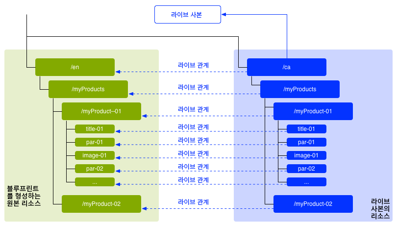
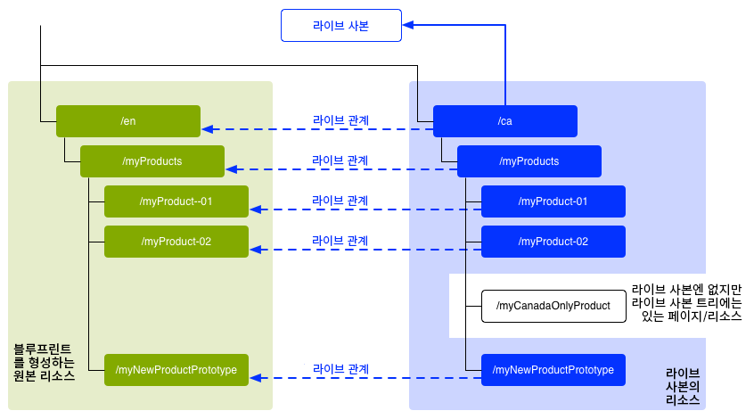
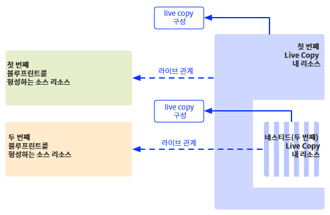
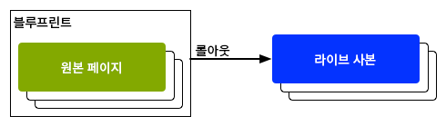

# 콘텐츠 재사용: 다중 사이트 관리자 및 Live Copy {#multi-site-manager-and-live-copy}

다중 사이트 관리자(MSM)를 사용하면 여러 지역에서 동일한 사이트 콘텐츠를 사용할 수 있습니다. 이를 위해 MSM은 Live Copy 기능을 사용합니다.

* MSM을 사용하여 다음과 같은 작업을 수행할 수 있습니다.
   * 콘텐츠를 한 번 만든 다음
   * 이 콘텐츠를 동일한 사이트의 다른 영역([Live Copy](#live-copies)를 통해) 또는 다른 사이트에서 사용할 수 있습니다.
* 그런 다음 MSM은 소스 콘텐츠와 해당 Live Copy 간의 라이브 관계를 유지하여 다음 작업을 수행합니다.
   * 소스 콘텐츠에 변경 내용을 적용하면 소스 및 Live Copy가 동기화됩니다.
   * 개별 하위 페이지 및/또는 구성 요소에 대한 라이브 관계의 연결 해제하여 Live Copy의 콘텐츠만 조정할 수 있습니다.

이 페이지는 MSM을 통한 콘텐츠 재사용에 대한 개요를 제공합니다. 다음 페이지는 관련 문제를 자세히 다룹니다.

* [Live Copy 생성 및 동기화](creating-live-copies.md)
* [Live Copy 개요 콘솔](live-copy-overview.md)
* [Live Copy 동기화 구성](live-copy-sync-config.md)
* [MSM 롤아웃 충돌](rollout-conflicts.md)
* [MSM 모범 사례](best-practices.md)

>[!NOTE]
>
>MSM은 콘텐츠 조각을 포함하여 자산에도 사용할 수 있습니다. 자세한 내용은 [자산의 MSM을 사용하여 콘텐츠 조각 재사용](/help/assets/reuse-assets-using-msm.md)(자산 콘솔을 통해서만 사용 가능)을 참조하십시오.

## 가능한 시나리오 {#possible-scenarios}

MSM 및 Live Copy에 대한 다양한 사용 사례가 있습니다. 다음과 같은 상황이 이에 해당됩니다.

* **다국적 - 글로벌 기업에서 로컬 회사까지**

  MSM이 지원하는 대표적인 사용 사례는 여러 다국적 동일 언어 사이트에서 콘텐츠를 재사용하는 것입니다. 이렇게 하면 핵심 콘텐츠를 재사용할 수 있는 동시에 다국적인 변형을 만들 수 있습니다.

  예를 들어 [WKND 튜토리얼 샘플](/help/implementing/developing/introduction/develop-wknd-tutorial.md)의 영어 섹션은 미국에 있는 고객을 위해 작성됩니다. 이 사이트의 대부분의 콘텐츠는 다른 국가와 문화의 영어권 고객들에게 제공되는 다른 WKND 사이트에도 사용할 수 있습니다. 핵심 콘텐츠는 모든 사이트에 걸쳐 동일하게 유지되는 반면 지역적인 조정을 수행할 수 있습니다.

  다음 구조는 미국과 캐나다의 사이트에 사용할 수 있습니다. `language-masters` 노드가 영어뿐만 아니라 다른 언어 콘텐츠의 마스터 사본을 유지하는 방법에 주목하십시오. 이 콘텐츠는 영어와 함께 추가 지역 언어 콘텐츠의 기반으로 사용할 수 있습니다.

  ```xml
  /content
      |- wknd
          |- language-masters
              |- en
              |- es
              |- fr
          |- us
              |- en
              |- es
          |- ca
              |- en
              |- fr
  ```

  >[!NOTE]
  >
  >MSM은 콘텐츠를 번역하지 않습니다. 필요한 구조를 만들고 콘텐츠를 배포하는 데 사용됩니다.
  >
  >
  >그에 대한 예는 [다국어 사이트를 위한 콘텐츠 번역](/help/sites-cloud/administering/translation/overview.md)을 참조하십시오.

* **국제적 - 본사부터 지역 지사까지**

  또는 대리점 네트워크를 보유한 회사는 본사에서 제공하는 기본 사이트의 변형으로 개별 대리점을 위한 별도의 웹 사이트를 원할 수 있습니다. 이는 여러 지역 사무소가 있는 단일 회사 또는 중앙 프랜차이즈 본사와 여러 지역 프랜차이즈로 구성된 국제적인 프랜차이즈 시스템에 대한 것일 수 있습니다.

  본사는 핵심 정보를 제공할 수 있지만, 지역 엔티티는 여기에 연락처 세부 정보, 영업 시간 및 이벤트와 같은 로컬 정보를 추가할 수 있습니다.

  ```xml
  /content
      |- head-office-berlin
      |- branch-hamburg
      |- branch-stuttgart
      |- branch-munich
      |- branch-frankfurt
  ```

* **여러 버전**

  MSM은 특정 하위 분기의 버전을 만들 수 있습니다. 예를 들어 지원되는 하위 사이트에는 특정 제품의 다른 버전에 대한 세부 정보가 포함될 수 있습니다. 여기에서 기본 정보는 일정하게 유지되며 업데이트된 기능만 변경해야 합니다.

  ```xml
  /content
      |- game-support
          |- polybius
              |- v5.0
              |- v4.0
              |- v3.0
              |- v2.0
              |- v1.0
  ```

  >[!TIP]
  >
  >이러한 상황에서 문제는 간단한 사본을 만들 것인지 아니면 Live Copy를 사용할 것인지 여부이며, 이는
  >
  >* 여러 버전에 걸쳐 업데이트해야 하는 핵심 콘텐츠
  >
  >및
  >
  >* 조정이 필요한 개별 사본 사이의 균형입니다.

## UI의 MSM {#msm-from-the-ui}

MSM은 적절한 콘솔에서 다양한 옵션을 사용하여 UI에서 직접 액세스할 수 있습니다.

* **사이트 생성** (**Sites**)

   * MSM은 일반적인 콘텐츠를 공유하는 여러 웹 사이트를 관리하는 데 도움이 됩니다. 예를 들어 웹 사이트를 전 세계 대상자들에게 제공할 때에는 대부분의 콘텐츠를 모든 국가에 공통적으로 제공함과 동시에 개별 국가에 특정된 콘텐츠의 하위 집합을 함께 제공하는 경우가 많습니다. MSM을 사용하면 [소스 사이트를 기반으로 하나 이상의 사이트를 자동으로 업데이트하는 Live Copy를 만들 수 있습니다](creating-live-copies.md#creating-a-live-copy-of-a-site-from-a-blueprint-configuration). 또한 이를 통해 일반적인 기본 구조를 적용하고, 여러 사이트에서 일반적인 콘텐츠를 사용하고, 공통적인 모양과 느낌을 유지하고, 사이트 간에 실제로 차이가 있는 콘텐츠를 관리하는 데 노력을 기울일 수 있습니다. 이러한 방식으로 사이트를 만들면:
      * 소스를 지정하기 위해 사전 정의된 블루프린트 구성이 필요합니다.
      * (사전 정의된) 소스의 Live Copy가 생성됩니다.
      * 사용자에게 **롤아웃** 버튼이 제공됩니다.

* **Live Copy 만들기** (**Sites**)

   * MSM을 사용하면 [웹 사이트의 개별 페이지 또는 하위 분기에 대한 애드혹(일회성) Live Copy를 만들 수 있습니다.](creating-live-copies.md#creating-a-live-copy-of-a-page) 예를 들어 하위 분기를 복제하여 제품의 새/업데이트 버전에 대한 정보를 제공할 수 있습니다. 이러한 방식으로 Live Copy를 만들면:
      * 애드혹 Live Copy가 생성됩니다(블루프린트 구성은 필요하지 않음).
      * 페이지/분기의 Live Copy를 만드는 데 (즉시) 사용할 수 있습니다.
      * **동기화**&#x200B;가 필요합니다(**롤아웃** 버튼은 제공되지 않음).

* **속성 보기** (**Sites**)

   * 해당되는 경우 이 옵션은 관련된 **Live Copy** 또는 **블루프린트**&#x200B;에 대한 정보를 제공하여 [Live Copy를 모니터링](creating-live-copies.md#monitoring-your-live-copy)하는 데 도움이 됩니다.

* **참조** (**Sites**)

   * [참조](/help/sites-cloud/authoring/getting-started/basic-handling.md#references) 레일은 적절한 작업에 대한 액세스 권한과 함께 **Live Copy**&#x200B;에 대한 정보를 제공합니다.

* **Live Copy 개요** (**Sites**)

   * 이 콘솔을 통해 [블루프린트 및 해당 Live Copy를 확인하고 관리](live-copy-overview.md)할 수 있습니다.

* **블루프린트** (**도구** - **Sites**)

   * 이 콘솔을 통해 [블루프린트 구성을 만들고 관리](creating-live-copies.md#creating-a-blueprint-configuration)할 수 있습니다.

>[!NOTE]
>
>MSM 기능은 론치와 같은 몇 가지 다른 AEM 기능에 사용됩니다. 이 경우 Live Copy는 이러한 기능에 의해 관리됩니다.

### 사용된 용어 {#terms-used}

다음 표에서는 MSM에서 사용되는 주요 용어에 대한 개요를 제공합니다. 이에 대한 자세한 내용은 이후 섹션 및 페이지에 나와 있습니다.

| 용어 | 정의 | 자세한 내용 |
|---|---|---|
| 소스 | Live Copy의 기반으로 사용되는 원본 페이지 | 블루프린트 및/또는 블루프린트 페이지의 동의어 |
| Live Copy | 롤아웃 구성에서 정의된 동기화 작업에 의해 관리되는 (소스의) 사본 |  |
| Live Copy 구성 | Live Copy에 대한 구성 세부 정보의 정의 |  |
| 라이브 관계 | 지정된 리소스에 대한 상속의 실질적 정의(예: 소스와 Live Copy 간의 연결) | 소스에 적용된 변경 내용을 Live Copy와 동기화합니다. |
| 블루프린트 | 소스의 동의어 | 블루프린트 구성으로 정의할 수 있습니다. |
| 블루프린트 구성 | 소스 경로를 지정하는 사전 정의된 구성 | 블루프린트 구성에서 블루프린트 페이지가 참조되면 롤아웃 명령을 사용할 수 있습니다. |
| 챕터 | Live Copy에 포함할 블루프린트 섹션 | 일반적으로 루트의 하위 페이지입니다. |
| 동기화 | 소스와 Live Copy 간의 콘텐츠 동기화를 나타내는 일반 용어 (**롤아웃** 및 **동기화** 옵션 모두 사용) |  |
| 롤아웃 | 소스에서 Live Copy로 동기화합니다. | (블루프린트 페이지의) 작성자 또는 시스템 이벤트에 의해(롤아웃 구성에 정의됨) 트리거될 수 있습니다. |
| 롤아웃 구성 | 동기화될 속성, 방법 및 시기를 결정하는 규칙 |  |
| 동기화 | Live Copy 페이지에서 작성되는 수동 동기화 요청 |  |
| 상속 | Live Copy 페이지/구성 요소는 동기화가 발생할 때 소스 페이지/구성 요소에서 콘텐츠를 상속합니다. |  |
| 일시 중단 | Live Copy와 블루프린트 페이지 간의 라이브 관계를 일시적으로 제거합니다. |  |
| 분리 | Live Copy와 블루프린트 페이지 간의 라이브 관계를 영구적으로 제거합니다. |  |
| 재설정 | Live Copy 페이지를 재설정하여 모든 상속 취소를 제거하고 페이지를 소스 페이지와 동일한 상태로 되돌립니다. | 재설정은 페이지 속성, 단락 시스템 및 구성 요소에 적용한 변경 내용에 영향을 미칩니다. |
| 약식 | 단일 페이지의 Live Copy |  |
| 딥 | 하위 페이지를 포함하는 페이지의 Live Copy |  |

>[!TIP]
>
>문서를 참조하십시오. [다중 사이트 관리자 확장](/help/implementing/developing/extending/msm.md#overview-of-the-java-api) 객체 이름.

## Live Copy {#live-copies}

MSM Live Copy는 원본 소스와의 라이브 관계가 유지되는 특정 사이트 콘텐츠의 사본입니다.

* Live Copy는 소스에서 콘텐츠를 상속합니다.
* 동기화는 소스가 변경될 때 실제 콘텐츠 이전을 수행합니다.
* Live Copy는 다음 중 하나로 간주할 수 있습니다.
   * 약식: 단일 페이지
   * 딥: 하위 페이지를 포함하는 페이지
* 롤아웃 구성이라고 하는 동기화 규칙은 동기화할 속성 및 동기화 시기를 결정합니다.

이전의 예에서는 `/content/wknd/language-masters/en`이 영어로 작성된 글로벌 마스터 사이트입니다. 이 사이트의 콘텐츠를 재사용하기 위해 MSM Live Copy가 생성됩니다.

* `/content/wknd/language-masters/en` 아래의 콘텐츠는 소스입니다.
* `/content/wknd/language-masters/en` 아래의 콘텐츠는 `/content/wknd/us/en/` 및 `/content/wknd/ca/en` 노드 아래에 복사됩니다. 이를 Live Copy라고 합니다.
* 작성자는 `/content/wknd/language-masters/en` 아래의 페이지에 변경 내용을 적용합니다.
* 트리거되면 MSM은 이러한 변경 내용을 Live Copy에 동기화합니다.

### Live Copy - 구성 {#live-copies-composition}

>[!NOTE]
>
>이 섹션의 다이어그램 및 설명은 잠재적 Live Copy의 스냅샷을 나타냅니다. 이 스냅샷은 포괄적이지는 않지만 특정 특성을 강조하는 개요를 제공합니다.

처음 Live Copy를 만들 때 선택한 소스 페이지는 Live Copy에 1:1 기준으로 반영됩니다. 이후 Live Copy 내에서 직접 새 리소스(페이지 및/또는 단락)를 작성할 수 있으므로, 이러한 변형이 동기화에 미치는 영향을 알아두는 것이 좋습니다. 가능한 구성은 다음과 같습니다.

* [Live Copy가 아닌 페이지를 포함하는 Live Copy](#live-copy-with-non-live-copy-pages)
* [중첩 Live Copy](#nested-live-copies)

Live Copy의 기본 형식은 다음으로 구성됩니다.

* 선택한 소스 페이지는 Live Copy에 1:1 기준으로 반영하는 Live Copy 페이지
* 1개의 구성 정의
* 모든 리소스에 대해 정의된 라이브 관계:
   * Live Copy 리소스를 해당 블루프린트/소스와 연결합니다.
   * 상속 및 롤아웃을 실현할 때 사용됩니다.

변경 내용은 요구 사항에 따라 [동기화](creating-live-copies.md#synchronizing-your-live-copy)될 수 있습니다.



#### Live Copy가 아닌 페이지를 포함하는 Live Copy {#live-copy-with-non-live-copy-pages}

AEM에서 Live Copy를 만들 때 Live Copy 분기를 확인하고 탐색할 수 있으며 Live Copy 분기에 일반 AEM 기능을 사용할 수 있습니다. 즉, 사용자(또는 프로세스)는 Live Copy 내부에 새 리소스(페이지 및/또는 단락)을 만들 수 있습니다. (예: 특정 지역 또는 국가를 위한 제품)

* 이러한 리소스는 소스/블루프린트 페이지와 라이브 관계가 없으며 동기화되지 않습니다.
* MSM이 특수 사례로 처리하는 시나리오가 발생할 수 있습니다. (예: 사용자(또는 프로세스)가 소스/블루프린트 및 Live Copy 분기에 위치 및 이름이 동일한 페이지를 만드는 경우) 이러한 상황에 대한 자세한 내용은 [MSM 롤아웃 충돌](rollout-conflicts.md)을 참조하십시오.



#### 중첩 Live Copy {#nested-live-copies}

사용자(또는 프로세스)가 [기존 Live Copy 내에 새 페이지](#live-copy-with-non-live-copy-pages)를 만들면 이 새 페이지도 다른 블루프린트의 Live Copy로 설정할 수 있습니다. 이를 중첩 Live Copy라고 합니다. 중첩 Live Copy에서 두 번째 또는 내부 Live Copy의 비헤이비어는 다음과 같은 방법으로 첫 번째 또는 외부 Live Copy의 영향을 받습니다.

* 최상위 Live Copy에 대해 트리거된 딥 롤아웃은 중첩 Live Copy로 계속 실행될 수 있습니다.
* 소스 간의 모든 링크는 Live Copy 내에서 다시 작성됩니다.

예를 들어 두 번째 블루프린트에서 첫 번째 블루프린트로 연결되는 링크는 중첩된/두 번째 Live Copy에서 첫 번째 Live Copy로 연결되는 링크로 다시 작성됩니다.



>[!NOTE]
>
>Live Copy 분기 내에서 페이지를 이동하거나 이름을 변경하면 이 페이지는 AEM이 관계를 추적할 수 있도록 중첩 Live Copy로 취급됩니다.

#### 누적 Live Copy {#stacked-live-copies}

Live Copy를 약식 Live Copy의 하위 항목으로 생성할 때 이를 누적 Live Copy라고 합니다. 이는 [중첩 Live Copy](#nested-live-copies)와 동일한 방식으로 작동합니다.

### 소스, 블루프린트 및 블루프린트 구성 {#source-blueprints-and-blueprint-configurations}

모든 페이지 또는 페이지 분기를 Live Copy의 소스로 사용할 수 있습니다. 그러나 MSM을 사용하면 소스 경로를 지정하는 블루프린트 구성을 정의할 수도 있습니다. 블루프린트 구성을 사용할 때의 이점은 다음과 같습니다.

* 작성자는 블루프린트에 **롤아웃** 옵션을 사용할 수 있습니다. (예: 이 블루프린트에서 상속하는 Live Copy에 대한 수정 사항을 명시적으로 푸시하기 위해)
* 작성자는 **사이트 생성**&#x200B;을 사용할 수 있습니다. 이렇게 하면 사용자는 손쉽게 언어를 선택하고 Live Copy 구조를 구성할 수 있습니다.
* 블루프린트와 연결된 Live Copy에 대한 기본 롤아웃 구성을 정의할 수 있습니다.

Live Copy의 소스는 일반 페이지이거나 블루프린트 구성으로 인해 포함된 페이지일 수 있습니다. 두 가지 모두 유용한 사용 사례입니다.

소스는 Live Copy의 블루프린트를 형성합니다. 다음의 경우 블루프린트가 정의됩니다.

* [블루프린트 구성을 만들 때](creating-live-copies.md#creating-a-blueprint-configuration) - 이 구성은 Live Copy를 만드는 데 사용할 페이지를 미리 정의합니다.
* [페이지의 Live Copy를 만들 때](creating-live-copies.md#creating-a-live-copy-of-a-page) - Live Copy를 만드는 데 사용할 페이지(소스 페이지)를 블루프린트 페이지라고 합니다. 소스 페이지는 블루프린트 구성에서 참조되거나 참조되지 않을 수 있습니다.

### 롤아웃 및 동기화 {#rollout-and-synchronize}

롤아웃은 Live Copy를 해당 소스와 동기화하는 중앙 집중식 MSM 작업입니다. 롤아웃은 수동으로 수행할 수도 있고 자동으로 수행할 수도 있습니다.

* [롤아웃 구성](#rollout-configurations)을 정의하여 특정 [이벤트](live-copy-sync-config.md#rollout-triggers)가 롤아웃을 자동으로 발생시킬 수 있도록 할 수 있습니다.
* 블루프린트 페이지를 작성할 때 **[롤아웃](creating-live-copies.md#rolling-out-a-blueprint)** 명령을 사용하여 변경 내용을 Live Copy로 푸시할 수 있습니다.
   * **롤아웃** 명령은 블루프린트 구성에서 참조되는 블루프린트 페이지에서 사용할 수 있습니다.

  

* Live Copy 페이지를 작성할 때 **[동기화](creating-live-copies.md#synchronizing-a-live-copy)** 명령을 사용하여 변경 내용을 소스에서 Live Copy로 가져올 수 있습니다.
   * **동기화** 명령은 소스/블루프린트 페이지가 블루프린트 구성에 포함되는지 여부에 관계없이 항상 Live Copy 페이지에서 사용할 수 있습니다.

  

### 롤아웃 구성 {#rollout-configurations}

롤아웃 구성은 Live Copy가 소스 콘텐츠와 동기화되는 시기와 방법을 정의합니다. 롤아웃 구성은 트리거와 하나 이상의 동기화 작업으로 구성됩니다.

* **트리거** - 트리거는 소스 페이지 활성화와 같이 라이브 작업 동기화를 발생시키는 이벤트입니다. MSM은 사용할 수 있는 트리거를 정의합니다.
* **동기화 작업** - 동기화 작업은 Live Copy에서 수행되어 이를 소스와 동기화합니다. 콘텐츠 복사, 하위 노드 순서 지정, Live Copy 페이지 활성화 등의 작업을 예로 들 수 있습니다. MSM은 다양한 동기화 작업을 제공합니다.

>[!NOTE]
>
>Java API를 사용하여 인스턴스에 대한 사용자 정의 작업을 만들 수 있습니다.

둘 이상의 Live Copy가 동일한 원격 설치 구성을 사용할 수 있도록 롤아웃 구성을 재사용할 수 있습니다. 표준 설치에는 여러 [롤아웃 구성](live-copy-sync-config.md#installed-rollout-configurations)이 포함되어 있습니다.

### 롤아웃 충돌 {#rollout-conflicts}

특히 작성자가 소스와 Live Copy의 콘텐츠를 모두 편집할 경우 롤아웃이 복잡해질 수 있습니다. 따라서 AEM을 사용하여 [롤아웃 중에 발생할 수 있는 충돌](rollout-conflicts.md)을 처리하는 방법을 알아두는 것이 유용합니다.

### 상속 및 동기화 일시 중단 및 취소 {#suspending-and-cancelling-inheritance-and-synchronization}

Live Copy의 각 페이지 및 구성 요소는 라이브 관계를 통해 소스 페이지 및 구성 요소와 연결됩니다. 라이브 관계는 소스의 Live Copy 콘텐츠 동기화를 구성합니다.

Live Copy 페이지에 대한 Live Copy 상속을 **일시 중단**&#x200B;하여 페이지 속성 및 구성 요소를 변경할 수 있습니다. 상속을 일시 중단하면 페이지 속성 및 구성 요소는 더 이상 소스와 동기화되지 않습니다.

개별 페이지 편집 시 작성자는 구성 요소에 대한 **상속을 취소**&#x200B;할 수 있습니다. 상속이 취소되면 라이브 관계가 일시 중단되고 해당 구성 요소에 대한 동기화가 수행되지 않습니다. 상속 및 동기화 취소 작업은 콘텐츠의 하위 섹션을 맞춤화해야 할 때 유용합니다.

### Live Copy 분리 {#detaching-a-live-copy}

블루프린트와 [Live Copy를 분리](creating-live-copies.md#detaching-a-live-copy)하여 모든 연결을 제거할 수도 있습니다.

>[!CAUTION]
>
>분리 작업은 영구적이며 취소가 불가능합니다.

분리 작업은 Live Copy와 블루프린트 페이지 간의 라이브 관계를 영구적으로 제거합니다. 모든 MSM 관련 속성이 Live Copy에서 제거되며 Live Copy 페이지는 독립형 사본이 됩니다.

>[!TIP]
>
>하위 페이지 및 상위 페이지에 미치는 영향을 포함한 자세한 내용은 [Live Copy 분리](creating-live-copies.md#detaching-a-live-copy)를 참조하십시오.

## MSM 사용을 위한 표준 단계 {#standard-steps-for-using-msm}

다음 단계에서는 MSM을 사용하여 콘텐츠를 재사용하고 Live Copy에 대한 변경 내용을 동기화하는 표준 절차를 설명합니다.

1. 소스 사이트의 콘텐츠를 개발합니다.
1. 사용할 롤아웃 구성을 결정합니다.

   1. MSM은 다양한 사용 사례를 충족할 수 있는 [여러 롤아웃 구성을 설치](live-copy-sync-config.md#installed-rollout-configurations)합니다.
   1. 필요한 경우 [롤아웃 구성을 생성](live-copy-sync-config.md#creating-a-rollout-configuration)할 수 있습니다.

1. [사용할 롤아웃 구성을 지정](live-copy-sync-config.md#specifying-the-rollout-configurations-to-use)해야 하는 위치를 결정하고 필요에 따라 구성합니다.
1. 필요한 경우 Live Copy의 소스 콘텐츠를 식별하는 [블루프린트 구성을 생성](creating-live-copies.md#creating-a-blueprint-configuration)합니다.
1. [Live Copy를 만듭니다.](creating-live-copies.md#creating-a-live-copy)
1. 필요에 따라 소스 콘텐츠를 변경합니다. 귀사에서 수립한 일반 콘텐츠 검토 및 승인 프로세스를 사용해야 합니다.
1. 블루프린트를 [롤아웃](creating-live-copies.md#rolling-out-a-blueprint)하거나 변경 내용으로 [Live Copy를 동기화](creating-live-copies.md#synchronizing-a-live-copy)합니다.

## MSM 맞춤화 {#customizing-msm}

MSM은 콘텐츠를 공유할 때 발생할 수 있는 예외적인 복잡성에 맞게 구현을 조정할 수 있는 도구를 제공합니다.

* **롤아웃 구성 사용자 정의** - 설치된 롤아웃 구성이 요구 사항에 부합하지 않는 경우 [롤아웃 구성을 생성](live-copy-sync-config.md#creating-a-rollout-configuration)합니다. 사용할 수 있는 모든 롤아웃 트리거 및 동기화 작업을 사용할 수 있습니다.

<!--
* **Custom Synchronization Actions** - [Create a custom synchronization action](/help/sites-developing/extending-msm.md#creating-a-new-synchronization-action) when the installed actions do not meet your specific application requirements. MSM provides a Java API for creating custom synchronization actions.
-->

## 모범 사례 {#best-practices}

[MSM 모범 사례](best-practices.md) 페이지에는 구현과 관련된 중요한 정보가 포함되어 있습니다.
