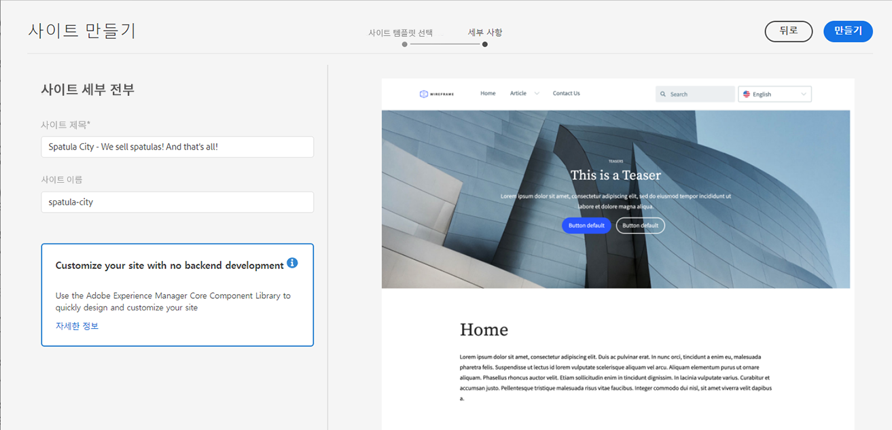
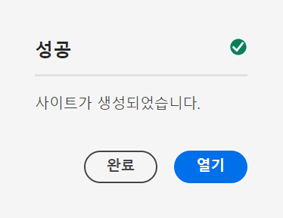
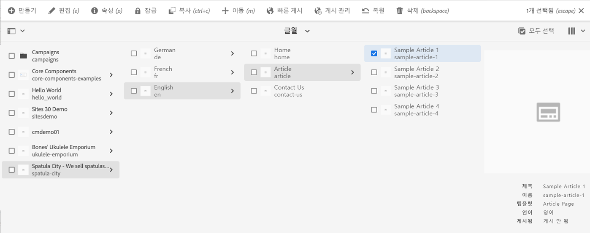

# 사이트 생성 {#creating-site}

AEM을 통해 사이트 템플릿을 사용하여 사이트를 만들고 이러한 사이트의 스타일 및 구조를 정의하는 방법에 대해 알아봅니다.

## 개요 {#overview}

콘텐츠 작성자가 콘텐츠로 페이지를 만들기 위해서는 먼저 사이트를 제작해야 합니다. 이 작업은 일반적으로 사이트의 초기 구조를 정의하는 AEM 관리자가 수행합니다. 사이트 템플릿을 사용하면 개발자가 아닌 사용자도 빠르고 유연하게 사이트를 만들 수 있습니다.

## 사이트 구조 계획 {#structure}

사이트의 목적과 계획된 콘텐츠를 사전에 충분히 고려하십시오. 이를 통해 사이트 구조 설계 방법을 유도해낼 수 있습니다. 훌륭한 사이트 구조를 통해 사이트 방문자는 간편하게 탐색하고 콘텐츠를 검색할 수 있으며 [다중 사이트 관리 및 번역](/help/sites-cloud/administering/msm-and-translation.md)과 같은 다양한 AEM 기능을 사용할 수 있습니다.

## 사이트 템플릿 {#site-templates}

사이트 구조는 사이트의 성공에 매우 중요한 요소이므로, 기존 표준 세트에 따라 새 사이트를 신속하게 배포할 수 있는 사전 정의된 구조를 갖추는 것이 편리합니다. 사이트 템플릿은 기본 사이트 콘텐츠를 편리하며 재사용 가능한 패키지로 결합하는 방법입니다.

일반적으로 사이트 템플릿에는 기본 사이트 콘텐츠 및 구조 외에도 새 사이트를 빠르게 시작할 수 있는 사이트 스타일 지정 정보가 포함됩니다. 템플릿은 재사용 및 맞춤화가 가능한 강력한 도구입니다. 또한 AEM 설치에서 여러 템플릿을 사용할 수 있으므로 서로 다른 사이트를 만들어 다양한 비즈니스 요구 사항을 유연하게 충족할 수 있습니다.

>[!TIP]
>
>사이트 템플릿에 대한 자세한 내용은 [사이트 템플릿](site-templates.md) 문서를 참조하십시오.

>[!NOTE]
>
>사이트 템플릿을 [페이지 템플릿과 혼동하면 안 됩니다.](/help/sites-cloud/authoring/page-editor/templates.md) 사이트 템플릿은 사이트의 전반적인 구조를 정의하는 역할을 합니다. 페이지 템플릿은 개별 페이지의 구조 및 초기 콘텐츠를 정의합니다.

### Adobe 제공 사이트 템플릿 {#adobe-templates}

{{adobe-templates}}

## 사이트 생성 {#create-site}

템플릿을 사용하여 간단하게 사이트를 만들 수 있습니다.

1. AEM 작성 환경에 로그인한 다음 Sites 콘솔로 이동합니다.

   * `https://<your-author-environment>.adobeaemcloud.com/sites.html/content`

1. 화면 오른쪽 상단의 **만들기**&#x200B;를 선택한 다음 드롭다운 메뉴에서 **템플릿으로 사이트 만들기**&#x200B;를 선택합니다.

   

1. 사이트 만들기 마법사의 왼쪽 패널 또는 왼쪽 열 상단의 **가져오기**&#x200B;에서 기존 템플릿을 선택하여 새 템플릿을 가져옵니다.

   

   1. 가져오기를 선택한 경우 파일 브라우저에서 사용할 템플릿을 찾은 다음 **업로드**&#x200B;를 선택합니다.

   1. 업로드되면 사용할 수 있는 템플릿 목록에 표시됩니다.

1. 템플릿을 선택하면 오른쪽 열에 템플릿에 대한 정보가 표시됩니다. 원하는 템플릿을 선택하고 **다음**&#x200B;을(를) 선택합니다.

   

1. 사이트의 제목을 입력합니다. 사이트 이름을 입력하거나 생략할 수 있으며, 생략할 경우 자동으로 제목에서 생성됩니다.

   * 브라우저의 제목 표시줄에 사이트 제목이 표시됩니다.
   * 사이트 이름은 URL의 일부가 됩니다.
   * 사이트 이름은 [AEM의 페이지 이름 지정 규칙](/help/sites-cloud/authoring/sites-console/organizing-pages.md#page-name-restrictions-and-best-practices)을 준수해야 합니다.

1. 사이트 템플릿에 필요한 추가 사이트 세부 정보를 제공합니다.

   * 다른 템플릿에는 추가 세부 정보가 필요할 수 있습니다.
   * 예를 들어 [Edge Delivery Services 프로젝트](https://www.aem.live/developer/ue-tutorial)용 템플릿에는 프로젝트의 GitHub 저장소가 필요합니다.

1. **만들기**&#x200B;를 선택하면 사이트 템플릿에서 사이트가 만들어집니다.

   

1. 표시되는 확인 대화 상자에서 **완료**&#x200B;를 선택합니다.

   

1. Sites 콘솔에 새 사이트가 표시되며 해당 사이트를 탐색하여 템플릿에서 정의한 기본 구조를 살펴볼 수 있습니다.

   

이제 콘텐츠 작성자는 작성을 시작할 수 있습니다!

## 사이트 맞춤화 {#site-customization}

템플릿은 사이트의 기본 구조와 스타일을 빠르게 설정하는 데 유용합니다. 그러나 대부분의 프로젝트에는 몇 가지 추가 스타일 및 맞춤화가 필요합니다. 사이트 템플릿을 사용하면 사이트 스타일을 분리할 수 있으므로 프론트엔드 개발자는 AEM에 대한 지식이 없어도 사이트 스타일을 지정할 수 있으며 다음과 같은 작업을 수행할 수 있습니다
콘텐츠 작성자와 별도로 작업하고 콘텐츠 작성자와 나란히 작업합니다. 프로젝트 유형에 따라 두 가지 형태가 될 수 있습니다.

* 범용 편집기로 AEM 페이지를 작성하고 [edge 전달을 통해 전달하는 프로젝트의 경우](/help/edge/overview.md) 모든 스타일이 GitHub 프로젝트에서 수행됩니다.
   * 자세한 내용은 [시작하기 - 유니버설 편집기 개발자 자습서](https://www.aem.live/developer/ue-tutorial) 문서를 참조하십시오.
* [게시 게재를 통해 기존 AEM 페이지를 작성하고 전달하는 프로젝트의 경우](/help/sites-cloud/authoring/author-publish.md) AEM 관리자는 사이트 테마를 다운로드하여 프론트엔드 개발자에게 제공하고 프론트엔드 개발자는 자주 사용하는 도구를 사용하여 이를 맞춤화한 다음 변경 내용을 AEM 코드 저장소에 커밋하여 배포합니다.
   * 자세한 내용은 [AEM 빠른 사이트 생성 여정](/help/journey-sites/quick-site/overview.md) 문서를 참조하십시오.
