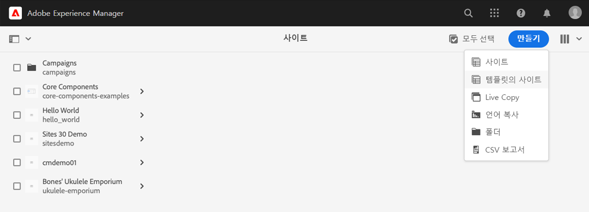

# 사이트 만들기 {#creating-site}

AEM을 사용하여 사이트 템플릿을 사용하여 사이트를 만들고 사이트의 스타일 및 구조를 정의하는 방법을 알아봅니다.

>[!CAUTION]
>
>빠른 사이트 만들기 도구는 현재 기술 미리 보기입니다. 테스트 및 평가 목적으로 사용할 수 있으며, Adobe 지원에 동의하지 않는 프로덕션 용도에는 사용할 수 없습니다.

## 개요 {#overview}

컨텐츠 작성자가 컨텐츠가 있는 페이지를 만들려면 먼저 사이트를 만들어야 합니다. 일반적으로 사이트의 초기 구조를 정의하는 AEM 관리자가 수행합니다. 사이트 템플릿을 사용하면 사이트를 빠르고 유연하게 만들 수 있습니다.

AEM 빠른 사이트 만들기 도구를 사용하면 비개발자가 사이트 템플릿을 사용하여 새 사이트를 처음부터 빠르게 만들 수 있습니다.

통합을 만든 후 빠른 사이트 만들기 도구를 사용하여 AEM 사이트의 테마 및 스타일(JavaScript, CSS 및 정적 리소스)을 빠르게 사용자 지정할 수 있습니다. 이를 통해 AEM에 대한 지식이 전혀 필요하지 않은 프런트 엔드 개발자는 컨텐츠 작성자와 별도로 작업하고 평행하게 작업할 수 있습니다. AEM 관리자는 사이트 테마를 다운로드하고 즐겨찾는 도구를 사용하여 사이트 테마를 사용자 지정한 다음 AEM 코드 리포지토리에 변경 사항을 커밋하는 프런트 엔드 개발자에게 제공하면 됩니다.

이 문서는 빠른 사이트 작성 도구를 사용한 사이트 작성에 중점을 둡니다. 사이트 만들기 및 사용자 지정 워크플로우에 대한 개요를 보려면 [AEM 빠른 사이트 만들기 여정](/help/journey-sites/quick-site/overview.md)

## 계획 사이트 구조 {#structure}

미리 사이트의 목적과 계획 컨텐츠를 잘 고려해 보십시오. 이렇게 하면 사이트 구조를 디자인하는 방법이 시작됩니다. 사이트 구조가 양호하여 사이트 방문자가 쉽게 탐색하고 컨텐츠를 검색할 수 있을 뿐만 아니라 다음과 같은 다양한 AEM 기능을 지원합니다 [다중 사이트 관리 및 번역.](/help/sites-cloud/administering/msm-and-translation.md)

>[!TIP]
>
>[WKND 참조 사이트](https://wknd.site) 은 완전히 작동하는 야외 경험 브랜드 웹 사이트에 대한 모범 사례 구현을 제공합니다. 잘 구축된 AEM 사이트가 어떻게 구성되어 있는지 살펴보십시오.

## 사이트 템플릿 {#site-templates}

사이트 구조가 사이트의 성공에 매우 중요하므로 사전 정의된 구조를 사용하여 기존 표준 세트에 따라 새 사이트를 빠르게 배포할 수 있습니다. 사이트 템플릿은 기본 사이트 컨텐츠를 간편하고 재사용 가능한 패키지로 결합하는 방법입니다.

사이트 템플릿에는 일반적으로 기본 사이트 콘텐츠 및 구조와 사이트 스타일 정보가 포함되어 있어 새로운 사이트를 빠르게 시작할 수 있습니다. 템플릿은 사용자 지정 가능 할 뿐만 아니라 재사용할 수 있으므로 강력합니다. 또한 AEM 설치에서 여러 템플릿을 사용할 수 있으므로 다양한 비즈니스 요구 사항을 충족하는 다양한 사이트를 유연하게 만들 수 있습니다.

>[!TIP]
>
>사이트 템플릿에 대한 자세한 내용은 [사이트 템플릿](site-templates.md) 문서.

>[!NOTE]
>
>사이트 템플릿을 페이지 템플릿과 혼동하지 않도록 합니다. 사이트 템플릿은 사이트의 전체 구조를 정의합니다. 페이지 템플릿은 개별 페이지의 구조 및 초기 컨텐츠를 정의합니다.

## 사이트 만들기 {#create-site}

템플릿을 사용하여 사이트를 만들 수 있습니다.

1. AEM 작성 환경에 로그인하고 사이트 콘솔로 이동합니다

   * `https://<your-author-environment>.adobeaemcloud.com/sites.html/content`

1. 탭 또는 클릭 **만들기** 화면의 오른쪽 상단에서 을(를) 선택하고 드롭다운 메뉴에서 을(를) 선택합니다 **템플릿의 사이트**.

   

1. 사이트 만들기 마법사에서 왼쪽 패널이나 **가져오기** 왼쪽 열 상단에서 새 템플릿을 가져옵니다.

   

   1. 가져오기로 선택한 경우 파일 브라우저에서 사용할 템플릿을 찾아 탭하거나 클릭합니다 **업로드**.

   1. 업로드되면 사용 가능한 템플릿 목록에 표시됩니다.

1. 템플릿을 선택하면 오른쪽 열에 템플릿에 대한 정보가 표시됩니다. 원하는 템플릿을 선택하고 을 탭하거나 클릭합니다 **다음**.

   

1. 사이트의 제목을 입력합니다. 사이트 이름을 제공할 수 있거나, 생략하면 제목에서 생성됩니다.

   * 사이트 제목은 브라우저 제목 표시줄에 나타납니다.
   * 사이트 이름이 URL의 일부가 됩니다.
   * 사이트 이름은 [AEM 페이지 이름 지정 규칙.](/help/sites-cloud/authoring/fundamentals/organizing-pages.md#page-name-restrictions-and-best-practices)

1. 탭 또는 클릭 **만들기** 사이트 템플릿에서 사이트를 만듭니다.

   

1. 확인 대화 상자가 표시되면 을 탭하거나 클릭합니다 **완료**.

   

1. 사이트 콘솔에서는 새 사이트가 표시되며 템플릿으로 정의된 기본 구조를 탐색하여 탐색할 수 있습니다.

   

이제 컨텐츠 작성자가 작성을 시작할 수 있습니다.

## 사이트 사용자 지정 {#site-customization}

사이트에서 사용 가능한 템플릿 이상으로 사용자 지정을 필요로 하는 경우 다양한 옵션을 사용할 수 있습니다.

* 사이트 구조 또는 초기 컨텐츠를 조정해야 하는 경우 [요구 사항을 충족하도록 사이트 템플릿을 사용자 지정할 수 있습니다.](site-templates.md)
* 사이트 스타일을 조정해야 하는 경우 [사이트 테마를 다운로드하여 사용자 지정할 수 있습니다.](/help/journey-sites/quick-site/overview.md)
* 사이트 기능을 조정해야 하는 경우 [사이트를 완전히 사용자 지정할 수 있습니다.](/help/implementing/developing/introduction/develop-wknd-tutorial.md)

개발 팀의 지원을 통해 모든 사용자 지정을 수행해야 합니다.
