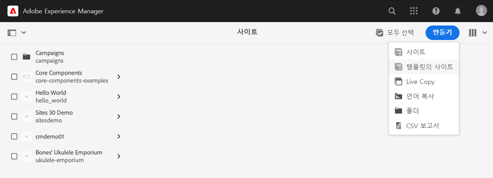
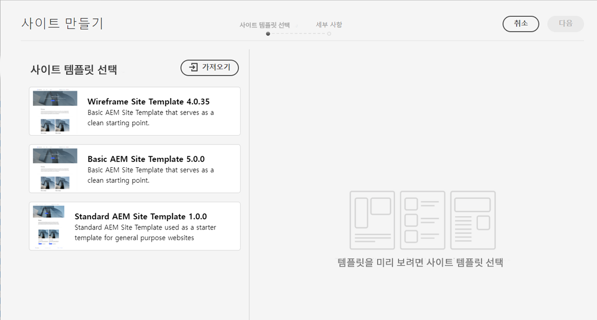
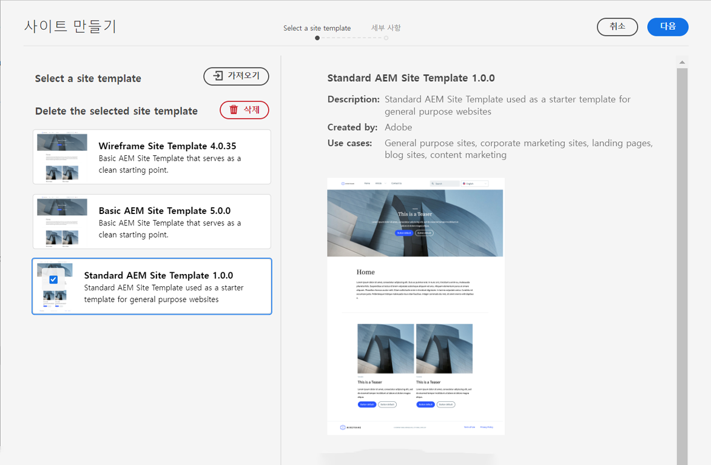

# 사이트 템플릿 {#site-templates}

AEM 사이트 템플릿을 통해 사이트 구조 및 초기 콘텐츠를 미리 정의하여 사이트를 빠르게 생성할 수 있는 방법에 대해 알아봅니다.

## 개요 {#overview}

기존 표준 세트에 따라 새 사이트를 신속하게 배포할 수 있는 사전 정의된 구조를 갖추는 것이 편리합니다. 사이트 템플릿은 기본 사이트 콘텐츠를 편리하며 재사용 가능한 패키지로 결합하는 방법입니다.

일반적으로 사이트 템플릿에는 기본 사이트 콘텐츠와 구조 및 새 사이트를 빠르게 시작할 수 있도록 [사이트 테마](site-themes.md)라고 하는 사이트 스타일 지정 정보가 포함됩니다. 관리자는 [사이트 생성 프로세스](create-site.md)에서 사이트의 기반이 되는 사이트 템플릿을 선택합니다.

템플릿은 재사용 및 맞춤화가 가능한 강력한 도구입니다. 또한 AEM 설치에서 여러 템플릿을 사용할 수 있으므로 서로 다른 사이트를 만들어 다양한 비즈니스 요구 사항을 유연하게 충족할 수 있습니다.

>[!NOTE]
>
>AEM 사이트 템플릿을 [페이지 템플릿과 혼동하면 안 됩니다](/help/sites-cloud/authoring/features/templates.md). 사이트 템플릿은 사이트의 전반적인 구조를 정의하는 역할을 합니다. 페이지 템플릿은 개별 페이지의 구조 및 초기 콘텐츠를 정의합니다.
>
>AEM 사이트 템플릿을 [AEM 사이트 테마와 혼동하면 안 됩니다](site-themes.md). AEM 사이트 테마는 AEM 사이트에 대한 스타일 정보만 포함합니다. AEM 사이트 템플릿은 사이트 구조 및 최초 콘텐츠를 정의하며 [빠른 사이트 생성](create-site.md)을 위한 AEM 사이트 테마를 포함합니다.

## AEM에 사이트 템플릿 추가 {#adding}

AEM에 여러 템플릿을 추가한 다음, [사이트를 만드는](create-site.md) 데 사용할 수 있습니다.

1. AEM 작성 환경에 로그인한 다음 Sites 콘솔로 이동합니다.

   * `https://<your-author-environment>.adobeaemcloud.com/sites.html/content`

1. 선택 **만들기** 화면 오른쪽 상단의 드롭다운 메뉴에서 을(를) 선택합니다. **템플릿의 사이트**.

   

1. 사이트 생성 마법사에서 다음을 선택합니다 **가져오기** 왼쪽 열의 맨 위에 있습니다.

   

1. 파일 브라우저에서 사용할 템플릿을 찾은 다음 을 선택합니다 **업로드**.

1. 업로드되면 사용할 수 있는 템플릿 목록에 표시됩니다.

템플릿이 업로드되어 [새 사이트를 만드는](create-site.md) 데 사용할 수 있습니다.

기존 템플릿을 선택하면 오른쪽 열에 템플릿에 대한 정보가 표시됩니다.

## 사이트 템플릿 구조 {#structure}

사이트 템플릿은 패키지 콘텐츠의 목적을 명확하게 반영하는 논리적 구조를 갖춘 패키지입니다. 사이트 템플릿의 구조는 다음과 같습니다.

* `files`: UI 키트, XD 파일 및 기타 파일이 포함된 폴더
* `previews`: 사이트 템플릿의 스크린샷이 포함된 폴더
* `site`: 페이지 템플릿, 페이지 등 이 템플릿으로 만든 각 사이트에 대해 복사된 콘텐츠의 콘텐츠 패키지
* `theme`: 의 소스 [사이트 테마](site-themes.md) 를 사용하여 CSS, JavaScript 등을 포함하여 사이트의 외관을 수정합니다.

## 표준 사이트 템플릿 {#standard-site-template}

Adobe는 나만의 템플릿을 만들 때 기준으로 사용할 수 있는 모범 참조 템플릿을 제공합니다. [표준 사이트 템플릿은 GitHub에서 사용할 수 있습니다.](https://github.com/adobe/aem-site-template-standard)

[표준 사이트 템플릿의 최신 릴리스](https://github.com/adobe/aem-site-template-standard/releases)를 다운로드하여 [새 사이트를 생성](create-site.md)하는 데 바로 사용할 수 있습니다.

## 사이트 템플릿 개발 {#developing-templates}

Adobe는 새 사이트 템플릿을 만들기 위한 스크립트 세트로 AEM 사이트 템플릿 빌더를 제공합니다.

[GitHub의 사용 설명서와 함께 AEM 사이트 템플릿 빌더를 사용할 수 있습니다](https://github.com/adobe/aem-site-template-builder). [사이트 테마](site-themes.md)를 맞춤화하려면 프론트엔드 개발자 경험이 필요하고 사이트 구조 및 콘텐츠를 맞춤화하려면 AEM 개발자 지식이 있어야 합니다.
