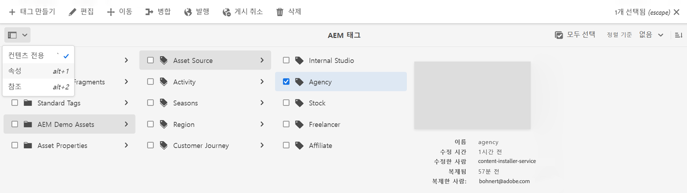

# 태그 관리 {#administering-tags}

태그는 콘텐츠를 분류하는 직관적인 방법입니다. 콘텐츠를 더 빨리 찾을 수 있도록 하는 키워드 또는 레이블(메타데이터)이라고 생각하면 됩니다.

AEM(Adobe Experience Manager)에서 태그는 다음의 속성일 수 있습니다.

* 페이지의 콘텐츠 노드
   * 자세한 내용은 [태그 사용](/help/sites-cloud/authoring/sites-console/tags.md) 문서를 참조하십시오.
* 자산의 메타데이터 노드
   * 자세한 내용은 [디지털 자산에 대한 메타데이터 관리](/help/assets/manage-metadata.md) 문서를 참조하십시오.

>[!TIP]
>
>동일한 아이디어와 관련된 태그의 수를 최소화하는 것이 좋습니다. 예를 들어 아웃도어 용품점의 콘텐츠를 관리하는 경우 **신발류**&#x200B;와 **신발** 모두에 대한 태그가 필요하지는 않다고 보면 됩니다.

## 태그 기능 {#tag-features}

태그는 콘텐츠 정리 및 관리를 위한 강력한 기능을 제공합니다.

* 태그는 다양한 네임스페이스로 그룹화할 수 있습니다.
   * 네임스페이스는 분류 체계를 구축할 수 있는 계층 구조라고 생각하면 됩니다.
   * 이러한 분류는 AEM 전체에 적용됩니다.
* 태그는 작성자가 적용하고 사이트 방문자가 사용할 수 있습니다.
* 만든 사람과 관계없이 태그를 페이지에 할당하거나 검색할 때 모든 형태의 태그를 선택할 수 있습니다.
* 태그는 [목록 구성 요소](https://experienceleague.adobe.com/docs/experience-manager-core-components/using/wcm-components/list.html)에서 선택한 태그를 기반으로 동적 목록을 생성할 때 사용됩니다.

## 태그 요구 사항 {#requirements}

태그를 만들고 관리할 때 염두에 두어야 할 몇 가지 기술적 세부 사항이 있습니다.

* 태그는 특정 네임스페이스 내에서 고유해야 합니다.
* 태그 이름은 다음과 같은 태그 구분 기호를 포함할 수 없습니다.
   * 콜론(`:`) - 네임스페이스 태그 구분
   * 슬래시(`/`) - 하위 태그 구분
* 태그 제목에 태그 구분 기호가 포함되어 있으면 UI에서 표시되지 않습니다.
* 태그를 만들고 태그 분류 체계를 수정할 수 있는 주체는 `tag-administrators` 그룹의 멤버와 `/content/cq:tags` 수정 권한이 있는 멤버입니다.
   * 하위 태그를 포함하는 태그를 컨테이너 태그라고 합니다.
   * 컨테이너 태그가 아닌 태그를 리프 태그라고 합니다.
   * 태그 네임스페이스는 리프 태그 또는 컨테이너 태그일 수 있습니다.

태그 작동 방식에 대한 자세한 기술 정보는 [AEM 태그 지정 프레임워크](/help/implementing/developing/introduction/tagging-framework.md)를 참조하십시오.

## 태그 지정 콘솔 {#tagging-console}

태그 지정 콘솔은 태그와 태그 분류 체계를 만들고 관리하는 데 사용합니다. 태그 지정 콘솔을 사용하여 다음과 같이 태그를 관리할 수 있습니다.

* 네임스페이스로 그룹화합니다.
* 새 태그를 만들기 전에 기존 태그의 사용을 검토합니다.
* 현재 참조된 콘텐츠에서 태그를 분리하지 않고 태그를 재구성합니다.

태그 지정 콘솔에 액세스하려면 다음 작업을 수행하십시오.

1. 관리 권한으로 작성 환경에 로그인합니다.
1. 전역 탐색 메뉴에서 **`Tools`** > **`General`** >
   **`Tagging`**&#x200B;을 선택합니다.

## 새 태그 만들기 {#creating-new-tags}

태그를 만들고 사용하여 콘텐츠를 구성하는 몇 가지 단계가 있습니다.

1. [태그에 대한 네임스페이스를 만듭니다](#creating-namespaces)(또는 재사용할 기존 네임스페이스 선택).
1. [새 태그를 만듭니다.](#creating-tags)
1. [태그를 게시합니다.](#publishing-tags)

### 네임스페이스 만들기 {#creating-namespaces}

네임스페이스는 다른 태그를 정리하는 데 사용됩니다. 가장 낮은 수준의 태그라고 생각하면 되며 일반적으로 다른 태그를 그룹화하는 데 사용합니다.

1. 네임스페이스를 만들려면 [태그 지정 콘솔](#tagging-console)을 열고 도구 모음에서 **만들기** 단추를 선택한 다음 **네임스페이스 만들기**&#x200B;를 선택하십시오.

   

1. 필요한 정보를 입력합니다.

   * **제목** - UI에서 사용자에게 표시되는 네임스페이스의 제목입니다(선택 사항).
   * **이름** - 이름을 지정하지 않으면 **제목**&#x200B;을 사용해 유효한 노드 이름이 만들어집니다. 자세한 내용은 [AEM 태그 지정 프레임워크](/help/implementing/developing/introduction/tagging-framework.md#tagid) 문서를 참조하십시오.
   * **설명** - 네임스페이스에 대한 설명입니다(선택 사항).

1. 필요한 정보를 입력하고 나면 **만들기**&#x200B;를 선택하세요.

네임스페이스가 만들어집니다. 태깅 콘솔에서 네임스페이스는 가장 낮은 수준(콘솔의 맨 왼쪽 열)에 있으며 폴더 아이콘으로 표시되며, 이는 해당 특성을 &quot;컨테이너&quot; 또는 다른 태그 그룹화로 반영합니다.

이제 이 네임스페이스에서 [새 태그를 만들거나](#creating-tags), [기존 태그를 관리](#managing-tags)할 수 있습니다.

네임스페이스는 하위 태그를 포함할 필요가 없습니다. 네임스페이스 자체가 태그이기 때문에 다른 태그처럼 콘텐츠를 정리하는 데 사용할 수 있습니다. 그러나 구조화된 태그 지정 분류 체계를 계속 만들려면 해당 네임스페이스 내에서 프로젝트 요구 사항에 따라 [하위 태그를 만들면](#creating-tags) 됩니다.

### 태그 만들기 {#creating-tags}

태그는 일반적으로 네임스페이스에 추가됩니다.

1. 태그를 만들려면 [태그 지정 콘솔을 엽니다.](#tagging-console)

1. 태그를 만들 네임스페이스를 선택합니다. 또는 다른 태그를 선택하여 그 아래에 하위 태그를 만듭니다.

1. 도구 모음에서 **만들기** 단추를 선택한 다음 **태그 만들기**&#x200B;를 선택하십시오.

1. **태그 만들기** 대화 상자가 열립니다. 새 태그의 필수 정보를 입력합니다.

   * **제목** - 태그의 표시 제목입니다(필수).
   * **이름** - 태그의 이름입니다(필수). 지정하지 않으면 **제목**&#x200B;을 사용해 유효한 노드 이름이 만들어집니다. [TagID](/help/implementing/developing/introduction/tagging-framework.md#tagid)를 참조하십시오.
   * **설명** - 태그에 대한 설명입니다.
   * **태그 경로** - 태그 지정 콘솔에서 선택한 네임스페이스(또는 태그)가 기본값입니다. 경로 선택기 아이콘을 탭하거나 클릭하여 수동으로 업데이트할 수 있습니다.

   

1. **제출**&#x200B;을 선택합니다.

태그가 만들어지고, 새 태그를 표시하도록 콘솔이 업데이트됩니다.

태그를 사용하면 조직의 요구 사항에 따라 고유한 분류 체계를 자유롭게 만들 수 있습니다.

* 새 태그를 만들기 전에 콘솔에서 상위 태그를 선택하여 기존 태그의 하위 태그를 만들 수 있습니다.
* 네임스페이스나 다른 태그를 선택하지 않고 태그를 만들면 네임스페이스를 효과적으로 만들 수 있습니다.

### 태그 게시 {#publishing-tags}

AEM에서 다른 콘텐츠를 만들 때와 마찬가지로 태그(또는 네임스페이스)를 만든 후에는 작성 환경에만 존재합니다. 사용자가 태그를 사용할 수 있으려면 태그를 게시해야 합니다.

1. 태그를 게시하려면 [태그 지정 콘솔](#tagging-console)을 엽니다.

1. 게시할 태그를 선택하고 도구 모음에서 **Publish**&#x200B;을 선택합니다.

   

1. **태그 게시** 대화 상자에서 선택한 태그를 게시할 것인지 확인합니다. **게시**&#x200B;를 선택합니다.

   

1. 게시 작업은 **성공** 대화 상자로 확인됩니다.

   

선택한 태그는 게시 대기열에 추가됩니다. 페이지 콘텐츠와 마찬가지로, 하위 태그가 있는지 여부에 관계없이 선택한 태그만 게시됩니다.

전체 분류 체계(네임스페이스 및 하위 태그)를 게시하려면 가장 좋은 방법은 네임스페이스의 [패키지](/help/implementing/developing/tools/package-manager.md)를 만드는 것입니다([분류 체계 루트 노드](/help/implementing/developing/introduction/tagging-framework.md#taxonomy-root-node) 참조).

<!--
Be sure to [apply permissions](#setting-tag-permissions) to the namespace before creating the package.
-->

## 태그 관리 {#managing-tags}

기존 태그 및 네임스페이스에서 이러한 태그를 관리하고 구성할 수 있는 몇 가지 작업이 있습니다. [태그 지정 콘솔](#tagging-console)에서 태그 또는 네임스페이스를 선택하면 이용 가능한 작업이 도구 모음에 표시됩니다.

* [속성 보기](#viewing-tag-properties)
* [편집](#editing-tags)
* [게시 취소](#unpublishing-tags)
* [참조](#viewing-tag-references)
* [이동](#moving-tags)
* [병합](#merging-tags)
* [삭제](#deleting-tags)

도구 모음에 사용 가능한 공간이 충분하면 생략 부호 아이콘 뒤에 추가 옵션을 사용할 수 있습니다.

### 태그 속성 보기 {#viewing-tag-properties}

태그 지정 콘솔에서 단일 태그나 네임스페이스 또는 기타 태그를 선택하면 마지막 편집 시간 및 마지막 게시 시간과 같이 선택한 태그의 기본 세부 정보가 태그 열의 왼쪽 열에 표시됩니다.

콘솔을 **속성** 보기로 전환하면 마지막 게시자, 마지막 게시 날짜 등 태그에 대한 추가 세부 정보를 볼 수 있습니다.

1. 태그의 속성을 보려면 [태그 지정 콘솔](#tagging-console)을 엽니다.

1. 속성을 보려는 태그를 선택하고 왼쪽 레일에서 **속성**&#x200B;을 선택합니다.

   

1. 선택한 태그의 세부 속성이 왼쪽 레일에 표시됩니다.

   

보기 모드 및 레일 선택에 대한 자세한 내용은 [기본 처리](/help/sites-cloud/authoring/basic-handling.md#rail-selector)를 참조하십시오.

### 태그 편집 {#editing-tags}

태그 및 네임스페이스는 만든 후 편집할 수 있습니다.

1. 태그를 편집하려면 [태그 지정 콘솔](#tagging-console)을 엽니다.

1. 편집할 태그를 선택하고 도구 모음에서 **편집**&#x200B;을 선택합니다.

1. 원하는 대로 변경합니다. 다음을 변경할 수 있습니다.

   * **제목**
   * **설명**
   * [**지역화**](#managing-tags-in-different-languages)

1. 편집한 후 **제출**&#x200B;을 선택합니다.

언어 번역 추가에 대한 자세한 내용은 [다양한 언어로 태그 관리](#managing-tags-in-different-languages)의 섹션을 참조하십시오.

변경 사항이 이미 게시된 태그에 대한 것이라면 [다시 게시](#publishing-tags)할 수 있습니다.

### 태그 게시 취소 {#unpublishing-tags}

작성자 인스턴스에서 태그를 비활성화하고 게시 인스턴스에서 제거하려면 게시를 취소할 수 있습니다.

1. 태그를 게시 취소하려면 [태그 지정 콘솔](#tagging-console)을 엽니다.

1. 게시를 취소할 태그를 선택하고 도구 모음에서 **게시 취소**&#x200B;를 선택합니다.

   

1. **태그 게시 취소** 대화 상자에서 선택한 태그를 게시 취소할 것인지 확인합니다. **게시**&#x200B;를 선택합니다.

   

1. 게시 취소 작업은 **성공** 대화 상자로 확인됩니다.

   

선택한 태그는 게시 취소 대기열에 추가됩니다. 선택한 태그가 컨테이너 태그인 경우 모든 하위 태그가 작성 환경에서 비활성화되고 게시 환경에서 제거됩니다.

### 태그 참조 보기 {#viewing-tag-references}

특정 태그가 적용된 콘텐츠를 확인하는 것이 유용할 수 있습니다. 태그 지정 콘솔의 **참조** 보기를 사용하여 이 작업을 수행할 수 있습니다.

1. 태그의 참조를 보려면 [태그 지정 콘솔](#tagging-console)을 엽니다.

1. 보려는 참조가 있는 태그를 선택하고 왼쪽 레일에서 **참조**&#x200B;를 선택합니다.

   

1. 선택한 태그의 총 참조 수가 왼쪽 레일에 표시됩니다.

   

1. 태그 참조 수를 선택하여 태그에 할당된 콘텐츠의 세부 목록을 확인합니다.

   

마우스로 가리키거나 목록에서 참조 콘텐츠를 선택하여 콘텐츠의 전체 경로를 표시합니다.

보기 모드 및 레일 선택에 대한 자세한 내용은 [기본 처리](/help/sites-cloud/authoring/basic-handling.md#rail-selector)를 참조하십시오.

### 태그로 이동 {#moving-tags}

태그를 새 위치로 이동하거나 이름을 변경하여 태그 분류 체계를 정리하거나 재구성해야 할 수 있습니다.

>[!TIP]
>
>관리자만 태그를 이동하고 태그의 이름을 바꿀 수 있도록 허용하는 것이 가장 좋습니다.

1. 태그를 이동하거나 태그의 이름을 변경하려면 [태그 지정 콘솔](#tagging-console)을 엽니다.

1. 이동하거나 이름을 바꿀 태그를 선택하고 도구 모음에서 **이동**&#x200B;을 선택합니다.

1. **태그 이동** 대화 상자에서 변경할 속성을 지정합니다.

   * **이름 바꾸기** - 태그에 지정할 새 이름
      * 이 필드는 태그의 현재 이름으로 미리 채워져 있습니다.
      * 태그만 이동하고 이름을 바꾸지 않으려면 수정되지 않은 상태로 두십시오.
   * **이동** - 태그를 이동할 위치
      * 이 필드는 태그의 현재 위치로 미리 채워져 있습니다.
      * 태그의 이름만 바꾸고 태그는 이동하지 않으려면 수정되지 않은 상태로 두십시오.

   

1. **제출**&#x200B;을 선택합니다.

태그의 이름이 변경되고/변경되거나 태그가 새 위치로 이동됩니다. 선택한 태그가 컨테이너 태그인 경우 태그를 이동하면 모든 하위 태그도 이동됩니다.

### 태그 병합 {#merging-tags}

태그 분류 체계에 중복 요소나 유사한 태그가 있는 경우 이러한 태그를 병합하는 것이 유용할 수 있습니다. 태그 `A`를 태그 `B`에 병합하면 태그 `A`가 지정된 모든 페이지에 태그 `B`가 지정되며 작성자는 태그 `A`를 더 이상 사용할 수 없습니다.

1. 두 태그를 병합하려면 [태그 지정 콘솔](#tagging-console)을 엽니다.

1. 다른 태그로 병합할 태그를 선택한 다음 도구 모음에서 **병합**&#x200B;을 선택합니다.

1. **태그 병합** 대화 상자에서 **다음으로 병합** 필드의 **찾아보기** 아이콘을 선택하여 선택한 태그를 병합할 태그를 지정합니다.

   

1. **제출**&#x200B;을 선택합니다.

콘솔에서 선택한 태그가 대화 상자에서 지정된 태그에 병합됩니다. 참조된 태그가 이동하거나 병합되더라도 태그가 물리적으로 삭제되지는 않으므로 참조를 유지할 수 있습니다. 자세한 내용은 [AEM 태그 지정 프레임워크](/help/implementing/developing/introduction/tagging-framework.md#moving-and-merging-tags)를 참조하십시오.

### 태그 삭제 {#deleting-tags}

태그 지정 분류 체계가 변경되어 태그 또는 네임스페이스가 불필요해지면 삭제할 수 있습니다.

1. 태그를 삭제하려면 [태그 지정 콘솔](#tagging-console)을 엽니다.

1. 삭제할 태그를 선택한 다음 도구 모음에서 **삭제**&#x200B;를 선택합니다.

1. **태그 삭제** 대화 상자에서 선택한 태그를 삭제할 것인지 확인합니다. **삭제**&#x200B;를 선택합니다.

   

1. AEM은 태그가 참조되지 않았는지 확인합니다.

   1. 참조가 없으면 AEM에서 최종 삭제 확인을 요청합니다. **삭제** 선택

      

   1. 참조가 발견되면 AEM에서 해당 참조를 표시하고 최종 삭제 확인을 요청합니다.

      

선택한 태그가 삭제되고 작성 환경에서 영구적으로 제거됩니다. 태그가 게시된 경우 게시 환경에서도 제거됩니다. 선택한 태그가 컨테이너 태그인 경우 모든 하위 태그도 제거됩니다.

<!--

## Setting Tag Permissions {#setting-tag-permissions}

Tag permissions are ['secure (by default)'](/help/sites-administering/production-ready.md); a best practice for the publish environment that requires read permission to be explicitly allowed for tags. Bascially, this is done by creating a package of the Tag Namespace after permissions have been set on author, and installing the package on all publish instances.

* on author instance

    * sign in with administrative privileges
    * access the [Security Console](/help/sites-administering/security.md#accessing-user-administration-with-the-security-console),

        * for example, browse to http://localhost:4502/useradmin

    * in the left pane, select the group (or user) for which [read permission](/help/sites-administering/security.md#permissions) is to be granted
    * in the right pane, locate the **Path **to the Tag Namespace

        * for example, `/content/cq:tags/mycommunity`

    * select the `checkbox`in the **Read** column
    * select **Save**

* ensure all publish instances have same permissions

    * one approach is to [create a package](/help/sites-administering/package-manager.md#package-manager) of the namespace on author

        * on `Advanced` tab, for `AC Handling` select `Overwrite`

    * replicate the package

        * choose `Replicate` from package manager

-->

## 다양한 언어로 태그 관리 {#managing-tags-in-different-languages}

태그의 `title` 속성은 여러 언어로 번역될 수 있습니다. 번역이 완료되면 사용자 또는 콘텐츠 언어에 따라 적절한 태그 제목이 표시될 수 있습니다.

`Animals`(이)라는 태그가 독일어와 프랑스어로 번역된다고 가정해 보겠습니다.

1. [태그 지정 콘솔](#tagging-console)을 엽니다.

1. 번역할 태그를 선택한 다음 도구 모음에서 **편집**&#x200B;을 선택합니다.

1. **태그 편집** 대화 상자의 **지역화** 열에서 대상 언어(예: 독일어)를 선택합니다.

1. **독일어** 필드가 나타나면 번역된 제목을 입력합니다.

1. 프랑스어에 대해 이전 두 단계를 반복합니다.

   

1. **제출**&#x200B;을 선택합니다.

콘텐츠 페이지의 경우 태그에 대해 선택한 언어는 페이지 언어(있는 경우)에서 가져옵니다.

그러나 작성 환경에서 AEM은 사용자 언어 설정을 사용합니다. 따라서 태그 지정 콘솔에서 `Animals` 태그는 사용자 속성에서 언어를 프랑스어로 설정한 사용자에게 `Animaux`로 표시됩니다.

대화 상자에 새 언어를 추가하려면 [AEM 애플리케이션에 태그 지정 구축](/help/implementing/developing/introduction/tagging-applications.md#adding-a-new-language-to-the-edit-tag-dialog) 문서를 참조하십시오.

>[!TIP]
>
>AEM 로컬라이제이션 기능에 대해 자세히 알아보려면 [다국어 사이트를 위한 콘텐츠 번역](/help/sites-cloud/administering/translation/overview.md)을 참조하세요.
