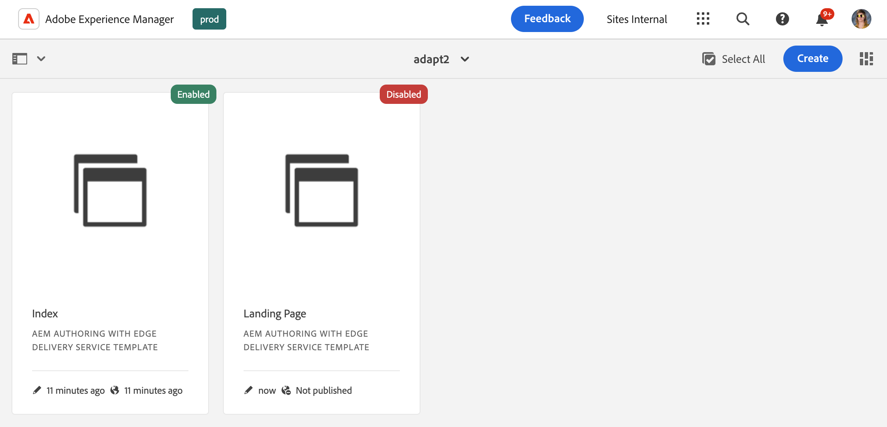

# 템플릿 콘솔 {#templates-console}

템플릿 콘솔이 페이지 템플릿을 보고 관리하는 중앙 위치 역할을 하는 방법에 대해 알아봅니다.

## 개요 {#overview}

페이지를 만들 때 템플릿을 선택해야 합니다. 페이지 템플릿은 새 페이지의 기반으로 사용됩니다. [AEM의 편집 가능한 템플릿](/help/implementing/developing/components/templates.md)은(는) 결과 페이지의 구조, 초기 콘텐츠 및 사용할 수 있는 구성 요소(디자인 속성)를 정의할 수 있습니다.

콘텐츠 작성자는 [사이트 콘솔에서 새 페이지를 만들](/help/sites-cloud/authoring/sites-console/creating-pages.md)때 사용 가능한 템플릿을 선택할 수 있습니다. 템플릿을 사용하여 다음과 같이 편집할 수 있는 페이지를 만들 수 있습니다.

* [페이지 편집기](/help/sites-cloud/authoring/page-editor/templates.md) 또는
* [범용 편집기](/help/sites-cloud/authoring/universal-editor/templates.md)

관리자는 템플릿 콘솔을 사용하여 모든 페이지 템플릿을 중앙 위치에서 보고 관리할 수 있습니다.

## 템플릿 콘솔 액세스 {#accessing}

1. AEM as a Cloud Service에 로그인.
1. 전역 탐색을 열고 **도구** 패널을 선택한 다음 **일반** -> **템플릿**&#x200B;을 선택합니다.

## 방향 {#orientation}

템플릿 콘솔은 구성에 대해 편집 가능한 템플릿이 활성화된 [구성](/help/implementing/developing/introduction/configurations.md)당 하나의 폴더가 있는 폴더로 구성됩니다.

[콘솔의 기본 보기](/help/sites-cloud/authoring/quick-start.md)는 카드 보기입니다. 콘텐츠를 살펴보려면 폴더를 탭하거나 클릭합니다.

템플릿을 선택하여 도구 모음에서 사용할 수 있는 옵션을 표시합니다.

* [편집](#edit-edit)
* [속성](#properties)
* [비활성화/활성화](#enable-disable)
* [게시](#publish)
* [복사](#copy)
* [삭제](#delete)

## 편집 {#edit}

템플릿을 편집하면 템플릿을 만드는 데 사용한 편집기가 열립니다. 다음 중 하나를 선택합니다.

* [템플릿 편집기](/help/sites-cloud/authoring/page-editor/templates.md)
* [범용 편집기](/help/sites-cloud/authoring/universal-editor/templates.md)

어느 편집기든 사용하여 템플릿에 필요한 사항을 변경할 수 있습니다. 사용 중인 템플릿을 편집하면 작성자에게 영향을 줄 수 있습니다.

* 템플릿 편집기로 만든 템플릿의 경우 변경 사항은 선택한 템플릿을 기반으로 하는 라이브 페이지에 영향을 줄 수 있습니다.
* 범용 편집기로 만든 템플릿의 경우 변경 사항은 작성자가 선택한 템플릿을 기반으로 만든 새 페이지에만 영향을 줍니다.

작성자가 이미 활성화된 템플릿 편집기로 만든 템플릿을 시작할 경우 경고가 표시됩니다.

>[!TIP]
>
>콘솔에서 템플릿을 선택했으면 핫키 `e`을(를) 사용하여 선택한 템플릿을 편집하십시오.

## 속성 {#properties}

[페이지 속성을 편집](/help/sites-cloud/authoring/sites-console/page-properties.md)할 수 있는 것과 같은 방법으로 [템플릿의 속성](/help/sites-cloud/authoring/page-editor/templates.md)을 편집할 수 있습니다.템플릿 속성은 다음과 같습니다.

* 템플릿 제목
* 설명
* 이미지

>[!TIP]
>
>콘솔에서 템플릿을 선택했으면 핫키 `p`을(를) 사용하여 선택한 템플릿의 속성을 엽니다.

## 활성화 및 비활성화 {#enable-disable}

템플릿에는 다음 세 가지 상태 중 하나가 있을 수 있습니다.

* **초안** - 템플릿이 아직 생성 중이므로 새 페이지를 만드는 데 사용할 수 없습니다.
* **사용** - 템플릿이 완료되었으며 새 페이지를 만드는 데 사용할 수 있습니다.
* **사용 안 함** - 템플릿이 완료되었으나 새 페이지를 만드는 데 사용할 수 없습니다.

템플릿이 만들어지면 기본적으로 **초안** 상태([템플릿 편집기](/help/sites-cloud/authoring/page-editor/templates.md)(으)로 만든 템플릿의 경우) 또는 **활성화됨** 상태([유니버설 편집기](/help/sites-cloud/authoring/universal-editor/templates.md)(으)로 만든 템플릿의 경우)입니다.

콘텐츠 작성자가 템플릿을 사용하여 페이지를 만들려면 먼저 템플릿을 활성화해야 합니다. 템플릿이 더 이상 필요하지 않은 경우 비활성화하여 더 이상 페이지 생성 마법사에 표시되지 않도록 할 수 있습니다.

* 템플릿을 선택하고 **사용 안 함**&#x200B;을 클릭하거나 탭하여 템플릿을 사용하지 않도록 설정합니다.
* 템플릿을 선택하고 **사용**&#x200B;을 클릭하거나 탭하여 템플릿을 사용하도록 설정합니다.

## 게시 {#publish}

템플릿 편집기로 만든 템플릿은 게시된 후에만 사용할 수 있습니다. 템플릿을 선택하고 **Publish**&#x200B;을(를) 클릭하거나 탭하여 게시하십시오.

범용 편집기로 만든 템플릿을 사용하려면 게시할 필요가 없습니다.

## 복사 중 {#copy}

구조가 비슷한 페이지가 많으면 **복사** 단추를 사용하여 템플릿의 범위를 만든 다음 필요에 따라 복사본을 변경할 수 있습니다. 이 기능은 다른 사이트에서 템플릿을 사용하려는 경우에도 유용합니다.

1. 템플릿을 선택한 다음 **복사**&#x200B;를 탭하거나 클릭하여 복사본을 만듭니다.
1. 복사본을 만들 위치로 이동합니다.
1. 도구 모음에서 **붙여넣기**&#x200B;를 탭하거나 클릭합니다.

붙여넣기가 완료되면 다음 작업을 수행할 수 있습니다.

* 필요에 따라 템플릿을 조정하려면 [템플릿을 편집](#edit)하십시오.
* [속성 창을 사용하여](#properties) 템플릿 제목을 업데이트합니다.
* [템플릿을 사용하도록 설정](#enable-disable)하여 페이지를 만드는 데 사용할 수 있습니다.
* 필요한 경우 [템플릿을 Publish](#publish)합니다.

>[!TIP]
>
>콘솔에서 템플릿을 선택했으면 핫키 `Command+c` 또는 `ctrl+c`을(를) 사용하여 선택한 템플릿을 복사합니다.

## 삭제 중 {#delete}

템플릿이 더 이상 필요하지 않은 경우 페이지에서 참조하지 않으면 삭제할 수 있습니다.

템플릿을 선택한 다음 **삭제**&#x200B;를 탭하거나 클릭하여 삭제합니다.

>[!TIP]
>
>콘솔에서 템플릿을 선택했으면 핫키 `Backspace`을(를) 사용하여 선택한 템플릿을 삭제합니다.

## 템플릿 만들기 {#create}

콘솔의 **만들기** 단추를 사용하여 현재 위치에 새 템플릿을 만듭니다. 템플릿 만들기에 대한 자세한 내용은 문서 [페이지 편집기로 편집할 수 있는 페이지 만들기에 대한 템플릿](/help/sites-cloud/authoring/page-editor/templates.md)을 참조하십시오.

**만들기** 단추는 페이지 편집기로 편집할 수 있는 템플릿을 만드는 데만 사용됩니다. 유니버설 편집기로 만든 페이지를 기반으로 템플릿을 만드는 방법에 대한 자세한 내용은 문서 [유니버설 편집기로 편집할 수 있는 페이지를 만드는 템플릿](/help/sites-cloud/authoring/universal-editor/templates.md)을 참조하십시오.
