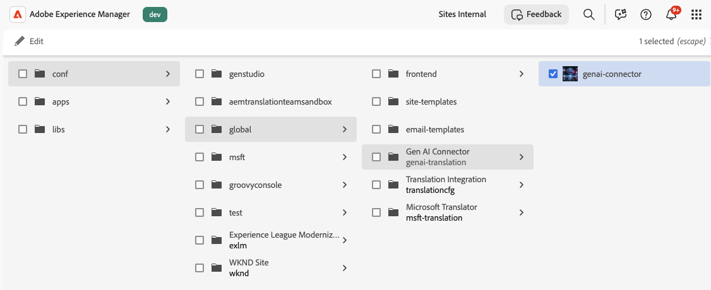
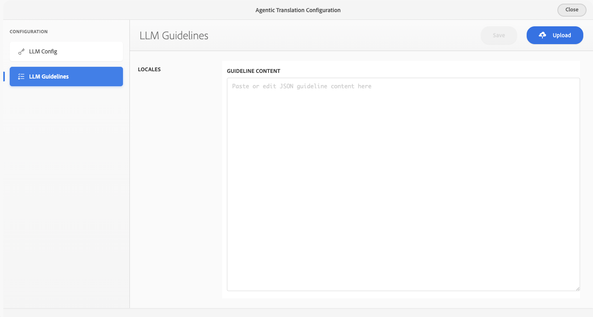

# AI 번역 통합 구성 {#ai-translation-integration}

AI 번역 통합을 통해 Adobe Experience Manager에서 작성하는 콘텐츠의 번역 서비스로 **LLM(Large Language Model)**&#x200B;을 사용할 수 있습니다. AEM을 LLM 공급자에 연결하고(Microsoft Azure OpenAI부터), 다른 커넥터와 동일한 [번역 워크플로](/help/sites-cloud/administering/translation/overview.md)를 재사용하고, 선택적으로 **번역 스타일 안내서**&#x200B;를 업로드하면 AEM에서 로케일 간에 톤, 용어 및 브랜드 언어를 일관되게 유지하는 규칙을 생성할 수 있습니다.

번역 프로젝트, 클라우드 구성 및 번역 통합 프레임워크에 대한 배경은 [다국어 사이트를 위한 콘텐츠 번역](overview.md) 및 [번역 통합 프레임워크 구성](integration-framework.md)을 참조하십시오.

## AI 번역이 AEM에 적합한 방법 {#how-ai-translation-fits-in-aem}

큰 언어 모델은 리터럴 단어 대 단어 대체가 아닌 컨텍스트, 색조 및 관용어에 주의하면서 전체 구절을 번역할 수 있습니다. AI 번역 통합을 구성할 때 LLM은 AEM을 통해 연결하는 다른 공급자와 동일한 방식으로 **타사 번역 서비스** 역할을 합니다. LLM 서비스에 **자신의 라이선스 및 자격 증명**&#x200B;을(를) 제공합니다.

초기 지원은 AEM을 **Azure OpenAI**&#x200B;에 연결합니다. Adobe은 이후 릴리스에서 추가 공급자에 대한 지원을 추가할 계획입니다.

다른 번역 구성과 함께 **번역 클라우드 서비스**&#x200B;에서 LLM 연결 및 선택적 스타일 가이드를 모두 구성합니다. 서로 다른 [클라우드 구성](/help/sites-cloud/administering/translation/integration-framework.md#creating-a-translation-integration-configuration)에 대해 서로 다른 번역 서비스를 사용할 수 있습니다. 예를 들어, 한 구성은 AI 번역을 사용하고 다른 구성은 기존 기계 번역 커넥터를 사용합니다.

## 번역 클라우드 서비스 구성 {#configure-translation-cloud-services}

다른 번역 클라우드 구성을 관리하는 동일한 영역에서 AI 번역을 설정하십시오.

1. [전역 탐색 메뉴](/help/sites-cloud/authoring/basic-handling.md#global-navigation)에서 **도구** > **클라우드 서비스** > **번역 클라우드 서비스**&#x200B;를 선택합니다.
1. AI 번역을 활성화할 구성을 열거나 만듭니다(기능이 광범위하게 적용되는 경우 `/conf/global` 포함).

## LLM 연결 구성 {#configure-the-llm-connection}

**에이전트 번역 구성** 경험에는 공급자를 연결하는 **LLM 구성** 섹션이 포함됩니다.

1. 번역 클라우드 서비스 항목에 대한 AI 번역 구성을 엽니다.
1. **[!UICONTROL LLM 구성]**&#x200B;을 선택합니다.
1. 공급자를 선택하십시오(예: **Azure OpenAI**).
1. 구독에 필요한 자격 증명 및 끝점 세부 정보(**API 키**, **API 버전**, **기본 경로**, **배포 이름** 및 공급자에 필요한 기타 필드)를 입력하십시오.
1. 구성을 저장합니다.

## 번역 스타일 가이드 및 생성된 규칙 추가 {#add-translation-style-guides-and-generated-rules}

**번역 스타일 안내서**&#x200B;개 문서를 업로드할 수 있습니다(일반적으로 대상 언어당 한 개). AEM은 각 안내서를 분석하고 **번역 규칙**&#x200B;을 생성하여 브랜드 및 언어 기대치에 맞게 출력을 조정합니다.

1. **에이전트 번역 구성**&#x200B;에서 **[!UICONTROL LLM 지침]**&#x200B;을 선택합니다.
1. 로케일을 선택하고 **[!UICONTROL 업로드]**&#x200B;를 사용하여 해당 언어의 스타일 안내 문서를 추가하십시오.
1. AEM에서 가이드를 처리하는 동안 상태 표시기에 진행률(**처리**, **완료** 또는 **중단됨**)이 표시됩니다.
1. 편집기에서 생성된 규칙(예: 톤, 용어 및 예를 캡처하는 JSON)을 검토하거나 편집합니다.

## 프레임워크에서 기본 변환 방법 설정 {#set-the-default-translation-method-in-the-framework}

클라우드 구성이 저장되면 번역 프로젝트를 만들 때 [번역 통합 프레임워크](integration-framework.md) 구성에서 **에이전트 번역**&#x200B;을(를) 기본 동작으로 등록합니다. 필요한 경우 프로젝트별 메서드를 변경할 수 있습니다.

## 번역 프로젝트 실행 {#run-translation-projects}

AI 번역이 구성되어 페이지와 연결되면 다른 번역 공급업체와 동일한 방식으로 [번역 프로젝트를 만들고 실행](managing-projects.md)할 수 있습니다. 페이지, 콘텐츠 조각 및 에셋의 콘텐츠는 번역 규칙 및 프레임워크 설정을 따릅니다.

>[!NOTE]
>
>AI 번역 통합은 Adobe Experience Manager의 [AI Assistant](/help/implementing/cloud-manager/ai-assistant-in-aem.md) 채팅 UI 또는 Experience Production Agent 인터페이스에서 **사용할 수 없습니다**. 이 문서에 설명된 번역 워크플로 및 콘솔을 사용합니다.

