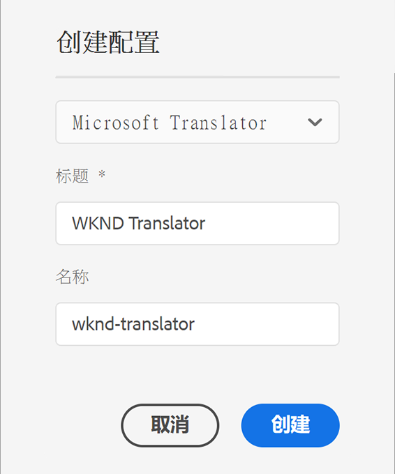

# Microsoft Translator에 연결 {#connecting-to-microsoft-translator}

[Microsoft Translator](https://www.microsoft.com/en-us/translator/business/) 클라우드 서비스에 대한 구성을 만들어 Microsoft Translation 계정을 사용하여 AEM 페이지 콘텐츠 또는 에셋을 번역할 수 있습니다.

>[!TIP]
>
>콘텐츠 번역이 처음이라면 AEM의 강력한 번역 도구를 사용한 AEM Sites 콘텐츠 번역을 안내하며 AEM이 없거나 번역 경험이 없는 사용자에게 최적화된 [사이트 번역 여정](/help/journey-sites/translation/overview.md)을 참조하십시오.

>[!NOTE]
>
>AEM은 월간 최대 2,000,000자를 무료로 번역할 수 있는 체험판 Microsoft Translation 계정을 제공합니다. 프로덕션 시스템에 적합한 계정 구독을 얻으려면 [Microsoft Translator 체험판 라이선스 구성 업그레이드](#upgrading-the-microsoft-translator-trial-license-configuration)를 참조하십시오.

| 속성 | 설명 |
|---|---|
| 번역 레이블 | 번역 서비스의 표시 이름 |
| 번역 속성 | (선택 사항) 사용자 생성 콘텐츠의 경우, 번역된 텍스트 옆에 표시되는 속성 (예: `Translations by Microsoft`) |
| 작업 영역 ID | (선택 사항) 사용할 맞춤화된 Microsoft Translator 엔진의 ID |
| 구독 키 | Microsoft Translator에 대한 Microsoft 구독 키 |

구성을 만든 다음에는 [생성된 구성을 활성화](#activating-the-translator-service-configurations)해야 합니다.

다음 절차를 통해 Microsoft Translator 구성이 생성됩니다.

1. [탐색 패널](/help/sites-cloud/authoring/getting-started/basic-handling.md#first-steps)에서 **도구** -> **클라우드 서비스** -> **번역 클라우드 서비스**&#x200B;를 클릭하거나 탭합니다.
1. 구성을 만들고자 하는 위치로 이동합니다. 일반적으로 이는 사이트 루트에 있거나 전역 기본 구성일 수 있습니다.
1. **만들기** 버튼을 클릭하거나 탭합니다.
1. 구성을 정의합니다.
   1. 드롭다운 목록에서 **Microsoft Translator**&#x200B;를 선택합니다.
   1. 구성의 제목을 입력합니다. 제목을 통해 클라우드 서비스 콘솔과 페이지 속성 드롭다운 목록에서 구성을 식별합니다.
   1. 필요한 경우 구성을 저장하는 저장소 노드에 사용할 이름을 입력합니다.

   

1. **만들기**&#x200B;를 클릭합니다.
1. **구성 편집** 창에서 이전 표에서 설명된 번역 서비스에 대한 값을 입력합니다.

   

1. **연결**&#x200B;을 탭하거나 클릭하여 연결을 확인합니다.
1. **저장 및 닫기**&#x200B;를 탭하거나 클릭합니다.

## Microsoft Translator 체험판 라이선스 구성 업그레이드 {#upgrading-the-microsoft-translator-trial-license-configuration}

Microsoft Translation 구성 페이지는 프로덕션 시스템에 적합한 계정 구독을 얻기 위한 Microsoft 웹 사이트로 간편하게 이동할 수 있는 링크를 제공합니다.

1. [탐색 패널](/help/sites-cloud/authoring/getting-started/basic-handling.md#first-steps)에서 **도구** -> **클라우드 서비스** -> **번역 클라우드 서비스**&#x200B;를 탭하거나 클릭합니다.
1. 기존 Microsoft Translator 구성을 탭하거나 클릭합니다.
1. **편집**&#x200B;을 탭하거나 클릭합니다.
1. **구성 편집** 창에서 **구독 업그레이드**&#x200B;를 탭하거나 클릭합니다. 서비스에 대한 세부 정보가 포함된 Microsoft 웹 페이지가 열립니다.

## Microsoft Translator 엔진 맞춤화 {#customizing-your-microsoft-translator-engine}

Microsoft Translation 구성 페이지는 Microsoft Translator 엔진을 맞춤화하기 위한 Microsoft 웹 사이트로 간편하게 이동할 수 있는 링크를 제공합니다.

1. [탐색 패널](/help/sites-cloud/authoring/getting-started/basic-handling.md#first-steps)에서 **도구** -> **클라우드 서비스** -> **번역 클라우드 서비스**&#x200B;를 탭하거나 클릭합니다.
1. 기존 Microsoft Translator 구성을 탭하거나 클릭합니다.
1. **편집**&#x200B;을 탭하거나 클릭합니다.
1. **구성 편집** 창에서 **Translator 맞춤화**&#x200B;를 탭하거나 클릭합니다. 화면에 표시되는 Microsoft 웹 페이지를 사용하여 서비스를 맞춤화합니다.

## Translator 서비스 구성 활성화 {#activating-the-translator-service-configurations}

게시 인스턴스에 복제되는 번역된 콘텐츠를 지원하려면 클라우드 서비스 구성을 활성화해야 합니다. [트리 게시](/help/sites-cloud/authoring/fundamentals/publishing-pages.md#publishing-and-unpublishing-a-tree) 방법을 사용하여 Microsoft Translator 구성을 저장하는 저장소 노드를 활성화하십시오. 해당 노드는 다음과 같은 상위 노드 아래에 위치합니다.

* `/libs/settings/cloudconfigs/translation/msft-translation`
