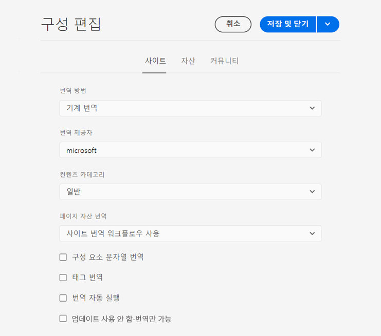
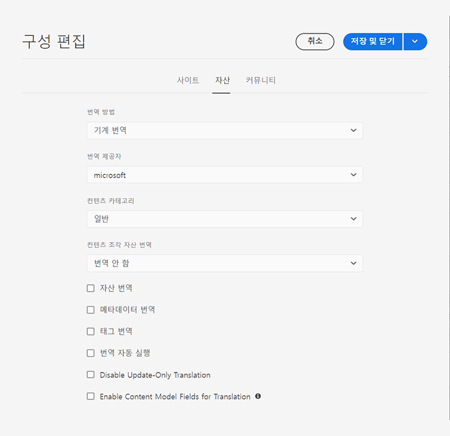

# 번역 통합 프레임워크 구성 {#configuring-the-translation-integration-framework}

번역 통합 프레임워크를 서드파티 번역 서비스와 통합하여 AEM 콘텐츠 번역을 조정합니다. 여기에는 세 가지 기본 단계가 포함됩니다.

1. [번역 서비스 공급업체에 연결합니다.](#connecting-to-a-translation-service-provider)
1. [번역 통합 프레임워크 구성을 만듭니다.](#creating-a-translation-integration-configuration)
1. [클라우드 구성을 페이지에 연결합니다.](#configuring-pages-for-translation)

AEM 콘텐츠 번역 기능의 개요를 확인하려면 [다국어 사이트를 위한 콘텐츠 번역](overview.md)을 살펴보십시오.

>[!TIP]
>
>콘텐츠 번역이 처음인 경우, AEM의 강력한 번역 도구를 사용한 AEM Sites 콘텐츠 번역을 안내하며 AEM이 없거나 번역 경험이 없는 사용자에게 최적화된 [Sites 번역 여정](/help/journey-sites/translation/overview.md)을 참조하십시오.

## 번역 서비스 공급업체에 연결 {#connecting-to-a-translation-service-provider}

AEM을 번역 서비스 공급업체에 연결하는 클라우드 구성을 만듭니다. AEM에는 기본적으로 [Microsoft Translator에 연결](connect-ms-translator.md)할 수 있는 기능이 포함되어 있습니다.

다음의 번역 공급업체는 번역 프로젝트를 위해 AEM API의 구현을 제공합니다.

* [Microsoft Translator](connect-ms-translator.md)
* [Translations.com](https://exchange.adobe.com/experiencecloud.details.90104.globallink-connect-plus-for-aem.html) (Adobe Exchange 프리미어 파트너)
* [Clay Tablet Technologies](https://exchange.adobe.com/experiencecloud.details.90064.clay-tablet-translation-for-experience-manager.html)
* [Lionbridge](https://exchange.adobe.com/experiencecloud.details.100064.lionbridge-connector-for-experience-manager-63.html)
* [Memsource](https://exchange.adobe.com/experiencecloud.details.103166.memsource-connector-for-adobe-experience-manager.html)
* [Cloudwords](https://exchange.adobe.com/experiencecloud.details.90019.html)
* [XTM Cloud](https://exchange.adobe.com/experiencecloud.details.105037.xtm-connect-for-adobe-experience-manager.html)
* [Lingotek](https://exchange.adobe.com/experiencecloud.details.90088.lingotek-collaborative-translation-platform.html)
* [RWS](https://partners.adobe.com/exchangeprogram/experiencecloud/exchange.details.108277.html)
* [Smartling](https://www.smartling.com/software/integrations/adobe-experience-manager/)
* [Systran](https://exchange.adobe.com/experiencecloud.details.90233.systran-for-adobe-experience-manager.html)

커넥터 패키지를 설치하면 커넥터에 대한 클라우드 구성을 만들 수 있습니다. 일반적으로 번역 서비스로 인증하기 위해 자격 증명을 제공해야 합니다. Microsoft Translator 커넥터 클라우드 구성에 대한 자세한 내용은 [Microsoft Translator와 통합](connect-ms-translator.md)을 참조합시오.

필요한 경우 같은 커넥터에 여러 클라우드 구성을 만들 수 있습니다. 예를 들어 같은 공급업체와 진행한 계정 또는 프로젝트에 대해 하나의 구성을 만듭니다.

연결을 구성하면 이를 사용하는 번역 통합 프레임워크를 만들 수 있습니다.

## 번역 통합 구성 만들기 {#creating-a-translation-integration-configuration}

번역 통합 프레임워크 구성을 만들어 콘텐츠 번역 방법을 지정합니다. 구성에는 다음 정보가 포함됩니다.

* 사용할 번역 서비스 공급업체
* 인간 번역이 수행되는지 또는 기계 번역이 수행되는지 여부
* 태그 등 페이지 또는 자산과 연결된 다른 콘텐츠 번역 여부

프레임워크 구성을 만든 후 구성에 따라 번역하고자 하는 페이지와 클라우드 구성을 연결합니다. 번역 프로세스가 시작되면 연결된 프레임워크 구성에 따라 번역 워크플로가 진행됩니다.

웹 사이트의 각 부분에 서로 다른 번역 요건이 있는 경우 그에 따라 여러 프레임워크 구성을 만듭니다. 예를 들어 다국어 웹 사이트에는 영어, 스페인어, 일본어 사본이 포함될 수 있습니다. 사이트 소유자는 스페인어와 일본어 번역에 다른 번역 서비스 공급업체를 사용합니다. 따라서 프레임워크의 구성 두 개를 진행합니다. 각 구성은 다른 번역 서비스 공급업체를 사용합니다.

번역 통합 프레임워크를 구성하고 나면 이를 사용하는 [페이지와 연결](preparation.md)할 수 있습니다.

>[!TIP]
>
>AEM 콘텐츠 번역 기능의 개요를 확인하려면 [다국어 사이트를 위한 콘텐츠 번역](overview.md)을 살펴보십시오.

프레임워크 단일 구성은 페이지 콘텐츠와 자산을 어떻게 번역할지 제어합니다. 새 번역 구성을 만들려면:

1. [글로벌 내비게이션 메뉴](/help/sites-cloud/authoring/getting-started/basic-handling.md#global-navigation)에서 **도구 -> Cloud Services -&amp; 번역 Cloud Services**&#x200B;를 클릭하거나 탭합니다.
1. 콘텐츠 구조에서 구성을 만들고자 하는 위치로 이동합니다. 보통 특정 사이트를 토대로 하거나 전역일 수 있습니다.
1. 필드에 다음 정보를 입력한 다음 **만들기**&#x200B;를 클릭하거나 탭합니다.
   1. 드롭다운 메뉴에서 **구성 유형**&#x200B;을 선택합니다.
   1. 구성의 **제목**&#x200B;을 입력합니다. **제목**&#x200B;을 통해 **클라우드 서비스** 콘솔 및 페이지 속성 드롭다운 목록에서 구성을 식별합니다.
   1. 필요한 경우 구성을 저장하는 저장소 노드에 사용할 **이름**&#x200B;을 입력합니다.
1. **구성 편집** 창에서 **사이트**&#x200B;와 **자산** 탭의 속성을 구성한 후 **저장 및 닫기**&#x200B;를 클릭하거나 탭합니다.

### 사이트 구성 속성 {#sites-configuration-properties}

**사이트** 탭은 페이지 콘텐츠의 번역을 어떻게 수행할지 제어합니다.

| 속성 | 설명 |
|---|---|
| 번역 방법 | 이 속성은 프레임워크가 사이트 콘텐츠에 대해 수행하는 번역 방법을 정의합니다.  - 기계 번역: 번역 공급업체가 기계 번역을 사용해 실시간으로 번역을 진행합니다. - 인간 번역: 콘텐츠를 번역사가 번역할 수 있도록 번역 공급업체로 보냅니다. - 번역하지 않음: 콘텐츠를 번역하도록 보내지 않습니다. 번역하지는 않지만 최신 콘텐츠로 업데이트할 수 있는 특정 콘텐츠 분기를 건너 뜁니다. |
| 번역 공급업체 | 이 속성은 번역을 수행할 번역 공급업체를 정의합니다. 해당 커넥터를 설치하면 목록에 공급업체가 표시됩니다. |
| 콘텐츠 범주 | (기계 번역 전용) 이 속성은 번역하는 콘텐츠를 설명하는 범주입니다. 범주는 콘텐츠를 번역할 때 용어 및 구문 선택에 영향을 미칠 수 있습니다. |
| 태그 번역 | 이 옵션을 사용하면 페이지와 연결된 태그를 번역할 수 있습니다. |
| 페이지 자산 번역 | 이 속성은 파일의 구성 요소에 추가되거나 자산에서 참조된 자산의 번역 방법을 정의합니다. - 번역하지 않음: 페이지 자산을 번역하지 않습니다. - 사이트 번역 워크플로 사용: 자산이 **사이트** 탭의 구성 속성에 따라 처리됩니다. - 자산 번역 워크플로 사용: 자산이 **자산** 탭에 구성된 속성에 따라 처리됩니다. |
| 자동 실행 번역 | 이 속성을 활성화하면 번역 프로젝트가 생성된 후 자동으로 번역 작업을 수행할 수 있습니다. 이 옵션을 선택하면 번역 작업을 검토하고 살필 수 없습니다. |
| 업데이트 전용 번역 사용 중지 | 이 옵션을 선택하면 번역 작업 업데이트로 최종 번역 이후 변경된 필드 외에 번역할 수 있는 모든 필드를 번역하도록 제출합니다. |

### 자산 구성 속성 {#assets-configuration-properties}

자산 속성은 자산 구성 방법을 제어합니다. 자산 번역에 대한 자세한 내용은 [자산용 언어 사본 만들기](/help/assets/translate-assets.md)를 참조하십시오.

| 속성 | 설명 |
|---|---|
| 번역 방법 | 이 속성은 프레임워크가 자산에 대해 수행하는 번역 유형을 선택합니다.  - 기계 번역: 번역 공급업체가 기계 번역을 사용해 즉시 번역을 진행합니다. - 인간 번역: 콘텐츠를 사람이 직접 번역할 수 있도록 자동으로 번역 공급업체에 보냅니다. - 번역하지 않음: 자산을 번역하도록 보내지 않습니다. |
| 번역 공급업체 | 이 속성은 번역을 수행할 번역 공급업체를 정의합니다. 해당 커넥터를 설치하면 목록에 공급업체가 표시됩니다. |
| 콘텐츠 범주 | (기계 번역 전용) 이 속성은 번역하는 콘텐츠를 설명합니다. 범주는 콘텐츠를 번역할 때 용어 및 구문 선택에 영향을 미칠 수 있습니다. |
| 자산 번역 | 이 속성을 활성화하면 번역 프로젝트에 자산을 포함시킬 수 있습니다. |
| 메타데이터 번역 | 이 속성을 활성화하면 자산 메타데이터를 번역할 수 있습니다. |
| 태그 번역 | 이 속성을 활성화하면 자산과 연결된 태그를 번역할 수 있습니다. |
| 자동 실행 번역 | 이 속성을 선택하면 번역 프로젝트가 생성된 후 자동으로 번역 작업을 수행할 수 있습니다. 이 옵션을 선택하면 번역 작업을 검토하거나 살필 수 없습니다. |
| 업데이트 전용 번역 사용 중지 | 이 옵션을 선택하면 번역 작업 업데이트로 최종 번역 이후 변경된 필드 외에 번역할 수 있는 모든 필드를 번역하도록 제출합니다. |
| 번역을 위해 콘텐츠 모델 필드 활성화 | 이 옵션을 활성화하면 필드의 번역 여부를 결정할 때 [콘텐츠 조각 모델](/help/sites-cloud/administering/content-fragments/content-fragments-models.md#properties)의 **번역할 수 있는** 필드를 사용하며 그에 따라 [번역 규칙](rules.md)을 자동으로 생성합니다. 이 옵션을 사용하면 이전에 생성한 모든 번역 규칙이 대체됩니다. |

## 번역을 위한 페이지 구성 {#configuring-pages-for-translation}

소스 페이지의 번역을 다른 언어로 구성하려면 페이지를 다음 클라우드 구성과 연결합니다.

* AEM을 번역 공급업체에 연결하는 클라우드 구성
* 번역의 세부 정보를 구성하는 번역 통합 프레임워크

번역 통합 프레임워크 클라우드 구성이 서비스 공급업체와의 연결에 사용하는 클라우드 구성을 식별한다는 점을 참고하십시오. 소스 페이지를 프레임워크 클라우드 구성과 연결할 때 프레임워크 클라우드 구성이 사용하는 서비스 공급업체 클라우드 구성과 페이지를 연결해야 합니다.

페이지를 클라우드 구성과 연결할 때 페이지의 하위 영역은 연결에 상속됩니다. 예를 들어 `/content/wknd/language-masters/en/magazine` 페이지를 번역 통합 프레임워크와 연결하면 `magazine` 페이지와 페이지 하위에 있는 페이지가 프레임워크에 따라 번역됩니다.

필요에 따라 하위 페이지에 연결을 재정의할 수 있습니다. 웹 사이트의 콘텐츠가 주로 여행과 라이프스타일에 관한 내용인 경우를 예로 들어 보겠습니다. 페이지 중 한 분기가 회사에 대해 설명합니다. 이런 경우 사이트의 루트 페이지를 라이프스타일 범주를 사용해 기계 번역을 지정하는 번역 통합 프레임워크에 연결할 수 있고 회사를 설명하는 해당 분기는 일반적인 범주를 사용해 기계 번역을 수행하는 프레임워크를 사용할 수 있습니다.

### 페이지를 번역 공급업체와 연결 {#associating-a-page-with-a-translation-provider}

페이지와 하위 페이지를 번역하기 위해 이용하는 번역 공급업체에 페이지를 연결합니다.

1. Sites 콘솔에서 페이지를 선택해 구성하고 **속성 보기**&#x200B;를 클릭하거나 탭합니다.
1. **Cloud Services** 탭을 클릭하거나 탭합니다.
1. **구성 추가** 드롭다운 메뉴에서 구성을 선택합니다.
1. **저장 및 닫기**&#x200B;를 클릭하거나 탭합니다.

### 페이지를 번역 통합 프레임워크와 연결 {#associating-pages-with-a-translation-integration-framework}

페이지와 하위 페이지 번역의 수행 방법을 정의하는 번역 통합 프레임워크와 페이지를 연결합니다.

1. Sites 콘솔에서 페이지를 선택해 구성하고 **속성 보기**&#x200B;를 클릭하거나 탭합니다.
1. **Cloud Services** 탭을 클릭하거나 탭합니다.
1. **구성 추가** 드롭다운 메뉴에서 구성을 선택합니다.
1. **저장 및 닫기**&#x200B;를 클릭하거나 탭합니다.
