# 번역 프로젝트 관리 {#managing-translation-projects}

번역 프로젝트를 통해 AEM 콘텐츠의 번역을 관리할 수 있습니다. 번역 프로젝트는 다른 언어로 번역될 리소스를 포함하는 일종의 AEM [프로젝트](/help/sites-cloud/authoring/projects/overview.md)입니다. 이러한 리소스는 언어 마스터로부터 생성되는 [언어 사본](preparation.md)의 페이지 및 자산입니다.

>[!TIP]
>
>콘텐츠 번역이 처음인 경우, AEM의 강력한 번역 도구를 사용한 AEM Sites 콘텐츠 번역을 안내하며 AEM이 없거나 번역 경험이 없는 사용자에게 최적화된 [Sites 번역 여정](/help/journey-sites/translation/overview.md)을 참조하십시오.

리소스가 번역 프로젝트에 추가되면 해당 리소스에 대한 번역 작업이 생성됩니다. 작업은 리소스에서 실행되는 인간 번역 및 기계 번역 워크플로 관리에 사용하는 명령 및 상태 정보를 제공합니다.

번역 프로젝트는 언어 및 번역 방법/공급업체에 의해 세계화를 위한 조직 거버넌스와 일치하도록 정의되는 장기 실행 항목입니다. 초기 번역 도중 또는 수동으로 한 번 시작해야 하며, 한 번 시작하면 콘텐츠 및 번역 업데이트 활동 전반에 걸쳐 계속 유효합니다.

번역 프로젝트 및 작업은 번역 준비 워크플로를 통해 생성됩니다. 이러한 워크플로에는 초기 번역(만들기 및 번역)과 업데이트(번역 업데이트) 모두를 위한 세 가지 옵션이 있습니다.

1. [새 프로젝트 만들기](#creating-translation-projects-using-the-references-panel)
1. [기존 프로젝트에 추가](#adding-pages-to-a-translation-project)
1. [콘텐츠 구조만](#creating-the-structure-of-a-language-copy)

AEM은 번역 작업이 콘텐츠의 초기 작업을 위해 생성되는지 또는 이미 번역된 언어 사본을 업데이트하기 위해 생성되는지 여부를 감지합니다. 페이지에 대한 번역 작업을 생성하고 번역 중인 언어 사본을 표시하면 AEM은 타겟팅된 언어 사본에 소스 페이지가 이미 존재하는지 여부를 감지합니다.

* **언어 사본에 페이지가 포함되지 않음:** AEM은 이러한 상황을 초기 번역으로 취급합니다. 페이지는 즉시 언어 사본에 복사되며 프로젝트에 포함됩니다. 번역된 페이지를 AEM으로 가져오면 AEM은 이를 언어 사본에 바로 복사합니다.
* **언어 사본에 페이지가 이미 포함되어 있음:** AEM은 이러한 상황을 업데이트된 번역으로 취급합니다. 론치가 생성되며, 페이지 사본이 론치에 추가되고 프로젝트에 포함됩니다. 론치를 사용하면 업데이트된 번역을 언어 사본에 전송하기 전에 검토할 수 있습니다.

   * 번역된 페이지를 AEM으로 가져오면 AEM은 이를 론치의 페이지에 덮어씁니다.
   * 번역된 페이지는 론치가 홍보될 때만 언어 사본을 덮어씁니다.

예를 들어 `/content/wknd/fr` 언어 루트는 `/content/wknd/en` 마스터 언어의 프랑스어 번역에 생성됩니다. 프랑스어 사본에는 다른 페이지가 없습니다.

* 번역 프로젝트는 프랑스어 사본을 타겟팅하는 `/content/wknd/en/products` 페이지 및 모든 하위 페이지에 대해 생성됩니다. 언어 사본에 `/content/wknd/fr/products` 페이지가 포함되어 있지 않으므로 AEM은 즉시 `/content/wknd/en/products` 페이지 및 모든 하위 페이지를 프랑스어 사본에 복사합니다. 복사된 항목은 번역 프로젝트에도 포함됩니다.
* 번역 프로젝트는 프랑스어 사본을 타겟팅하는 `/content/wknd/en` 페이지 및 모든 하위 페이지에 대해 생성됩니다. 언어 사본에 `/content/wknd/en` 페이지(언어 루트)에 해당하는 페이지가 포함되어 있으므로 AEM은 `/content/wknd/en` 페이지 및 모든 하위 페이지를 복사한 다음 론치에 추가합니다. 복사된 항목은 번역 프로젝트에도 포함됩니다.

## Sites 콘솔에서 번역 {#performing-initial-translations-and-updating-existing-translations}

Sites 콘솔에서 번역 프로젝트를 바로 만들고 업데이트할 수 있습니다.

### 참조 패널을 사용하여 번역 프로젝트 만들기 {#creating-translation-projects-using-the-references-panel}

번역 프로젝트를 만들어 언어 마스터 리소스를 번역하기 위한 워크플로를 실행하고 관리할 수 있습니다. 프로젝트를 만들 때 번역 중인 언어 마스터에서 페이지와 번역을 수행하고 있는 언어 사본을 지정합니다.

* 선택한 페이지와 연결된 번역 통합 프레임워크의 클라우드 구성은 사용할 번역 워크플로와 같은 번역 프로젝트의 많은 속성을 결정합니다.
* 프로젝트는 선택한 각 언어 사본에 대해 생성됩니다.
* 선택한 페이지의 사본 및 관련 자산이 추가되고 각 프로젝트에 추가됩니다. 이렇게 복사된 항목은 나중에 번역을 위해 번역 공급업체에게 전송됩니다.

선택한 페이지의 하위 페이지도 선택하도록 지정할 수 있습니다. 이 경우 하위 페이지의 사본도 번역할 수 있도록 각 프로젝트에 추가됩니다. 하위 페이지가 다른 번역 통합 프레임워크 구성과 연결되는 경우, AEM은 추가 프로젝트를 생성합니다.

[번역 프로젝트를 수동으로 생성](#creating-a-translation-project-using-the-projects-console)할 수도 있습니다.

>[!NOTE]
>
>프로젝트를 만들려면 귀하의 계정은 `project-administrators` 그룹의 멤버여야 합니다.

### 초기 번역 및 번역 업데이트 {#initial-and-updating}

참조 패널은 사용자가 기존 언어 사본을 업데이트하는 중인지 또는 언어 사본의 첫 번째 버전을 만드는 중인지 여부를 표시합니다. 선택한 페이지에 대한 언어 사본이 존재하면 [언어 사본 업데이트] 탭이 표시되어 프로젝트 관련 명령에 대한 액세스 권한을 제공합니다.

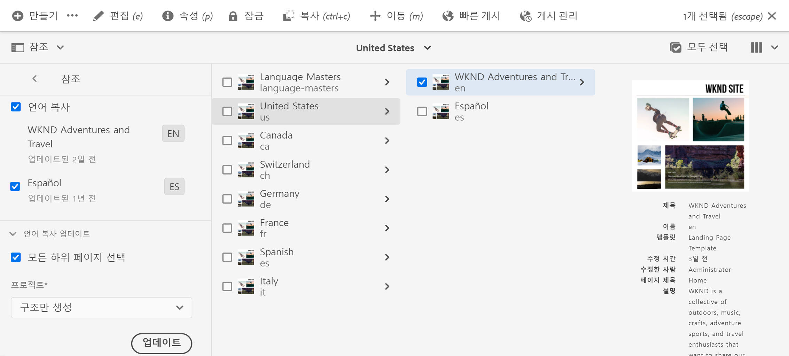

번역 후에는 언어 사본을 번역본으로 덮어쓰기 전에 [번역을 검토](#reviewing-and-promoting-updated-content)할 수 있습니다. 선택한 페이지에 대한 언어 사본이 존재하지 않으면 [만들기 및 번역] 탭이 표시되어 프로젝트 관련 명령에 대한 액세스 권한을 제공합니다.

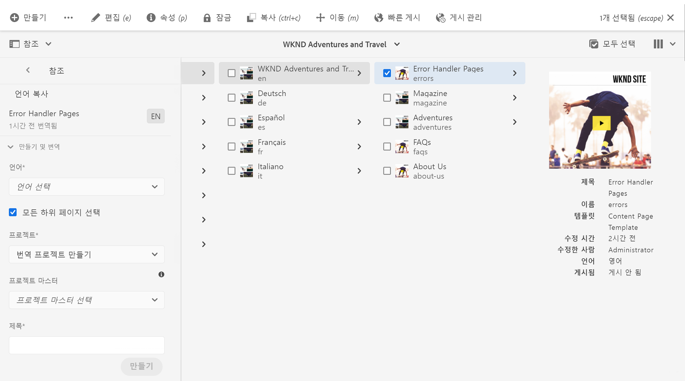

### 새 언어 사본에 대한 번역 프로젝트 만들기 {#create-translation-projects-for-a-new-language-copy}

1. Sites 콘솔을 사용하여 번역 프로젝트에 추가하려는 페이지를 선택합니다.

1. 도구 모음을 사용하여 **참조** 레일을 엽니다.

   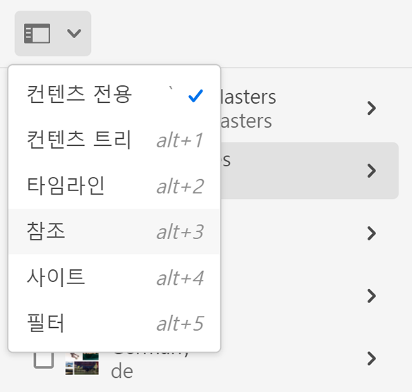

1. **언어 사본**&#x200B;을 선택한 다음 소스 페이지를 번역하고 있는 언어 사본을 선택합니다.
1. 선택 **만들기 및 번역** 번역 작업을 구성합니다.

   * **언어** 드롭다운을 사용하여 번역하려는 언어 사본을 선택합니다. 필요에 따라 추가 언어를 선택합니다. 목록에 표시되는 언어는 [생성한 언어 루트](preparation.md#creating-a-language-root)에 해당합니다.
      * 여러 언어를 선택하면 각 언어에 대해 번역 작업이 포함된 하나의 프로젝트가 생성됩니다.
   * 선택한 페이지 및 모든 하위 페이지를 번역하려면 **모든 하위 페이지 선택**&#x200B;을 선택합니다. 선택한 페이지만 번역하려면 이 옵션의 선택을 취소합니다.
   * **프로젝트**&#x200B;는 **번역 프로젝트 만들기**&#x200B;를 선택하십시오.
   * 필요한 경우 **프로젝트 마스터**&#x200B;는 사용자 역할 및 권한을 상속할 프로젝트를 선택하십시오.
   * **제목**&#x200B;에서 프로젝트의 이름을 입력합니다.

   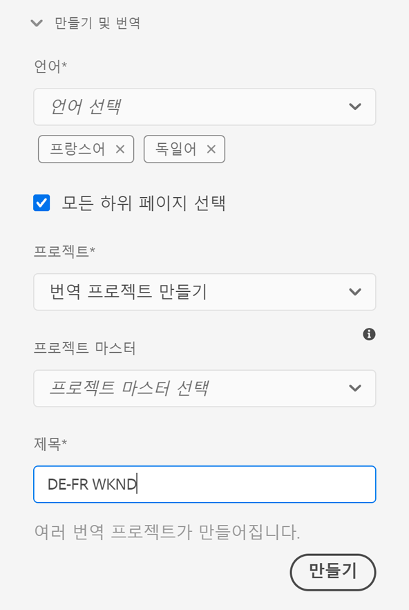

1. **만들기**&#x200B;를 선택합니다.

### 기존 언어 사본에 대한 번역 프로젝트 만들기 {#create-translation-projects-for-an-existing-language-copy}

1. Sites 콘솔을 사용하여 번역 프로젝트에 추가할 페이지를 선택합니다.

1. 도구 모음을 사용하여 **참조** 레일을 엽니다.

   

1. **언어 사본**&#x200B;을 선택한 다음 소스 페이지를 번역하고 있는 언어 사본을 선택합니다.
1. 선택 **언어 사본 업데이트** 번역 작업을 구성합니다.

   * 선택한 페이지 및 모든 하위 페이지를 번역하려면 **모든 하위 페이지 선택**&#x200B;을 선택합니다. 선택한 페이지만 번역하려면 이 옵션의 선택을 취소합니다.
   * **프로젝트**&#x200B;는 **번역 프로젝트 만들기**&#x200B;를 선택하십시오.
   * 필요한 경우 **프로젝트 마스터**&#x200B;는 사용자 역할 및 권한을 상속할 프로젝트를 선택하십시오.
   * **제목**&#x200B;에서 프로젝트의 이름을 입력합니다.

   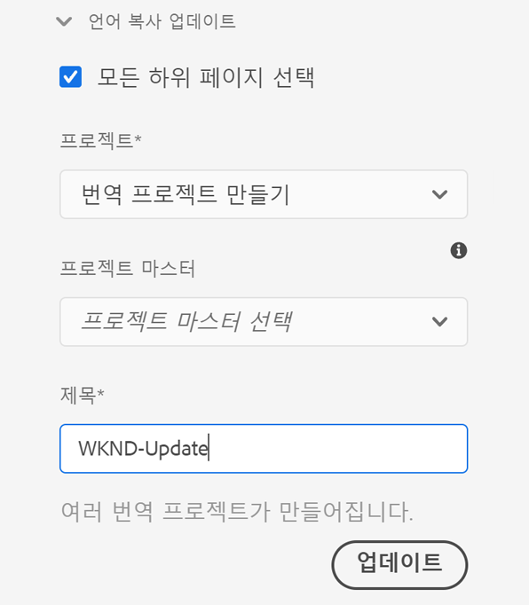

1. **만들기**&#x200B;를 선택합니다.

### 번역 프로젝트에 페이지 추가 {#adding-pages-to-a-translation-project}

번역 프로젝트를 만든 다음에는 **리소스** 레일을 사용하여 프로젝트에 페이지를 추가할 수 있습니다. 페이지 추가는 동일한 프로젝트에 다른 분기의 페이지를 포함할 때 유용합니다.

번역 프로젝트에 페이지를 추가하면 해당 페이지는 새 번역 작업에 포함됩니다. [기존 작업에 페이지를 추가](#adding-pages-assets-to-a-translation-job)할 수도 있습니다.

프로젝트를 만들 때와 마찬가지로 페이지를 추가할 때도 기존 언어 사본을 덮어쓰는 것을 방지하기 위해 페이지 사본이 론치에 추가됩니다. ([기존 언어 사본에 대한 번역 프로젝트 만들기](#performing-initial-translations-and-updating-existing-translations)를 참조하십시오.)

1. Sites 콘솔을 사용하여 번역 프로젝트에 추가할 페이지를 선택합니다.

1. 도구 모음을 사용하여 **참조** 레일을 엽니다.

   

1. **언어 사본**&#x200B;을 선택한 다음 소스 페이지를 번역하고 있는 언어 사본을 선택합니다.

   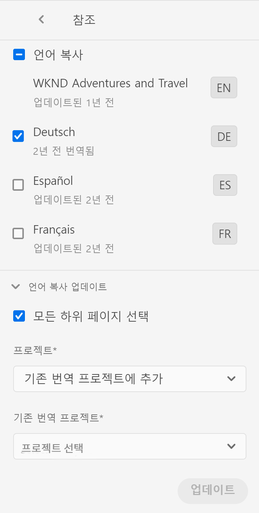

1. 선택 **언어 사본 업데이트** 그런 다음 속성을 구성합니다.

   * 선택한 페이지 및 모든 하위 페이지를 번역하려면 **모든 하위 페이지 선택**&#x200B;을 선택합니다. 선택한 페이지만 번역하려면 이 옵션의 선택을 취소합니다.
   * **프로젝트**&#x200B;는 **기존 번역 프로젝트에 추가**&#x200B;를 선택하십시오.
   * **기존 번역 프로젝트**&#x200B;에서 프로젝트를 선택합니다.

   >[!NOTE]
   >
   >번역 프로젝트의 타겟 언어 세트는 참조 레일에 표시되는 언어 사본의 경로와 일치해야 합니다.

1. 선택 **업데이트**.

### 언어 사본 구조 만들기 {#creating-the-structure-of-a-language-copy}

언어 사본의 구조만 만들 수 있으므로 언어 마스터의 콘텐츠 및 구조적 변경 내용을 (번역되지 않은) 언어 사본에 복사할 수 있습니다. 이는 번역 작업 또는 프로젝트와 무관합니다. 언어 사본 구조를 사용하여 번역 없이도 언어 마스터의 동기화를 유지할 수 있습니다.

번역 중인 마스터 언어의 콘텐츠를 포함하도록 언어 사본을 채웁니다. 언어 사본을 채우기 전에 언어 사본의 [언어 루트](preparation.md#creating-a-language-root)를 만들어야 합니다.

1. Sites 콘솔을 사용하여 소스로 사용하는 마스터 언어의 언어 루트를 선택합니다.
1. 도구 모음에서 **참조**&#x200B;를 클릭하거나 탭하여 참조 레일을 엽니다.

   

1. **언어 사본**&#x200B;을 선택한 다음 채우려는 언어 사본을 선택합니다.

   

1. 선택 **언어 사본 업데이트** 번역 도구를 표시하고 속성을 구성하려면 다음 작업을 수행하십시오.

   * **모든 하위 페이지 선택** 옵션을 선택합니다.
   * **프로젝트**&#x200B;는 **구조만 만들기**&#x200B;를 선택하십시오.

   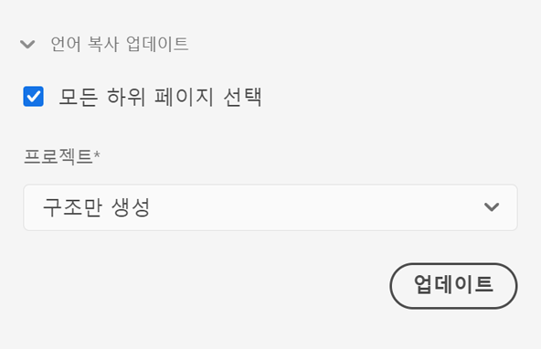

1. 선택 **업데이트**.

### 번역 메모리 업데이트 {#updating-translation-memory}

번역된 콘텐츠의 수동 편집 내용을 번역 관리 시스템(TMS)과 다시 동기화하여 번역 메모리를 트레이닝할 수 있습니다.

1. Sites 콘솔에서 번역된 페이지의 텍스트 콘텐츠를 업데이트한 다음 **번역 메모리 업데이트**&#x200B;를 선택합니다.
1. 편집된 모든 텍스트 구성 요소에 대해 소스와 번역의 병렬 비교가 목록 보기에 표시됩니다. 번역 메모리에 동기화할 번역 업데이트를 선택한 다음 **메모리 업데이트**&#x200B;를 선택합니다.

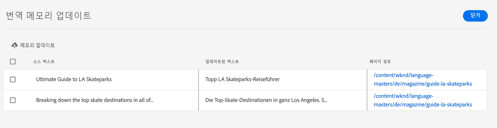

AEM은 구성된 TMS의 번역 메모리에 기존 문자열의 번역을 업데이트합니다.

* 이 작업은 구성된 TMS의 번역 메모리에 기존 문자열의 번역을 업데이트합니다.
* 이는 새로운 번역 작업을 생성하지 않습니다.
* 이는 AEM 번역 API를 통해 TMS로 번역을 다시 전달합니다(아래 참조).

이 기능을 사용하려면 다음 작업을 수행하십시오.

* TMS를 AEM과 사용할 수 있도록 구성해야 합니다.
* 커넥터가 메서드를 구현해야 합니다. [`storeTranslation`](https://developer.adobe.com/experience-manager/reference-materials/cloud-service/javadoc/com/adobe/granite/translation/api/TranslationService.html).
   * 이 방법에 포함되는 코드는 번역 메모리 업데이트 요청에 발생하는 일을 결정합니다.
   * 이 방법의 구현을 통해 AEM 번역 프레임워크는 문자열 값 쌍(원본 번역과 업데이트된 번역)을 TMS로 다시 전달합니다.

독점 번역 메모리를 사용하는 경우 번역 메모리 업데이트가 이전되어 사용자 정의 대상으로 전달될 수 있습니다.

### 페이지 번역 상태 확인 {#check-translation-status}

Sites 콘솔의 목록 보기에서 속성을 선택할 수 있으며, 속성은 페이지가 번역되었는지, 번역 중인지 또는 아직 번역되지 않았는지 보여 줍니다.

1. 사이트 콘솔에서 [목록 보기](/help/sites-cloud/authoring/getting-started/basic-handling.md#viewing-and-selecting-resources)로 전환합니다.
1. 선택, **설정 보기** 보기 드롭다운에서 을 클릭합니다.
1. 대화 상자에서 **번역됨** 속성 및 선택 **업데이트**.

이제 Sites 콘솔에는 나열된 페이지의 번역 상태를 표시하는 **번역됨** 열이 표시됩니다.

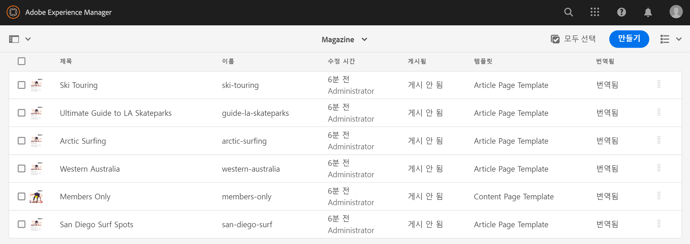

## 프로젝트 콘솔에서 번역 프로젝트 관리

프로젝트 콘솔에서 많은 번역 작업 및 고급 옵션에 액세스할 수 있습니다.

### 프로젝트 콘솔 이해

AEM의 번역 프로젝트는 표준 [AEM 프로젝트 콘솔을 사용합니다](/help/sites-cloud/authoring/projects/overview.md). AEM 프로젝트에 익숙하지 않은 경우, 이 설명서를 검토하십시오.

다른 프로젝트와 마찬가지로 번역 프로젝트는 프로젝트 작업의 개요를 보여 주는 타일로 구성됩니다.

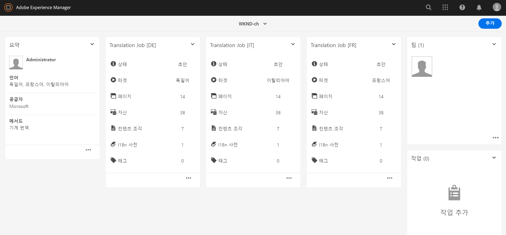

* **요약** - 프로젝트 개요
* **작업** - 하나 이상의 번역 작업
* **팀** - 번역 프로젝트에 대해 공동 작업 중인 사용자
* **작업** - 번역 작업의 일환으로 완료해야 하는 항목

타일 상/하단의 명령 버튼 및 생략 부호 버튼을 각각 사용하여 다양한 타일에 대한 컨트롤 및 옵션에 액세스하십시오.

### 프로젝트 콘솔을 사용하여 번역 프로젝트 만들기 {#creating-a-translation-project-using-the-projects-console}

Sites 콘솔이 아닌 프로젝트 콘솔을 사용하고자 하는 경우 번역 프로젝트를 수동으로 만들 수 있습니다.

>[!NOTE]
>
>프로젝트를 만들려면 귀하의 계정은 `project-administrators` 그룹의 멤버여야 합니다.

번역 프로젝트를 수동으로 만들 때, [기본 속성](/help/sites-cloud/authoring/projects/managing.md#creating-a-project) 이외에도 다음 번역 관련 속성에 대한 값을 제공해야 합니다.

* **이름:** 프로젝트 이름
* **소스 언어:** 소스 콘텐츠의 언어
* **타겟 언어:** 콘텐츠를 번역할 언어
   * 여러 언어를 선택하면 프로젝트 내의 각 언어에 대한 작업이 생성됩니다.
* **번역 방법:** 번역을 수동으로 수행함을 나타내려면 **인간 번역**&#x200B;을 선택합니다.

1. 프로젝트 콘솔의 도구 모음에서 를 선택합니다. **만들기**.
1. 다음 항목 선택 **번역 프로젝트** 템플릿을 선택한 다음 선택 **다음**.
1. **기본** 속성 탭에 대한 값을 입력합니다.
1. 선택 **고급** 번역 관련 속성에 대한 값을 제공합니다.
1. **만들기**&#x200B;를 선택합니다. 확인란에서 을 선택합니다. **완료** 프로젝트 콘솔로 돌아가거나 **프로젝트 열기** 을 클릭하여 프로젝트를 열고 관리를 시작합니다.

### 번역 작업에 페이지 및 자산 추가 {#adding-pages-assets-to-a-translation-job}

번역 프로젝트의 번역 작업에 페이지, 자산 또는 태그를 추가할 수 있습니다. 페이지 또는 자산을 추가하려면 다음 작업을 수행하십시오.

1. 번역 프로젝트의 번역 작업 타일 하단에서 생략 부호를 선택합니다.

   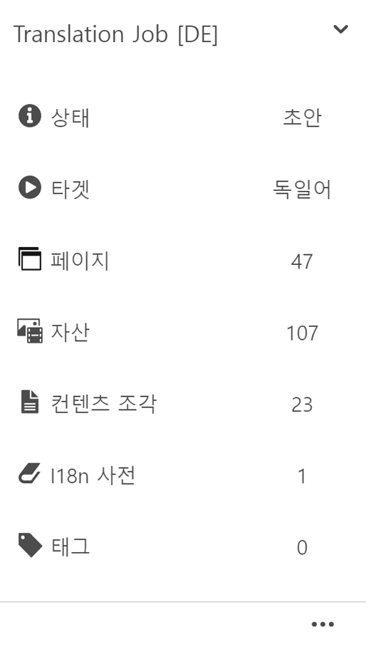

1. 다음 창에서 다음을 선택합니다. **추가** 도구 모음에서 버튼을 클릭한 다음 **에셋/페이지**.

   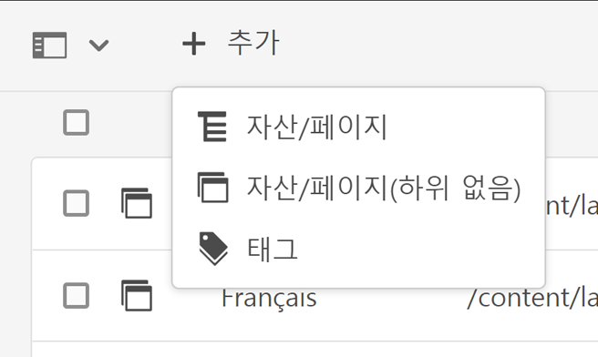

1. 모달 창에서 추가할 분기의 최상위 항목을 선택한 다음 확인 표시 아이콘을 선택합니다. 이 창에서는 다중 선택 기능이 활성화되어 있습니다.

   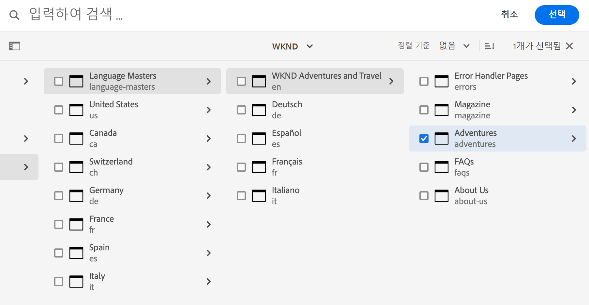

1. 또는 검색 아이콘을 선택하여 번역 작업에 추가하려는 페이지 또는 자산을 손쉽게 찾을 수 있습니다.

   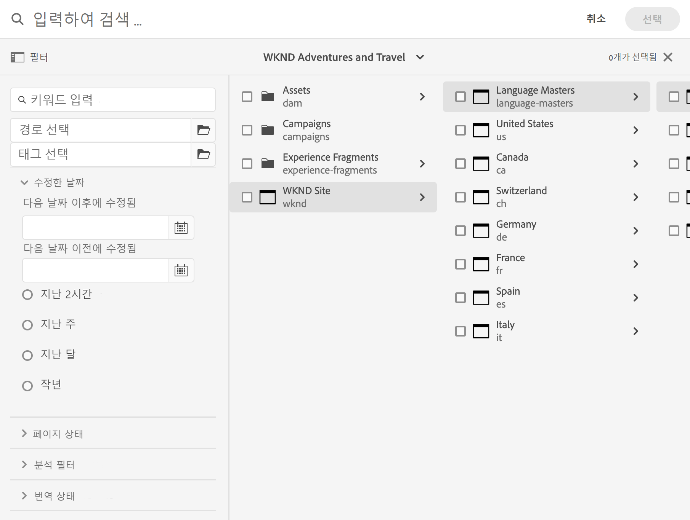

1. 선택한 후 다음을 선택합니다. **선택**. 페이지 및/또는 자산이 번역 작업에 추가됩니다.

>[!TIP]
>
>이 방법을 사용하면 페이지/자산과 그 하위 항목이 프로젝트에 추가됩니다. 상위 항목만 추가하려면 **자산/페이지(하위 항목을 포함하지 않음)**&#x200B;을 선택하십시오.

### 번역 작업에 태그 추가 {#adding-tags-to-a-translation-job}

[프로젝트에 자산 및 페이지를 추가하는 방법과 유사하게 번역 프로젝트에 태그를 추가할 수 있습니다](#adding-pages-assets-to-a-translation-job). **추가** 메뉴에 있는 **태그**&#x200B;를 선택한 다음 동일한 단계를 따르십시오.

### 번역 프로젝트 세부 정보 보기 {#seeing-translation-project-details}

프로젝트 요약 타일의 생략 부호 버튼을 통해 번역 프로젝트 속성에 액세스할 수 있습니다. 일반적인 [프로젝트 정보](/help/sites-cloud/authoring/projects/overview.md#project-info) 이외에도 번역 프로젝트 속성에는 번역 관련 정보가 포함되어 있습니다.

번역 프로젝트에서 번역 요약 타일 하단의 생략 부호를 선택합니다. 대부분의 프로젝트 관련 속성은 **고급** 탭에 있습니다.

* **소스 언어:** 번역할 페이지의 언어
* **타겟 언어:** 페이지를 번역할 언어
* **클라우드 구성:** 프로젝트에 사용되는 번역 서비스 커넥터에 대한 클라우드 구성
* **번역 방법:** 번역 워크플로(**인간 번역** 또는 **기계 번역**)
* **번역 공급업체:** 번역을 수행하는 번역 서비스 공급업체
* **콘텐츠 범주:** (기계 번역) 번역에 사용되는 콘텐츠 범주
* **번역 공급업체 자격 증명:** 공급업체에 로그인하기 위한 자격 증명
* **자동으로 번역 론치 홍보:** 번역된 콘텐츠를 수신한 후 번역 론치를 자동으로 홍보합니다.
   * **홍보 후 론치 삭제:** 번역 론치가 자동으로 홍보되는 경우 홍보 후 론치를 삭제합니다.
* **자동으로 번역 승인:** 번역된 콘텐츠를 수신한 후 번역 작업을 자동으로 승인합니다.
* **반복 번역:** 프로젝트가 자동으로 생성되고 번역 작업을 실행하는 빈도를 선택하여 번역 프로젝트의 반복 실행을 구성합니다.

페이지의 참조 레일을 사용하여 프로젝트를 만들면 소스 페이지의 속성을 기반으로 이들 속성이 자동으로 구성됩니다.

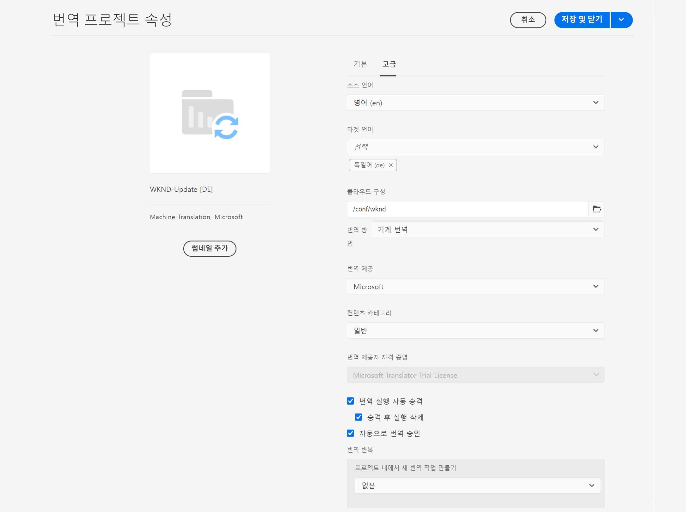

### 번역 작업 상태 모니터링 {#monitoring-the-status-of-a-translation-job}

번역 프로젝트의 번역 작업 타일은 번역 작업의 상태, 작업 내 페이지 및 자산 수를 제공합니다.

다음 표는 작업 또는 작업 내 항목이 가질 수 있는 각각의 속성에 대해 설명합니다.

| 상태 | 설명 |
|---|---|
| **초안** | 번역 작업이 아직 시작되지 않았습니다. 처음 생성될 때 번역 작업은 **초안**&#x200B;상태입니다. |
| **제출됨** | 번역 작업 내 파일이 정상적으로 번역 서비스로 전송되었을 때 이 상태를 가질 수 있습니다. 이 상태는 **범위 요청** 명령 또는 **시작** 명령을 실행했을 때 나타날 수 있습니다. |
| **요청된 범위** | (인간 번역 워크플로의 경우) 작업 내의 파일이 범위 지정을 위해 번역 공급업체에 제출되었습니다. 이 상태는 **범위 요청** 명령을 실행했을 때 표시됩니다. |
| **완료된 범위** | 공급업체에서 번역 작업의 범위를 지정했습니다. |
| **번역용으로 전송됨** | 프로젝트 소유자가 범위를 수락했습니다. 이 상태는 번역 공급업체가 작업 내 파일의 번역을 시작해야 함을 나타냅니다. |
| **번역 진행 중** | (작업의 경우) 하나 이상의 작업 내 파일의 번역이 아직 완료되지 않았습니다. (작업 내 항목의 경우) 항목이 번역되고 있습니다. |
| **번역됨** | (작업의 경우) 작업 내 모든 파일의 번역이 아직 완료되지 않았습니다. (작업 내 항목의 경우) 항목이 번역됩니다. |
| **검토 준비됨** | 작업 내 항목의 번역이 완료되어 파일을 AEM으로 가져왔습니다. |
| **완료** | 프로젝트 소유자가 번역 계약이 완료되었음을 나타냈습니다. |
| **취소** | 번역 공급업체가 번역 작업을 중단해야 함을 나타냅니다. |
| **오류 업데이트** | AEM 및 번역 서비스 간 파일을 전송하는 동안 오류가 발생했습니다. |
| **알 수 없는 상태** | 알 수 없는 오류가 발생했습니다. |

작업에 있는 각 파일의 상태를 보려면 타일 하단의 생략 부호를 선택합니다.

### 번역 작업 만기일 설정 {#setting-the-due-date-of-translation-jobs}

번역 공급업체가 번역된 파일을 반환해야 하는 날짜를 지정합니다. 사용 중인 번역 공급업체가 만기일 설정 기능을 지원하는 경우에만 이 기능이 올바르게 작동합니다.

1. 번역 요약 타일 하단의 생략 부호를 선택합니다.

   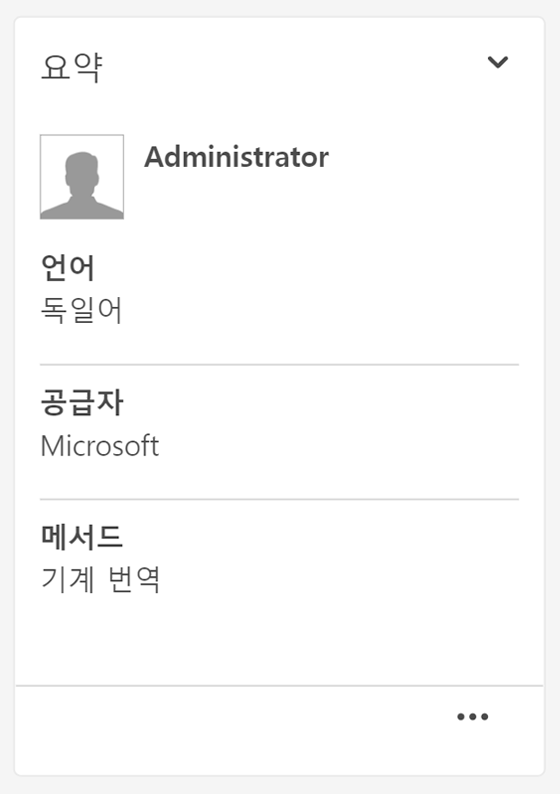

1. **기본** 탭에서 **만기일** 속성의 날짜 선택기를 사용하여 만기일을 선택합니다.

   

1. 선택 **저장 및 닫기**.

### 번역 작업 범위 지정 {#scoping-a-translation-job}

번역 작업의 범위를 지정하여 번역 서비스 공급업체로부터 번역료의 견적서를 받을 수 있습니다. 작업의 범위를 지정하면 텍스트와 저장된 번역 풀(번역 메모리)을 비교하는 번역 공급업체에 소스 타일이 제출됩니다. 일반적으로 범위는 번역이 필요한 단어의 수를 의미합니다.

범위 지정 결과에 대한 자세한 정보를 얻으려면 귀사의 번역 공급업체에 문의하십시오.

>[!NOTE]
>
>범위 지정은 옵션이며 인간 번역에만 적용됩니다. 범위를 지정하지 않고 번역 작업을 시작할 수 있습니다.

번역 작업의 범위를 지정할 때 해당 작업의 상태는 **범위 요청됨**&#x200B;입니다. 번역 공급업체가 범위를 반환하면 이 상태는 **범위 완료됨**&#x200B;으로 변경됩니다. 범위 지정이 완료되면 **범위 표시** 명령을 사용하여 범위 지정 결과를 검토할 수 있습니다.

사용 중인 번역 공급업체가 범위 지정 기능을 지원하는 경우에만 이 기능이 올바르게 작동합니다.

1. 프로젝트 콘솔에서 번역 프로젝트를 엽니다.
1. 번역 작업 제목에서 명령 메뉴를 선택한 다음 을 선택합니다. **범위 요청**.
1. 작업 상태가 (으)로 변경되는 경우 **완료된 범위**&#x200B;를 클릭하고 명령 메뉴를 선택한 다음 를 선택합니다. **범위 표시**.

### 번역 작업 시작 {#starting-translation-jobs}

번역 작업을 시작하여 소스 페이지를 타겟 언어로 번역합니다. 번역 요약 타일의 속성 값에 따라 번역이 수행됩니다.

프로젝트 내에서 개별 작업을 시작할 수 있습니다.

1. 프로젝트 콘솔에서 번역 프로젝트를 엽니다.
1. 번역 작업 타일에서 명령 메뉴를 선택한 다음 을 선택합니다. **시작**.
1. 번역 시작을 확인하는 작업 대화 상자에서 다음을 선택합니다. **닫기**.

번역 작업이 시작되면 번역 작업 타일에 해당 번역이 **진행 중** 상태로 표시됩니다.

프로젝트의 모든 번역 작업을 시작할 수도 있습니다.

1. 프로젝트 콘솔에서 번역 프로젝트를 선택합니다.
1. 도구 모음에서 를 선택합니다. **번역 작업 시작**.
1. 대화 상자에서 시작할 작업 목록을 검토한 다음, **시작**&#x200B;을 선택하여 확인하거나 **취소**&#x200B;를 선택하여 중단합니다.

### 번역 작업 취소 {#canceling-a-translation-job}

번역 작업을 취소하여 번역 프로세스를 중지하고 번역 공급업체가 이후 번역을 수행하지 않도록 할 수 있습니다. 작업이 **번역용으로 전송됨** 또는 **번역 진행 중** 상태일 때 해당 작업을 취소할 수 있습니다.

1. 프로젝트 콘솔에서 번역 프로젝트를 엽니다.
1. 번역 작업 타일에서 명령 메뉴를 선택한 다음 을 선택합니다. **취소**.
1. 번역 취소를 확인하는 작업 대화 상자에서 다음을 선택합니다. **확인**.

### 워크플로 수락 또는 거부 {#accept-reject-workflow}

번역된 콘텐츠가 돌아오고 **검토 준비됨** 상태이면 번역 작업으로 이동하여 콘텐츠를 수락/거부할 수 있습니다.

**번역 거부**&#x200B;를 선택하면 댓글을 추가할 수 있습니다.

콘텐츠를 거부하면 댓글을 확인할 수 있도록 해당 콘텐츠가 번역 공급업체에 다시 전송됩니다.

### 번역 작업 완료 및 보관 {#completing-and-archiving-translation-jobs}

공급업체로부터 번역된 파일을 검토한 후 번역 작업을 완료하십시오.

1. 프로젝트 콘솔에서 번역 프로젝트를 엽니다.
1. 번역 작업 타일에서 명령 메뉴를 선택한 다음 을 선택합니다. **완료**.
1. 이제 해당 작업은 **완료** 상태가 됩니다.

인간 번역 워크플로의 경우 번역을 완료했다는 것은 번역 계약이 이행되었으며 공급업체는 번역본을 번역 메모리에 저장해야 함을 나타냅니다.

번역 작업이 완료되었으며 더 이상 작업 상태 세부 정보를 볼 필요가 없다면 번역 작업을 보관하십시오.

1. 프로젝트 콘솔에서 번역 프로젝트를 엽니다.
1. 번역 작업 타일에서 명령 메뉴를 선택한 다음 을 선택합니다. **보관**.

작업을 저장할 때 번역 작업 타일은 프로젝트에서 제거됩니다.

## 번역된 콘텐츠 검토 및 사용 {#reviewing-and-promoting-updated-content}

Sites 콘솔을 사용하여 콘텐츠를 검토하고, 언어 사본을 비교하고, 콘텐츠를 활성화할 수 있습니다.

### 업데이트된 콘텐츠 홍보 {#promoting-updated-content}

기존 언어 사본에 대해 콘텐츠를 번역할 때, 번역본을 검토하고 필요한 경우 변경 내용을 적용한 다음 해당 번역본을 홍보하여 언어 사본으로 이동할 수 있습니다. 번역 작업에 **검토 준비됨** 상태가 표시되면 번역된 파일을 검토할 수 있습니다.

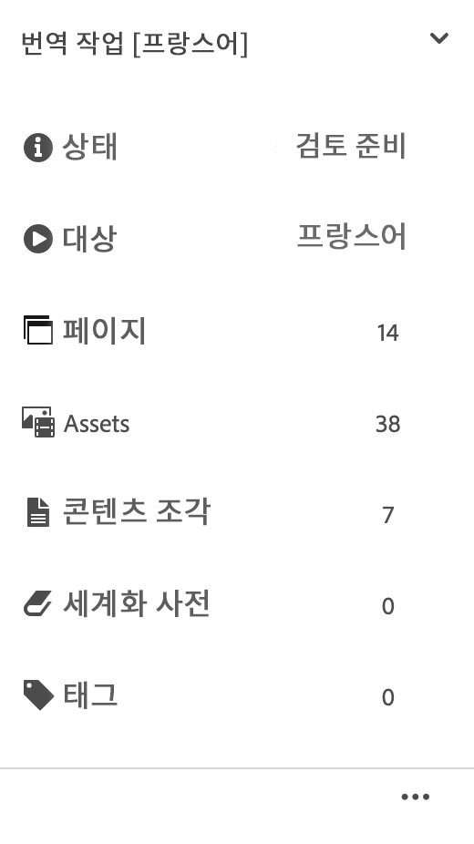

1. 언어 마스터에서 페이지를 선택하고 **참조**&#x200B;을 선택한 다음 을 선택합니다. **언어 복사**.
1. 검토할 언어 사본을 선택하십시오.

   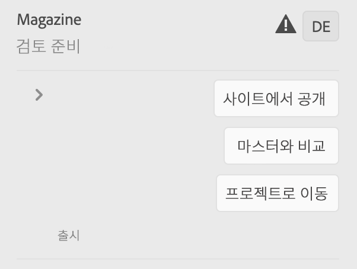

1. 선택 **시작** 론치 관련 명령을 표시합니다.

   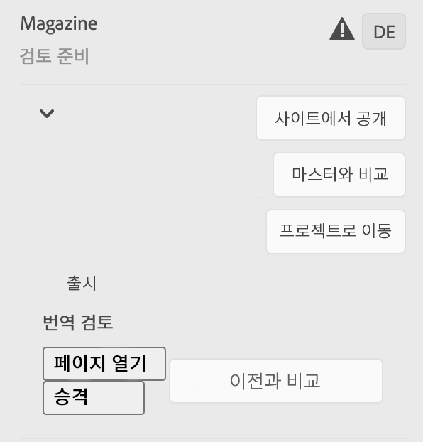

1. 페이지의 론치 사본을 열어 콘텐츠를 검토하고 편집하려면 **페이지 열기**&#x200B;를 클릭합니다.
1. 콘텐츠를 검토하고 필요한 변경 내용을 적용한 후 론치 사본을 홍보하려면 **홍보**&#x200B;를 클릭합니다.
1. 다음에서 **출시 홍보** 페이지, 홍보할 페이지를 지정한 다음 선택 **홍보**.

### 언어 사본 비교 {#comparing-language-copies}

언어 사본과 언어 마스터를 비교하려면 다음 작업을 수행하십시오.

1. Sites 콘솔에서 비교하려는 언어 사본으로 이동합니다.
1. [참조 레일](/help/sites-cloud/authoring/getting-started/basic-handling.md#references)을 엽니다.
1. **사본** 제목에서 **언어 사본**&#x200B;을 선택합니다.
1. 특정 언어 사본을 선택하면 **마스터와 비교** 또는 해당되는 경우 **이전과 비교** 중 하나를 선택할 수 있습니다.

   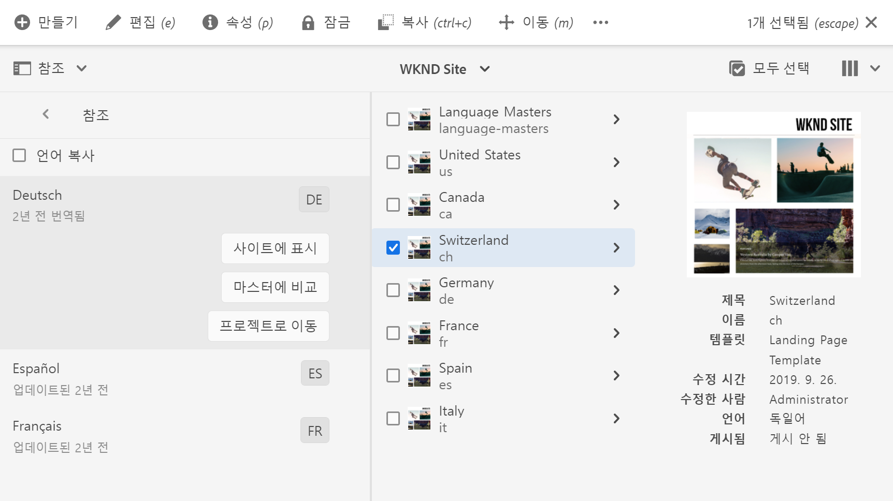

1. 두 페이지(론치 및 소스)가 나란히 열립니다.
   * 이 기능의 사용에 대한 자세한 내용은 [페이지 비교](/help/sites-cloud/authoring/features/page-diff.md)를 참조하십시오.

## 소스 페이지 이동 또는 이름 바꾸기 {#move-source}

이미 번역된 소스 페이지가 [이름이 변경되거나 이동됨](/help/sites-cloud/authoring/fundamentals/organizing-pages.md#moving-or-renaming-a-page)이동 후 페이지를 다시 번역하면 새 페이지 이름/위치를 기반으로 언어 사본이 생성됩니다. 이전 이름/위치를 기반으로 하는 이전 언어 사본은 여전히 존재합니다.

이 시나리오에서 가장 좋은 방법은 다음 절차를 따르는 것입니다.

1. 이동하려는 소스 페이지와 연결된 언어 사본을 게시 취소합니다.
1. 이 사본을 삭제합니다.
1. 새로 이동한 소스 페이지에서 새 언어 사본을 만듭니다.
1. 생성된 언어 사본을 게시합니다.

## 번역 작업 가져오기 및 내보내기 {#import-export}

AEM은 여러 번역 솔루션 및 인터페이스를 제공하지만 수동으로 번역 작업 정보를 가져오고 내보낼 수도 있습니다.

### 번역 작업 내보내기 {#exporting-a-translation-job}

번역 작업 콘텐츠를 다운로드하여 커넥터를 통해 AEM과 통합되지 않은 번역 공급업체에게 전송하거나 콘텐츠를 검토할 수 있습니다.

1. 번역 작업 타일의 드롭다운 메뉴에서 을(를) 선택합니다 **내보내기**.
1. 대화 상자에서 을 선택합니다. **내보낸 파일 다운로드**&#x200B;필요한 경우 웹 브라우저 대화 상자를 사용하여 파일을 저장합니다.
1. 대화 상자에서 을 선택합니다. **닫기**.

### 번역 작업 가져오기 {#importing-a-translation-job}

번역 공급업체가 커넥터를 통해 AEM과 통합되지 않아 번역된 콘텐츠를 귀하에게 전송한 경우 이를 AEM으로 가져올 수 있습니다.

1. 번역 작업 타일의 드롭다운 메뉴에서 을(를) 선택합니다 **가져오기**.
1. 웹 브라우저의 대화 상자를 사용하여 내보낼 파일을 선택합니다.
1. 대화 상자에서 을 선택합니다. **닫기**.
