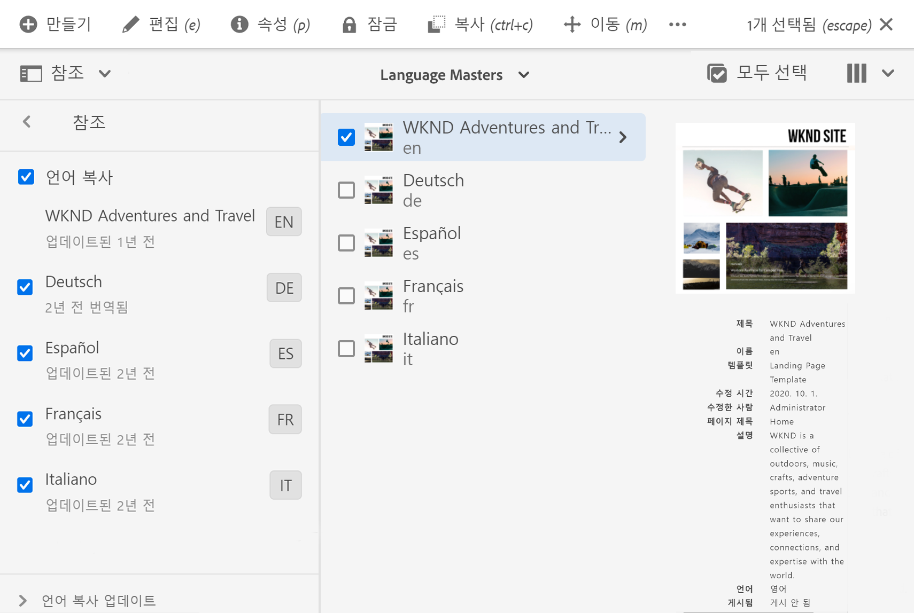
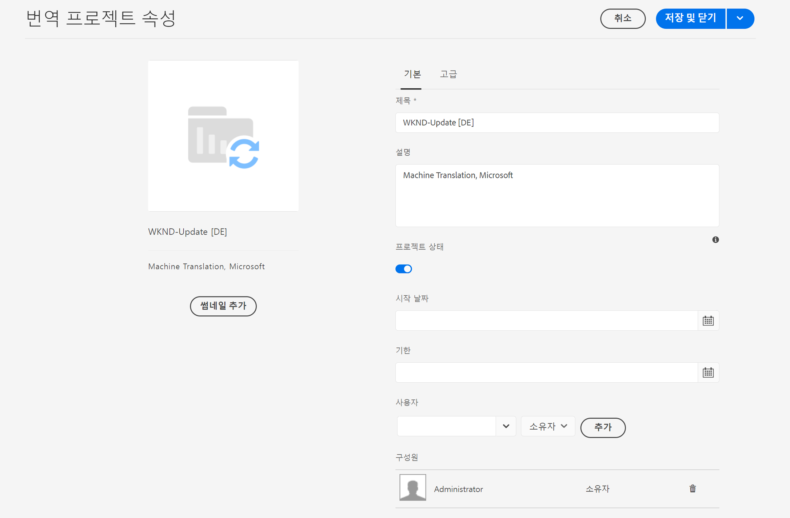

# 번역 프로젝트 관리 {#managing-translation-projects}

번역 프로젝트를 사용하면 AEM 컨텐츠 번역을 관리할 수 있습니다. 번역 프로젝트는 다른 언어로 번역되는 리소스를 포함하는 AEM [project](/help/sites-cloud/authoring/projects/overview.md)의 유형입니다. 이러한 리소스는 언어 마스터에서 만들어진 [언어 사본](preparation.md)의 페이지 및 자산입니다.

번역 프로젝트에 리소스를 추가하면 해당 리소스에 대한 번역 작업이 만들어집니다. 작업은 리소스에서 실행되는 인간 번역 및 기계 번역 워크플로우를 관리하는 데 사용하는 명령과 상태 정보를 제공합니다.

번역 프로젝트는 세계화 조직의 거버넌스에 맞게 언어 및 번역 방법/공급자로 정의된 오래 실행되는 항목입니다. 이 요청은 초기 번역 중 또는 수동 중에 한 번 시작되어야 하며 콘텐츠 및 번역 업데이트 활동 전반에서 계속 적용됩니다.

번역 프로젝트 및 작업은 번역 준비 워크플로우로 만들어집니다. 이러한 워크플로우에는 첫 번째 번역(만들기 및 번역)과 업데이트(번역 업데이트)에 대한 세 가지 옵션이 있습니다.

1. [새 프로젝트 만들기](#creating-translation-projects-using-the-references-panel)
1. [기존 프로젝트에 추가](#adding-pages-to-a-translation-project)
1. [컨텐츠 구조만](#creating-the-structure-of-a-language-copy)

AEM은 컨텐츠의 초기 번역을 위해 번역 프로젝트가 만들어지는 것인지 아니면 이미 번역된 언어 사본을 업데이트하고 있는지 감지합니다. 페이지에 대한 번역 프로젝트를 만들고 번역할 언어 사본을 표시하면 AEM에서 대상 언어 복사본에 소스 페이지가 이미 있는지 여부를 감지합니다.

* **언어 사본에는 페이지가 포함되지 않습니다.**  AEM에서는 이 상황을 초기 번역으로 처리합니다. 페이지가 즉시 언어 복사본으로 복사되고 프로젝트에 포함됩니다. 번역된 페이지를 AEM으로 가져올 때 AEM은 해당 페이지를 언어 사본에 직접 복사합니다.
* **언어 사본에는 이미 페이지가 포함되어 있습니다.**  AEM에서는 이 상황을 업데이트된 번역으로 처리합니다. 론치가 만들어지고 페이지 사본이 론치에 추가되고, 프로젝트에 포함됩니다. Launch를 사용하면 언어 복사본에 커밋하기 전에 업데이트된 번역을 검토할 수 있습니다.

   * 번역된 페이지를 AEM으로 가져올 때 launch의 페이지를 덮어씁니다.
   * 번역된 페이지는 론치가 승격될 때만 언어 사본을 덮어씁니다.

예를 들어 `/content/wknd/fr` 언어 루트는 `/content/wknd/en` 마스터 언어의 프랑스어 번역을 위해 만들어집니다. 프랑스어 복사본에는 다른 페이지가 없습니다.

* `/content/wknd/en/products` 페이지와 모든 하위 페이지에 대한 번역 프로젝트가 생성되고, 프랑스어 복사본을 타깃팅합니다. 언어 복사본에 `/content/wknd/fr/products` 페이지가 포함되지 않으므로 AEM에서는 즉시 `/content/wknd/en/products` 페이지와 모든 하위 페이지를 프랑스어 복사본으로 복사합니다. 복사본은 번역 프로젝트에도 포함됩니다.
* `/content/wknd/en` 페이지와 모든 하위 페이지에 대한 번역 프로젝트가 생성되고, 프랑스어 복사본을 타깃팅합니다. 언어 복사본에는 `/content/wknd/en` 페이지(언어 루트)에 해당하는 페이지가 포함되므로 AEM에서는 `/content/wknd/en` 페이지와 모든 하위 페이지를 복사하여 Launch에 추가합니다. 복사본은 번역 프로젝트에도 포함됩니다.

## 사이트 콘솔에서 번역 {#performing-initial-translations-and-updating-existing-translations}

번역 프로젝트는 사이트 콘솔에서 직접 만들거나 업데이트할 수 있습니다.

### 참조 패널을 사용하여 번역 프로젝트 만들기 {#creating-translation-projects-using-the-references-panel}

언어 마스터의 리소스를 번역하는 워크플로우를 실행하고 관리할 수 있도록 번역 프로젝트를 만듭니다. 프로젝트를 만들 때 번역할 언어 마스터와 번역을 수행할 언어 사본의 페이지를 지정합니다.

* 선택한 페이지와 연결된 번역 통합 프레임워크의 클라우드 구성은 사용할 번역 워크플로우와 같은 번역 프로젝트의 많은 속성을 결정합니다.
* 선택한 각 언어 복사본에 대해 프로젝트가 만들어집니다.
* 선택한 페이지와 연결된 자산의 사본이 만들어지고 각 프로젝트에 추가됩니다. 이러한 복사본은 나중에 번역을 위해 번역 공급자에게 전송됩니다.

선택한 페이지의 하위 페이지도 선택되도록 지정할 수 있습니다. 이 경우 하위 페이지의 복사본이 각 프로젝트에 추가되어 번역됩니다. 하위 페이지가 다른 번역 통합 프레임워크 구성과 연결되어 있으면 AEM에서 추가 프로젝트를 만듭니다.

[수동으로 번역 프로젝트를 만들 수도 있습니다](#creating-a-translation-project-using-the-projects-console).

>[!NOTE]
>
>프로젝트를 만들려면 계정이 `project-administrators` 그룹의 구성원이어야 합니다.

### 초기 번역 및 번역 업데이트 {#initial-and-updating}

참조 패널은 기존 언어 사본을 업데이트할지 또는 언어 사본의 첫 번째 버전을 작성할지 여부를 나타냅니다. 선택한 페이지에 대한 언어 사본이 있으면 프로젝트 관련 명령에 액세스할 수 있는 언어 사본 업데이트 탭이 나타납니다.

번역 후 [번역](#reviewing-and-promoting-updated-content)을 검토한 후 번역 복사본을 덮어쓸 수 있습니다. 선택한 페이지에 대한 언어 사본이 없으면 프로젝트 관련 명령에 액세스할 수 있는 만들기 및 번역 탭이 나타납니다.

### 새 언어 사본 번역 프로젝트 만들기 {#create-translation-projects-for-a-new-language-copy}

1. 사이트 콘솔을 사용하여 번역 프로젝트에 추가할 페이지를 선택합니다.

1. 도구 모음을 사용하여 **참조** 레일을 엽니다.

   

1. **언어 사본**&#x200B;을 선택한 다음 소스 페이지를 번역할 언어 사본을 선택합니다.
1. **만들기 및 번역**&#x200B;을 클릭하거나 탭한 다음, 번역 작업을 구성하십시오.

   * **언어** 드롭다운을 사용하여 번역할 언어 사본을 선택합니다. 필요에 따라 추가 언어를 선택합니다. 목록에 나타나는 언어는 [언어 루트에서 만든 ](preparation.md#creating-a-language-root)언어 루트와 일치합니다.
      * 여러 언어를 선택하면 각 언어에 대한 번역 작업으로 하나의 프로젝트가 만들어집니다.
   * 선택한 페이지와 모든 하위 페이지를 번역하려면 **모든 하위 페이지 선택**&#x200B;을 선택합니다. 선택한 페이지만 번역하려면 옵션을 선택 취소합니다.
   * **Project**&#x200B;에 대해 **번역 프로젝트 만들기**&#x200B;를 선택합니다.
   * 선택 사항으로 **프로젝트 기본**&#x200B;에 대해 사용자 역할 및 권한을 상속할 프로젝트를 선택하십시오.
   * **제목**&#x200B;에 프로젝트 이름을 입력합니다.

   

1. **만들기**&#x200B;를 클릭하거나 탭합니다.

### 기존 언어 복사본에 대한 번역 프로젝트 만들기 {#create-translation-projects-for-an-existing-language-copy}

1. 사이트 콘솔을 사용하여 번역 프로젝트에 추가할 페이지를 선택합니다.

1. 도구 모음을 사용하여 **참조** 레일을 엽니다.

   

1. **언어 사본**&#x200B;을 선택한 다음 소스 페이지를 번역할 언어 사본을 선택합니다.
1. **언어 사본 업데이트**&#x200B;를 클릭하거나 탭한 다음 번역 작업을 구성합니다.

   * 선택한 페이지와 모든 하위 페이지를 번역하려면 **모든 하위 페이지 선택**&#x200B;을 선택합니다. 선택한 페이지만 번역하려면 옵션을 선택 취소합니다.
   * **Project**&#x200B;에 대해 **번역 프로젝트 만들기**&#x200B;를 선택합니다.
   * 선택 사항으로 **프로젝트 기본**&#x200B;에 대해 사용자 역할 및 권한을 상속할 프로젝트를 선택하십시오.
   * **제목**&#x200B;에 프로젝트 이름을 입력합니다.

   

1. **만들기**&#x200B;를 클릭하거나 탭합니다.

### 번역 프로젝트에 페이지 추가 {#adding-pages-to-a-translation-project}

번역 프로젝트를 만든 후에는 **리소스** 레일을 사용하여 프로젝트에 페이지를 추가할 수 있습니다. 페이지를 추가하는 것은 동일한 프로젝트에서 서로 다른 분기의 페이지를 포함할 때 유용합니다.

페이지를 번역 프로젝트에 추가하면 페이지가 새 번역 작업에 포함됩니다. 기존 작업](#adding-pages-assets-to-a-translation-job)에 페이지를 추가할 수도 있습니다.[

새 프로젝트를 만들 때와 마찬가지로 페이지를 추가할 때 기존 언어 사본을 덮어쓰지 않도록 필요할 때 페이지 복사본이 launch에 추가됩니다. ([기존 언어 사본 번역 프로젝트 만들기](#performing-initial-translations-and-updating-existing-translations) 참조).

1. 사이트 콘솔을 사용하여 번역 프로젝트에 추가할 페이지를 선택합니다.

1. 도구 모음을 사용하여 **참조** 레일을 엽니다.

   

1. **언어 사본**&#x200B;을 선택한 다음 소스 페이지를 번역할 언어 사본을 선택합니다.

   

1. **언어 사본 업데이트**&#x200B;를 클릭하거나 탭한 다음 속성을 구성합니다.

   * 선택한 페이지와 모든 하위 페이지를 번역하려면 **모든 하위 페이지 선택**&#x200B;을 선택합니다. 선택한 페이지만 번역하려면 옵션을 선택 취소합니다.
   * **Project**&#x200B;에 대해 **기존 번역 프로젝트에 추가**&#x200B;를 선택합니다.
   * **기존 번역 프로젝트**&#x200B;에서 프로젝트를 선택합니다.

   >[!NOTE]
   >
   >번역 프로젝트에 설정된 대상 언어는 참조 레일에 표시된 대로 언어 사본의 경로와 일치해야 합니다.

1. **업데이트**&#x200B;를 클릭하거나 탭합니다.

### 언어 사본 구조 만들기 {#creating-the-structure-of-a-language-copy}

언어 사본의 구조만 만들 수 있으므로 언어 마스터의 내용 및 구조적 변경 사항을 (번역되지 않은) 언어 사본에 복사할 수 있습니다. 번역 작업 또는 프로젝트와 관련이 없습니다. 이 기능을 사용하면 번역을 하지 않고도 언어 마스터를 동기화할 수 있습니다.

번역할 마스터 언어의 콘텐츠가 포함되도록 언어 사본을 채웁니다. 언어 사본을 채우려면 먼저 언어 사본의 언어 루트](preparation.md#creating-a-language-root)를 만들어야 합니다.[

1. 사이트 콘솔을 사용하여 소스로 사용 중인 마스터 언어의 언어 루트를 선택합니다.
1. 도구 모음에서 **참조**&#x200B;를 클릭하거나 탭하여 참조 레일을 엽니다.

   

1. **언어 사본**&#x200B;을 선택한 다음 채울 언어 사본을 선택합니다.

   

1. **언어 사본 업데이트**&#x200B;를 클릭하거나 탭하여 번역 도구를 표시하고 속성을 구성하십시오.

   * **모든 하위 페이지 선택** 옵션을 선택합니다.
   * **Project**&#x200B;에 대해 **구조만 만들기**&#x200B;를 선택합니다.

   

1. **업데이트**&#x200B;를 클릭하거나 탭합니다.

### 번역 메모리 업데이트 {#updating-translation-memory}

번역된 컨텐츠의 수동 편집 내용을 TMS(번역 관리 시스템)로 다시 동기화하여 번역 메모리를 교육할 수 있습니다.

1. 사이트 콘솔에서 번역된 페이지의 텍스트 컨텐츠를 업데이트한 후 **번역 메모리 업데이트**&#x200B;를 선택합니다.
1. 목록 보기에는 편집된 모든 텍스트 구성 요소에 대한 소스와 번역을 나란히 비교한 것입니다. 번역 메모리에 동기화해야 하는 번역 업데이트를 선택하고 **메모리 업데이트**&#x200B;를 선택합니다.

AEM에서 선택한 문자열을 번역 관리 시스템으로 다시 전송합니다.

### 페이지의 번역 상태 확인 {#check-translation-status}

페이지가 번역되었거나, 번역되어 있거나, 아직 번역되지 않았는지 여부를 보여주는 사이트 콘솔의 목록 보기에서 속성을 선택할 수 있습니다.

1. 사이트 콘솔에서 [목록 보기로 전환합니다.](/help/sites-cloud/authoring/getting-started/basic-handling.md#viewing-and-selecting-resources)
1. 보기 드롭다운에서 **보기 설정** 을 탭하거나 클릭합니다.
1. 대화 상자에서 **Translated** 속성을 확인하고 **Update**&#x200B;를 탭하거나 클릭합니다.

이제 사이트 콘솔에 나열된 페이지의 번역 상태를 보여주는 **번역된** 열이 표시됩니다.

## 프로젝트 콘솔에서 번역 프로젝트 관리

많은 번역 작업 및 고급 옵션은 프로젝트 콘솔에서 액세스할 수 있습니다.

### 프로젝트 콘솔 이해

AEM의 번역 프로젝트는 표준 [AEM 프로젝트 콘솔을 사용합니다.](/help/sites-cloud/authoring/projects/overview.md) AEM 프로젝트에 익숙하지 않은 경우 해당 설명서를 검토하십시오.

다른 프로젝트처럼 번역 프로젝트는 프로젝트 작업의 개요를 보여주는 타일로 구성됩니다.

* **요약**  - 프로젝트 개요
* **작업**  - 하나 이상의 번역 작업
* **팀**  - 번역 프로젝트를 공동 작업하는 사용자
* **작업**  - 번역 노력의 일환으로 완료해야 하는 항목

타일 위쪽과 아래쪽에 있는 명령 및 줄임표 단추(각각)를 사용하여 다양한 타일의 컨트롤과 옵션에 액세스합니다.

### 프로젝트 콘솔을 사용하여 번역 프로젝트 생성 {#creating-a-translation-project-using-the-projects-console}

사이트 콘솔 대신 프로젝트 콘솔을 사용하려는 경우 번역 프로젝트를 수동으로 만들 수 있습니다.

>[!NOTE]
>
>프로젝트를 만들려면 계정이 `project-administrators` 그룹의 구성원이어야 합니다.

번역 프로젝트를 수동으로 만들 때 [기본 속성](/help/sites-cloud/authoring/projects/managing.md#creating-a-project) 외에 다음 번역 관련 속성에 대한 값을 제공해야 합니다.

* **이름:** 프로젝트 이름
* **소스 언어:**  소스 컨텐츠의 언어입니다
* **Target 언어:**  컨텐츠가 번역되는 언어 또는 언어입니다
   * 여러 언어를 선택한 경우 프로젝트 내의 각 언어에 대한 작업이 만들어집니다.
* **번역 방법:**  **수동** 번역을 선택하여 번역이 수동으로 수행됨을 나타냅니다.

1. 프로젝트 콘솔의 도구 모음에서 **만들기**&#x200B;를 클릭하거나 탭합니다.
1. **번역 프로젝트** 템플릿을 선택한 다음 **다음**&#x200B;을 클릭하거나 탭합니다.
1. **기본** 속성 탭의 값을 입력합니다.
1. **고급**&#x200B;을 클릭하거나 탭하고 번역 관련 속성에 대한 값을 제공합니다.
1. **만들기**&#x200B;를 클릭하거나 탭합니다. 확인 상자에서 **완료** 를 클릭하거나 탭하여 프로젝트 콘솔로 돌아가거나 **프로젝트 열기**&#x200B;를 클릭하거나 탭하여 프로젝트를 열고 관리를 시작합니다.

### 번역 작업에 페이지 및 자산 추가 {#adding-pages-assets-to-a-translation-job}

번역 프로젝트의 번역 작업에 페이지, 자산 또는 태그를 추가할 수 있습니다. 페이지 또는 자산을 추가하려면:

1. 번역 프로젝트의 번역 작업 타일 맨 아래에서 줄임표를 클릭하거나 탭합니다.

   

1. 다음 창의 도구 모음에서 **추가** 단추를 클릭하거나 탭한 다음 **자산/페이지**&#x200B;를 선택합니다.

   

1. 모달 창에서 추가할 분기의 맨 위 항목을 선택한 다음 확인 표시 아이콘을 클릭하거나 탭합니다. 이 창에서 다중 선택을 사용할 수 있습니다.

   

1. 또는 검색 아이콘을 선택하여 번역 작업에 추가할 페이지 또는 자산을 쉽게 찾을 수 있습니다.

   

1. 선택한 후 **선택**&#x200B;을 탭하거나 클릭합니다. 페이지 및/또는 자산이 번역 작업에 추가됩니다.

>[!TIP]
>
>이 방법은 페이지/자산 및 해당 하위 페이지를 프로젝트에 추가합니다. 상위 항목만 추가하려면 **자산/페이지(하위 항목 없음)**&#x200B;를 선택합니다.

### 번역 작업에 태그 추가 {#adding-tags-to-a-translation-job}

[프로젝트에 자산 및 페이지를 추가하는 방법과 유사하게 번역 프로젝트에 태그를 추가할 수 있습니다.](#adding-pages-assets-to-a-translation-job) 추가 메뉴  **** 아래에서  **** 태그 를 선택한 다음 동일한 단계를 수행하면 됩니다.

### 번역 프로젝트 세부 정보 보기 {#seeing-translation-project-details}

번역 프로젝트 속성은 프로젝트 요약 타일의 줄임표 단추를 통해 액세스할 수 있습니다. 번역 프로젝트 속성은 일반 [프로젝트 정보](/help/sites-cloud/authoring/projects/overview.md#project-info) 외에도 번역별 속성을 포함합니다.

번역 프로젝트에서 번역 요약 타일의 하단에 있는 줄임표를 클릭하거나 탭합니다. 대부분의 프로젝트별 속성은 **고급** 탭에 있습니다.

* **소스 언어:**  번역되는 페이지의 언어입니다
* **Target 언어:** 페이지를 번역하는 언어 또는 언어입니다
* **클라우드 구성:**  프로젝트에 사용되는 번역 서비스 커넥터에 대한 클라우드 구성입니다
* **번역 방법:** 인간 번역 또는  **기계** 번역  **워크플로우입니다**
* **번역 공급자:** 번역을 수행하는 번역 서비스 공급자입니다
* **컨텐츠 카테고리:** (기계 번역) 번역에 사용되는 컨텐츠 카테고리입니다
* **번역 공급자 자격 증명:**  공급자에 로그인할 자격 증명입니다
* **번역 론치 자동 홍보:** 번역된 콘텐츠를 받은 후 번역 론치가 자동으로 홍보됩니다
   * **프로모션 후 론치 삭제:** 번역 론치가 자동으로 홍보되면 홍보 후 론치를 삭제합니다
* **자동 번역 승인:**  번역된 콘텐츠를 받은 후 번역 작업이 자동으로 승인됩니다
* **번역 반복:**  프로젝트가 번역 작업을 자동으로 만들고 실행할 빈도를 선택하여 번역 프로젝트의 반복 실행을 구성합니다

페이지의 참조 레일을 사용하여 프로젝트를 만들 때 소스 페이지의 속성을 기반으로 이러한 속성이 자동으로 구성됩니다.

### 번역 작업 상태 모니터링 {#monitoring-the-status-of-a-translation-job}

번역 프로젝트의 번역 작업 타일은 번역 작업의 상태와 작업 내의 페이지 및 자산 수를 제공합니다.

다음 표에서는 작업 또는 작업의 항목이 가질 수 있는 각 상태에 대해 설명합니다.

| 상태 | 설명 |
|---|---|
| **초안** | 번역 작업이 시작되지 않았습니다. 번역 작업은 만들 때 **초안**** 상태에 있습니다. |
| **제출함** | 번역 작업에 있는 파일은 번역 서비스로 성공적으로 전송되었을 때 이 상태를 갖습니다. 이 상태는 **요청 범위** 명령 또는 **시작** 명령이 실행된 후에 발생할 수 있습니다. |
| **요청된 범위** | 인간 번역 워크플로우의 경우, 작업 내의 파일이 범위 지정을 위해 번역 공급업체에 제출되었습니다. 이 상태는 **요청 범위** 명령이 실행된 후에 나타납니다. |
| **완료된 범위** | 공급업체에서 번역 작업 범위를 지정했습니다. |
| **번역 커밋됨** | 프로젝트 소유자가 해당 범위를 수락했습니다. 이 상태는 번역 공급업체가 작업의 파일 번역을 시작해야 함을 나타냅니다. |
| **번역 진행 중** | 작업의 경우 작업에 있는 하나 이상의 파일 번역이 아직 완료되지 않았습니다. 작업의 항목에 대해 항목이 번역되고 있습니다. |
| **번역됨** | 작업의 경우 작업의 모든 파일 번역이 완료되었습니다. 작업의 항목에 대해서는 항목이 번역됩니다. |
| **검토 준비** | 작업의 항목이 변환되고 파일을 AEM으로 가져왔습니다. |
| **완료** | 프로젝트 소유자는 번역 계약이 완료되었음을 나타냅니다. |
| **취소** | 번역 공급업체가 번역 작업 작업을 중지해야 함을 나타냅니다. |
| **오류 업데이트** | AEM과 번역 서비스 간에 파일을 전송하는 동안 오류가 발생했습니다. |
| **알 수 없는 상태** | 알 수 없는 오류가 발생했습니다. |

작업에 있는 각 파일의 상태를 보려면 타일 맨 아래에 있는 줄임표를 클릭하거나 탭합니다.

### 번역 작업 기한 설정 {#setting-the-due-date-of-translation-jobs}

번역 공급업체에서 번역된 파일을 반환해야 하는 이전 날짜를 지정합니다. 사용 중인 번역 공급업체가 이 기능을 지원하는 경우에만 기한 기능을 올바르게 설정합니다.

1. 번역 요약 타일의 하단에 있는 생략 부호를 클릭하거나 탭합니다.

   

1. **기본** 탭에서 **기한** 속성의 날짜 선택기를 사용하여 기한을 선택합니다.

   

1. **저장 및 닫기**&#x200B;를 클릭하거나 탭합니다.

### 번역 작업 범위 지정 {#scoping-a-translation-job}

번역 작업 범위를 지정하여 번역 서비스 공급자로부터 번역 비용을 예상합니다. 작업 범위를 지정할 때 원본 파일이 저장된 번역(번역 메모리)의 풀과 비교하여 번역 공급업체에 제출됩니다. 일반적으로 범위는 번역이 필요한 단어 수입니다.

범위 지정 결과에 대한 자세한 내용은 번역 공급업체에 문의하십시오.

>[!NOTE]
>
>범위 지정은 선택 사항이며 인간 번역에만 적용됩니다. 범위 지정 없이 번역 작업을 시작할 수 있습니다.

번역 작업의 범위를 지정할 때 작업의 상태는 **요청 범위**&#x200B;입니다. 번역 공급업체에서 범위를 반환하면 상태가 **Scope Completed**&#x200B;로 변경됩니다. 범위 지정이 완료되면 **범위 표시** 명령을 사용하여 범위 결과를 검토할 수 있습니다.

사용 중인 번역 공급업체가 이 기능을 지원하는 경우에만 범위 지정 기능이 올바르게 작동합니다.

1. 프로젝트 콘솔에서 번역 프로젝트를 엽니다.
1. 번역 작업의 제목에서 명령 메뉴를 탭하거나 클릭한 다음, **요청 범위**&#x200B;를 탭하거나 클릭합니다.
1. 작업 상태가 **범위 완료**&#x200B;로 변경되면 명령 메뉴를 클릭하거나 탭한 다음 **범위 표시**&#x200B;를 클릭하거나 탭합니다.

### 번역 작업 시작 {#starting-translation-jobs}

소스 페이지를 대상 언어로 변환하려면 번역 작업을 시작합니다. 번역 요약 타일의 속성 값에 따라 번역이 수행됩니다.

프로젝트 내에서 개별 작업을 시작할 수 있습니다.

1. 프로젝트 콘솔에서 번역 프로젝트를 엽니다.
1. 번역 작업 타일에서 명령 메뉴를 클릭하거나 탭한 다음, **시작**&#x200B;을 클릭하거나 탭합니다.
1. 번역 시작을 확인하는 작업 대화 상자에서 **닫기**&#x200B;를 클릭하거나 탭합니다.

번역 작업을 시작하면 번역 작업 타일에 **진행 중** 상태에 번역이 표시됩니다.

프로젝트에 대한 모든 번역 작업을 시작할 수도 있습니다.

1. 프로젝트 콘솔에서 번역 프로젝트를 선택합니다.
1. 도구 모음에서 **번역 작업 시작**&#x200B;을 탭하거나 클릭합니다.
1. 대화 상자에서 시작할 작업 목록을 검토하고 **시작**&#x200B;으로 확인하거나 **취소**&#x200B;로 중단합니다.

### 번역 작업 취소 {#canceling-a-translation-job}

번역 작업을 취소하여 번역 프로세스를 중단하고 번역 공급업체가 추가 번역을 수행하지 못하도록 합니다. 작업이 **번역 커밋됨** 또는 **번역 진행 중** 상태가 있으면 작업을 취소할 수 있습니다.

1. 프로젝트 콘솔에서 번역 프로젝트를 엽니다.
1. 번역 작업 타일에서 명령 메뉴를 클릭하거나 탭한 다음, **취소**&#x200B;를 클릭하거나 탭합니다.
1. 번역 취소를 확인하는 작업 대화 상자에서 **확인**&#x200B;을 클릭하거나 탭합니다.

### 워크플로우 수락 및 거부 {#accept-reject-workflow}

컨텐츠가 번역 후 반환되고 **검토 준비** 상태에 있으면 번역 작업으로 이동하여 컨텐츠를 수락/거부할 수 있습니다.

**번역 거부**&#x200B;를 선택하면 설명을 추가할 수 있습니다.

콘텐츠를 거부하면 번역 공급업체로 다시 전송되며 해당 업체에서는 주석을 볼 수 있습니다.

### 번역 작업 완료 및 보관 {#completing-and-archiving-translation-jobs}

공급업체에서 번역한 파일을 검토한 후 번역 작업을 완료합니다.

1. 프로젝트 콘솔에서 번역 프로젝트를 엽니다.
1. 번역 작업 타일에서 명령 메뉴를 클릭하거나 탭한 다음, **완료**&#x200B;를 클릭하거나 탭합니다.
1. 이제 작업의 상태가 **완료**&#x200B;입니다.

인간 번역 워크플로우의 경우, 번역을 완료하면 번역 계약이 이행되었으며 번역을 번역 메모리에 저장해야 한다는 표시도 제공됩니다.

번역 작업이 완료되면 보관 작업을 보관하여 더 이상 작업 상태 세부 사항을 볼 필요가 없습니다.

1. 프로젝트 콘솔에서 번역 프로젝트를 엽니다.
1. 번역 작업 타일에서 명령 메뉴를 클릭하거나 탭한 다음, **보관**&#x200B;을 클릭하거나 탭합니다.

작업을 보관하면 번역 작업 타일이 프로젝트에서 제거됩니다.

## 번역된 컨텐츠 검토 및 사용 {#reviewing-and-promoting-updated-content}

사이트 콘솔을 사용하여 컨텐츠를 검토하고, 언어 사본을 비교하고, 컨텐츠를 활성화할 수 있습니다.

### 업데이트된 컨텐츠 홍보 {#promoting-updated-content}

컨텐츠가 기존 언어 사본으로 번역되면 번역을 검토하고 필요한 경우 변경한 다음 번역을 승격하여 언어 사본으로 이동합니다. 번역 작업에 **검토 준비** 상태가 표시되면 번역된 파일을 검토할 수 있습니다.

1. 언어 마스터에서 페이지를 선택하고 **참조**&#x200B;를 클릭하거나 탭한 다음, **언어 사본**&#x200B;을 클릭하거나 탭합니다.
1. 검토할 언어 사본 을 클릭하거나 탭합니다.

   

1. **Launch**&#x200B;를 클릭하거나 탭하여 실행 관련 명령을 표시합니다.

   

1. 페이지의 론치 복사본을 열어 컨텐츠를 검토하고 편집하려면 **페이지 열기**&#x200B;를 클릭합니다.
1. 컨텐츠를 검토하고 필요한 변경을 수행한 후 론치 카피를 승격하려면 **Promote**&#x200B;를 클릭합니다.
1. **Promote Launch** 페이지에서 홍보할 페이지를 지정한 다음 **Promote**&#x200B;을(를) 클릭하거나 탭합니다.

### 언어 사본 비교 {#comparing-language-copies}

언어 사본을 언어 마스터에 비교하려면

1. 사이트 콘솔에서 비교할 언어 사본으로 이동합니다.
1. [참조 레일을 엽니다.](/help/sites-cloud/authoring/getting-started/basic-handling.md#references)
1. **Copies** 제목 아래에서 **언어 사본.**
1. 특정 언어 사본을 선택한 다음, 해당하는 경우 **기본**&#x200B;비교 또는 **이전**&#x200B;비교 를 클릭할 수 있습니다.

   

1. 두 페이지(론치와 소스)가 나란히 열립니다.
   * 이 기능의 사용에 대한 자세한 내용은 [페이지 비교](/help/sites-cloud/authoring/features/page-diff.md)를 참조하십시오.

## 번역 작업 가져오기 및 내보내기 {#import-export}

AEM에서는 다양한 번역 솔루션과 인터페이스를 제공하지만 번역 작업 정보를 수동으로 가져오고 내보낼 수도 있습니다.

### 번역 작업 내보내기 {#exporting-a-translation-job}

번역 작업의 컨텐츠를 다운로드할 수 있습니다. 예를 들어 커넥터를 통해 AEM과 통합되지 않은 번역 공급자에게 보내거나 컨텐츠를 검토할 수 있습니다.

1. 번역 작업 타일의 드롭다운 메뉴에서 **내보내기**&#x200B;를 클릭하거나 탭합니다.
1. 대화 상자에서 **내보낸 파일 다운로드**&#x200B;를 클릭하거나 탭하고, 필요한 경우 웹 브라우저 대화 상자를 사용하여 파일을 저장합니다.
1. 대화 상자에서 **닫기**&#x200B;를 클릭하거나 탭합니다.

### 번역 작업 가져오기 {#importing-a-translation-job}

번역된 컨텐츠를 AEM으로 가져올 수 있습니다. 예를 들어 번역 공급자가 커넥터를 통해 AEM과 통합하지 않으므로 사용자에게 보낼 수 있습니다.

1. 번역 작업 타일의 드롭다운 메뉴에서 **가져오기**&#x200B;를 클릭하거나 탭합니다.
1. 웹 브라우저의 대화 상자를 사용하여 가져올 파일을 선택합니다.
1. 대화 상자에서 **닫기**&#x200B;를 클릭하거나 탭합니다.
