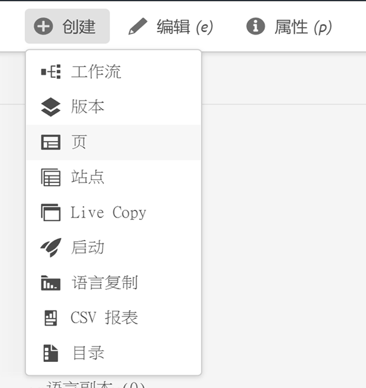
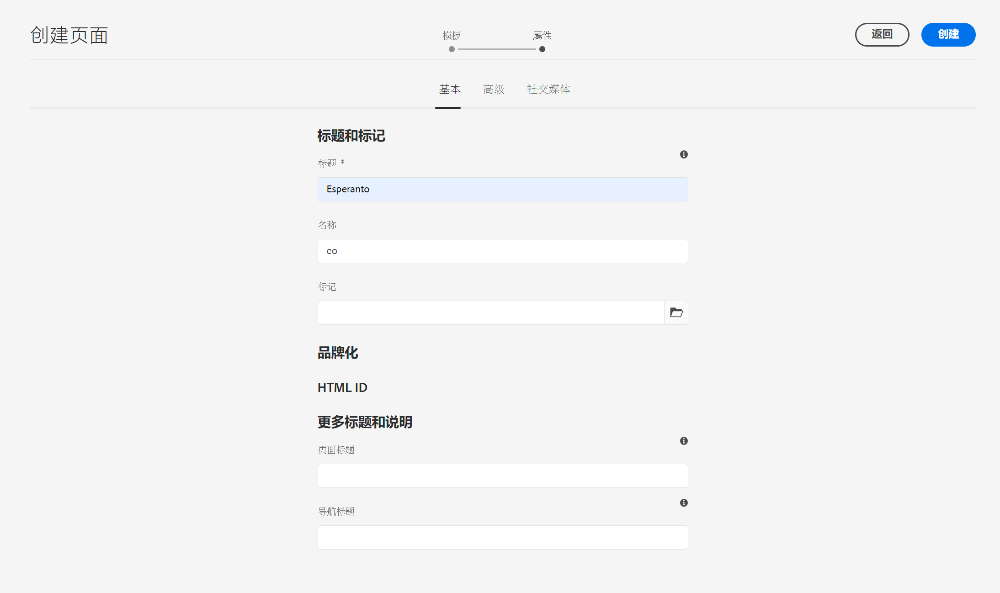
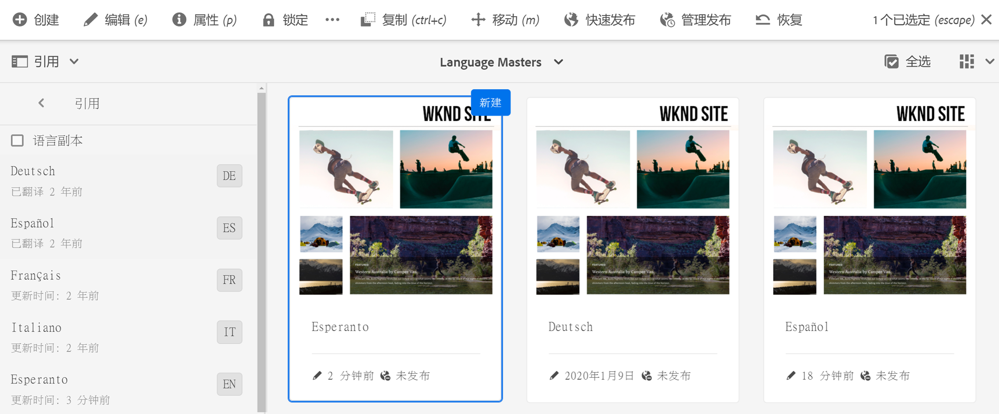
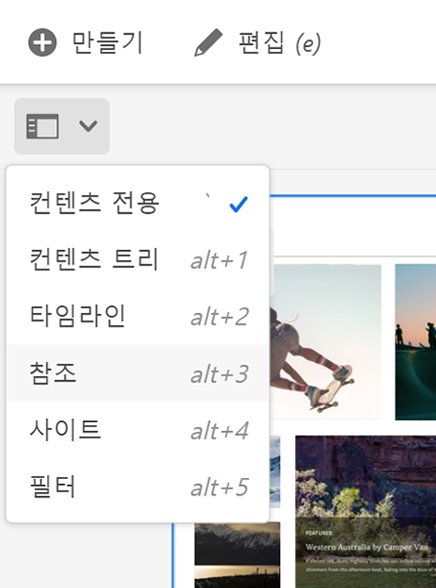

# 번역을 위한 콘텐츠 준비 {#preparing-content-for-translation}

일반적으로 다국어 웹 사이트는 여러 언어로 일정량의 콘텐츠를 제공합니다. 사이트는 하나의 언어로 작성된 다음 다른 언어로 번역됩니다. 일반적으로 다국어 사이트는 페이지 분기로 구성되며, 각 분기에는 서로 다른 언어로 된 사이트 페이지가 포함됩니다.

>[!TIP]
>
>콘텐츠 번역이 처음이라면 AEM의 강력한 번역 도구를 사용한 AEM Sites 콘텐츠 번역을 안내하며 AEM이 없거나 번역 경험이 없는 사용자에게 최적화된 [사이트 번역 여정](/help/journey-sites/translation/overview.md)을 참조하십시오.

[WKND 튜토리얼 사이트](/help/implementing/developing/introduction/develop-wknd-tutorial.md)는 몇 가지 언어 분기를 포함하며 다음과 같은 구조를 사용합니다.

```text
/content
    |- wknd
        |- language-masters
            |- en
            |- de
            |- es
            |- fr
            |- it
        |- us
            |- en
            |- es
        |- ca
            |- en
            |- fr
        |- ch
            |- de
            |- fr
            |- it
        |- de
            |- de
        |- fr
            |- fr
        |- es
            |- es
        |- it
            |- it
```

처음 사이트 콘텐츠를 작성하는 언어 사본은 언어 마스터입니다. 언어 마스터는 다른 언어로 번역되는 소스입니다.

각각의 사이트 언어 분기를 언어 사본이라고 합니다. 언어 루트라고도 하는 언어 사본의 루트 페이지는 언어 사본에 있는 콘텐츠의 언어를 식별합니다. 예를 들어 `/content/wknd/fr`은 프랑스어 언어 사본의 언어 루트입니다. 언어 사본은 소스 사이트 번역 시 올바른 언어가 타겟팅되도록 [올바르게 구성된 언어 루트](preparation.md#creating-a-language-root)를 사용해야 합니다.

다음 단계를 사용하여 사이트 번역을 준비하십시오.

1. 언어 마스터의 언어 루트를 만듭니다. 예를 들어 영어 WKND 데모 사이트의 언어 루트는 `/content/wknd/language-masters/en`입니다. 언어 루트는 [언어 루트 만들기](preparation.md#creating-a-language-root)에 기재된 정보에 따라 올바르게 구성되어야 합니다.
1. 언어 마스터의 콘텐츠를 작성합니다.
1. 사이트에 대한 각 언어 사본의 언어 루트를 만듭니다. 예를 들어 WKND 샘플 사이트의 프랑스어 언어 사본은 `/content/wknd/language-masters/fr`입니다.

번역을 위한 콘텐츠를 준비한 다음에는 언어 사본 및 관련 번역 프로젝트에서 누락된 페이지를 자동으로 만들 수 있습니다. ([번역 프로젝트 만들기](managing-projects.md)를 참조하십시오.) AEM 콘텐츠 번역 프로세스의 개요를 확인하려면 [다국어 웹 사이트를 위한 콘텐츠 번역](overview.md)을 살펴보십시오.

## 언어 루트 만들기 {#creating-a-language-root}

언어 루트를 콘텐츠의 언어를 식별하는 언어 사본의 루트 페이지로 만듭니다. 언어 루트를 만든 다음에는 언어 사본이 포함된 번역 프로젝트를 만들 수 있습니다.

언어 루트를 만들려면 페이지를 만들고 ISO 언어 코드를 **이름** 속성 값으로 사용합니다. 언어 코드는 다음 형식 중 하나여야 합니다.

* `<language-code>` - 지원되는 언어 코드는 ISO-639-1에서 정의된 두 자리 코드입니다(예: `en`).
* `<language-code>_<country-code>` 또는 `<language-code>-<country-code>` - 지원되는 국가 코드는 ISO 3166에서 정의된 소문자 또는 대문자 두 자리 코드입니다(예: `en_US`, `en_us`, `en_GB`, `en-gb`).

전역 사이트에 대해 선택한 구조에 따라 두 형식 중 하나를 사용할 수 있습니다. 예를 들어 WKND 샘플 사이트의 프랑스어 언어 사본의 루트 페이지에는 **이름** 속성인 `fr`이 있습니다. **이름** 속성은 저장소의 페이지 노드 이름으로 사용되므로 페이지 경로를 결정합니다(`http://<host>:<4502>/content/wknd/language-masters/fr.html`).

1. 사이트로 이동합니다.
1. 언어 사본을 만들려는 사이트를 클릭하거나 탭합니다.
1. **만들기**&#x200B;를 클릭하거나 탭한 다음 **페이지**&#x200B;를 클릭하거나 탭합니다.

   

1. 페이지 템플릿을 선택하고 **다음**&#x200B;을 클릭하거나 탭합니다.
1. **이름** 필드에 국가 코드를 `<language-code>` 또는 `<language-code>_<country-code>`의 형식으로 입력합니다(예: `en`, `en_US`, `en_us`, `en_GB`, `en_gb`). 페이지 제목을 입력합니다.

   

1. **만들기**&#x200B;를 클릭하거나 탭합니다. 확인 대화 상자에서 **완료**&#x200B;를 클릭하거나 탭하여 사이트 콘솔로 돌아가거나, **열기**&#x200B;를 클릭하거나 탭하여 언어 사본을 엽니다.

## 언어 루트 상태 보기 {#seeing-the-status-of-language-roots}

AEM은 생성된 언어 루트 목록을 표시하는 **참조** 레일을 제공합니다.



다음 절차를 통해 [레일 선택기](/help/sites-cloud/authoring/getting-started/basic-handling.md#rail-selector)를 사용하여 페이지의 언어 사본을 볼 수 있습니다.

1. 사이트 콘솔에서 사이트의 페이지를 선택한 다음 **참조**&#x200B;를 클릭하거나 탭합니다.

   

1. 참조 레일에서 **언어 사본**&#x200B;을 클릭하거나 탭합니다. 레일에 웹 사이트의 언어 사본이 표시됩니다.

## 여러 수준의 언어 사본 {#multiple-levels}

언어 루트를 언어 사본의 루트로 인식되도록 유지하면서 노드 아래에 그룹화할 수도 있습니다(예: 그룹별).

```text
/content
    |- wknd
        |- language-masters
            |- europe
                |- de
                |- fr
                |- it
                |- es
                ]- pt
            |- americas
                |- en
                |- es
                |- fr
                |- pt
            |- asia
                |- ...
            |- africa
                |- ...
            |- oceania
                |- ...
        |- europe
        |- americas
        |- asia
        |- africa
        |- oceania            
```

>[!NOTE]
>
>하나의 수준만 허용됩니다. 예를 들어 다음과 같은 경우에는 `es` 페이지가 언어 사본으로 확인되지 않습니다.
>
>* `/content/wknd/language-masters/en`
>* `/content/wknd/language-masters/americas/central-america/es`
>
> 이 `es` 언어 사본은 `en` 노드와 2수준 떨어져 있으므로(`americas/central-america`) 감지되지 않습니다.

>[!TIP]
>
>이러한 설정에서 언어 루트는 언어의 ISO 코드가 아닌 페이지 이름을 가질 수 있습니다. AEM은 항상 경로와 이름을 먼저 확인하지만, 페이지 이름이 언어를 식별하지 않을 경우 AEM은 언어 식별을 위해 페이지의 `cq:language` 속성을 확인합니다.
