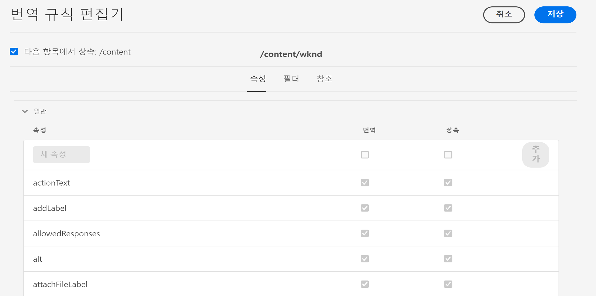
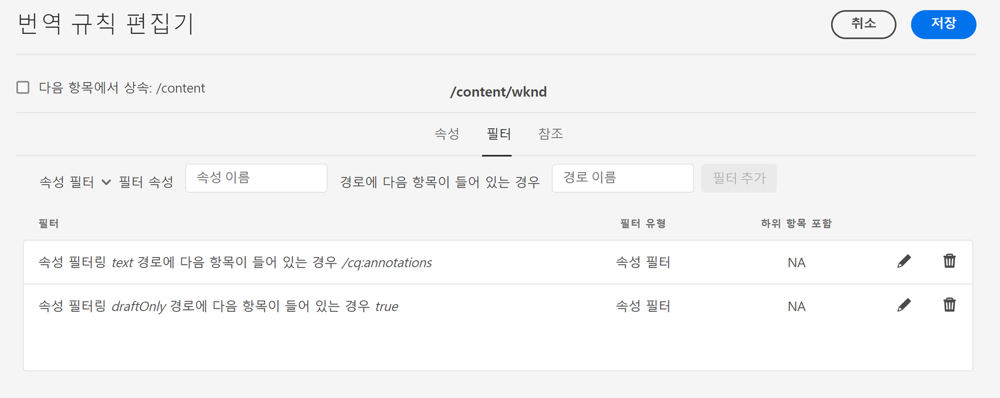

# 번역할 콘텐츠 식별 {#identifying-content-to-translate}

번역 규칙은 번역 프로젝트에 포함되어 있거나 번역 프로젝트에서 제외된 페이지, 구성 요소 및 에셋에 대해 번역할 콘텐츠를 식별합니다. 페이지 또는 에셋이 번역될 때 AEM은 이 콘텐츠를 추출하여 번역 서비스로 전송될 수 있도록 합니다.

>[!TIP]
>
>콘텐츠 번역이 처음이라면 다음을 참조하십시오. [사이트 번역 여정,](/help/journey-sites/translation/overview.md) 는 AEM 강력한 번역 도구를 사용한 AEM Sites 콘텐츠 번역을 안내하며 AEM 또는 번역 경험이 없는 사용자에게 이상적입니다.

## 콘텐츠 조각 및 번역 규칙 {#content-fragments}

이 문서에 설명된 번역 규칙은 **번역에 대해 콘텐츠 모델 필드 사용** 옵션이 [번역 통합 프레임워크 구성 수준](integration-framework.md#assets-configuration-properties)에서 활성화되지 않은 경우에만 콘텐츠 조각에 적용됩니다.

**번역에 대해 콘텐츠 모델 필드 사용** 옵션이 활성화된 경우, AEM은 [콘텐츠 조각 모델](/help/sites-cloud/administering/content-fragments/content-fragments-models.md#properties)에서 **번역 가능** 필드를 사용하여 해당 필드를 번역할지 여부를 결정하고 그에 따라 자동으로 번역 규칙을 생성합니다. 이 옵션을 사용하면 이전에 생성한 모든 번역 규칙이 대체되며 여기에는 개입이나 추가 단계가 필요하지 않습니다.

번역 규칙을 사용하여 콘텐츠 조각을 번역하려면 번역 통합 프레임워크 구성의 **번역에 대해 콘텐츠 모델 필드 사용** 옵션이 비활성화되어 있어야 하며 아래 설명된 단계를 따라 규칙을 생성해야 합니다.

## 개요 {#overview}

페이지 및 에셋은 JCR 저장소의 노드로 표시됩니다. 추출되는 콘텐츠는 하나 이상의 노드 속성 값입니다. 번역 규칙은 추출할 콘텐츠가 포함된 속성을 식별합니다.

번역 규칙은 XML 형식으로 표시되며 다음과 같은 위치에 저장됩니다.

* `/libs/settings/translation/rules/translation_rules.xml`
* `/apps/settings/translation/rules/translation_rules.xml`
* `/conf/global/settings/translation/rules/translation_rules.xml`

파일은 모든 번역 프로젝트에 적용됩니다.

규칙에는 다음과 같은 정보가 포함됩니다.

* 규칙이 적용되는 노드의 경로
   * 규칙은 노드의 하위 항목에도 적용됩니다.
* 번역할 콘텐츠가 포함된 노드 속성의 이름
   * 속성은 특정 리소스 타입 또는 모든 리소스 타입에 한정될 수 있습니다.

예를 들어 작성자가 페이지의 모든 텍스트 구성 요소에 추가하는 콘텐츠를 번역하는 규칙을 생성할 수 있습니다. 규칙은 `core/wcm/components/text/v2/text` 구성 요소에 대한 `/content` 노드 및 `text` 속성을 식별할 수 있습니다.

번역 규칙을 구성하기 위해 추가된 [콘솔](#translation-rules-ui)이 있습니다. UI의 정의에 의해 파일이 채워집니다.

AEM 콘텐츠 번역 기능의 개요를 확인하려면 [다국어 사이트를 위한 콘텐츠 번역](overview.md)을 살펴보십시오.

>[!NOTE]
>
>AEM은 페이지에서 참조된 콘텐츠의 번역을 위해 리소스 유형과 참조 속성 간의 일대일 매핑을 지원합니다.

## 페이지, 구성 요소 및 에셋에 대한 규칙 구문 {#rule-syntax-for-pages-components-and-assets}

규칙은 하나 이상의 하위 `property` 요소 또는 0개 이상의 하위 `node` 요소가 있는 `node` 요소입니다.

```xml
<node path="content path">
          <property name="property name" [translate="false"]/>
          <node resourceType="component path" >
               <property name="property name" [translate="false"]/>
          </node>
</node>
```

이러한 각 `node` 요소는 다음과 같은 특성을 가지고 있습니다.

* `path` 속성에는 규칙이 적용될 분기의 루트 노드로의 경로가 포함됩니다.
* 하위 `property` 요소는 모든 리소스 유형에 대해 번역할 노드 속성을 식별합니다.
   * `name` 속성에는 속성 이름이 포함됩니다.
   * 선택 사항인 `translate` 속성은 번역되어 있지 않은 경우 `false`와 같습니다. 기본값은 `true`입니다. 이 속성은 이전 규칙을 오버라이드할 때 유용합니다.
* 하위 `node` 요소는 특정 리소스 유형에 대해 번역할 노드 속성을 식별합니다.
   * `resourceType` 속성에는 리소스 유형을 구현하는 구성 요소로 확인되는 경로가 포함됩니다.
   * 하위 `property` 요소는 번역할 노드 속성을 식별합니다. 이 노드를 노드 규칙에 대해 하위 `property` 요소와 동일한 방식으로 사용하십시오.

다음과 같은 예시 규칙을 사용하면 모든 `text` 속성의 콘텐츠가 `/content` 노드 아래의 모든 페이지에 대해 번역됩니다. 이 규칙은 텍스트 구성 요소와 같이 `text` 속성에 콘텐츠를 저장하는 모든 구성 요소에 대해 적용됩니다.

```xml
<node path="/content">
          <property name="text"/>
</node>
```

다음 예는 모든 `text` 속성의 콘텐츠와 함께 이미지 구성 요소의 다른 속성도 번역합니다. 다른 구성 요소에 이름이 같은 속성이 있는 경우 규칙이 적용되지 않습니다.

```xml
<node path="/content">
      <property name="text"/>
      <node resourceType="core/wcm/components/image/v2/image">
         <property name="image/alt"/>
         <property name="image/jcr:description"/>
         <property name="image/jcr:title"/>
      </node>
</node>
```

## 페이지에서 에셋을 추출하기 위한 규칙 구문  {#rule-syntax-for-extracting-assets-from-pages}

다음 규칙 구문을 사용하여 구성 요소에 임베드되거나 구성 요소에서 참조되는 에셋을 포함할 수 있습니다.

```xml
<assetNode resourceType="path to component" assetReferenceAttribute="property that stores asset"/>
```

각 `assetNode` 요소는 다음과 같은 특성을 가지고 있습니다.

* 구성 요소로 확인되는 경로와 동일한 `resourceType` 속성
* 에셋 바이너리(임베드된 에셋의 경우) 또는 참조된 에셋으로의 경로를 저장하는 속성의 이름과 동일한 `assetReferenceAttribute` 속성

다음 예는 이미지 구성 요소에서 이미지를 추출합니다.

```xml
<assetNode resourceType="core/wcm/components/image/v2/image" assetReferenceAttribute="fileReference"/>
```

## 오버라이드 규칙 {#overriding-rules}

`translation_rules.xml` 파일은 여러 개의 하위 `node` 요소가 있는 `nodelist` 요소로 구성됩니다. AEM은 노드 목록을 위쪽에서 아래쪽으로 읽습니다. 여러 규칙이 동일한 노드를 대상으로 하는 경우 파일에서 아래쪽에 있는 규칙이 사용됩니다. 예를 들어 다음 규칙을 사용하면 페이지의 `/content/mysite/en` 분기를 제외한 `text` 속성의 모든 콘텐츠가 번역됩니다.

```xml
<nodelist>
     <node path="/content">
           <property name="text" />
     </node>
     <node path="/content/mysite/en">
          <property name="text" translate="false" />
     </node>
<nodelist>
```

## 속성 필터링 {#filtering-properties}

`filter` 요소를 사용하여 특정 속성이 있는 노드를 필터링할 수 있습니다.

예를 들어 다음 규칙을 사용하면 속성 `draft`가 `true`로 설정되어 있는 노드를 제외한 `text` 속성의 모든 콘텐츠가 번역됩니다.

```xml
<nodelist>
    <node path="/content">
     <filter>
   <node containsProperty="draft" propertyValue="true" />
     </filter>
        <property name="text" />
    </node>
<nodelist>
```

## 번역 규칙 UI {#translation-rules-ui}

번역 규칙을 구성할 때 콘솔을 사용할 수도 있습니다.

다음 방법으로 액세스할 수 있습니다.

1. **도구**&#x200B;로 이동한 다음 **일반**&#x200B;으로 이동합니다.

1. **번역 구성**&#x200B;을 선택합니다.

번역 규칙 UI에서 다음과 같은 작업을 수행할 수 있습니다.

1. **컨텍스트 추가**: 경로를 추가할 수 있습니다.

   

1. 경로 브라우저를 사용하여 필요한 컨텍스트를 선택한 다음 **확인** 버튼을 탭하거나 클릭하여 저장합니다.

   

1. 그런 다음 컨텍스트를 선택하고 **편집**&#x200B;을 선택해야 합니다. 이렇게 하면 번역 규칙 편집기가 열립니다.

   

UI를 통해 변경할 수 있는 속성에는 네 가지가 있습니다.

* `isDeep`
* `inherit`
* `translate`
* `updateDestinationLanguage`

### isDeep {#isdeep}

**`isDeep`**&#x200B;은 노드 필터에 적용할 수 있으며 기본값은 true입니다. 노드(또는 상위 항목)에 필터에 지정된 속성 값이 있는 속성이 포함되어 있는지 확인합니다. false인 경우 현재 노드에서만 확인합니다.

예를 들어 상위 노드에 속성이 있는 경우에도 하위 노드가 번역 작업에 추가됩니다 `draftOnly` 초안 콘텐츠에 플래그를 지정하려면 true로 설정합니다. 여기서 `isDeep`이 생성되어 상위 노드에 true인 속성 `draftOnly`가 있는지 확인하고 이들 하위 노드를 제외합니다.

편집기에서, **필터** 탭에서 **Is Deep**&#x200B;을 선택/선택 취소할 수 있습니다.



다음은 UI에서 **Is Deep**&#x200B;이 선택 해제된 경우 나타나는 XML의 예입니다.

```xml
 <filter>
    <node containsProperty="draftOnly" isDeep="false" propertyValue="true"/>
</filter>
```

### 상속 {#inherit}

**`inherit`**&#x200B;은 속성에 적용됩니다. 기본적으로 모든 속성은 상속되며, 몇몇 속성이 하위 속성에 상속되지 않도록 하려면 이 속성을 false로 표시하여 특정 노드에만 적용되도록 할 수 있습니다.

UI에서, **속성** 탭에서 **상속**&#x200B;을 선택/선택 취소할 수 있습니다.

### 번역 {#translate}

**`translate`**&#x200B;을 사용하여 속성을 번역할지 여부를 지정할 수 있습니다.

UI에서, **속성** 탭에서 **번역**&#x200B;을 선택/선택 취소할 수 있습니다.

### updateDestinationLanguage {#updatedestinationlanguage}

**`updateDestinationLanguage`**&#x200B;는 `jcr:language`와 같이 텍스트가 아닌 언어 코드가 있는 속성에 대해 사용됩니다. 사용자는 텍스트가 아닌 언어 로케일을 소스에서 대상으로 번역하는 것입니다. 이러한 속성은 번역용으로 전송되지 않습니다.

UI에서, **속성** 탭에서 **번역**&#x200B;을 선택/선택 해제하여 이 값을 수정할 수 있지만, 여기에는 언어 코드를 값으로 하는 특정 속성만 해당됩니다.

`updateDestinationLanguage`와 `translate` 간의 차이점을 명확하게 이해하기 위해, 2개의 규칙만을 가진 컨텍스트를 예로 들어보겠습니다.


XML의 결과는 다음과 같이 표시됩니다.

```xml
<property inherit="true" name="text" translate="true" updateDestinationLanguage="false"/>
<property inherit="true" name="jcr:language" translate="false" updateDestinationLanguage="true"/>
```

## 수동으로 규칙 파일 편집 {#editing-the-rules-file-manually}

AEM과 함께 설치되는 `translation_rules.xml` 파일에는 기본 번역 규칙 세트가 포함되어 있습니다. 번역 프로젝트 요구 사항을 지원하도록 파일을 편집할 수 있습니다. 예를 들어 규칙을 추가하여 사용자 정의 구성 요소의 콘텐츠가 번역되도록 할 수 있습니다.

`translation_rules.xml` 파일을 편집하는 경우 콘텐츠 패키지에 백업 사본을 보관해 두십시오. 특정 AEM 패키지를 다시 설치하면 현재 `translation_rules.xml` 파일이 원본 파일로 대체될 수 있습니다. 이러한 상황에서 규칙을 복원하기 위해 백업 사본이 포함된 패키지를 설치할 수 있습니다.

>[!NOTE]
>
>콘텐츠 패키지를 제작한 후 파일을 편집할 때마다 패키지를 다시 빌드할 수 있습니다.

## 예제 번역 규칙 파일 {#example-translation-rules-file}

```xml
<?xml version="1.0" encoding="UTF-8"?><nodelist>
  <node path="/content">
    <property name="addLabel"/>
    <property name="allowedResponses"/>
    <property name="alt"/>
    <property name="attachFileLabel"/>
    <property name="benefits"/>
    <property name="buttonLabel"/>
    <property name="chartAlt"/>
    <property name="confirmationMessageToggle"/>
    <property name="confirmationMessageUntoggle"/>
    <property name="constraintMessage"/>
    <property name="contentLabel"/>
    <property name="denyText"/>
    <property name="detailDescription"/>
    <property name="emptyText"/>
    <property name="helpMessage"/>
    <property name="image/alt"/>
    <property name="image/jcr:description"/>
    <property name="image/jcr:title"/>
    <property name="jcr:description"/>
    <property name="jcr:title"/>
    <property name="heading"/>
    <property name="label"/>
    <property name="main"/>
    <property name="listLabel"/>
    <property name="moreText"/>
    <property name="pageTitle"/>
    <property name="placeholder"/>
    <property name="requiredMessage"/>
    <property name="resetTitle"/>
    <property name="subjectLabel"/>
    <property name="subtitle"/>
    <property name="tableData"/>
    <property name="text"/>
    <property name="title"/>
    <property name="navTitle"/>
    <property name="titleDivContent"/>
    <property name="toggleLabel"/>
    <property name="transitionLabel"/>
    <property name="untoggleLabel"/>
    <property name="name"/>
    <property name="occupations"/>
    <property name="greetingLabel"/>
    <property name="signInLabel"/>
    <property name="signOutLabel"/>
    <property name="pretitle"/>
    <property name="cq:panelTitle"/>
    <property name="actionText"/>
    <property name="cq:language" updateDestinationLanguage="true"/>
    <node pathContains="/cq:annotations">
      <property name="text" translate="false"/>
    </node>
    <node path="/content/wknd"/>
  </node>
  <node path="/content/forms">
    <property name="text" translate="false"/>
  </node>
  <node path="/content/dam">
    <property name="dc:description"/>
    <property name="dc:rights"/>
    <property name="dc:subject"/>
    <property name="dc:title"/>
    <property name="defaultContent"/>
    <property name="jcr:description"/>
    <property name="jcr:title"/>
    <property name="pdf:Title"/>
    <property name="xmpRights:UsageTerms"/>
    <property name="main"/>
    <property name="adventureActivity"/>
    <property name="adventureDescription"/>
    <property name="adventureDifficulty"/>
    <property name="adventureGearList"/>
    <property name="adventureGroupSize"/>
    <property name="adventureItinerary"/>
    <property name="adventurePrice"/>
    <property name="adventureTitle"/>
    <property name="adventureTripLength"/>
    <property name="adventureType"/>
    <node pathContains="/jcr:content/metadata/predictedTags">
      <property name="name"/>
    </node>
  </node>
  <assetNode assetReferenceAttribute="fragmentPath" resourceType="cq/experience-fragments/editor/components/experiencefragment"/>
  <assetNode assetReferenceAttribute="fragmentVariationPath" resourceType="core/wcm/components/experiencefragment/v1/experiencefragment"/>
  <assetNode assetReferenceAttribute="fileReference" resourceType="dam/cfm/components/contentfragment"/>
  <assetNode resourceType="docs/components/download"/>
  <assetNode resourceType="docs/components/image"/>
  <assetNode assetReferenceAttribute="fileReference" resourceType="foundation/components/image"/>
  <assetNode assetReferenceAttribute="asset" resourceType="foundation/components/video"/>
  <assetNode assetReferenceAttribute="fileReference" resourceType="foundation/components/download"/>
  <assetNode assetReferenceAttribute="fileReference" resourceType="core/wcm/components/download/v1/download"/>
  <assetNode assetReferenceAttribute="fileReference" resourceType="wcm/foundation/components/image"/>
  <assetNode assetReferenceAttribute="fragmentPath" resourceType="core/wcm/components/contentfragment/v1/contentfragment"/>
  <assetNode assetReferenceAttribute="fileReference" resourceType="core/wcm/components/image/v2/image"/>
</nodelist>
```
