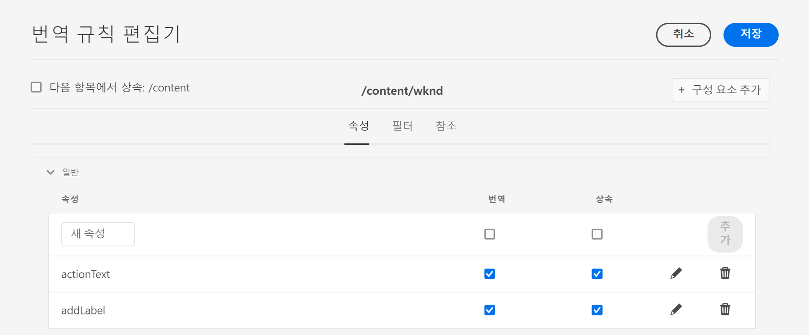

# {#identifying-content-to-translate} 번역할 컨텐츠 식별

번역 규칙은 번역 프로젝트에 포함되거나 번역 프로젝트에서 제외되는 페이지, 구성 요소 및 자산에 대해 번역할 컨텐츠를 식별합니다. 페이지 또는 자산을 번역하는 경우, AEM은 이 컨텐츠를 추출하여 번역 서비스로 전송할 수 있습니다.

페이지와 자산은 JCR 저장소의 노드로 표시됩니다. 추출되는 컨텐츠는 노드의 속성 값을 하나 이상 나타냅니다. 번역 규칙은 추출할 컨텐츠가 포함된 속성을 식별합니다.

번역 규칙은 XML 형식으로 표현되며 다음과 같은 위치에 저장됩니다.

* `/libs/settings/translation/rules/translation_rules.xml`
* `/apps/settings/translation/rules/translation_rules.xml`
* `/conf/global/settings/translation/rules/translation_rules.xml`

이 파일은 모든 번역 프로젝트에 적용됩니다.

규칙에는 다음 정보가 포함됩니다.

* 규칙이 적용되는 노드의 경로
   * 이 규칙은 노드의 하위 노드에도 적용됩니다.
* 변환할 컨텐츠가 포함된 노드 속성의 이름
   * 속성은 특정 리소스 유형이나 모든 리소스 유형에 따라 달라질 수 있습니다.

예를 들어 작성자가 페이지의 모든 텍스트 구성 요소에 추가하는 컨텐츠를 변환하는 규칙을 만들 수 있습니다. 규칙은 `core/wcm/components/text/v2/text` 구성 요소의 `/content` 노드 및 `text` 속성을 식별할 수 있습니다.

번역 규칙을 구성하기 위해 추가된 [콘솔](#translation-rules-ui)이 있습니다. UI의 정의가 파일을 자동으로 채웁니다.

AEM의 콘텐츠 번역 기능에 대한 개요는 [다국어 사이트에 대한 콘텐츠 번역](overview.md)을 참조하십시오.

>[!NOTE]
>
>AEM은 페이지에서 참조되는 컨텐츠를 번역하기 위해 리소스 유형과 참조 속성 간의 1 대 1 매핑을 지원합니다.

## 페이지, 구성 요소 및 자산 {#rule-syntax-for-pages-components-and-assets} 규칙 구문

규칙은 하나 이상의 하위 `property` 요소와 0개 이상의 하위 `node` 요소가 있는 `node` 요소입니다.

```xml
<node path="content path">
          <property name="property name" [translate="false"]/>
          <node resourceType="component path" >
               <property name="property name" [translate="false"]/>
          </node>
</node>
```

이러한 `node` 요소 각에는 다음과 같은 특성이 있습니다.

* `path` 속성에는 규칙이 적용되는 분기의 루트 노드에 대한 경로가 포함됩니다.
* 하위 `property` 요소는 모든 리소스 유형에 대해 변환할 노드 속성을 식별합니다.
   * `name` 속성에는 속성 이름이 포함되어 있습니다.
   * 선택적 `translate` 속성은 속성이 변환되지 않으면 `false`과 같습니다. 기본적으로 값은 `true`입니다. 이 속성은 이전 규칙을 덮어쓸 때 유용합니다.
* 하위 `node` 요소는 특정 리소스 유형에 대해 변환할 노드 속성을 식별합니다.
   * `resourceType` 속성에는 리소스 유형을 구현하는 구성 요소로 확인되는 경로가 포함됩니다.
   * 자식 `property` 요소는 변환할 노드 속성을 식별합니다. 노드 규칙의 하위 `property` 요소와 같은 방법으로 이 노드를 사용하십시오.

다음 예제 규칙은 `/content` 노드 아래의 모든 페이지에 대해 모든 `text` 속성의 컨텐츠를 번역하도록 합니다. 규칙은 텍스트 구성 요소와 같이 `text` 속성에 컨텐츠를 저장하는 모든 구성 요소에 효과적입니다.

```xml
<node path="/content">
          <property name="text"/>
</node>
```

다음 예제에서는 모든 `text` 속성의 컨텐츠를 번역하고 이미지 구성 요소의 다른 속성을 변환합니다. 다른 구성 요소에 이름이 같은 속성이 있는 경우 해당 규칙이 해당 구성 요소에 적용되지 않습니다.

```xml
<node path="/content">
      <property name="text"/>
      <node resourceType="core/wcm/components/image/v2/image">
         <property name="image/alt"/>
         <property name="image/jcr:description"/>
         <property name="image/jcr:title"/>
      </node>
</node>
```

## {#rule-syntax-for-extracting-assets-from-pages} 페이지에서 에셋을 추출하기 위한 규칙 구문

다음 규칙 구문을 사용하여 구성 요소에 포함되거나 구성 요소에서 참조되는 자산을 포함할 수 있습니다.

```xml
<assetNode resourceType="path to component" assetReferenceAttribute="property that stores asset"/>
```

각 `assetNode` 요소에는 다음과 같은 특성이 있습니다.

* 구성 요소로 확인되는 경로와 동일한 `resourceType` 속성 하나
* 자산 이진(포함된 자산에 대해)을 저장하는 속성 이름 또는 참조된 자산에 대한 경로와 같은 `assetReferenceAttribute` 속성 중 하나

다음 예제에서는 이미지 구성 요소에서 이미지를 추출합니다.

```xml
<assetNode resourceType="core/wcm/components/image/v2/image" assetReferenceAttribute="fileReference"/>
```

## 규칙 무시 {#overriding-rules}

`translation_rules.xml` 파일은 여러 하위 `node` 요소가 있는 `nodelist` 요소로 구성됩니다. AEM은 노드 목록을 위에서 아래로 읽습니다. 여러 규칙이 동일한 노드를 타깃팅하면 파일에서 낮은 규칙이 사용됩니다. 예를 들어, 다음 규칙은 `/content/mysite/en` 페이지 분기를 제외한 `text` 속성의 모든 컨텐츠를 번역하도록 합니다.

```xml
<nodelist>
     <node path="/content”>
           <property name="text" />
     </node>
     <node path=“/content/mysite/en”>
          <property name=“text” translate=“false" />
     </node>
<nodelist>
```

## 속성 필터링 {#filtering-properties}

`filter` 요소를 사용하여 특정 속성이 있는 노드를 필터링할 수 있습니다.

예를 들어 다음 규칙은 `draft` 속성이 `true`로 설정된 노드를 제외하고 `text` 속성의 모든 콘텐츠를 번역하도록 합니다.

```xml
<nodelist>
    <node path="/content”>
     <filter>
   <node containsProperty="draft" propertyValue="true" />
     </filter>
        <property name="text" />
    </node>
<nodelist>
```

## 번역 규칙 UI {#translation-rules-ui}

번역 규칙을 구성하는 데에도 콘솔을 사용할 수 있습니다.

액세스 방법:

1. **도구**&#x200B;로 이동한 다음 **일반**&#x200B;으로 이동합니다.

1. **번역 구성**&#x200B;을 선택합니다.

번역 규칙 UI에서 다음을 수행할 수 있습니다.

1. **경로를 추가할 수** 있는 컨텍스트를 추가합니다.

   

1. 경로 브라우저를 사용하여 필요한 컨텍스트를 선택하고 **확인** 단추를 탭하거나 클릭하여 저장합니다.

   

1. 그런 다음 컨텍스트를 선택한 다음 **편집**&#x200B;을 클릭합니다. 그러면 번역 규칙 편집기가 열립니다.

   

UI를 통해 변경할 수 있는 4가지 속성이 있습니다.

* `isDeep`
* `inherit`
* `translate`
* `updateDestinationLanguage`

### isDeep {#isdeep}

**`isDeep`**  은 노드 필터에 적용되며 기본적으로 true입니다. 노드(또는 해당 상위 노드)에 필터에 지정된 속성 값을 가진 속성이 있는지 확인합니다. false이면 현재 노드에서만 확인합니다.

예를 들어, 초안 내용에 플래그를 지정하기 위해 부모 노드가 `draftOnly` 속성이 true로 설정된 경우에도 자식 노드가 번역 작업에 추가됩니다. 여기서 `isDeep`은(는) play를 시작하고 상위 노드의 속성 `draftOnly`이(가) true이고 해당 하위 노드를 제외하는지 확인합니다.

편집기에서 **필터** 탭에서 **깊이**&#x200B;를 선택/선택 취소할 수 있습니다.


다음은 UI에서 **Is Deep**&#x200B;이(가) 선택 취소된 결과 XML의 예입니다.

```xml
 <filter>
    <node containsProperty="draftOnly" isDeep="false" propertyValue="true"/>
</filter>
```

### 상속 {#inherit}

**`inherit`** 는 속성에 적용할 수 있습니다. 기본적으로 모든 속성은 상속되지만 일부 속성을 자식으로 상속하지 않으려면 이 속성을 false로 표시하여 특정 노드에만 적용할 수 있습니다.

UI에서 **속성** 탭에서 **상속**&#x200B;을 선택/선택 취소할 수 있습니다.

### translate {#translate}

**`translate`** 는 속성을 번역할지 여부를 지정하는 데 사용됩니다.

UI에서 **속성** 탭에서 **번역**&#x200B;을 선택/선택 취소할 수 있습니다.

### updateDestinationLanguage {#updatedestinationlanguage}

**`updateDestinationLanguage`** 은 텍스트가 아닌 언어 코드가 있는 속성에 사용됩니다(예:  `jcr:language`). 사용자가 텍스트를 번역하지 않고 언어 로케일을 소스에서 대상으로 번역합니다. 이러한 속성은 변환용으로 전송되지 않습니다.

UI에서는 **속성** 탭에서 **번역**&#x200B;을 선택/선택 취소하여 이 값을 수정할 수 있지만 언어 코드를 값으로 포함하는 특정 속성의 경우에는 이 값을 수정할 수 있습니다.

`updateDestinationLanguage`과 `translate` 간의 차이를 명확히 하기 위해 다음은 두 개의 규칙만 있는 컨텍스트의 간단한 예입니다.



xml의 결과는 다음과 같습니다.

```xml
<property inherit="true" name="text" translate="true" updateDestinationLanguage="false"/>
<property inherit="true" name="jcr:language" translate="false" updateDestinationLanguage="true"/>
```

## 규칙 파일을 수동으로 편집 {#editing-the-rules-file-manually}

AEM과 함께 설치되는 `translation_rules.xml` 파일에는 기본 변환 규칙 세트가 포함되어 있습니다. 번역 프로젝트의 요구 사항을 지원하기 위해 파일을 편집할 수 있습니다. 예를 들어 사용자 지정 구성 요소의 컨텐츠가 번역되도록 규칙을 추가할 수 있습니다.

`translation_rules.xml` 파일을 편집하는 경우 백업 복사본을 콘텐트 패키지에 보관합니다. 특정 AEM 패키지를 다시 설치하면 현재 `translation_rules.xml` 파일을 원본으로 바꿀 수 있습니다. 이러한 상황에서 규칙을 복원하려면 백업 복사본이 포함된 패키지를 설치할 수 있습니다.

>[!NOTE]
>
>컨텐츠 패키지를 만든 후 파일을 편집할 때마다 패키지를 다시 빌드합니다.

## 번역 규칙 파일 예 {#example-translation-rules-file}

```xml
<?xml version="1.0" encoding="UTF-8"?><nodelist>
  <node path="/content">
    <property name="addLabel"/>
    <property name="allowedResponses"/>
    <property name="alt"/>
    <property name="attachFileLabel"/>
    <property name="benefits"/>
    <property name="buttonLabel"/>
    <property name="chartAlt"/>
    <property name="confirmationMessageToggle"/>
    <property name="confirmationMessageUntoggle"/>
    <property name="constraintMessage"/>
    <property name="contentLabel"/>
    <property name="denyText"/>
    <property name="detailDescription"/>
    <property name="emptyText"/>
    <property name="helpMessage"/>
    <property name="image/alt"/>
    <property name="image/jcr:description"/>
    <property name="image/jcr:title"/>
    <property name="jcr:description"/>
    <property name="jcr:title"/>
    <property name="heading"/>
    <property name="label"/>
    <property name="main"/>
    <property name="listLabel"/>
    <property name="moreText"/>
    <property name="pageTitle"/>
    <property name="placeholder"/>
    <property name="requiredMessage"/>
    <property name="resetTitle"/>
    <property name="subjectLabel"/>
    <property name="subtitle"/>
    <property name="tableData"/>
    <property name="text"/>
    <property name="title"/>
    <property name="navTitle"/>
    <property name="titleDivContent"/>
    <property name="toggleLabel"/>
    <property name="transitionLabel"/>
    <property name="untoggleLabel"/>
    <property name="name"/>
    <property name="occupations"/>
    <property name="greetingLabel"/>
    <property name="signInLabel"/>
    <property name="signOutLabel"/>
    <property name="pretitle"/>
    <property name="cq:panelTitle"/>
    <property name="actionText"/>
    <property name="cq:language" updateDestinationLanguage="true"/>
    <node pathContains="/cq:annotations">
      <property name="text" translate="false"/>
    </node>
    <node path="/content/wknd"/>
  </node>
  <node path="/content/forms">
    <property name="text" translate="false"/>
  </node>
  <node path="/content/dam">
    <property name="dc:description"/>
    <property name="dc:rights"/>
    <property name="dc:subject"/>
    <property name="dc:title"/>
    <property name="defaultContent"/>
    <property name="jcr:description"/>
    <property name="jcr:title"/>
    <property name="pdf:Title"/>
    <property name="xmpRights:UsageTerms"/>
    <property name="main"/>
    <property name="adventureActivity"/>
    <property name="adventureDescription"/>
    <property name="adventureDifficulty"/>
    <property name="adventureGearList"/>
    <property name="adventureGroupSize"/>
    <property name="adventureItinerary"/>
    <property name="adventurePrice"/>
    <property name="adventureTitle"/>
    <property name="adventureTripLength"/>
    <property name="adventureType"/>
    <node pathContains="/jcr:content/metadata/predictedTags">
      <property name="name"/>
    </node>
  </node>
  <assetNode assetReferenceAttribute="fragmentPath" resourceType="cq/experience-fragments/editor/components/experiencefragment"/>
  <assetNode assetReferenceAttribute="fragmentVariationPath" resourceType="core/wcm/components/experiencefragment/v1/experiencefragment"/>
  <assetNode assetReferenceAttribute="fileReference" resourceType="dam/cfm/components/contentfragment"/>
  <assetNode resourceType="docs/components/download"/>
  <assetNode resourceType="docs/components/image"/>
  <assetNode assetReferenceAttribute="fileReference" resourceType="foundation/components/image"/>
  <assetNode assetReferenceAttribute="asset" resourceType="foundation/components/video"/>
  <assetNode assetReferenceAttribute="fileReference" resourceType="foundation/components/download"/>
  <assetNode assetReferenceAttribute="fileReference" resourceType="core/wcm/components/download/v1/download"/>
  <assetNode assetReferenceAttribute="fileReference" resourceType="wcm/foundation/components/image"/>
  <assetNode assetReferenceAttribute="fragmentPath" resourceType="core/wcm/components/contentfragment/v1/contentfragment"/>
  <assetNode assetReferenceAttribute="fileReference" resourceType="core/wcm/components/image/v2/image"/>
</nodelist>
```
