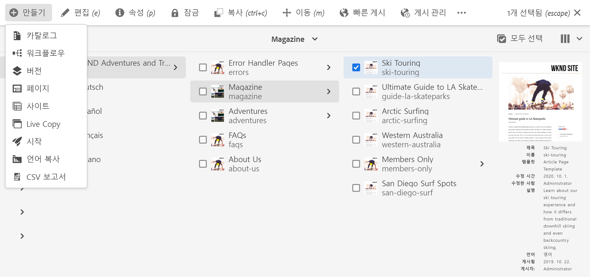
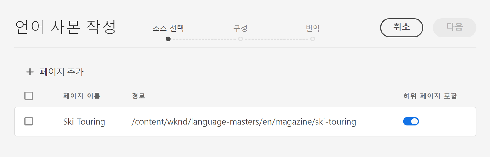
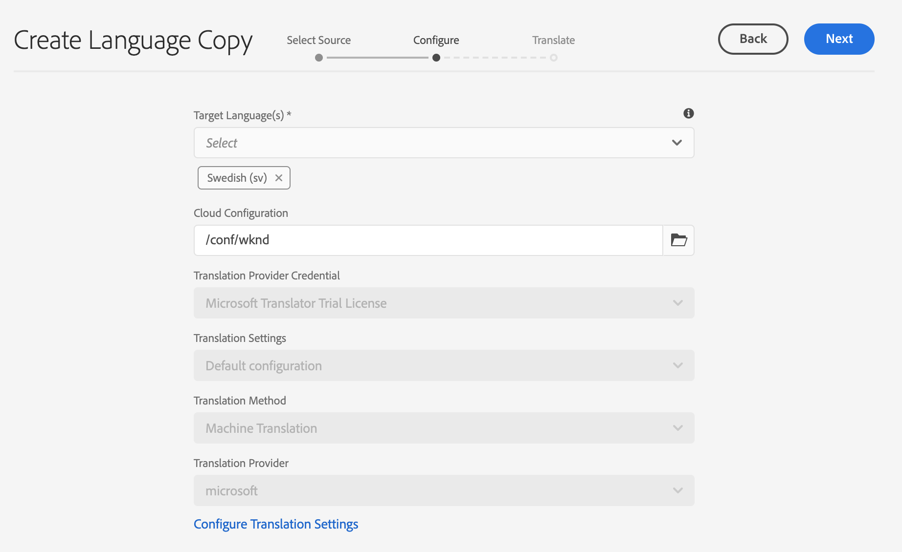
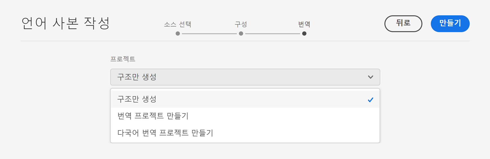
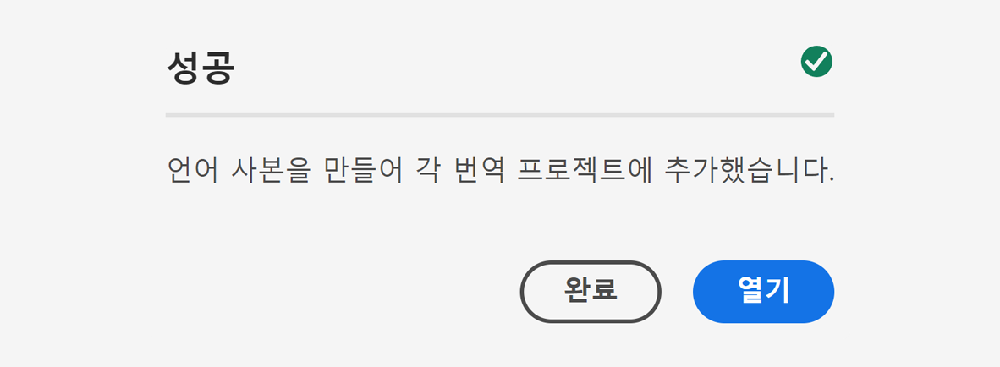

# 언어 복사 마법사 {#language-copy-wizard}

언어 복사 마법사는 다국어 콘텐츠 구조 생성 및 측정을 위한 안내형 경험입니다. 마법사를 사용하면 언어 사본을 빠르고 간편하게 만들 수 있습니다.

>[!TIP]
>
>콘텐츠 번역이 처음인 경우, AEM의 강력한 번역 도구를 사용한 AEM Sites 콘텐츠 번역을 안내하며 AEM이 없거나 번역 경험이 없는 사용자에게 최적화된 [Sites 번역 여정](/help/journey-sites/translation/overview.md)을 참조하십시오.

>[!NOTE]
>
>사용자는 의 멤버여야 합니다. `project-administrators` 를 그룹화하여 사이트의 언어 사본을 만듭니다.

마법사에 액세스하려면 다음 작업을 수행하십시오.

1. 사이트 콘솔에서 페이지를 선택한 다음 을 선택합니다. **만들기** 및 선택 **언어 복사**.

   

1. 마법사가 열리며 페이지를 추가/제거할 수 있는 **소스 선택** 단계로 이동합니다. 하위 페이지를 포함하거나 제외할 수 있는 옵션도 있습니다. 포함할 페이지를 선택하고 선택합니다. **다음**.

   

1. 마법사의 **구성** 단계에서는 언어를 추가/제거하고 번역 방법을 선택할 수 있습니다. **다음**&#x200B;을 선택합니다.

   

   >[!NOTE]
   >
   >기본적으로 번역 설정은 하나만 표시됩니다. 다른 설정을 선택하려면 먼저 클라우드 구성을 구성해야 합니다. [번역 통합 프레임워크 구성](integration-framework.md)을 참조하십시오.

1. 다음에서 **번역** 마법사의 단계에서는 구조만 만들거나, 번역 프로젝트를 만들거나, 기존 번역 프로젝트에 추가할 수 있습니다.

   >[!NOTE]
   >
   >이전 단계에서 여러 언어를 선택한 경우, 여러 작업 프로젝트가 생성됩니다.

   

1. **만들기** 버튼을 클릭하면 마법사가 종료됩니다. 선택 **완료** 마법사를 닫거나 **열기** 최종 번역 프로젝트를 봅니다.

   
