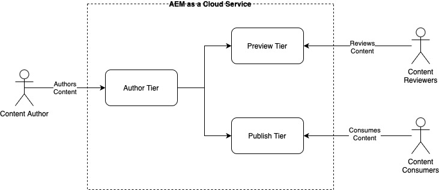

# 작성 및 게시 개념 {#authoring-publishing}

AEM 콘텐츠 작성자의 경우, as a Cloud Service 설치는 가장 기본적인 수준에서 세 개의 기본 티어로 생각할 수 있습니다

* 작성자 계층
* 계층 미리 보기
* 계층 게시

이러한 계층은 상호 작용하여 방문자가 액세스할 수 있도록 웹 사이트에서 컨텐츠를 사용할 수 있도록 합니다. 기본 워크플로우는 다음과 같습니다.

1. 콘텐츠 작성자는 작성 계층을 사용하여 콘텐츠를 작성합니다.
1. 콘텐츠 작성자는 미리보기 계층을 사용하여 검토자가 콘텐츠를 미리 볼 수 있도록 합니다.
1. 콘텐츠를 공개적으로 사용할 준비가 되면 작성자가 게시 계층을 사용하여 콘텐츠를 게시합니다.

컨텐츠는 페이지, 에셋 및 게시물을 비롯한 다양한 유형일 수 있습니다. 작성자의 판단에 따라 콘텐츠 미리보기를 건너뛸 수 있습니다.

AEM as a Cloud Service의 기술 아키텍처에 대한 자세한 내용은 문서를 참조하십시오. [Adobe Experience Manager as a Cloud Service 아키텍처 소개.](/help/overview/architecture.md)

{{edge-delivery-authoring}}

## 콘텐츠 작성 {#author-environment}

작성 계층의 작성 환경에서는 컨텐츠를 작성하기 위해 사용하기 쉬운 그래픽 사용자 인터페이스를 제공합니다. 이 환경을 사용하려면 작성자가 적절한 액세스 권한이 할당된 계정을 사용하여 로그온해야 합니다.

작성자의 인스턴스 및 개인의 액세스 권한이 어떻게 구성되었는지에 따라 콘텐츠에서 다음을 비롯한 다양한 작업을 수행할 수 있습니다.

* 페이지에서 새 콘텐츠 생성 또는 기존 콘텐츠 편집
* 사전 정의된 템플릿을 사용하여 콘텐츠 페이지 작성
* 자산 및 컬렉션 만들기, 편집 및 관리
* 콘텐츠 페이지와 자산의 이동, 복사 및 삭제
* 페이지와 자산 등의 게시(또는 게시 취소)

또는 콘텐츠를 관리하는 데 도움이 되는 관리 작업도 있습니다.

* 게시 전 검토 진행과 같이 변경 사항의 관리 방식을 제어하는 워크플로
* 개별 작업을 편성하는 프로젝트

AEM은 작성 환경에서도 관리됩니다.

문서를 참조하십시오. [작성에 대한 빠른 시작 안내서](/help/sites-cloud/authoring/quick-start.md) 작성 프로세스에 대한 개요입니다.

## 콘텐츠 미리보기 {#previewing-content}

AEM은 또한 개발자 및 콘텐츠 작성자가 웹 사이트의 최종 경험이 게시 환경에 도달하고 공개적으로 사용할 수 있게 되기 전에 이를 미리 볼 수 있도록 하는 미리보기 서비스를 제공합니다.

문서를 참조하십시오. [컨텐츠 미리 보기](/help/sites-cloud/authoring/sites-console/previewing-content.md) 을 참조하십시오.

## 게시 환경 {#publish-environment}

준비가 완료된 사이트 콘텐츠는 게시 계층의 게시 환경에 게시됩니다. 여기서 웹 사이트의 페이지는 콘텐츠 템플릿의 모양 및 느낌에 따라 의도한 대상자가 사용할 수 있습니다.

문서를 참조하십시오. [페이지 게시](/help/sites-cloud/authoring/sites-console/publishing-pages.md) 페이지 게시 및 게시 취소에 대한 자세한 내용은 를 참조하십시오.

## Dispatcher {#dispatcher}

웹 사이트 방문자가 체감하는 성능을 최적화하려면 **[디스패처](/help/implementing/dispatcher/overview.md)** 게시 및 미리보기 계층 모두에 대해 로드 밸런싱 및 캐싱을 구현합니다.
