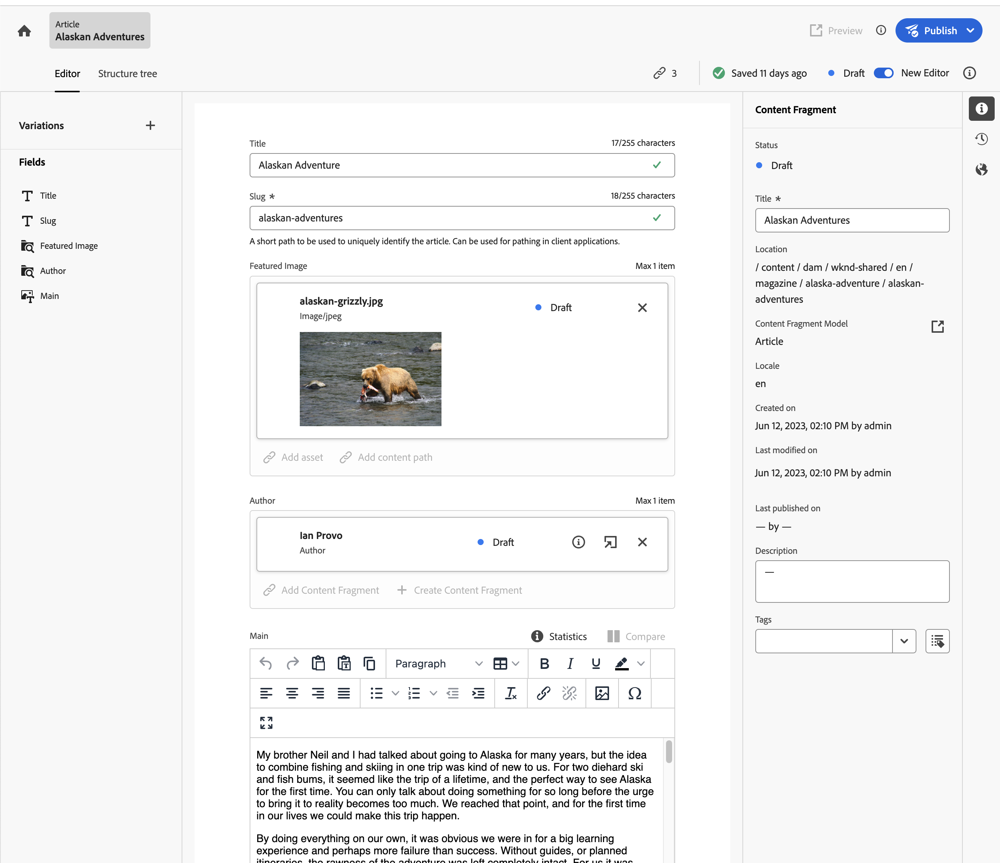

# AEM에서 컨텐츠를 작성하는 방법 {#authoring-methods}

AEM에서 콘텐츠를 작성하는 다양한 방법, 차이점 및 두 방법 중 하나를 사용할 수 있는 시기를 알아봅니다.

## AEM 작성 유연성 {#authoring-flexibility}

AEM as a Cloud Service은 다양한 유형의 콘텐츠를 편집하고 다양한 작성 사용 사례를 지원할 수 있는 여러 가지 편집기를 제공합니다.

* [페이지 편집기를 사용하여 WYSIWYG 작성](#page-editor) - 페이지 편집기는 수천 개의 웹 사이트에서 시도하고 신뢰하는 AEM의 컨텐츠 작성용 클래식 편집기입니다.
* [유니버설 편집기를 사용한 WYSIWYG 작성](#universal-editor) - 범용 편집기는 콘텐츠에 관계없이 AEM 콘텐츠를 작성할 수 있는 최신 UI이며, Edge Delivery Services을 활용하는 AEM 프로젝트에 사용할 수 있습니다.
* [문서 기반 작성](#document-based) - Edge Delivery 서비스를 사용하는 경우 콘텐츠를 AEM 콘솔 외부에 있는 Microsoft Word 또는 Google 문서와 같은 기존 문서로 작성하도록 선택할 수 있습니다.
* [AEM 콘텐츠 조각 편집기](#cf-editor) - Headless 콘텐츠를 만들기 위한 선택 편집기입니다.

AEM의 통합적이고 확장 가능한 특성으로 인해 이 메서드는 프로젝트의 요구 사항에 따라 배타적으로 또는 서로 함께 사용할 수 있습니다.

사용 가능한 작성 옵션이 확실하지 않거나 콘텐츠 작성에 대한 새로운 옵션을 탐색하려는 경우 시스템 관리자 또는 프로젝트 관리자에게 문의하십시오.

## 페이지 편집기를 사용하여 WYSIWYG 작성 {#page-editor}

수천 개의 웹 사이트에서 시도하고 신뢰할 수 있는 AEM의 컨텐츠 작성용 클래식 편집기입니다.

AEM 페이지 편집기는 WYSIWYG(보이는 것) 인터페이스를 사용하여 콘텐츠를 작성할 수 있는 통합 환경을 제공합니다. 사전 정의된 구성 요소를 드래그 앤 드롭하여 페이지를 작성하고 콘텐츠를 즉석으로 편집합니다.

AEM 페이지 편집기에 대한 자세한 내용은 문서를 참조하십시오. [AEM 페이지 편집기.](/help/sites-cloud/authoring/page-editor/introduction.md)

## 유니버설 편집기를 사용한 WYSIWYG 작성 {#universal-editor}

범용 편집기는 콘텐츠에 관계없이 AEM 콘텐츠를 작성할 수 있는 최신 UI이며 Edge Delivery Services을 활용하는 AEM 프로젝트의 첫 번째 선택 항목입니다.

범용 편집기는 AEM 내의 사이트 콘솔을 통해 액세스할 수 있지만, AEM 콘텐츠뿐만 아니라 적절하게 계측된 외부 콘텐츠도 작성할 수 있는 강력한 성능과 콘텐츠에 관계없는 유연성을 제공합니다.

유니버설 편집기에 대한 자세한 내용은 문서를 참조하십시오. [범용 편집기로 콘텐츠 작성](/help/sites-cloud/authoring/universal-editor/authoring.md)

## 문서 기반 작성  {#document-based}

Edge Delivery 서비스를 사용하는 경우 콘텐츠를 의 외부에 있는 Microsoft Word 또는 Google 문서와 같은 기존 문서로 작성하도록 선택할 수 있습니다 [AEM **사이트** 콘솔.](/help/sites-cloud/authoring/sites-console/introduction.md)

문서 기반 작성을 통해 작성자는 이미 알고 있는 도구를 사용할 수 있으며, 여전히 AEM Edge Delivery Services의 속도와 성능을 활용하여 콘텐츠를 게시할 수 있습니다. 문서 기반 작성에는 AEM 콘솔을 사용할 필요가 없습니다.

문서 기반 작성에 대한 자세한 내용은 문서를 참조하십시오. [컨텐츠 작성 및 게시](/help/edge/docs/authoring.md)

## AEM 콘텐츠 조각 편집기 {#cf-editor}

AEM 콘텐츠 조각 편집기는 headless 콘텐츠를 만들기 위한 선택 편집기입니다.

AEM 콘텐츠 조각 편집기는 headless 게재에 이상적인 구조화된 콘텐츠를 만들고 관리하기 위한 명확한 인터페이스를 제공합니다.

AEM 콘텐츠 조각 편집기에 대한 자세한 내용은 문서를 참조하십시오. [컨텐츠 조각 관리](/help/sites-cloud/administering/content-fragments/managing.md) 및 [컨텐츠 조각 작성](/help/sites-cloud/administering/content-fragments/managing.md).

>[!NOTE]
>
>다음 *신규* AEMas a Cloud Service 용으로 로컬에서 개발할 때는 이 섹션에서 강조 표시된 편집기를 사용할 수 없습니다.
>
>다음 [*원본* 콘텐츠 조각 편집기](/help/assets/content-fragments/content-fragments-variations.md) 을 사용할 수도 있습니다.
