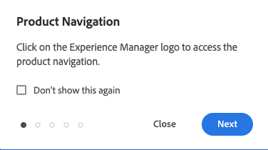

# 기본 처리 {#basic-handling}

이 문서는 AEM 작성 환경을 사용할 때 기본 처리에 대한 개요를 알 수 있도록 설계되었습니다.

>[!TIP]
>
>AEM 전체에서 키보드 단축키를 사용할 수 있습니다. 특히 다음의 경우에 [사이트 콘솔 사용](/help/sites-cloud/authoring/sites-console/keyboard-shortcuts.md) 및 [페이지 편집기](/help/sites-cloud/authoring/page-editor/keyboard-shortcuts.md).

{{edge-delivery-authoring}}

## 터치 지원 UI {#a-touch-enabled-ui}

AEM 사용자 인터페이스는 터치가 활성화되어 있습니다. 터치 활성화 인터페이스를 사용하면 탭, 길게 탭, 밀기 등의 동작을 통해 소프트웨어와 상호 작용할 수 있습니다. AEM UI는 터치를 지원하므로 휴대 전화 또는 태블릿과 같은 터치 디바이스에서 터치 제스처를 사용할 수 있습니다. 그러나 기존 데스크탑 디바이스에서 마우스 동작도 사용할 수 있으므로 콘텐츠를 작성하는 방법을 유연하게 선택할 수 있습니다.

## 첫 단계 {#first-steps}

로그인하면 [탐색 패널](#navigation-panel)로 바로 이동합니다. 옵션 중 하나를 선택하면 해당 콘솔이 열립니다.

AEM의 기본 사용 방법을 이해할 수 있도록 이 문서는 **사이트** 콘솔을 기반으로 합니다. 선택 **사이트** 시작합니다.

## 제품 탐색 {#product-navigation}

사용자가 콘솔에 처음 액세스할 때마다 제품 탐색 튜토리얼이 시작됩니다. 잠시 시간을 내어 AEM 기본 처리에 대한 개요를 살펴보십시오.

선택 **다음** 개요의 다음 페이지로 이동합니다. 선택 **닫기** 닫으려면 개요 대화 상자의 외부를 선택하십시오.

모든 슬라이드를 표시하지 않거나 **다시 표시 안 함** 옵션을 선택하지 않은 한 이후에 콘솔에 액세스하면 개요가 다시 시작됩니다.

## 전역 탐색 {#global-navigation}

전역 탐색 패널을 사용하여 콘솔 간을 탐색할 수 있습니다. 을 선택하면 전체 화면 드롭다운으로 트리거됩니다. **Adobe Experience Manager** 화면 왼쪽 상단의 링크.

**닫기**&#x200B;를 클릭하거나 탭하여 전역 탐색 패널을 닫고 이전 위치로 돌아갈 수 있습니다.

전역 탐색에는 다음과 같은 두 개의 패널이 있으며 화면의 왼쪽 여백에 아이콘으로 표시됩니다.

* **[탐색](#navigation-panel)** - AEM에 로그인할 때 나침반 및 기본 패널로 표시됨
* **[도구](#tools-panel)** - 망치로 표시됨

이러한 패널에서 사용 가능한 옵션은 아래에 설명되어 있습니다.

### 탐색 패널 {#navigation-panel}

다음 **탐색** 패널:

콘솔 및 콘텐츠를 탐색할 때 브라우저 탭의 제목이 현재 위치를 반영하도록 업데이트됩니다.

탐색에서 사용할 수 있는 콘솔은 다음과 같습니다.

| 콘솔 | 목적 |
|---|---|
| 프로젝트 | 프로젝트 콘솔에서는 프로젝트에 직접 액세스할 수 있습니다. [프로젝트는 가상 대시보드](/help/sites-cloud/authoring/projects/overview.md)로서 팀을 만드는 데 사용할 수 있습니다. 팀을 만든 후에는 공동 목표를 위한 작업을 수행할 수 있도록 이 팀에 리소스, 워크플로 및 작업에 대한 액세스 권한을 부여할 수 있습니다. |
| Sites | [사이트 콘솔](/help/sites-cloud/authoring/sites-console/introduction.md) AEM 인스턴스에서 실행되는 사이트를 만들고, 보고, 관리할 수 있습니다. 이 콘솔을 통해 페이지를 만들고, 편집하고, 복사하고, 이동하고, 삭제하며 워크플로를 시작하고, 페이지를 게시할 수 있습니다. |
| 경험 조각 | [경험 조각](/help/sites-cloud/authoring/fragments/content-fragments.md)은 여러 채널 간에 재사용할 수 있으며 변형이 있는 독립형 환경으로, 경험 또는 경험 일부를 반복해서 복사하고 붙여넣는 단조로운 작업을 수행할 필요를 없애줍니다. |
| 자산 | 자산 콘솔을 사용하여 [이미지, 비디오, 문서 및 오디오 파일과 같은 디지털 자산](/help/assets/overview.md)을 가져오고 관리할 수 있습니다. 그런 다음 동일한 AEM 인스턴스에서 실행되는 사이트에서 이러한 자산을 사용할 수 있습니다. 또한 자산 콘솔에서는 [콘텐츠 조각](/help/assets/content-fragments/content-fragments.md)을 만들고 관리할 수도 있습니다. |
| 개인화 | [이 콘솔은 타겟팅된 콘텐츠를 작성하고 개인화된 환경을 제공하기 위한 도구 프레임워크를 제공합니다](/help/sites-cloud/authoring/personalization/overview.md). |
| 콘텐츠 조각 | [콘텐츠 조각](/help/sites-cloud/administering/content-fragments/overview.md)을 사용하여 페이지 독립적인 콘텐츠를 디자인하고, 만들고, 선별하고, 게시할 수 있습니다. 이를 통해 페이지 작성과 Headless 게재 모두에 이상적인, 여러 위치/여러 채널에서 사용할 수 있도록 구조화된 콘텐츠를 준비할 수 있습니다. |
| 변형 생성 | [변형 생성](/help/generative-ai/generate-variations.md) 는 생성 인공 지능(AI)을 사용하여 프롬프트에 따라 콘텐츠 변형을 만듭니다. 이러한 프롬프트는 Adobe이 제공하거나 사용자가 만들고 관리합니다. |

## 도구 패널 {#tools-panel}

다음 **도구** 패널에는 유사한 콘솔을 함께 그룹화하는 다양한 카테고리가 포함된 사이드 패널이 있습니다. 다음 **도구** 콘솔에서는 웹 사이트, 디지털 자산 및 콘텐츠 저장소의 다른 측면을 관리하는 데 도움이 되는 몇 가지 전문 도구 및 콘솔에 액세스할 수 있습니다.

## 헤더 {#the-header}

헤더는 항상 화면 상단에 있습니다. 헤더의 대부분 옵션은 시스템 위치와 관계없이 동일하게 유지되지만 일부는 컨텍스트에 따라 다릅니다.

* [전역 탐색](#global-navigation) - 다음을 선택합니다. **Adobe Experience Manager** 콘솔 간에 이동하는 링크입니다.

  

* 피드백

  

* IMS 조직 - 필요한 경우 변경하려면 선택합니다.

* [솔루션](https://www.adobe.com/kr/experience-cloud.html) - 다른 Adobe 솔루션에 액세스하려면 이 옵션을 선택하십시오.

  

* [검색](/help/sites-cloud/authoring/search.md) - 다음을 사용할 수도 있습니다 [바로 가기 키](/help/sites-cloud/authoring/sites-console/keyboard-shortcuts.md) `/` (슬래시) 모든 콘솔에서 검색을 호출합니다.

  

* [도움말](#accessing-help)

  

* [알림](/help/sites-cloud/authoring/inbox.md) - 이 아이콘에는 현재 할당된 미완료 알림 수가 배지로 표시되어 있습니다.

  

* [사용자 속성](/help/sites-cloud/authoring/account-environment.md) - 사용자 설정을 변경하려면 선택하십시오.

  

## 도움말 액세스 {#accessing-help}

사용 가능한 도움말 리소스와 몇 가지 방법으로 액세스할 수 있습니다.

* **도구 모음** - 위치에 따라 **도움말** 아이콘 은 적절한 리소스를 엽니다.

  

* **콘솔** - 시스템을 처음 탐색하면 [AEM 탐색을 소개하는 일련의 슬라이드](#product-navigation).

  

* **페이지 편집기** - 페이지를 처음 편집할 때 일련의 슬라이드가 페이지 편집기에 도입됩니다.

  

   * 모든 콘솔에 처음 액세스할 때 [제품 탐색 개요](#product-navigation)와 마찬가지로 이 개요를 탐색합니다.
   * [**페이지 정보** 메뉴에서 **도움말**](#accessing-help)&#x200B;을 선택하여 언제든지 이 페이지를 다시 볼 수 있습니다.

* **도구 콘솔** - 출처: **도구** 콘솔 또한 외부에 액세스할 수 있습니다 **리소스**:

   * **설명서** - 웹 경험 관리 설명서 보기
   * **개발자 리소스** - 개발자 리소스 및 다운로드

>[!TIP]
>
>콘솔에서 있을 때에는 핫키 `?`(물음표)를 사용하여 사용 가능한 단축키 개요를 언제든지 볼 수 있습니다.
>
>모든 키보드 단축키에 대한 개요는 다음 문서를 참조하십시오.
>
>* [페이지 편집을 위한 키보드 단축키](/help/sites-cloud/authoring/page-editor/keyboard-shortcuts.md)
>* [콘솔용 키보드 단축키](/help/sites-cloud/authoring/sites-console/keyboard-shortcuts.md)
