# AEM으로 캠페인 뉴스레터 생성 {#creating-newsletters}

이 문서에서는 AEM as a Cloud Service를 사용해 Adobe Campaign Classic에서 전송할 수 있는 뉴스레터를 생성하는 방법에 대해 알아봅니다.

AEM as a Cloud Service와 Adobe Campaign Classic 간 통합을 사용하여 AEM의 강력한 제작 도구로 뉴스레터를 생성할 수 있습니다. 뉴스레터를 전송할 준비가 되면 Campaign의 수신자 관리 및 배포 기능을 사용해 전송할 수 있습니다.

## 사전 요구 사항 {#prerequisites}

AEM에서 뉴스레터를 생성하고 Campaign을 사용해 전송하려면 먼저 [Adobe Campaign Classic과 AEM as a Cloud Service를 통합해야 합니다.](/help/sites-cloud/integrating/integrating-campaign-classic.md)

## 뉴스레터 구조 생성 {#create-structure}

AEM은 사이트 콘텐츠의 관리 방법과 매우 유사한 방법으로 뉴스레터 콘텐츠를 관리합니다. 먼저, 콘텐츠를 담을 &quot;사이트&quot;를 생성합니다. 이 &quot;사이트&quot; 내에서 브랜드별 뉴스레터를 수집할 수 있습니다.

1. AEM 제작자 인스턴스에 로그인합니다.

1. 메인 탐색 페이지에서 **사이트** 콘솔을 엽니다.

1. AEM 표준 설치에 **Campaign** 폴더가 있을 것입니다. 이 폴더를 선택하고 **생성** 버튼을 클릭한 뒤 **페이지**&#x200B;를 클릭합니다.

   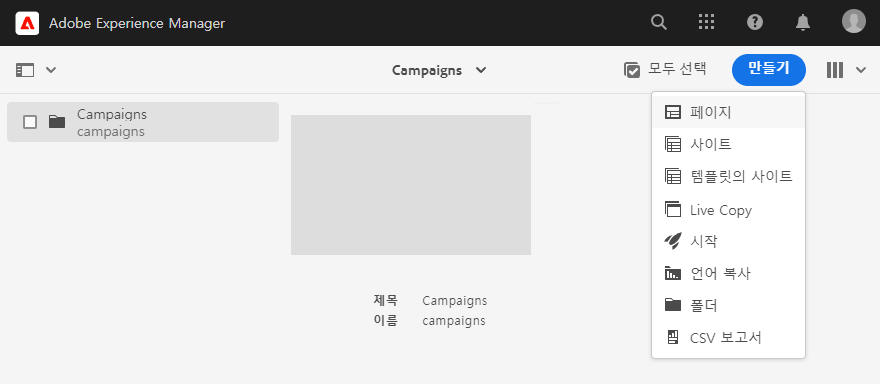

1. **브랜드**&#x200B;를 사이트 템플릿으로 선택하고 **다음**&#x200B;를 클릭합니다.

   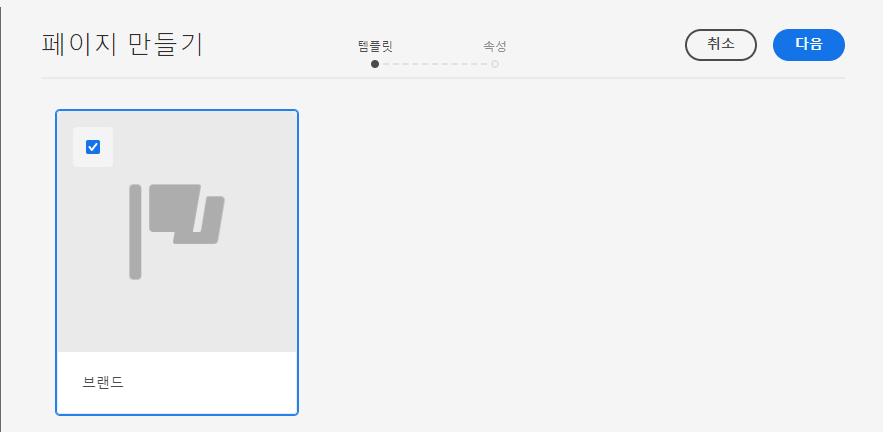

1. **제목**&#x200B;을 입력하고 **생성**&#x200B;을 클릭한 뒤 **완료**&#x200B;를 클릭합니다.

   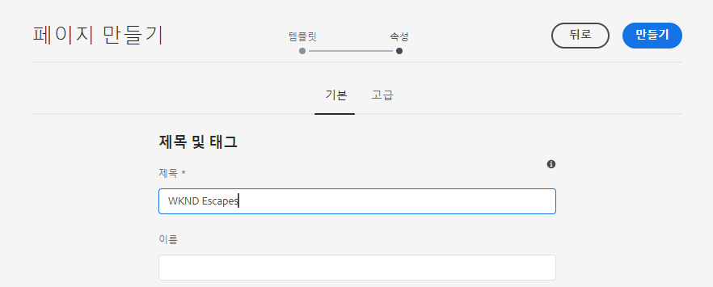

이제 캠페인 생성을 위한 기본적인 콘텐츠 구조를 갖추었습니다.

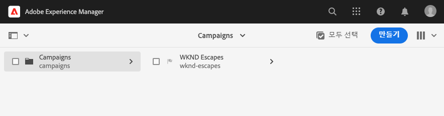

## 캠페인 생성 {#create-campaign}

캠페인을 위한 기본적인 콘텐츠 구조를 만들었으니 이제 본격적으로 캠페인을 생성할 수 있습니다. 캠페인은 여러 개일 수 있는 뉴스레터를 구성하는 데 사용됩니다.

1. 사이트 콘솔에서 [열 보기](/help/sites-cloud/authoring/getting-started/basic-handling.md#viewing-and-selecting-resources)를 사용해 이전에 생성한 브랜드(이 경우에서는 **WKND 탈출**)를 선택한 뒤, 이미 자동으로 생성된 **마스터 영역**&#x200B;을 선택합니다. 그리고 **생성** 버튼을 클릭한 뒤 **페이지**&#x200B;를 클릭합니다.

   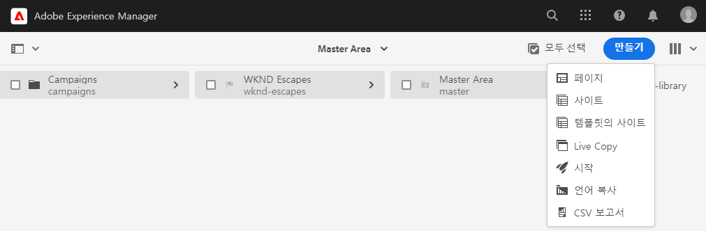

1. **캠페인**&#x200B;을 템플릿으로 선택한 뒤 **다음**&#x200B;을 클릭하고 **완료**&#x200B;를 클릭합니다.

   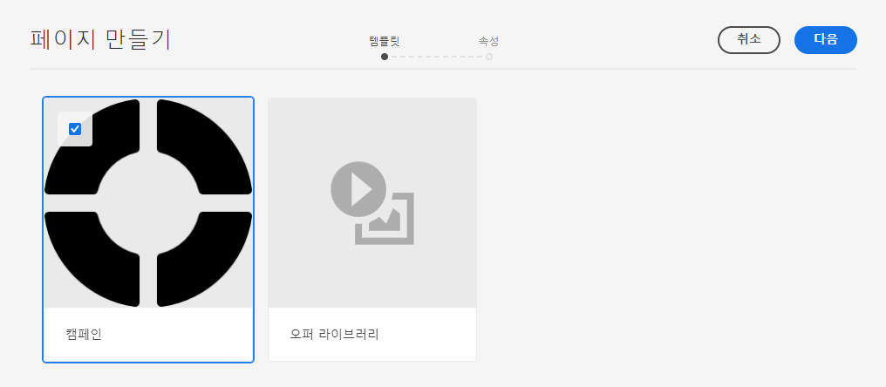

1. 캠페인 **제목**&#x200B;을 입력한 뒤 **생성**&#x200B;을 클릭하고 **완료**&#x200B;를 클릭합니다.

   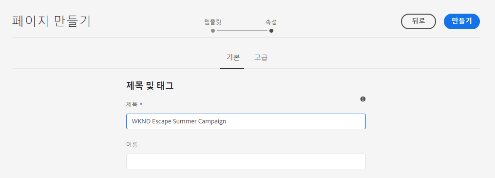

이제 뉴스레터를 생성할 수 있는 캠페인이 갖춰졌습니다.

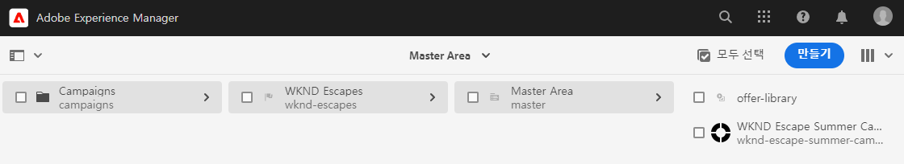

## 캠페인 구성 선택 {#campaign-configuration}

AEM은 여러 통합 구성을 지원할 수 있습니다. 새 캠페인에 대해, 뉴스레터 콘텐츠를 전송할 때 사용할 구성을 정의해야 합니다.

1. 사이트 콘솔에서 [열 보기](/help/sites-cloud/authoring/getting-started/basic-handling.md#viewing-and-selecting-resources)를 사용해 이전에 생성한 캠페인(이 경우에는 **WKND 탈출 여름 캠페인**)을 찾아 확인란을 선택한 뒤 도구 모음에서 **속성** 버튼을 클릭합니다.

   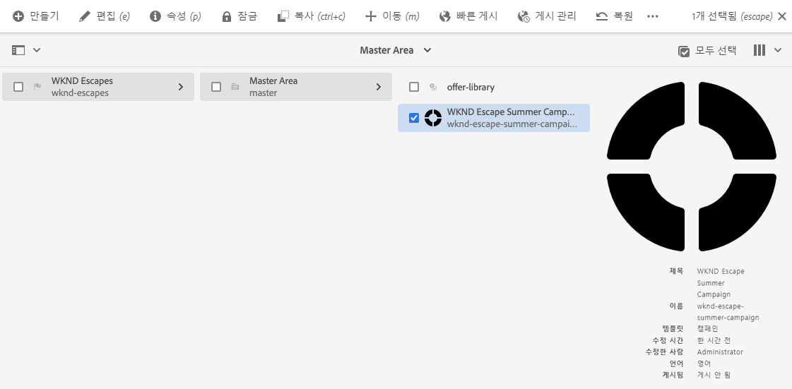

1. **속성** 창에서 **Cloud Service** 탭을 선택하여 이 캠페인에 사용할 통합을 정의합니다.

   * **Cloud Service 구성** 드롭다운 목록에서 **Adobe Campaign**&#x200B;을 선택합니다.
   * **Adobe Campaign** 드롭다운 목록에서 원하는 Adobe Campaign 통합 구성을 선택합니다.
   * **저장 및 닫기**&#x200B;를 클릭합니다.

   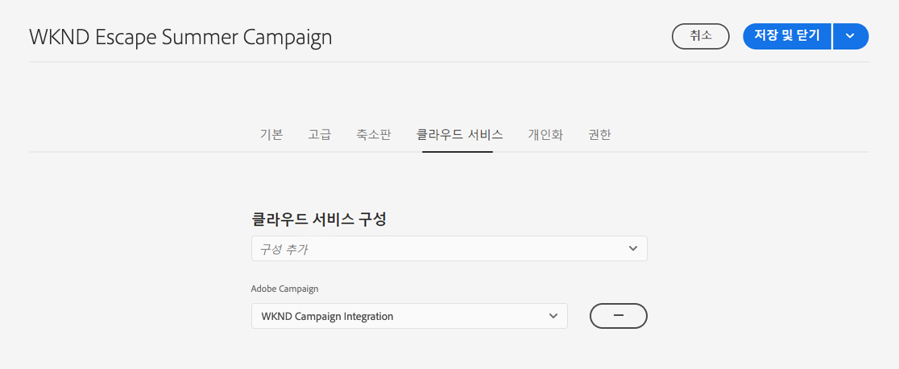

이제 캠페인이 Adobe Campaign 통합에 연결되었습니다. AEM에서 뉴스레터를 생성하고 Adobe Campaign을 사용해 전송할 준비가 되었습니다.

## 뉴스레터 생성 {#create-newsletter}

이미 생성 및 구성한 캠페인 콘텐츠 구조를 바탕으로 뉴스레터를 생성하고 관리합니다.

1. 사이트 콘솔에서 [열 보기](/help/sites-cloud/authoring/getting-started/basic-handling.md#viewing-and-selecting-resources)를 사용해 이전에 구성한 캠페인(이 경우에는 **WKND 탈출 여름 캠페인**)을 찾아 선택한 뒤 **생성** 버튼을 클릭하고 **페이지**&#x200B;를 클릭합니다.

   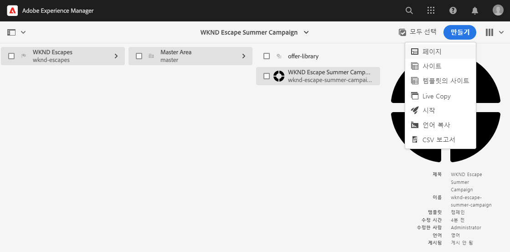

1. 페이지 생성 마법사에서 **Adobe Campaign 이메일(AC 6.1)** 템플릿을 선택하고 **다음**&#x200B;을 클릭합니다.

   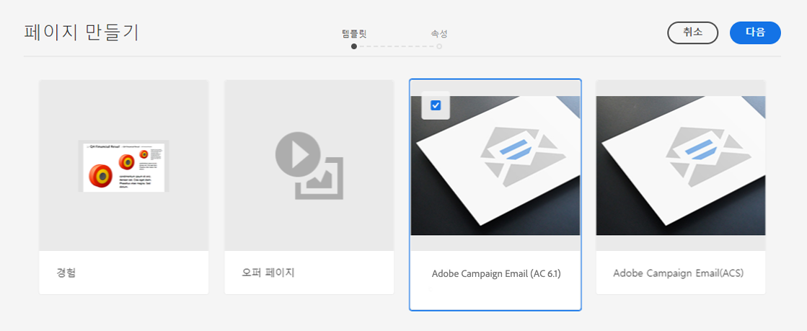

1. 이 마법사의 **속성** 단계에서 뉴스레터의 **제목**&#x200B;을 입력한 뒤 **생성**&#x200B;을 클릭하고 **열기**&#x200B;를 클릭합니다.

   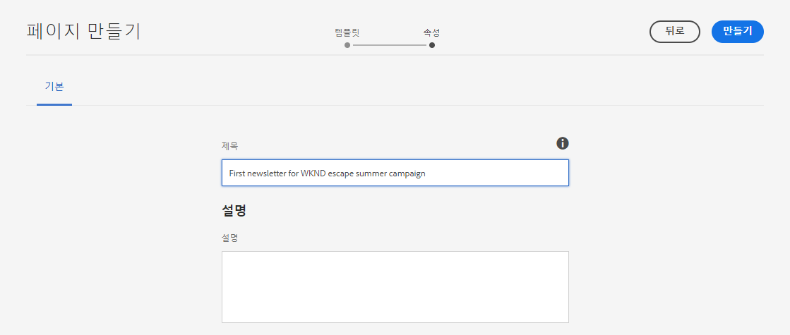

1. 해당되는 요구 사항을 충족할 수 있도록 기타 모든 AEM 콘텐츠 페이지와 마찬가지로 뉴스레터 페이지를 편집합니다.

이제 Adobe Campaign을 사용해 전송할 뉴스레터가 준비되었습니다.

## 뉴스레터 게시 {#publishing-newsletter}

Adobe Campaign에서 뉴스레터를 전송할 수 있도록 하려면 먼저 뉴스레터를 게시해야 합니다.

1. 사이트 콘솔에서 [열 보기](/help/sites-cloud/authoring/getting-started/basic-handling.md#viewing-and-selecting-resources)를 사용해 이전에 생성한 뉴스레터(이 경우에는 **WKND 탈출 여름 캠페인 첫 번째 뉴스레터**)를 찾아 선택한 뒤 왼쪽 상단의 **페이지 정보** 버튼을 클릭하고 **페이지 게시**&#x200B;를 클릭합니다.

1. 페이지를 게시해야 하는 구성을 선택하고 **게시**&#x200B;를 클릭합니다.

   

이제 뉴스레터 페이지가 AEM 게시 인스턴스에 게시되며 Adobe Campaign Classic에 표시됩니다. Adobe Campaign에서 이를 선택하려면 먼저 승인되어야 합니다.

1. 뉴스레터의 **페이지 정보** 버튼을 한 번 더 클릭하고 **워크플로 시작**&#x200B;을 선택합니다.

1. 워크플로 모델로 **Adobe Campaign에 대해 승인**&#x200B;을 선택한 뒤(선택 사항으로 설명 제공 가능) **워크플로 시작** 버튼을 클릭합니다.

   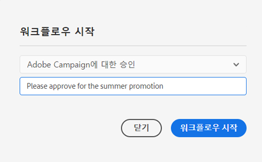

1. 뉴스레터 페이지 편집기 상단에 배너가 표시되어 승인 프로세스의 다음 단계를 제시합니다. **완료**&#x200B;를 클릭합니다.

   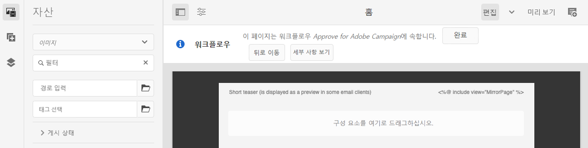

1. **작업 항목 완료** 대화 상자에서 **다음 단계** 드롭다운 목록으로부터 **뉴스레터 검토(관리자)**&#x200B;를 선택한 뒤 **확인** 버튼을 클릭합니다.

   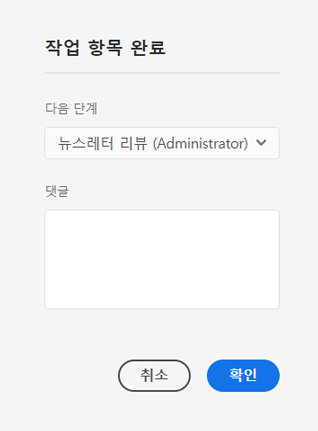

1. 뉴스레터 페이지 편집기 상단에 표시되는 배너에서 다시 한 번 **완료**&#x200B;를 클릭합니다.

1. **작업 항목 완료** 대화 상자에서 **다음 단계** 드롭다운 목록으로부터 **뉴스레터 승인**&#x200B;을 선택한 뒤 **확인** 버튼을 클릭합니다.

   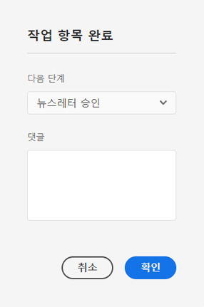

1. 대화 상자가 닫히면 승인 워크플로가 완료된 것이므로 뉴스레터 페이지 편집기 상단에 표시된 배너가 사라집니다.

이제 뉴스레터가 AEM에서 게시되었으며 Adobe Campaign에서 사용할 수 있도록 승인되었습니다.

>[!TIP]
>
>위에 설명된 워크플로 단계들은 프로세스 설명을 위해 간소화된 내용입니다. 실제 워크플로에서는 뉴스레터를 생성하고 승인하는 일이 역할마다 다릅니다.
>
>워크플로 사용에 관한 자세한 내용은 [워크플로를 사용하여 작업](/help/sites-cloud/authoring/workflows/overview.md) 문서를 참조하십시오.

## 수신자 생성 {#creating-recipient}

AEM에서 생성한 뉴스레터를 전송하려면 먼저 Adobe Campaign Classic에서 수신자를 정의해야 합니다.

1. 클라이언트 콘솔을 사용해 관리자 자격으로 Adobe Campaign Classic에 로그인합니다.

1. 메뉴 표시줄에서 **도구** -> **탐색기**&#x200B;를 선택합니다.

1. 탐색기에서 **프로필 및 대상** -> **수신자** 노드로 이동합니다.

   

1. 도구 모음에서 **새로 만들기**&#x200B;를 클릭하고 수신자에 관한 세부 정보를 입력합니다.

   * 이름
   * 성
   * 이메일 주소

1. **저장**&#x200B;을 클릭합니다.

이제 Adobe Campaign Classic을 사용해 뉴스레터를 게재할 대상 수신자가 갖춰졌습니다.

## 이메일 게재 생성 {#create-delivery}

최종 단계는 AEM에서 생성한 뉴스레터를 Adobe Campaign Classic에서 추가한 수신자에게 전송하는 것입니다.

1. 클라이언트 콘솔을 사용해 관리자 자격으로 Adobe Campaign Classic에 로그인합니다.

1. 메뉴 표시줄에서 **도구** -> **탐색기**&#x200B;를 선택합니다.

1. 탐색기에서 **캠페인 관리** -> **게재** 노드로 이동하여 **새로 만들기**&#x200B;를 클릭합니다.

   

1. **게재** 대화 상자에서 **게재 템플릿** 드롭다운 목록으로부터 **AEM 콘텐츠를 사용해 이메일 게재**&#x200B;를 선택하고 **계속**&#x200B;을 클릭합니다.

   

1. **이메일 매개변수** 섹션에서 **발신** 링크를 클릭하고 발신자 정보를 입력한 뒤 **확인**&#x200B;을 클릭합니다.

   * 발신자 주소
   * 발신 필드

   

1. **이메일 매개변수** 섹션에서 **수신** 링크를 클릭해 **대상 선택** 대화 상자를 연 뒤 **추가**&#x200B;를 클릭합니다.

   

1. **대상 요소 선택** 대화 상자에서 **수신자**&#x200B;를 선택하고 **다음**&#x200B;을 클릭합니다.

   

1. 필터를 사용해 [이전에 생성한](#creating-recipient)수신자를 선택한 뒤 **마침**&#x200B;을 클릭합니다.

   

1. 다시 **대상 선택** 대화 상자로 돌아가 **확인**&#x200B;을 클릭합니다.

1. 게재 창에서 **동기화**&#x200B;를 클릭합니다.

   

1. **AEM 콘텐츠와 동기화** 대화 상자에서 목록으로부터 이전에 생성한 뉴스레터를 선택하고 **확인**&#x200B;을 클릭합니다.

1. Adobe Campaign의 이메일 콘텐츠가 AEM에서 생성한 뉴스레터 콘텐츠와 동기화됩니다.

   * 콘텐츠가 자동으로 로드되지 않으면 **콘텐츠 새로 고침**&#x200B;을 클릭합니다.

1. **전송**&#x200B;을 클릭해 이메일을 전송합니다.

1. **주 게재 대상에게 전송** 대화 상자에서 **최대한 빨리 게재**&#x200B;을 선택한 뒤 **분석**&#x200B;을 클릭합니다.

   

1. 분석 단계는 콘텐츠와 수신자를 종합하여 게재를 구축합니다. 이제 게재가 생성되었으니 **게재 확인**&#x200B;을 클릭해 이메일을 전송합니다. **예**&#x200B;를 클릭하여 확인합니다.

1. 게재가 시작되었습니다. **닫기**&#x200B;를 클릭합니다.

   

1. **저장**&#x200B;을 클릭하여 게재를 저장합니다.

뉴스레터가 전송되었습니다!

>[!TIP]
>
>이 예시는 단일 수신자에게 뉴스레터를 전송하는 간단한 게재를 설명한 것입니다. 물론 실제 게재에는 여러 다양한 수신자가 포함될 것이며, 이 경우도 Adobe Campaign에서 관리하기 용이합니다. 게재 및 수신자 관리에 관한 자세한 내용은 [Adobe Campaign Classic 문서](https://experienceleague.adobe.com/docs/campaign-classic.html)를 참조하십시오.
