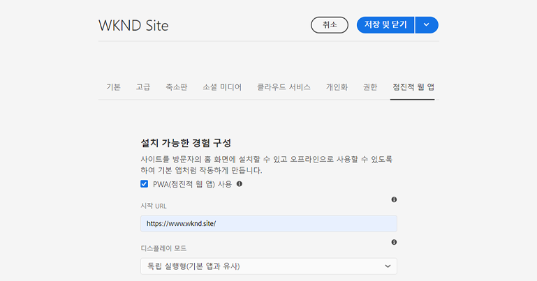
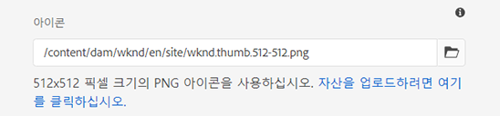
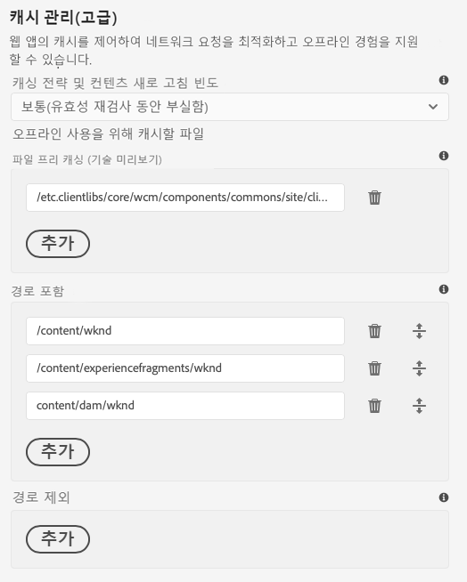

# 점진적 웹 앱 기능 활성화 {#enabling-pwa}

이제 간단한 구성을 통해 콘텐츠 작성자는 AEM Sites에서 생성된 경험에 대해 점진적 웹 앱(PWA) 기능을 활성화할 수 있습니다.

>[!CAUTION]
>
>이는 다음을 필요로 하는 고급 기능입니다.
>
>* PWA에 대한 지식
>* 사이트 및 콘텐츠 구조에 대한 지식
>* 캐싱 전략에 대한 이해
>* 개발 팀의 지원
>
>이 기능을 사용하기 전에 개발 팀과 논의하여 프로젝트에 가장 적합한 사용 방법을 정의하는 것이 좋습니다.

## 소개 {#introduction}

[점진적 웹 앱(PWA)](https://developer.mozilla.org/en-US/docs/Web/Progressive_web_apps)은 AEM 사이트를 사용자의 컴퓨터에 로컬로 저장하고 오프라인으로도 액세스할 수 있도록 함으로써 앱과 유사한 몰입형 경험을 제공합니다. 사용자는 인터넷 연결이 끊어져도 언제든지 사이트를 탐색할 수 있습니다. PWA는 네트워크가 끊기거나 불안정한 경우에도 원활한 경험을 제공합니다.

콘텐츠 작성자는 사이트를 다시 코딩하는 대신 PWA 속성을 사이트의 [페이지 속성](/help/sites-cloud/authoring/fundamentals/page-properties.md)에서 추가 탭으로 구성할 수 있습니다.

* 저장 또는 게시 후 이 구성은 사이트에서 PWA 기능을 활성화하는 [매니페스트 파일](https://developer.mozilla.org/en-US/docs/Web/Manifest) 및 [서비스 작업자](https://developer.mozilla.org/en-US/docs/Web/API/Service_Worker_API)를 작성하는 이벤트 처리기를 트리거합니다.
* 또한 Sling 매핑은 서비스 작업자가 애플리케이션의 루트에서 제공되어 앱 내에서 오프라인 기능을 허용하는 콘텐츠의 프록싱을 활성화하도록 유지됩니다.

PWA를 사용하면 사이트의 로컬 사본이 제공되어 사용자는 인터넷 연결 없이도 앱과 유사한 경험을 누릴 수 있습니다.

>[!NOTE]
>
>점진적 웹 앱은 진화하는 기술이며, 로컬 앱 설치 및 기타 기능에 대한 지원은 [사용 중인 브라우저에 따라 다릅니다.](https://developer.mozilla.org/en-US/docs/Web/Progressive_web_apps/Installable_PWAs#Summary)

## 사전 요구 사항 {#prerequisites}

사이트에 PWA 기능을 사용하려면 프로젝트 환경에 대한 2가지 요구 사항을 충족해야 합니다.

1. 이 기능을 활용하려면 [핵심 구성 요소를 사용](#adjust-components)해야 합니다.
1. 필요한 파일을 노출하려면 [Dispatcher 규칙을 조정](#adjust-dispatcher)해야 합니다.

이는 작성자와 개발 팀의 조정이 필요한 기술적인 단계입니다. 이러한 단계는 사이트당 한 번만 필요합니다.

### 핵심 구성 요소 사용 {#adjust-components}

핵심 구성 요소 릴리스 2.15.0 이상 버전은 AEM 사이트의 PWA 기능을 완전히 지원합니다. AEMaaCS는 항상 핵심 구성 요소의 최신 버전을 포함하므로 PWA 기능을 즉시 사용할 수 있습니다. AEMaaCS 프로젝트는 이 요구 사항을 자동으로 충족합니다.

>[!NOTE]
>
>사용자 정의 구성 요소 또는 [핵심 구성 요소에서 확장](https://experienceleague.adobe.com/docs/experience-manager-core-components/using/developing/customizing.html)되지 않은 구성 요소에는 PWA 기능을 사용하지 않는 것이 좋습니다.
<!--
Your components need to include the [manifest files](https://developer.mozilla.org/en-US/docs/Web/Manifest) and [service worker,](https://developer.mozilla.org/en-US/docs/Web/API/Service_Worker_API) which supports the PWA features.

 To do this, the developer will need to add the following link to the `customheaderlibs.html` file of your page component.

```xml
<link rel="manifest" href="/content/<projectName>/manifest.webmanifest" crossorigin="use-credentials"/>
```

The developer will also need to add the following link to the `customfooterlibs.html` file of your page component.

```xml
<script>
        // Check that service workers are supported
        if ('serviceWorker' in navigator) {
            // Use the window load event to make sure the page load performs well
            window.addEventListener('load', () => {
                let serviceWorker = '/<projectName>sw.js';
                navigator.serviceWorker.register(serviceWorker);
            });
        }
</script>
```
-->

### Dispatcher 조정 {#adjust-dispatcher}

PWA 기능은 `/content/<sitename>/manifest.webmanifest` 파일을 생성하고 사용합니다. 기본적으로, [dispatcher](/help/implementing/dispatcher/overview.md) 는 이러한 파일을 노출하지 않습니다. 이들 파일을 노출하려면 개발자는 사이트 프로젝트에 다음과 같은 구성을 추가해야 합니다.

```text
File location: [project directory]/dispatcher/src/conf.dispatcher.d/filters/filters.any >

# Allow webmanifest files
/0102 { /type "allow" /extension "webmanifest" /path "/content/*/manifest" }
```

프로젝트에 따라 서로 다른 확장 프로그램 유형을 포함하여 규칙을 재작성할 수 있습니다. `webmanifest` 확장 프로그램은 요청을 숨기고 `/content/<projectName>`으로 리디렉션하는 규칙을 도입할 때 재작성 조건에 포함하기에 유용할 수 있습니다.

```text
RewriteCond %{REQUEST_URI} (.html|.jpe?g|.png|.svg|.webmanifest)$
```

## 사이트에 대해 PWA 활성화 {#enabling-pwa-for-your-site}

[사전 요구 사항](#prerequisites)을 충족하면 콘텐츠 작성자는 매우 간단하게 사이트에 대해 PWA 기능을 활성화할 수 있습니다. 다음은 이를 수행하는 방법에 대한 간략한 소개입니다. 개별 옵션은 [상세 옵션](#detailed-options) 섹션에 자세히 기재되어 있습니다.

1. AEM에 로그인합니다.
1. 메인 메뉴에서 **탐색** -> **사이트**&#x200B;를 탭하거나 클릭합니다.
1. 사이트 프로젝트를 선택한 다음 [**속성**](/help/sites-cloud/authoring/fundamentals/page-properties.md)&#x200B;을 탭 또는 클릭하거나 핫키 `p`를 사용합니다.
1. **점진적 웹 앱** 탭을 선택한 다음 해당하는 속성을 구성합니다. 최소한 다음과 같은 작업을 수행해야 합니다.
   1. **PWA 활성화** 옵션을 선택합니다.
   1. **시작 URL**&#x200B;을 정의합니다.

      

   1. 512x512 png 아이콘을 DAM에 업로드한 다음 이를 앱 아이콘으로 참조합니다.

      

   1. 서비스 작업자가 오프라인으로 사용할 경로를 구성합니다. 대표적인 경로는 다음과 같습니다.
      * `/content/<sitename>`
      * `/content/experiencefragements/<sitename>`
      * `/content/dam/<sitename>`
      * 서드파티 글꼴 참조
      * `/etc/clientlibs/<sitename>`

      

1. **저장 및 닫기**&#x200B;를 탭하거나 클릭합니다.

이제 사이트가 구성되며 [이를 로컬 앱으로 설치](#using-pwa-enabled-site)할 수 있습니다.

## PWA 지원 사이트 사용 {#using-pwa-enabled-site}

이제 [PWA를 지원하도록 사이트를 구성](#enabling-pwa-for-your-site)했으므로 이를 직접 체험해 볼 수 있습니다.

1. [지원되는 브라우저](https://developer.mozilla.org/en-US/docs/Web/Progressive_web_apps/Installable_PWAs#Summary)에서 사이트에 액세스합니다.
1. 브라우저의 주소창에 사이트를 로컬 앱으로 설치할 수 있음을 나타내는 새 아이콘이 표시됩니다.
   * 아이콘은 브라우저에 따라 다를 수 있으며, 브라우저에도 배너 또는 대화 상자와 같이 사이트를 로컬 앱으로 설치할 수 있음을 나타내는 알림이 표시될 수 있습니다.
1. 앱을 설치하십시오.
1. 앱이 장치의 홈 화면에 설치됩니다.
1. 앱을 열어 탐색해 보고 페이지를 오프라인에서 사용할 수 있는지 확인하십시오.

## 상세 옵션 {#detailed-options}

다음 섹션은 [PWA에 대해 사이트를 구성](#enabling-pwa-for-your-site)할 때 사용할 수 있는 옵션에 대한 세부 정보를 제공합니다.

### 설치 가능한 경험 구성 {#configure-installable-experience}

이러한 설정을 사용하면 사이트를 방문자의 홈 화면에 설치하고 오프라인에서 사용할 수 있으므로 사이트가 기본 앱처럼 작동하도록 할 수 있습니다.

* **PWA 활성화** - 사이트에 대해 PWA를 활성화하기 위한 메인 토글입니다.
* **시작 URL** - 사용자가 로컬로 설치한 앱을 로드할 때 열리는 [기본 시작 URL](https://developer.mozilla.org/en-US/docs/Web/Manifest/start_url)입니다.
   * 이는 콘텐츠 구조의 경로 중 하나일 수 있습니다.
   * 루트일 필요는 없으며 앱의 전용 시작 페이지인 경우가 많습니다.
   * 이 URL이 상대적인 경우 매니페스트 URL이 이를 해결하기 위한 기본 URL로 사용됩니다.
   * 이를 비워 두면 기능은 웹 앱이 설치된 웹 페이지 주소를 사용합니다.
   * 값을 설정하는 것이 좋습니다.
* **디스플레이 모드** - PWA 지원 앱은 여전히 브라우저를 통해 제공되는 AEM 사이트입니다. [이러한 디스플레이 옵션](https://developer.mozilla.org/en-US/docs/Web/Manifest/display)은 로컬 디바이스에서 브라우저가 사용자에게 표시되지 않거나 표시되는 방법을 정의합니다.
   * **독립형** - 브라우저는 사용자에게 완전히 표시되지 않으며 기본 앱처럼 표시됩니다. 이 값은 기본값입니다.
      * 이 옵션을 사용하면 브라우저의 내비게이션 컨트롤을 사용하지 않고도 사이트 페이지의 링크 및 구성 요소를 사용하여 콘텐츠를 통해 앱을 완전히 탐색할 수 있습니다.
   * **브라우저** - 브라우저는 사이트를 방문할 때 일반적으로 표시되는 것과 같이 표시됩니다.
   * **최소 UI** - 브라우저는 기본 앱처럼 대부분 숨겨져 있지만 기본 내비게이션 컨트롤은 노출되어 있습니다.
   * **전체 화면** - 브라우저는 기본 앱처럼 사용자에게 완전히 표시되지 않지만 전체 화면 모드에서는 렌더링됩니다.
      * 이 옵션을 사용하면 브라우저의 내비게이션 컨트롤을 사용하지 않고도 사이트 페이지의 링크 및 구성 요소를 사용하여 콘텐츠를 통해 앱을 완전히 탐색할 수 있습니다.
* **화면 방향** - 로컬 앱에서는 PWA이 처리 방법을 알고 있어야 합니다. [디바이스 방향](https://developer.mozilla.org/en-US/docs/Web/Manifest/orientation).
   * **임의** - 앱이 사용자 디바이스의 방향에 맞게 조정됩니다. 이 값은 기본값입니다.
   * **세로** - 사용자 디바이스의 방향에 관계없이 앱이 세로 레이아웃으로 열립니다.
   * **기로** - 사용자 디바이스의 방향에 관계없이 앱이 가로 레이아웃으로 열립니다.
* **테마 색상** - 로컬 사용자의 운영 체제에 기본 UI 도구 모음 및 내비게이션 컨트롤이 표시되는 방법에 영향을 주는 [앱 색상](https://developer.mozilla.org/en-US/docs/Web/Manifest/theme_color)을 정의합니다. 브라우저에 따라 다른 앱 프레젠테이션 요소에도 영향을 줄 수 있습니다.
   * 색상 팝업을 사용하여 색상을 선택합니다.
   * 이 색상은 16진수 또는 RGB 값으로 정의될 수도 있습니다.
* **배경색** - 다음을 정의합니다. [앱의 배경색](https://developer.mozilla.org/en-US/docs/Web/Manifest/background_color): 앱이 로드될 때 표시됩니다.
   * 색상 팝업을 사용하여 색상을 선택합니다.
   * 이 색상은 16진수 또는 RGB 값으로 정의될 수도 있습니다.
   * 특정 브라우저는 앱 이름, 배경색 및 아이콘으로부터 [자동으로 스플래시 화면을 빌드](https://developer.mozilla.org/en-US/docs/Web/Manifest#Splash_screens)합니다.
* **아이콘** - 사용자 디바이스에서 앱을 표시하는 [아이콘](https://developer.mozilla.org/en-US/docs/Web/Manifest/icons)을 정의합니다.
   * 이 아이콘은 512x512픽셀의 png 파일이어야 합니다.
   * 아이콘은 다음과 같아야 합니다. [dam에 저장됨](/help/assets/overview.md).

### 캐시 관리(고급) {#offline-configuration}

이 설정을 사용하면 이 사이트의 일부를 오프라인에서 사용하고 방문자의 디바이스에서 로컬로 사용할 수 있습니다. 이를 통해 웹 앱의 캐시를 제어하여 네트워크 요청을 최적화하고 오프라인 경험을 지원할 수 있습니다.

* **캐싱 전략 및 콘텐츠 새로 고침 주기** - 이 설정은 PWA의 캐싱 모델을 정의합니다.
   * **보통** - [이 설정](https://web.dev/stale-while-revalidate/)은 대부분의 사이트에 적용되며 기본값입니다.
      * 이 설정을 사용하면 사용자가 처음 본 콘텐츠가 캐시에서 로드되고 사용자가 해당 콘텐츠를 사용하는 동안 캐시에 있는 나머지 콘텐츠의 유효성이 다시 검사됩니다.
   * **자주** - 이 설정은 경매장과 같이 업데이트가 매우 빨리 이루어져야 하는 사이트에 적용됩니다.
      * 이 설정을 사용하면 앱은 먼저 네트워크를 통해 최신 콘텐츠를 찾고, 이를 사용할 수 없는 경우 로컬 캐시로 돌아갑니다.
   * **거의 사용 안 함** - 이 설정은 참조 페이지와 같이 거의 정적인 사이트에 적용됩니다.
      * 이 설정을 사용하면 앱은 먼저 캐시에서 콘텐츠를 찾고, 이를 사용할 수 없는 경우 네트워크로 돌아가 다시 검색합니다.
* **파일 사전 캐싱** - AEM에서 호스팅된 이러한 파일은 서비스 작업자가 설치할 때, 그리고 이를 사용하기 전에 로컬 브라우저 캐시에 저장됩니다. 이 옵션을 사용하면 오프라인에서도 웹 앱의 모든 기능을 사용할 수 있습니다.
* **경로 포함** - 정의된 경로에 대한 네트워크 요청이 이전되며 구성된 **캐싱 전략 및 콘텐츠 새로 고침 주기**&#x200B;에 따라 캐시된 콘텐츠가 반환됩니다.
* **캐시 제외** - 이 파일은 **파일 사전 캐싱** 및 **경로 포함** 아래의 설정에 관계없이 캐시되지 않습니다.

>[!TIP]
>
>개발자 팀에서 오프라인 구성 설정 방법과 관련된 유용한 정보를 가지고 있을 수 있습니다.

## 제한 사항 및 권장 사항 {#limitations-recommendations}

일부 PWA 기능은 AEM Sites에 사용할 수 없습니다. 몇 가지 주목할 만한 제한 사항이 있습니다.

* 사용자가 앱을 사용하고 있지 않은 경우 페이지는 자동으로 동기화되거나 업데이트되지 않습니다.

또한 Adobe는 PWA 구현 시 다음과 같은 권장 사항을 제공합니다.

### 사전 캐시할 리소스의 수를 최소화하십시오. {#minimize-precache}

사전 캐싱할 페이지의 수를 제한하는 것이 좋습니다.

* 라이브러리를 임베드하여 사전 캐싱 시 관리할 항목 수를 줄이십시오.
* 사전 캐싱할 이미지 변형의 수를 제한하십시오.

### 프로젝트 스크립트 및 스타일시트가 안정화된 다음 PWA를 활성화하십시오. {#pwa-stabilized}

클라이언트 라이브러리는 다음 패턴 `lc-<checksumHash>-lc`를 관찰하는 캐시 선택기와 함께 제공됩니다. 라이브러리를 구성하는 파일(및 종속성) 중 하나가 변경될 때마다 이 선택기가 변경됩니다. 서비스 작업자가 사전 캐싱할 클라이언트 라이브러리를 나열했으며 새 버전을 참조하고자 하는 경우 항목을 수동으로 검색하여 업데이트합니다. 따라서 프로젝트 스크립트 및 스타일시트가 안정화된 다음 사이트를 PWA로 구성하는 것이 좋습니다.

### 이미지 변형의 수를 최소화하십시오. {#minimize-variations}

AEM 핵심 구성 요소의 이미지 구성 요소는 프론트엔드에서 가져올 최적의 렌디션을 결정합니다. 이 메커니즘에는 해당 리소스의 마지막 수정 시간에 해당하는 타임스탬프도 포함됩니다. 이 메커니즘은 PWA 사전 캐싱 구성을 더욱 복잡하게 만듭니다.

사전 캐싱을 구성할 때 사용자는 가져올 수 있는 모든 경로 변형을 나열해야 합니다. 이러한 변형은 품질 및 너비와 같은 매개변수로 구성되어 있습니다. 이러한 변형의 수를 최대 3개(작음, 중간, 큼)으로 줄이는 것이 좋습니다. 이러한 작업은 [이미지 구성 요소](https://experienceleague.adobe.com/docs/experience-manager-core-components/using/components/image.html)의 콘텐츠 정책 대화 상자를 통해 수행할 수 있습니다.

신중하게 구성하지 않으면 메모리 및 네트워크 소모가 PWA 성능에 심각한 영향을 줄 수 있습니다. 또한 50개의 이미지를 사전 캐싱하고자 하고 이미지당 너비가 3개라고 가정하면 사이트를 관리하는 사용자는 페이지 속성의 PWA 사전 캐싱 섹션에서 최대 150개의 항목 목록을 관리해야 합니다.

이와 더불어 이미지의 프로젝트 사용이 안정화된 다음 사이트를 PWA로 구성하는 것이 좋습니다.
