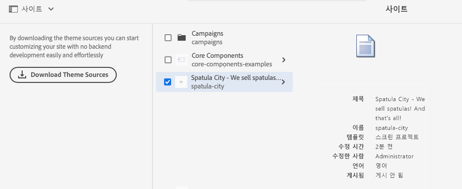

# 기본 처리 {#basic-handling}

이 문서는 AEM 작성 환경을 사용할 때 기본 처리에 대한 개요를 알 수 있도록 설계되었습니다. **사이트** 콘솔을 기본으로 사용합니다.

>[!NOTE]
>
>* 몇 가지 기능을 일부 콘솔에서 사용할 수 없거나, 추가 기능을 일부 콘솔에서 사용할 수 있습니다. 개별 콘솔에 대한 특정 정보 및 관련 기능은 다른 페이지에서 더 자세히 다룹니다.
>* AEM 전체에서 키보드 단축키를 사용할 수 있습니다. 특히 [콘솔을 사용하고](/help/sites-cloud/authoring/getting-started/keyboard-shortcuts.md) [페이지를 편집할 때 ](/help/sites-cloud/authoring/fundamentals/keyboard-shortcuts.md)이러한 키보드 단축키를 사용할 수 있습니다.

{{edge-delivery-authoring}}

## 터치 지원 UI {#a-touch-enabled-ui}

AEM 사용자 인터페이스는 터치가 활성화되어 있습니다. 터치 활성화 인터페이스를 사용하면 탭, 길게 누르기, 밀기 등과 같은 동작을 통해 소프트웨어와 상호 작용할 수 있습니다. AEM UI는 터치를 지원하므로 휴대 전화 또는 태블릿과 같은 터치 디바이스에서 터치 제스처를 사용할 수 있습니다. 그러나 기존 데스크탑 디바이스에서 마우스 동작도 사용할 수 있으므로 콘텐츠를 작성하는 방법을 유연하게 선택할 수 있습니다.

## 첫 단계 {#first-steps}

로그인하면 [탐색 패널](#navigation-panel)로 바로 이동합니다. 옵션 중 하나를 선택하면 해당 콘솔이 열립니다.

AEM의 기본 사용 방법을 이해할 수 있도록 이 문서는 **사이트** 콘솔을 기반으로 합니다. 선택 **사이트** 시작합니다.

## 제품 탐색 {#product-navigation}

사용자가 콘솔에 처음 액세스할 때마다 제품 탐색 튜토리얼이 시작됩니다. 잠시 시간을 내어 AEM 기본 처리에 대한 개요를 살펴보십시오.

선택 **다음** 개요의 다음 페이지로 이동합니다. 선택 **닫기** 닫으려면 개요 대화 상자의 외부를 선택하십시오.

모든 슬라이드를 표시하지 않거나 **다시 표시 안 함** 옵션을 선택하지 않은 한 이후에 콘솔에 액세스하면 개요가 다시 시작됩니다.

## 전역 탐색 {#global-navigation}

전역 탐색 패널을 사용하여 콘솔 간을 탐색할 수 있습니다. 화면 왼쪽 상단에서 Adobe Experience Manager 링크를 선택하면 전체 화면 드롭다운으로 트리거됩니다.

**닫기**&#x200B;를 클릭하거나 탭하여 전역 탐색 패널을 닫고 이전 위치로 돌아갈 수 있습니다.

전역 탐색에는 다음과 같은 두 개의 패널이 있으며 화면의 왼쪽 여백에 아이콘으로 표시됩니다.

* **[탐색](#navigation-panel)** - 나침반으로 표시되며 AEM에 로그인할 경우 기본 패널입니다.
* **[도구](#tools-panel)** - 망치로 표시됨

이러한 패널에서 사용 가능한 옵션은 아래에 설명되어 있습니다.

### 탐색 패널 {#navigation-panel}

탐색 패널:

콘솔 및 콘텐츠를 탐색할 때 브라우저 탭의 제목이 현재 위치를 반영하도록 업데이트됩니다.

탐색에서 사용할 수 있는 콘솔은 다음과 같습니다.

| 콘솔 | 목적 |
|---|---|
| 프로젝트 | 프로젝트 콘솔에서는 프로젝트에 직접 액세스할 수 있습니다. [프로젝트는 가상 대시보드](/help/sites-cloud/authoring/projects/overview.md)로서 팀을 만드는 데 사용할 수 있습니다. 팀을 만든 후에는 공동 목표를 위한 작업을 수행할 수 있도록 이 팀에 리소스, 워크플로 및 작업에 대한 액세스 권한을 부여할 수 있습니다. |
| Sites | Sites 콘솔에서는 AEM 인스턴스에서 실행되는 [사이트를 만들고, 보고, 관리](/help/sites-cloud/authoring/fundamentals/organizing-pages.md)할 수 있습니다. 이 콘솔을 통해 페이지를 만들고, 편집하고, 복사하고, 이동하고, 삭제하며 워크플로를 시작하고, 페이지를 게시할 수 있습니다. |
| 경험 조각 | [경험 조각](/help/sites-cloud/authoring/fundamentals/experience-fragments.md)은 여러 채널 간에 재사용할 수 있으며 변형이 있는 독립형 환경으로, 경험 또는 경험 일부를 반복해서 복사하고 붙여넣는 단조로운 작업을 수행할 필요를 없애줍니다. |
| 자산 | 자산 콘솔을 사용하여 [이미지, 비디오, 문서 및 오디오 파일과 같은 디지털 자산](/help/assets/overview.md)을 가져오고 관리할 수 있습니다. 그런 다음 동일한 AEM 인스턴스에서 실행되는 사이트에서 이러한 자산을 사용할 수 있습니다. 또한 자산 콘솔에서는 [콘텐츠 조각](/help/assets/content-fragments/content-fragments.md)을 만들고 관리할 수도 있습니다. |
| 개인화 | [이 콘솔은 타겟팅된 콘텐츠를 작성하고 개인화된 환경을 제공하기 위한 도구 프레임워크를 제공합니다](/help/sites-cloud/authoring/personalization/overview.md). |
| 콘텐츠 조각 | [콘텐츠 조각](/help/sites-cloud/administering/content-fragments/overview.md)을 사용하여 페이지 독립적인 콘텐츠를 디자인하고, 만들고, 선별하고, 게시할 수 있습니다. 이를 통해 페이지 작성과 Headless 게재 모두에 이상적인, 여러 위치/여러 채널에서 사용할 수 있도록 구조화된 콘텐츠를 준비할 수 있습니다. |

## 도구 패널 {#tools-panel}

도구 패널에는 유사한 도구 콘솔을 함께 그룹화하는 다양한 범주가 포함된 사이드 패널이 있습니다. 도구 콘솔에서는 웹 사이트, 디지털 자산 및 콘텐츠 저장소의 다른 측면을 관리하는 데 도움이 되는 몇 가지 전문 도구 및 콘솔에 액세스할 수 있습니다. <!--The [Tools consoles](/help/sites-administering/tools-consoles.md) provide access to several specialized tools and consoles that help you administer your websites, digital assets, and other aspects of your content repository.-->

## 헤더 {#the-header}

헤더는 항상 화면 상단에 있습니다. 헤더의 대부분 옵션은 시스템 위치와 관계없이 동일하게 유지되지만 일부는 컨텍스트에 따라 다릅니다.

* [전역 탐색](#global-navigation)

  콘솔 간에 탐색하려면 **Adobe Experience Manager** 링크를 선택합니다.

  

* [검색](/help/sites-cloud/authoring/getting-started/search.md)

  

  [단축키](/help/sites-cloud/authoring/getting-started/keyboard-shortcuts.md) `/`(슬래시)를 사용하여 모든 콘솔에서 검색을 호출할 수도 있습니다.

* [솔루션](https://www.adobe.com/kr/experience-cloud.html)

  

* [도움말](#accessing-help)

  

* [알림](/help/sites-cloud/authoring/getting-started/inbox.md)

  

  이 아이콘에는 현재 할당된 불완전 알림 수가 배지로 지정됩니다.

* [사용자 속성](/help/sites-cloud/authoring/getting-started/account-environment.md)

  

* [레일 선택기](#rail-selector)

  

  제공된 옵션은 현재 콘솔에 따라 다릅니다. 예를 들어 **Sites**&#x200B;에서 콘텐츠 전용(기본값), 타임라인, 참조 또는 필터 사이드 패널을 선택할 수 있습니다.

  

* 이동 경로

  

  레일의 중간에 위치하며 항상 현재 선택된 항목에 대한 설명을 표시하는 [이동 경로]를 사용하면 특정 콘솔 내에서 탐색할 수 있습니다. **Sites** 콘솔에서는 웹 사이트 수준을 탐색할 수 있습니다.

  이동 경로 텍스트를 클릭하면 현재 선택한 항목의 계층 구조 수준을 나열하는 드롭다운이 표시됩니다. 해당 위치로 이동하려면 항목을 클릭하십시오.

  

* **만들기** 버튼

  

  클릭하면 콘솔/컨텍스트에 해당하는 옵션이 표시됩니다.

* [보기](#viewing-and-selecting-resources)

  보기 아이콘은 AEM 도구 모음의 맨 오른쪽에 있습니다. 또한 현재 보기를 나타내므로 아이콘이 변경됩니다. 예를 들어 기본 보기인 **열 보기**&#x200B;에서 다음이 표시됩니다.

  

  열 보기, 카드 보기 및 목록 보기 간에 전환할 수 있습니다. 목록 보기에서 보기 설정도 표시됩니다.

  

  >[!NOTE]
  >
  >**보기 설정** 옵션은 **목록 보기** 모드에서만 사용할 수 있습니다.

* 키보드 탐색

  키보드만 사용하여 웹 사이트를 탐색할 수 있습니다. 여기서는 **Tab** 키(또는 **opt+tab**)의 표준 브라우저 기능을 사용하여 초점을 맞출 수 있는 페이지의 요소 간에 이동합니다.

  **사이트** 콘솔에는 **주 콘텐츠로 이동**&#x200B;하는 옵션이 추가되었습니다. 이 옵션은 헤더 옵션을 탭할 때 표시되며, (제품) 도구 모음에서 표준 요소를 건너뛰고 주 콘텐츠로 바로 이동할 수 있도록 하여 탐색 시간을 단축할 수 있습니다.

  

## 도움말 액세스 {#accessing-help}

사용할 수 있는 도움말 리소스는 다양합니다.

* **콘솔 도구 모음**

  위치에 따라 **도움말** 아이콘 은 적절한 리소스를 엽니다.

  

* **탐색**

  시스템을 처음 탐색하면 [일련의 슬라이드가 표시되면서 AEM 탐색 기능을 소개](#product-navigation)합니다.

  

* **페이지 편집기**

  페이지를 처음 편집하면 일련의 슬라이드를 통해 페이지 편집기에 대한 설명을 볼 수 있습니다.

  

  모든 콘솔에 처음 액세스할 때 [제품 탐색 개요](#product-navigation)와 마찬가지로 이 개요를 탐색합니다.

  [**페이지 정보** 메뉴에서 **도움말**](/help/sites-cloud/authoring/fundamentals/environment-tools.md#accessing-help)&#x200B;을 선택하여 언제든지 이 페이지를 다시 볼 수 있습니다.

* **도구 콘솔**

  **도구** 콘솔에서 외부 **리소스**&#x200B;에도 액세스할 수 있습니다.

   * **설명서** - 웹 경험 관리 설명서 보기
   * **개발자 리소스** - 개발자 리소스 및 다운로드

  >[!NOTE]
  >
  >콘솔에서 있을 때에는 핫키 `?`(물음표)를 사용하여 사용 가능한 단축키 개요를 언제든지 볼 수 있습니다.
  >
  >모든 키보드 단축키에 대한 개요는 다음 문서를 참조하십시오.
  >
  >* [페이지 편집을 위한 키보드 단축키](/help/sites-cloud/authoring/fundamentals/keyboard-shortcuts.md)
  >* [콘솔용 키보드 단축키](/help/sites-cloud/authoring/getting-started/keyboard-shortcuts.md)

## 작업 도구 모음 {#actions-toolbar}

리소스를 선택하면(예: 페이지 또는 자산) 도구 모음에 설명 텍스트가 있는 아이콘으로 다양한 작업이 표시됩니다. 이러한 작업은 다음 항목에 따라 달라집니다.

* 현재 콘솔
* 현재 컨텍스트
* [선택 모드](#viewing-and-selecting-resources)인지 여부

도구 모음에서 사용 가능한 작업은 선택한 특정 항목에서 수행할 수 있는 작업을 반영하도록 변경됩니다.

[리소스 선택 방법](#viewing-and-selecting-resources)은 보기에 따라 다릅니다.

일부 창은 공간이 제한되어 있으므로 도구 모음이 사용할 수 있는 공간보다 바로 길어질 수 있습니다. 이 경우 추가 옵션이 표시됩니다. 줄임표(세 점 또는 **...**)를 클릭하거나 탭하면 나머지 작업을 모두 포함하는 드롭다운 선택기가 열립니다. 예를 들어 **사이트** 콘솔에서 페이지를 선택하면 다음이 수행됩니다.

>[!NOTE]
>
>사용할 수 있는 개별 아이콘은 적절한 콘솔/기능/시나리오와 관련하여 문서화되어 있습니다.

## 빠른 작업 {#quick-actions}

[카드 보기](#card-view)에서는 특정 작업을 빠른 작업 아이콘으로 사용할 수 있을 뿐 아니라 도구 모음에 표시할 수도 있습니다. 빠른 작업 아이콘은 한 번에 단일 항목에 사용할 수 있으며 사전 선택할 필요가 없습니다.

빠른 작업은(데스크탑 디바이스) 리소스 카드 위에 마우스를 올려 놓으면 표시됩니다. 사용 가능한 빠른 작업은 콘솔 및 컨텍스트에 따라 달라질 수 있습니다. 예를 들어 **사이트** 콘솔에서 페이지에 대한 빠른 작업은 다음과 같습니다.

## 리소스 보기 및 선택 {#viewing-and-selecting-resources}

보기, 탐색 및 선택은 모든 보기에서 개념적으로는 같지만 사용 중인 보기에 따라 처리 방식이 약간 다릅니다.

사용 가능한 보기 중 하나에서(추가 작업을 위해) 리소스를 보고, 탐색하며 선택할 수 있습니다. 각 보기는 오른쪽 상단의 아이콘으로 선택할 수 있습니다.

* [열 보기](#column-view)
* [카드 보기](#card-view)
* [목록 보기](#list-view)

>[!NOTE]
>
>기본적으로 AEM Assets은 보기의 썸네일로 UI에 있는 자산의 원본 표현물을 표시하지 않습니다. 관리자인 경우, 오버레이를 사용하여 AEM Assets을 구성한 뒤 원본 표현물을 썸네일로 표시할 수 있습니다.

### 리소스 선택 {#selecting-resources}

특정 리소스를 선택하는 방법은 보기 및 디바이스 조합에 따라 다릅니다.

| 보기 | 터치 선택 | 데스크탑 선택 | 터치 선택 해제 | 데스크탑 선택 해제 |
|---|---|---|---|---|
| 열 | 썸네일 탭 | 썸네일 클릭 | 썸네일 탭 | 썸네일 클릭 |
| 카드 | 카드를 길게 탭 | 마우스를 위에 놓고 확인 표시 빠른 작업 사용 | 카드 탭 | 카드 클릭 |
| 목록 | 썸네일 탭 | 썸네일 클릭 | 썸네일 탭 | 썸네일 클릭 |

#### 모두 선택 {#select-all}

콘솔의 오른쪽 상단에 있는 **모두 선택** 옵션을 클릭하여 보기에서 모든 항목을 선택할 수 있습니다.

* **카드 보기**&#x200B;에서 모든 카드가 선택됩니다.
* **목록 보기**&#x200B;에서는 목록의 모든 항목이 선택됩니다.
* **열 보기**&#x200B;에서 맨 왼쪽 열에 있는 모든 항목이 선택됩니다.

#### 모두 선택 해제 {#deselecting-all}

모든 항목을 선택하면 선택한 항목의 수가 도구 모음의 오른쪽 상단에 표시됩니다.

모든 항목을 선택 해제하고 다음 방법으로 선택 모드를 종료할 수 있습니다.

* 카운트 옆에 있는 **X**&#x200B;를 클릭하거나 탭합니다.
* **Esc** 키를 사용합니다.

데스크탑 디바이스를 사용하는 경우 모든 보기에서 키보드에서 Esc 키를 눌러 모든 항목을 선택 해제할 수 있습니다.

#### 선택 예 {#selecting-example}

1. 예를 들면 카드 보기에서 다음 작업을 수행합니다.

   

1. 리소스를 선택하면 상단 헤더에는 현재 선택한 리소스에 적용할 수 있는 작업에 대한 액세스를 제공하는 [작업 도구 모음](#actions-toolbar)이 표시됩니다.

   선택 모드를 종료하려면 오른쪽 상단에서 **X**&#x200B;를 선택하거나 **Esc** 키를 사용하십시오.

### 열 보기 {#column-view}

[열 보기]를 사용하면 일련의 계단식 열을 통해 콘텐츠 트리를 시각적으로 탐색할 수 있습니다. 이 보기에서는 웹 사이트의 트리 구조를 시각화하고 트래버스할 수 있습니다.

맨 왼쪽 열의 리소스를 선택하면 오른쪽 열에 하위 리소스가 표시됩니다. 오른쪽 열에서 리소스를 선택하면 오른쪽의 다른 열에 하위 리소스가 표시됩니다.

* 리소스 이름 또는 리소스 이름 오른쪽에 있는 V자형 화살표를 탭하거나 클릭하여 트리에서 위아래로 탐색할 수 있습니다.

   * 탭하거나 클릭하면 리소스 이름과 V자형 화살표가 강조 표시됩니다.
   * 클릭하거나 탭한 리소스의 하위 항목은 클릭하거나 탭한 리소스의 오른쪽에 있는 열에 표시됩니다.
   * 하위 항목이 없는 리소스 이름을 선택하면 해당 세부 정보가 마지막 열에 표시됩니다.

* 썸네일을 탭하거나 클릭하면 리소스가 선택됩니다.

   * 선택하면 확인 표시가 썸네일에 오버레이되고 리소스 이름이 강조 표시됩니다.
   * 선택한 리소스의 세부 정보가 마지막 열에 표시됩니다.
   * 작업 도구 모음을 사용할 수 있습니다.

  [열 보기]에서 페이지를 선택하면 선택한 페이지가 다음 세부 정보와 함께 마지막 열에 표시됩니다.

   * 페이지 제목
   * 페이지 이름(페이지 URL 일부)
   * 페이지의 기반이 되는 템플릿
   * 수정 세부 사항
   * 페이지 언어
   * 게시 및 세부 정보 미리보기

### 카드 보기 {#card-view}

* 카드 보기는 현재 수준에서 각 항목에 대한 정보 카드를 표시합니다. 다음과 같은 정보를 제공합니다.

   * 페이지 콘텐츠의 시각적 표현
   * 페이지 제목
   * 중요한 날짜(예: 마지막 편집 날짜, 마지막 게시 날짜)
   * 페이지가 잠긴 경우 숨겨진 Live Copy 또는 Live Copy 일부
   * 필요한 경우 워크플로우의 일부로 수행해야 합니다
      * 필요한 작업을 나타내는 마커는 [받은 편지함](/help/sites-cloud/authoring/getting-started/inbox.md)의 항목과 관련되어 있을 수 있습니다.

* 또한 [빠른 작업](#quick-actions)은 선택과 같은 보기, 편집과 같은 일반적인 작업에서 사용할 수 있습니다.

  

* 카드를 탭하거나 클릭하여 트리 아래를 탐색하거나(빠른 작업이 발생하지 않도록 주의) [헤더에서 이동 경로](#the-header)를 사용하여 트리 위로 다시 탐색할 수 있습니다.

### 목록 보기 {#list-view}

* 목록 보기에는 현재 수준의 각 리소스에 대한 정보가 표시됩니다.
* 리소스 이름을 탭/클릭하여 트리를 탐색하고 [헤더에서 [이동 경로]](#the-header)를 사용하여 백업할 수 있습니다.
* 목록에서 모든 항목을 간편하게 선택하려면 목록의 왼쪽 상단에 있는 확인란을 사용합니다.

  

   * 목록의 모든 항목을 선택하면 이 확인란이 선택된 것으로 표시됩니다.

      * 확인란을 선택하여 모두 선택 취소합니다.

   * 일부 항목만 선택한 경우 빼기(-) 기호가 표시됩니다.

      * 확인란을 선택하여 모두 선택합니다.
      * 확인란을 다시 선택하면 모든 항목이 선택 해제됩니다.

* [보기] 버튼 아래에 있는 **보기 설정** 옵션을 사용하여 표시할 열을 선택합니다. 다음 열이 표시될 수 있습니다.

   * **이름** - 페이지 이름이며, 페이지 URL의 일부이고 언어와 관계없이 변경되지 않으므로 다국어 제작 환경에서 유용할 수 있습니다.
   * **수정됨** - 마지막 수정 일자 및 수정자
   * **게시됨** - 게시 상태
   * **미리보기** 상태 미리보기
   * **템플릿** - 페이지의 기반이 되는 템플릿
   * **워크플로** - 페이지에 현재 적용된 워크플로입니다. 마우스오버로 또는 타임라인을 열면 더 많은 정보를 사용할 수 있습니다.
   * **페이지 분석**
   * **고유 방문자**
   * **페이지 시간**

     

  기본적으로 페이지 URL 부분을 구성하는 **이름** 열이 표시됩니다. 일부 경우에는 작성자가 다른 언어로 된 페이지에 액세스해야 하며 작성자가 페이지의 언어를 모르는 경우 페이지 이름(일반적으로 변경되지 않음)을 확인하면 도움이 될 수 있습니다.

* 목록에서 각 항목의 맨 오른쪽에 있는 점선 세로 막대를 사용하여 항목 순서를 변경합니다.

  >[!NOTE]
  >
  >순서 변경은 `jcr:primaryType` 값이 `sling:OrderedFolder`인 순서가 지정된 폴더 내에서만 작동합니다.

  

  수직 선택 막대를 선택하고 항목을 목록의 새 위치로 드래그합니다.

  

## 레일 선택기 {#rail-selector}

**레일 선택기**&#x200B;는 창 왼쪽 상단에서 사용할 수 있으며 현재 콘솔에 따라 옵션을 표시합니다.

예를 들어 **사이트** 콘솔에서 콘텐츠만 선택하거나(기본값), 콘텐츠 트리, 타임라인, 참조, 사이트 세부 정보 또는 필터 측면 패널을 선택할 수 있습니다.

콘텐츠만 선택하면 레일 아이콘만 표시됩니다. 기타 옵션이 선택된 경우, 레일 아이콘 옆에 옵션 이름이 표시됩니다.

>[!NOTE]
>
>[키보드 단축키](/help/sites-cloud/authoring/getting-started/keyboard-shortcuts.md)를 사용하면 레일 디스플레이 옵션 간을 빠르게 전환할 수 있습니다.

### 콘텐츠 트리 {#content-tree}

콘텐츠 트리를 사용하여 사이드 패널에서 사이트 계층 구조를 빠르게 탐색하고, 현재 폴더의 페이지에 대한 다양한 정보를 볼 수 있습니다.

콘텐츠 트리 사이드 패널과 목록 보기 또는 카드 보기를 함께 사용하여 프로젝트의 계층 구조를 쉽게 확인하고, 콘텐츠 트리 사이드 패널을 사용하여 콘텐츠 구조를 쉽게 탐색할 수 있으며 목록 보기에서 자세한 페이지 정보를 볼 수 있습니다.

>[!NOTE]
>
>계층 구조 보기에서 항목을 선택한 후에는 화살표 키를 사용하여 계층 구조를 빠르게 탐색할 수 있습니다.
>
>자세한 내용은 [키보드 단축키](/help/sites-cloud/authoring/getting-started/keyboard-shortcuts.md)를 참조하십시오.

### 타임라인 {#timeline}

타임라인을 사용하면 선택한 리소스에서 발생한 이벤트를 보거나 시작할 수 있습니다. 타임라인 열을 열려면 레일 선택기를 사용합니다.

타임라인 열을 통해 다음을 수행할 수 있습니다.

* 선택한 항목과 관련된 다양한 이벤트 보기

   * 드롭다운 목록에서 이벤트 유형을 선택할 수 있습니다.

      * 댓글
      * [주석](/help/sites-cloud/authoring/fundamentals/annotations.md)
      * [활동](/help/sites-cloud/authoring/personalization/activities.md)
      * [론치](/help/sites-cloud/authoring/launches/overview.md)
      * [버전](/help/sites-cloud/authoring/features/page-versions.md)
      * [워크플로](/help/sites-cloud/authoring/workflows/overview.md)
         * 내역 정보가 저장되지 않는 임시 워크플로 제외 <!--With the exception of [transient workflows](/help/sites-developing/workflows.md#transient-workflows) as no history information is saved for these-->
      * 모두 표시

* 선택한 항목에 대한 댓글 추가/보기 이벤트 목록 맨 아래쪽에 **주석** 상자가 표시됩니다. 댓글을 입력(입력 후 Return 키)하면 댓글이 등록되고 이 댓글은 **댓글** 또는 **모두 표시**&#x200B;를 선택하면 표시됩니다.

* 특정 콘솔에는 추가 기능이 있습니다. 예를 들면 [Sites 콘솔]에서 다음과 같은 작업을 수행할 수 있습니다.

   * [버전 저장](/help/sites-cloud/authoring/features/page-versions.md)
   * [워크플로 시작](/help/sites-cloud/authoring/workflows/applying.md)

이러한 옵션은 **댓글** 필드 옆에 있는 V자형 화살표를 통해 액세스할 수 있습니다.

### 참조 {#references}

**참조**&#x200B;에는 선택한 리소스에 대한 모든 연결 내용이 표시됩니다. 예를 들어 페이지의 **사이트** 콘솔 [참조](/help/sites-cloud/authoring/fundamentals/environment-tools.md#references)는 다음과 같은 정보를 표시합니다.

* [론치](/help/sites-cloud/authoring/launches/overview.md#launches-in-references-sites-console)
* [Live Copy](/help/sites-cloud/administering/msm/overview.md#openingthelivecopyoverviewfromreferences)
* [언어 사본](/help/sites-cloud/administering/translation/preparation.md#seeing-the-status-of-language-roots)
* 콘텐츠 참조:

   * 다른 페이지에서 선택한 페이지로의 링크
   * 참조 구성 요소가 선택한 페이지에서 빌린 콘텐츠 및/또는 선택한 페이지에 빌려준 콘텐츠

### Site {#site}

**사이트**&#x200B;에는 [사이트 템플릿을 사용하여 생성한](/help/sites-cloud/administering/site-creation/create-site.md) 사이트의 세부 정보가 표시됩니다.

이 레일을 사용하여 [사이트 테마](/help/sites-cloud/administering/site-creation/site-themes.md)를 관리하는 방법에 대한 자세한 내용은 다음 문서인 [사이트 레일을 사용하여 사이트 테마 관리](/help/sites-cloud/administering/site-creation/site-rail.md)를 참조하십시오.

>[!TIP]
>
>템플릿으로 사이트를 만들고 테마를 맞춤화하는 프로세스에 대한 전체적인 설명은 [빠른 사이트 생성 여정](/help/journey-sites/quick-site/overview.md)에서 확인할 수 있습니다.

### 필터 {#filter}

다음과 유사한 패널이 열립니다. [검색](/help/sites-cloud/authoring/getting-started/search.md) 적절한 위치 필터가 이미 설정되어 있는 상태에서 보려는 콘텐츠를 추가로 필터링할 수 있습니다.

