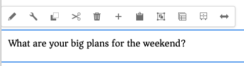
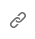

# AEM 페이지 편집기를 사용하여 페이지 컨텐츠 편집 {#edit-content}

AEM 페이지 편집기는 페이지 콘텐츠를 작성하는 강력한 도구입니다. 이 패널을 사용하여 콘텐츠를 드래그 앤 드롭하고 해당 위치에서 콘텐츠를 편집하는 방법에 대해 알아봅니다.

## 개요 {#overview}

페이지 편집기에서 콘텐츠를 편집하기 위해 수행할 수 있는 세 가지 기본 작업이 있습니다.

1. [새 구성 요소 추가](#adding-components) 페이지로 끌어다 놓기.
1. [새 에셋 추가](#adding-asset) 페이지로 끌어다 놓기.
1. [즉석 구성 요소 편집](#edit-in-place) 이(가) 페이지에 이미 있습니다.

AEM 페이지 편집기는 고급 기능에 대한 액세스 권한뿐만 아니라 이러한 작업을 수행하기 위한 직관적인 UI를 제공합니다.

또한 편집기에서 다음 작업을 수행하여 페이지에서 기존 콘텐츠를 구성할 수 있습니다.

* [구성 요소 이동](#moving-components)
* [구성 요소 레이아웃 편집](#editing-component-layout)
* [구성 요소 상속 편집](#inherited-components)

## 구성 요소 추가 {#adding-components}

에서 새 구성 요소를 선택하여 페이지에 드래그 앤 드롭할 수 있습니다. [사이드 패널의 구성 요소 브라우저](/help/sites-cloud/authoring/page-editor/editor-side-panel.md#components-browser) 구성 요소 자리 표시자에 삭제할 수 있습니다.

### 구성 요소 플레이스홀더 {#component-placeholder}

구성 요소 자리 표시자는 구성 요소를 놓을 때 배치될 위치를 보여 주는 표시기입니다. 그것은 두 가지 모습을 가지고 있다.

* 구성 요소 브라우저에서 드래그하여 페이지에 새 구성 요소를 추가하면 배치 중인 구성 요소에 대한 세부 정보가 있는 회색 상자로 표시됩니다.

  

* 날짜 [기존 구성 요소 이동](#movging-components) 파란색 사각형으로 나타납니다.

  

두 경우 모두 선택한 대상이 드래그하는 구성 요소 아래에 파란색 윤곽선으로 나타납니다. 타겟은 구성 요소를 릴리스할 때 배치할 위치입니다.

### 구성 요소 브라우저에서 구성 요소 추가 {#adding-a-component-from-the-components-browser}

[구성 요소 브라우저](/help/sites-cloud/authoring/page-editor/editor-side-panel.md#components-browser)를 사용하여 새 구성 요소를 추가할 수 있습니다. 다음 [구성 요소 플레이스홀더](#component-placeholder) 구성 요소를 배치할 위치를 보여 줍니다.

1. 페이지 편집기가에 있는지 확인합니다. [**편집** 모드.](/help/sites-cloud/authoring/page-editor/introduction.md#mode-selector)
1. 를 엽니다. [구성 요소 브라우저.](/help/sites-cloud/authoring/page-editor/editor-side-panel.md#components-browser)
1. 필요한 구성 요소를 [필수 위치](#component-placeholder) 및 릴리스.
1. [편집](#edit-content) 새로 배치된 구성 요소.

>[!NOTE]
>
>모바일 디바이스에서 구성 요소 브라우저가 전체 화면을 채웁니다. 구성 요소를 드래그하면 브라우저가 닫히고 구성 요소를 배치할 수 있도록 페이지가 다시 표시됩니다.

### 단락 시스템에서 구성 요소 추가 {#adding-a-component-from-the-paragraph-system}

다음을 사용하여 새 구성 요소를 추가할 수 있습니다. **여기에 구성 요소 드래그** 단락 시스템의 자리 표시자:

1. 페이지 편집기가에 있는지 확인합니다. [**편집** 모드.](/help/sites-cloud/authoring/page-editor/introduction.md#mode-selector)
1. 단락 시스템에서 새 구성 요소를 선택하고 추가하는 두 가지 방법이 있습니다.

   * 기존 구성 요소의 도구 모음 또는 **구성 요소를 여기로 드래그하십시오** 상자에서 **구성 요소 삽입** 옵션(+)을 선택합니다.

     

   * 데스크탑 디바이스를 사용하는 경우 **여기에 구성 요소 드래그** 상자.

1. 다음 **새 구성 요소 삽입** 필수 구성 요소를 선택할 수 있는 대화 상자가 열립니다. 추가하려는 구성 요소를 탭하거나 클릭합니다.

   * 검색 필터를 사용하여 구성 요소를 찾습니다.
   * 구성 요소 이름 옆에 있는 정보 아이콘을 사용하여 구성 요소에 대해 자세히 알아보십시오.

   

1. 선택한 구성 요소가 선택한 대상에 추가됩니다. 필요에 따라 구성 요소를 [편집](#edit-content)합니다.

## 자산 추가 {#adding-asset}

에서 에셋을 끌어 페이지에 새 구성 요소를 추가할 수도 있습니다. [에셋 브라우저.](/help/sites-cloud/authoring/page-editor/editor-side-panel.md#assets-browser) 이렇게 하면 적절한 유형의 구성 요소가 자동으로 만들어집니다(에셋이 들어 있음).

이 동작은 설치에 대해 구성할 수 있습니다. 문서를 참조하십시오. [구성 요소 참조 안내서](/help/implementing/developing/components/reference.md#component-placeholders) 을 참조하십시오.

위의 자산 유형 중 하나를 끌어 구성 요소를 만들려면

1. 페이지가에 있는지 확인합니다. [**편집** 모드.](/help/sites-cloud/authoring/page-editor/introduction.md#mode-selector)
1. [자산 브라우저](/help/sites-cloud/authoring/page-editor/editor-side-panel.md#assets-browser)를 엽니다.
1. 필요한 자산을 필요한 위치로 드래그합니다. 다음 [구성 요소 플레이스홀더](#component-placeholder) 구성 요소가 위치한 위치를 보여 주고 대상이 삽입되면 표시됩니다.
1. 자산을 대상으로 릴리스합니다. 에셋 유형에 적절한 구성 요소가 선택한 에셋이 포함된 필요한 위치에 만들어집니다.
1. [편집](#edit-content) 필요한 경우 구성 요소입니다.

>[!NOTE]
>
>모바일 디바이스에서 자산 브라우저가 전체 화면을 채웁니다. 자산을 드래그하면 브라우저가 닫히고 자산을 배치할 수 있도록 페이지가 다시 표시됩니다.

자산을 검색할 때 자산을 빠르게 변경해야 하는 경우, 자산의 이름 옆에 있는 편집 아이콘을 클릭하여 [자산 편집기](/help/assets/manage-digital-assets.md)를 브라우저에서 직접 시작할 수 있습니다.

## 바로 구성 요소 편집 {#edit-in-place}

구성 요소를 선택하면 구성 요소 도구 모음이 열립니다. 구성 요소에서 수행할 수 있는 다양한 작업에 대한 액세스를 제공합니다.

구성 요소 도구 모음에서 사용할 수 있는 작업은 선택한 구성 요소에 적합합니다. 선택한 구성 요소에 따라 더 많이 또는 더 적게 표시될 수 있으며, 여기에 설명되거나 설명되지 않을 수 있습니다.

* **편집** 구성 요소의 콘텐츠를 수정할 수 있습니다(종종 즉석). 동작은 구성 요소에 따라 다릅니다.

  

* **구성** 일반적으로 대화 상자에서 콘텐츠와 직접 관련되지 않은 구성 요소의 일부 매개 변수를 변경할 수 있습니다. 동작은 구성 요소에 따라 다릅니다.

  

* **복사** 구성 요소를 클립보드에 복사하여 다른 곳에 붙여넣습니다. 원본 컴포넌트는 변경되지 않은 상태로 유지됩니다.

  

* **잘라내기** 구성 요소를 클립보드에 복사합니다. 원본 구성 요소가 제거됩니다.

  

* **삭제** 은 확인 메시지가 표시된 페이지에서 구성 요소를 삭제합니다.

  

* **구성 요소 삽입** 대화 상자를 엽니다. [새 구성 요소를 추가합니다.](#adding-a-component-from-the-paragraph-system)

  

* **붙여넣기** 구성 요소를 클립보드에서 페이지로 붙여넣습니다. 원본이 남아 있는지 여부는 사용 여부에 따라 다릅니다 **복사** 또는 **잘라내기**.

   * 같은 페이지나 다른 페이지에 붙여넣을 수 있습니다.
   * 잘라내기/복사 작업 전에 이미 열려 있는 다른 페이지에 붙여넣으면 해당 페이지를 새로 고쳐 붙여넣은 콘텐츠를 볼 수 있습니다.
   * 붙여넣은 항목은 붙여넣기 작업을 선택한 항목 위에 붙여넣게 됩니다.
   * 클립보드에 콘텐츠가 있는 경우에만 붙여넣기 작업이 표시됩니다.

  

* **그룹** 여러 구성 요소를 한 번에 선택할 수 있습니다. **Control+Click** 또는 **Command+Click**&#x200B;하여 데스크탑 디바이스에서도 동일한 작업을 수행할 수 있습니다.

  

* **상위** 선택한 구성 요소의 상위 구성 요소를 선택합니다.

  

* **레이아웃** 을(를) 수정할 수 있습니다. [레이아웃](#editing-component-layout) 선택한 구성 요소.

   * 선택한 구성 요소에만 적용되며 전체 페이지의 [레이아웃 모드](/help/sites-cloud/authoring/page-editor/introduction.md#mode-selector)는 활성화하지 않습니다.

  

* **경험 조각 변형으로 변환** 을(를) 만들 수 있습니다. [경험 조각](/help/sites-cloud/authoring/fragments/content-fragments.md) 선택한 구성 요소에서 선택하거나 기존 경험 조각에 추가합니다.

  

### 구성 요소 편집 대화 상자 {#component-edit-dialog}

일부 구성 요소는 그 자리에서 사용할 수 있는 것 이상의 추가 편집 옵션을 제공합니다. 구성 요소의 편집 대화 상자를 열고 [구성 요소 도구 모음의 편집(연필) 아이콘](#component-toolbar) 추가 구성 옵션에 액세스

정확한 편집 옵션은 구성 요소에 따라 다릅니다. 일부 구성 요소의 경우 [일부 작업은 전체 화면 모드에서만 사용할 수 있습니다.](#edit-content-full-screen-mode). 예:

* 텍스트 구성 요소

  

* 이미지 구성 요소

  

### 전체 화면 모드로 구성 요소 편집 {#edit-content-full-screen-mode}

많은 구성 요소가 편집용 전체 화면 모드를 제공하며 이 버튼을 사용하여 액세스할 수 있습니다.

전체 화면 편집을 사용하면 이미지 구성 요소처럼 즉석 편집기보다 더 많은 편집 옵션을 표시할 수 있습니다.

사용 **최소화** 전체 화면 모드에 있는 단추입니다.

## 구성 요소 이동 {#moving-components}

구성 요소를 이동하려면 다음과 같이 하십시오.

1. 길게 탭 또는 길게 클릭 시 이동할 구성 요소를 선택합니다.
1. 구성 요소를 새 위치로 드래그합니다.

   * 페이지 편집기는 가 있는 구성 요소의 위치를 나타냅니다. [자리 표시자](#component-placeholder) 그리고 대상과 함께 단락을 놓을 수 있는 위치입니다.

   

1. 원하는 위치에 드롭합니다.

>[!TIP]
>
>[잘라내기 및 붙여넣기](#component-toolbar)를 사용하여 구성 요소를 이동할 수도 있습니다.

## 구성 요소 레이아웃 편집 {#editing-component-layout}

구성 요소를 조정하기 위해 편집에서 [레이아웃 모드](/help/sites-cloud/authoring/page-editor/responsive-layout.md)로 반복적으로 전환하는 대신 해당 구성 요소의 레이아웃을 변경하려는 구성 요소에 대해 **레이아웃** 작업을 선택하면 [편집 모드]를 벗어나지 않고 시간을 절약할 수 있습니다.

1. 다음 시기 **편집** sites 콘솔의 모드에서 구성 요소를 선택하여 구성 요소의 도구 모음을 표시합니다.

1. 다음 항목 선택 **레이아웃** 구성 요소 레이아웃을 조정하는 작업

   

1. 레이아웃 작업을 선택하면 다음과 같이 구성 요소의 레이아웃을 수정할 수 있습니다. [레이아웃 모드.](/help/sites-cloud/authoring/page-editor/responsive-layout.md#defining-layouts-layout-mode)

   * 구성 요소 표시의 크기 조정 핸들이 표시됩니다.
   * 에뮬레이터 도구 모음이 화면 맨 위에 표시됩니다.
   * 표준 편집 작업 대신 레이아웃 작업이 구성 요소 도구 모음에 표시됩니다.

   

1. 필요한 레이아웃 변경을 만든 후 다음을 탭하거나 클릭합니다. **닫기** 구성 요소 작업 메뉴의 버튼을 클릭하여 구성 요소 레이아웃 수정을 중지할 수 있으며 구성 요소의 도구 모음이 일반적인 편집 상태로 돌아갑니다.

   

>[!TIP]
>
>레이아웃 작업은 선택한 구성 요소의 범위로 제한됩니다. 예를 들어, 한 구성 요소의 레이아웃을 편집한 다음 다른 구성 요소를 클릭하면 새로 선택한 구성 요소에 대해 표준 편집 도구 모음(레이아웃 도구 모음이 아님)이 표시되고 크기 조정 핸들 및 에뮬레이터 도구 모음이 사라집니다.
>
>여러 구성 요소에 영향을 미치는 페이지의 전체 레이아웃을 편집해야 하는 경우 [레이아웃 모드](/help/sites-cloud/authoring/page-editor/responsive-layout.md)로 전환하십시오.

## 구성 요소 상속 편집 {#inherited-components}

상속은 콘텐츠를 연결할 수 있는 메커니즘으로, 콘텐츠를 변경하면 자동으로 다른 콘텐츠가 변경됩니다. 상속된 구성 요소는 다음을 포함하여 다양한 시나리오의 제품일 수 있습니다.

* [다중 사이트 관리](/help/sites-cloud/administering/msm/overview.md)
* [론치](/help/sites-cloud/authoring/launches/overview.md)

상속을 취소하고 다시 활성화할 수 있습니다. 구성 요소에 따라 이러한 옵션은 구성 요소가 라이브 카피 또는 론치의 일부인 경우 구성 요소 도구 모음에서 사용할 수 있습니다.

* **상속 취소**

  

* **상속 다시 활성화** 상속이 이미 취소된 경우

  

* **롤아웃** 블루프린트 또는 라이브 카피 소스에서도 사용할 수 있습니다.

  
