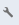

# 페이지 편집기 사이드 패널 {#side-panel}

AEM Sites 편집기의 사이드 패널을 사용하여 페이지에 구성 요소 및 에셋을 추가하는 방법을 알아봅니다.

## 사이드 패널 모드 {#modes}

페이지 편집기의 도구 모음에서 **사이드 패널 전환** 아이콘을 탭하거나 클릭하여 페이지 편집기에서 항상 사이드 패널에 액세스할 수 있습니다.

사이드 패널을 열 때는 왼쪽에서 밀어서 열게 되며 다음과 같은 세 가지 중요한 탭 중에서 선택할 수 있습니다.

* 페이지에 새 콘텐츠를 추가하려면 [구성 요소 브라우저](#components-browser)
* [에셋 브라우저](#assets-browser)를 사용하여 페이지에 새 에셋을 추가합니다.
* 페이지의 구조를 찾아보려면 [콘텐츠 트리](#content-tree)

## 구성 요소 브라우저 {#components-browser}

[구성 요소](/help/implementing/developing/components/overview.md)는 AEM 페이지 편집기로 콘텐츠를 만드는 데 사용되는 기본 구성단위입니다. 페이지에 여러 구성 요소를 배치하고 해당 옵션을 설정하여 콘텐츠 페이지를 작성합니다.

구성 요소 브라우저에는 현재 페이지에서 사용할 수 있는 모든 구성 요소가 표시됩니다. 이 구성 요소들은 적절한 위치로 드래그한 다음 편집하여 콘텐츠를 추가할 수 있습니다.

사이드 패널에서 **구성 요소** 탭을 탭하거나 클릭하여 **구성 요소** 브라우저에 액세스합니다.

실제 모양 및 처리는 사용하는 장치 유형에 따라 다릅니다.

### 모바일 장치 {#mobile-device-components-browser}

모바일 장치에서 구성 요소 브라우저를 열면 편집되는 페이지가 완전히 가려집니다.

페이지에 구성 요소를 추가하려면 구성 요소를 선택하고 드래그하여 오른쪽으로 이동합니다. 구성 요소 브라우저가 닫히고 페이지가 다시 표시되어 구성 요소를 배치할 수 있습니다.

>[!NOTE]
>
>너비가 1024px 미만이면 모바일 디바이스가 검색됩니다.

### 데스크탑 디바이스 {#desktop-device-components-browser}

데스크탑 디바이스에서 구성 요소 브라우저를 열면 창 왼쪽에 표시됩니다.

페이지에 구성 요소를 추가하려면 필요한 구성 요소를 클릭하고 필요한 위치로 끕니다.

### 구성 요소 브라우저 사용 {#using-component-browser}

**구성 요소** 브라우저의 구성 요소는 다음과 같이 표시됩니다.

* 구성 요소 이름
* 구성 요소 그룹(회색)
* 아이콘 또는 약어
   * 표준 구성 요소의 아이콘은 단색입니다.
   * 약어는 항상 구성 요소 이름의 첫 번째 두 문자입니다.

**구성 요소** 브라우저의 맨 위 도구 모음에서 다음 작업을 수행할 수 있습니다.

* 구성 요소를 이름별로 필터링합니다.
* 드롭다운 선택을 사용하여 표시를 특정 그룹으로 제한합니다.

구성 요소에 대한 자세한 설명은 **구성 요소** 브라우저에서 구성 요소 옆에 있는 정보 아이콘을 선택할 수 있습니다(사용 가능한 경우). 예를 들어 **콘텐츠 조각**&#x200B;의 경우 다음과 같습니다.

사용 가능한 구성 요소에 대한 자세한 내용은 [구성 요소 콘솔](/help/sites-cloud/authoring/components-console.md)을 참조하십시오.

## 자산 브라우저 {#assets-browser}

**Assets** 브라우저에 현재 페이지에서 사용할 수 있는 모든 [자산](/help/assets/overview.md)이 표시됩니다.

사이드 패널에서 **Assets** 탭을 탭하거나 클릭하여 자산을 탐색합니다.

스크롤할 때 필요에 따라 자산 목록을 확장하는 데 무한 스크롤이 사용됩니다.

실제 모양 및 처리는 사용하는 디바이스 유형에 따라 달라집니다.

### 모바일 장치 {#mobile-device-assets-browser}

모바일 장치에서 자산 브라우저를 열면 편집되는 페이지가 완전히 가려집니다.

에셋을 페이지에 추가하려면 필요한 에셋을 선택하고 드래그한 다음 오른쪽으로 이동합니다. 에셋 브라우저가 닫히고 페이지가 다시 표시되며, 여기에서 에셋을 필요한 구성 요소에 추가할 수 있습니다.

>[!NOTE]
>
>너비가 1024px 미만이면 모바일 디바이스가 검색됩니다.

### 데스크탑 디바이스 {#desktop-device-assets-browser}

데스크탑 디바이스에서 에셋 브라우저를 열면 창 왼쪽에서 열립니다.

에셋을 페이지에 추가하려면 필요한 에셋을 선택하고 필요한 구성 요소 또는 위치로 드래그합니다.

### Assets 브라우저 사용 {#using-assets-browser}

자산을 페이지에 추가하려면 선택한 후 필요한 위치로 끕니다. 다음과 같은 경우일 수 있습니다.

* 해당 유형의 기존 구성 요소
   * 예를 들어 유형 이미지의 자산을 이미지 구성 요소로 끌 수 있습니다.
* 적절한 형식의 구성 요소를 만들기 위한 단락 시스템의 [자리 표시자](/help/sites-cloud/authoring/page-editor/edit-content.md#component-placeholder)입니다.
   * 예를 들어 유형 이미지의 자산을 단락 시스템으로 드래그하여 이미지 구성 요소를 만들 수 있습니다.

>[!NOTE]
>
>에셋 드래그 앤 드롭은 특정 에셋 및 구성 요소 유형에 사용할 수 있습니다. 자세한 내용은 [자산 브라우저를 사용하여 구성 요소 삽입](/help/sites-cloud/authoring/page-editor/edit-content.md#adding-a-component-from)을 참조하십시오.

자산 브라우저의 상단 도구 모음에서 다음 기준에 따라 자산을 필터링할 수 있습니다.

* 이름
* 경로
* 이미지, 비디오, 문서, 단락, 콘텐츠 조각 및 경험 조각과 같은 자산 유형
* 방향 및 스타일과 같은 자산 특성
   * 특정 자산 유형에만 사용할 수 있음

자산을 빠르게 변경해야 하는 경우, 자산의 이름 옆에 있는 편집 아이콘을 클릭하여 [자산 편집기](/help/assets/manage-digital-assets.md)를 자산 브라우저에서 직접 시작할 수 있습니다.

## 콘텐츠 트리 {#content-tree}

**콘텐츠 트리**&#x200B;는 계층 구조의 페이지에 있는 모든 구성 요소에 대한 개요를 제공하므로 페이지 작성 방법을 한눈에 볼 수 있습니다.

>[!NOTE]
>
>모바일 디바이스(브라우저 폭이 1024px 미만인 경우)에서 페이지를 편집하는 경우, 콘텐츠 트리를 사용할 수 없습니다.

**콘텐츠 트리** 탭을 탭하거나 클릭하여 콘텐츠 트리에 액세스합니다.

열리면 페이지나 템플릿의 트리 보기 표시를 확인하여 콘텐츠가 계층 구조로 구성되는 방식을 쉽게 이해할 수 있습니다. 또한 복잡한 페이지에서 페이지의 구성 요소 간을 더 쉽게 이동할 수 있습니다.

페이지는 동일한 유형의 여러 구성 요소로 쉽게 구성할 수 있으므로 콘텐츠 트리는 구성 요소 유형의 이름(검은색) 뒤에 설명 텍스트(회색)를 표시합니다. 설명 텍스트는 제목 또는 텍스트와 같은 구성 요소의 공통된 속성에서 가져옵니다.

구성 요소 유형은 사용자 언어로 표시되는 반면 구성 요소 설명 텍스트는 페이지 언어로 제공됩니다.

구성 요소 옆에 있는 V자형 화살표를 클릭하면 해당 수준을 축소하거나 확장합니다.

[구성 요소]를 클릭하면 페이지 편집기에서 구성 요소가 강조 표시됩니다. 사용 가능한 작업은 페이지 상태에 따라 다릅니다. 예:

## 기본 페이지 {#basic-page}

기본 페이지의 구성 요소에는 일반적인 옵션이 있습니다.

트리에서 클릭한 구성 요소가 편집 가능한 경우 이름의 오른쪽에 공구 모양 아이콘이 표시됩니다. 이 아이콘을 클릭하면 구성 요소에 대한 편집 대화 상자가 시작됩니다.

### 라이브 카피 {#live-copy}

다른 페이지에서 구성 요소가 상속되는 [livecopy](/help/sites-cloud/administering/msm/overview.md)의 일부인 페이지에는 다른 옵션이 있습니다.

## 관련 컨텐츠 브라우저 {#associated-content-browser}

페이지에 콘텐츠 조각이 포함되어 있으면 관련 콘텐츠의 [브라우저에 액세스할 수도 있습니다.](/help/sites-cloud/authoring/fragments/content-fragments.md#using-associated-content)
