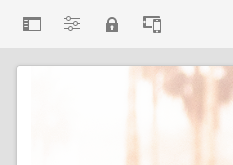

# AEM 페이지 편집기 {#editing-page-content}

페이지가에 생성되면 [**사이트** 콘솔,](/help/sites-cloud/authoring/sites-console/introduction.md) 콘텐츠 작성을 위한 강력한 도구인 AEM 페이지 편집기를 사용하여 페이지 콘텐츠를 편집할 수 있습니다.

>[!NOTE]
>
>에서 페이지 편집 시 [**사이트** 콘솔,](/help/sites-cloud/authoring/sites-console/introduction.md) 콘솔에서 페이지의 [템플릿:](/help/sites-cloud/authoring/sites-console/templates.md) 이 문서에 설명된 페이지 편집기 또는 [유니버설 편집기.](/help/sites-cloud/authoring/universal-editor/authoring.md)

>[!NOTE]
>
>페이지를 편집하려면 계정에 적절한 액세스 권한과 권한이 있어야 합니다. 권한이 없는 경우 시스템 관리자에게 문의하십시오.

## 방향 {#orientation}

AEM 페이지 편집기는 주로 다음 세 섹션으로 구성됩니다.

1. [도구 모음](#toolbar) - 도구 모음을 사용하면 페이지 모드를 변경하고 추가 페이지 설정에 액세스할 수 있습니다.
1. [사이드 패널](#side-panel) - 사이드 패널을 통해 페이지 구성 요소 및 에셋과 기타 작성 도구에 액세스할 수 있습니다.
1. [편집자](#editor) - 편집기에서 콘텐츠를 변경하고 미리 볼 수 있습니다.

콘텐츠는 페이지로 끌 수 있는 [구성 요소](/help/sites-cloud/authoring/components-console.md)(콘텐츠 유형에 맞는)를 사용하여 추가됩니다. 그런 다음 그 자리에서 편집하거나, 이동하거나 삭제할 수 있습니다.

### 도구 모음 {#page-toolbar}

페이지 도구 모음에서는 페이지 구성에 따라 상황에 맞는 기능에 대한 액세스를 제공합니다.

#### 사이드 패널 {#side-panel-button}

다음을 열거나 닫습니다. [사이드 패널,](/help/sites-cloud/authoring/page-editor/editor-side-panel.md) 에셋 브라우저, 구성 요소 브라우저 및 콘텐츠 트리를 보유합니다.

#### 페이지 정보 {#page-information}

페이지 세부 정보 및 페이지 정보 보기 및 편집, 페이지 속성 보기, 페이지 게시/게시 취소 등 페이지에서 수행할 수 있는 작업을 포함한 자세한 페이지 정보에 액세스할 수 있습니다.

**페이지 정보** 선택한 페이지의 마지막 편집 및 마지막 게시에 대한 세부 정보를 제공하는 드롭다운 메뉴를 엽니다. 페이지, 해당 사이트 및 인스턴스의 특성에 따라 추가 작업을 사용할 수 있습니다.

* [속성 열기](/help/sites-cloud/authoring/sites-console/page-properties.md)
* [페이지 롤아웃](/help/sites-cloud/administering/msm/overview.md#msm-from-the-ui)
* [워크플로 시작](/help/sites-cloud/authoring/workflows/applying.md#starting-a-workflow-from-the-page-editor)
* [페이지 잠금](/help/sites-cloud/authoring/page-editor/introduction.md#locking-unlocking)
* [페이지 게시](/help/sites-cloud/authoring/sites-console/publishing-pages.md#publishing-pages-1)
* [페이지 게시 취소](/help/sites-cloud/authoring/sites-console/publishing-pages.md#unpublishing-pages)
* [템플릿 편집](/help/sites-cloud/authoring/sites-console/templates.md)
* [게시됨으로 보기](/help/sites-cloud/authoring/page-editor/introduction.md#view-as-published)
* [관리자로 보기](/help/sites-cloud/authoring/basic-handling.md#viewing-and-selecting-resources)
* [도움말](/help/sites-cloud/authoring/basic-handling.md#accessing-help)
* [론치 홍보](/help/sites-cloud/authoring/launches/promoting.md)(페이지가 론치되었을 경우에만)

또한 **페이지 정보**&#x200B;는 해당하는 경우 분석 및 권장 사항에 대한 액세스 권한을 제공할 수 있습니다.

#### 에뮬레이터 {#emulator}

이렇게 하면 이(가) [에뮬레이터 도구 모음](/help/sites-cloud/authoring/page-editor/responsive-layout.md#selecting-a-device-to-emulate): 다른 디바이스에서 페이지의 디자인을 에뮬레이트하는 데 사용됩니다. 이 기능은 레이아웃 모드에서 자동으로 활성화됩니다.

#### ContextHub {#context-hub}

이렇게 하면 [ContextHub.](/help/sites-cloud/authoring/personalization/contexthub.md) 다음에서만 사용할 수 있습니다. **미리 보기** 모드.

#### 페이지 제목 {#page-title}

페이지 제목으로, 대문자로 정보를 렌더링합니다.

#### 모드 선택기 {#mode-selector}

모드 선택기에 현재 [모드](/help/sites-cloud/authoring/page-editor/introduction.md#mode-selector) 편집, 레이아웃, 타임워프 또는 타겟팅과 같은 다른 모드를 선택할 수 있습니다.

여러 작업을 허용하는 페이지를 편집할 때는 다음과 같은 다양한 모드가 있습니다.

* [편집](/help/sites-cloud/authoring/page-editor/edit-content.md) - 페이지 콘텐츠를 편집할 때 사용할 모드
* [레이아웃](/help/sites-cloud/authoring/page-editor/responsive-layout.md) - 디바이스에 따라 응답형 레이아웃을 만들고 편집할 수 있도록 허용(페이지가 레이아웃 컨테이너를 기반으로 하는 경우)
* [타겟팅](/help/sites-cloud/authoring/personalization/targeted-content.md) - 모든 채널에서 타겟팅과 측정을 통해 콘텐츠 관련성을 향상시킵니다.
* [타임워프](/help/sites-cloud/authoring/sites-console/page-versions.md#timewarp) - 특정 시점의 페이지 상태 보기
* [Live Copy 상태](/help/sites-cloud/authoring/page-editor/introduction.md#live-copy-status) - Live Copy 상태 및 상속되지 않은 구성 요소를 간략하게 살펴볼 수 있습니다.
* [개발자 모드](/help/implementing/developing/tools/developer-mode.md)
* [미리 보기](/help/sites-cloud/authoring/page-editor/introduction.md#previewing-pages) - 페이지를 게시 환경에 표시된 대로 보거나 컨텐츠의 링크를 사용하여 탐색할 수 있습니다.
* [주석](/help/sites-cloud/authoring/page-editor/annotations.md) - 페이지에서 주석 추가 또는 보기

>[!NOTE]
>
>* 페이지의 특성에 따라 일부 모드를 사용할 수 없습니다.
>* 일부 모드에 액세스하려면 적절한 권한이 필요합니다.
>* 공간 제약으로 인해 [개발자 모드]는 모바일 디바이스에서 사용할 수 없습니다.
>* 다음 항목이 있습니다. [키보드 단축키](/help/sites-cloud/authoring/sites-console/keyboard-shortcuts.md) ( `Ctrl-Shift-M`) 간 전환 **미리 보기** 및 현재 선택한 모드(예: **편집**, **레이아웃**&#x200B;등).

#### 미리보기 {#preview}

다음 **미리 보기** 단추 사용 [미리 보기 모드.](#preview-mode): 게시할 때 표시되는 페이지를 표시합니다.

#### 주석 {#annotate}

**주석** 모드에서는 다음을 추가할 수 있습니다. [주석](/help/sites-cloud/authoring/page-editor/annotations.md) 페이지를 검토할 때 페이지로 이동합니다. 첫 번째 주석 다음에 아이콘이 숫자로 전환하여 페이지에 있는 주석의 수를 가리킵니다.

### 사이드 패널 {#side-panel}

사이드 패널에서는 세 가지 탭에 액세스할 수 있습니다.

* 페이지에 새 콘텐츠를 추가할 구성 요소 브라우저
* 페이지에 새 자산을 추가하는 에셋 브라우저
* 페이지 구조를 검색하는 콘텐츠 트리

문서를 참조하십시오. [페이지 편집기 사이드 패널](/help/sites-cloud/authoring/page-editor/editor-side-panel.md) 추가 정보.

### 편집기 {#editor}

편집기에서 페이지 콘텐츠를 직접 변경할 수 있습니다. 페이지가 표시되는 대로 렌더링되므로 사이드 패널의 에셋 또는 구성 요소 브라우저를 사용하여 새 콘텐츠를 드래그 앤 드롭하고 콘텐츠를 즉석에서 편집할 수 있습니다.

## 콘텐츠 편집 {#editing-content}

이제 페이지 편집기를 이해했으므로 콘텐츠를 편집할 준비가 되었습니다.

문서를 참조하십시오. [AEM 페이지 편집기를 사용하여 컨텐츠 편집](/help/sites-cloud/authoring/page-editor/edit-content.md) 추가 정보.

## 상태 알림 {#status-notification}

페이지가 [워크플로우](/help/sites-cloud/authoring/workflows/overview.md) 또는 여러 워크플로가 있을 경우 페이지를 편집할 때 도구 모음 아래에 있는 알림 표시줄에 이 정보가 표시됩니다.

>[!NOTE]
>
>상태 표시줄은 적절한 권한이 있는 사용자 계정에만 표시됩니다.

알림은 페이지에 대해 실행 중인 워크플로를 나열합니다. 사용자가 현재 워크플로 단계에 참여 중인 경우 옵션은 [워크플로 상태](/help/sites-cloud/authoring/workflows/participating.md)에 영향을 주며 워크플로에 대한 자세한 정보는 다음과 같이 확인할 수 있습니다.

* **완료** - **작업 항목 완료** 대화 상자를 엽니다.
* **위임** - **작업 항목 완료** 대화 상자를 엽니다.
* **세부 사항 보기** - 워크플로의 **세부 사항** 창을 엽니다.

알림 표시줄을 통해 워크플로 단계를 완료하고 위임하는 것은 알림 받은 편지함에서 [워크플로에 참여](/help/sites-cloud/authoring/workflows/participating.md)할 때와 같은 방식입니다.

페이지에 여러 개의 워크플로가 있는 경우 알림 오른쪽 끝에 화살표 버튼과 함께 워크플로 개수가 표시되어 워크플로를 스크롤할 수 있습니다.

## Live Copy 상태 {#live-copy-status}

다음 **Live Copy 상태** 페이지 모드에서는 라이브 카피 상태 및 상속되지 않은 구성 요소에 대한 빠른 개요를 제공합니다.

* 녹색 테두리: 상속됨
* 분홍색 테두리: 상속이 취소되었습니다.

예:

## 페이지 미리보기 {#previewing-pages}

페이지를 미리 볼 수 있는 두 가지 옵션이 있습니다.

* [미리 보기 모드](#preview-mode) - 빠르고 즉각적인 미리보기
* [게시됨으로 보기](#view-as-published) - 새 탭에서 페이지를 여는 전체 미리보기

>[!TIP]
>
>* 콘텐츠의 링크는 표시되지만 에서는 액세스할 수 없습니다. **편집** 모드.
>* 링크를 사용하여 탐색하려는 경우 미리보기 옵션 중 하나를 사용합니다.
>* [키보드 단축키](/help/sites-cloud/authoring/sites-console/keyboard-shortcuts.md) `Ctrl-Shift-M`을 사용하여 미리보기와 마지막에 선택한 모드 간에 전환할 수 있습니다.

>[!NOTE]
>
>WCM 모드 쿠키는 두 미리보기 옵션 모두에 대해 설정됩니다.

### 미리보기 모드 {#preview-mode}

콘텐츠를 편집할 때 미리보기 모드를 사용하여 페이지를 미리 볼 수 있습니다. 이 모드에서 다음 작업을 수행합니다.

* 게시할 때 페이지가 표시되는 모양에 대해 빠른 보기를 제공할 수 있도록 여러 가지 편집 메커니즘을 숨깁니다.
* 링크를 사용하여 탐색할 수 있습니다.
* 페이지 콘텐츠를 새로 고치지 **않습니다**.

작성 시 페이지 편집기의 오른쪽 상단에 있는 아이콘을 사용하여 미리보기 모드를 사용할 수 있습니다.

### 게시됨으로 보기 {#view-as-published}

**게시됨으로 보기** 옵션은 [페이지 정보](#page-information) 메뉴에서 사용할 수 있습니다. 이 옵션은 새 탭에 페이지를 열고, 콘텐츠를 새로 고치고, 게시 환경에 표시되는 대로 페이지를 표시합니다.

## 페이지 잠금 및 잠금 해제 {#locking-unlocking}

AEM을 사용하면 다른 사람이 컨텐츠를 편집할 수 없도록 페이지를 잠글 수 있습니다. 잠금은 하나의 특정 페이지를 여러 번 편집하거나 잠시 동안 페이지를 동결해야 할 때 유용합니다.

1. **페이지 정보**&#x200B;아이콘을 선택하여 메뉴를 엽니다.
1. **페이지 잠금** 옵션을 선택합니다.

잠기면 페이지 편집기의 도구 모음에 잠금 기호가 표시됩니다.

페이지 잠금 해제는 다음과 매우 유사합니다 [페이지 잠금](#locking-a-page). 페이지가 잠기면 잠금 옵션이 잠금 해제 동작으로 대체됩니다.

>[!CAUTION]
>
>* 사용자를 가장할 때 페이지 잠금이 수행될 수 있습니다. 그러나 이 방법으로 잠긴 페이지는 (고객이) 가장한 사용자를 사용해서만 잠금 해제할 수 있습니다.
>* 페이지를 잠근 사용자를 가장하는 것으로는 페이지 잠금을 해제할 수 없습니다.
>* 페이지를 잠근 사용자가 페이지를 잠금 해제할 수 없는 경우, 고객 지원 센터에 문의하여 잠금 해제 옵션을 평가하십시오.

## 페이지 편집 실행 취소 및 재실행 {#undoing-and-redoing-page-edits}

다음 아이콘을 사용하여 작업을 실행 취소하거나 재실행할 수 있습니다. 이 아이콘들은 때에 따라 도구 모음에도 표시됩니다.

>[!TIP]
>
>* [키보드 단축키](/help/sites-cloud/authoring/sites-console/keyboard-shortcuts.md) `Ctrl-Z`를 사용하여 페이지 편집 작업을 취소할 수 있습니다.
>* 또한 키보드 단축키 `Ctrl-Y`를 사용하여 페이지 편집 작업을 재실행할 수 있습니다.

>[!NOTE]
>
>문서를 참조하십시오. [실행 취소 및 재실행 제한 사항](/help/sites-cloud/authoring/page-editor/undo-redo.md) 페이지 편집 내용을 실행 취소하거나 재실행할 때 가능한 사항에 대한 전체 세부 정보.
