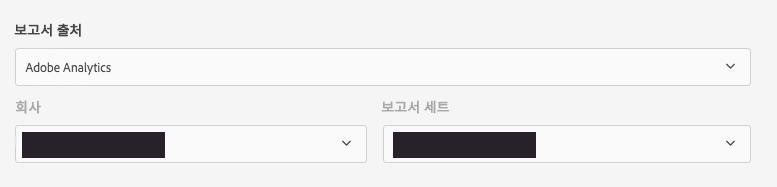
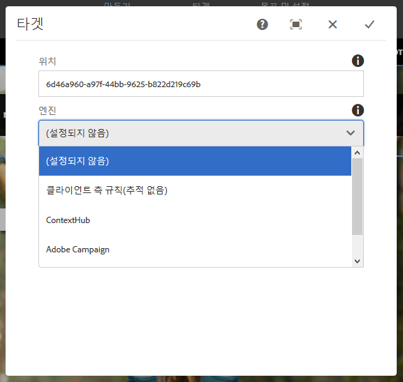

# 타겟팅 모드를 사용하여 타겟팅된 콘텐츠 작성 {#authoring-targeted-content-using-targeting-mode}

AEM의 타겟팅 모드를 사용하여 타겟팅된 콘텐츠를 작성하십시오. 타겟팅 모드 및 타겟 구성 요소는 경험을 위한 콘텐츠를 만드는 도구를 제공합니다.

* 페이지에 있는 타겟팅된 콘텐츠를 쉽게 인식할 수 있습니다. 점선이 모든 타겟팅된 콘텐츠 주변에 테두리를 표시합니다.
* 경험을 보려면 브랜드와 활동을 선택하십시오.
* 활동에 경험을 추가하거나 경험을 제거합니다.
* A/B 테스트를 수행하고 우승자를 전환합니다(Adobe Target만 해당).
* 오퍼를 만들거나 라이브러리의 오퍼를 사용하여 경험에 오퍼를 추가합니다.
* 목표를 구성하고 성능을 모니터링합니다.
* 사용자 경험을 시뮬레이션합니다.
* 사용자 정의가 더 필요하면 타겟 구성 요소를 구성합니다.

>[!NOTE]
>
>타겟팅 모드는 페이지 편집기와 경험 조각 편집기 모두에서 사용할 수 있습니다.
>
>다음 문서는 페이지 편집기용으로 작성되었지만 양쪽 모두 동일한 기준으로 작동하므로 양쪽 모두에 적용할 수 있습니다.

>[!CAUTION]
>
>페이지 편집기에서 타겟팅하는 경우 경험 조각 구성 요소만 타겟팅할 수 있습니다.
>
>다른 구성 요소 유형은 구성 요소 도구 모음의 **경험 조각 변형으로 변환** 아이콘을 사용하여 경험 조각으로 변환할 수 있습니다.

<!--
>Other component types can be converted to an Experience Fragment using the **Convert to experience fragment variation** icon on the component toolbar:
>
>
-->

타겟팅 엔진으로 AEM 또는 Adobe Target을 사용할 수 있습니다(Adobe Target을 사용하려면 올바른 Adobe Target 계정이 있어야 합니다). Adobe Target을 사용하는 경우 먼저 통합을 구성해야 합니다. [Adobe Target과의 통합에 대한 지침](/help/sites-cloud/integrating/integrating-adobe-target.md)을 참조하십시오.

타겟팅 모드에서 볼 수 있는 활동 및 경험은 [활동 콘솔](/help/sites-cloud/authoring/personalization/activities.md)에 반영됩니다.

* 타겟팅 모드를 사용하여 활동 및 경험에 수행하는 변경 내용은 활동 콘솔에 반영됩니다.
* 활동 콘솔에서 수행된 변경 내용은 타겟팅 모드에서 반영됩니다.

>[!NOTE]
>
>Adobe Target에서 캠페인을 만들 때 각 캠페인에 `thirdPartyId`라는 속성을 지정하게 됩니다. Adobe Target에서 이 캠페인을 삭제해도 thirdPartyId는 삭제되지 않습니다. `thirdPartyId`는 다른 유형의 캠페인(AB, XT)에 대해 다시 사용할 수 없으며 수동으로 제거할 수 없습니다. 이러한 문제를 방지하려면 각 캠페인에 고유한 이름을 지정하십시오. 따라서 캠페인 이름은 다른 캠페인 유형에서 다시 사용할 수 없습니다.
>
>동일한 캠페인 유형에서 동일한 이름을 사용하는 경우 기존 캠페인을 덮어쓰게 됩니다.
>
>동기화 중에 “Request Failed. `thirdPartyId` already exists”(요청이 실패했습니다. thirdPartyId가 이미 있습니다)라는 오류가 발생하는 경우, 캠페인 이름을 변경하고 다시 동기화하십시오.

>[!NOTE]
>
>타겟팅할 때 브랜딩 및 활동 조합은 채널 레벨이 아닌 사용자 레벨에서 지속됩니다.

## 타겟팅 모드로 전환 {#switching-to-targeting-mode}

타겟팅된 콘텐츠를 작성하는 도구에 액세스하려면 타겟 모드로 전환하십시오.

타겟 모드로 전환하려면 다음 작업을 수행하십시오.

1. 타겟팅된 콘텐츠를 작성할 페이지를 엽니다.
1. 페이지 상단의 도구 모음에서 모드 드롭다운 메뉴를 클릭하거나 탭하여 사용 가능한 모드 유형을 표시합니다.

   

1. **타겟팅**&#x200B;을 클릭하거나 탭합니다. 페이지 상단에 타겟팅 선택 사항이 표시됩니다.

   

## 타겟팅 모드를 사용하여 활동 추가 {#adding-an-activity-using-targeting-mode}

타깃팅 모드를 사용하여 브랜드에 활동을 추가합니다. 활동을 추가하면 기본 경험이 포함됩니다. 활동을 추가했으면 활동에 대한 콘텐츠 타겟팅 프로세스를 시작합니다.

타겟 엔진(AEM 또는 Adobe Target)을 선택하거나 활동 유형(경험 타겟팅 또는 A/B 테스트)을 선택하는 선택 사항을 사용하여 AEM에서 Adobe Target 활동을 생성하고 관리할 수도 있습니다.

또한 모든 Adobe Target 활동에 대한 목표와 지표를 관리하고 Adobe Target 대상자를 관리할 수도 있습니다. A/B 테스트에 대한 우승자 변환을 비롯한 Adobe Target 활동 보고도 포함됩니다.

활동을 추가하면 에도 표시됩니다. [활동 콘솔](/help/sites-cloud/authoring/personalization/activities.md).

활동을 추가하려면 다음 작업을 수행하십시오.

1. 사용 **브랜드** 드롭다운 메뉴를 사용하여 활동을 만들 브랜드를 선택합니다.

   >[!NOTE]
   >
   >권장 사항: [활동 콘솔을 통해 브랜드 만들기](/help/sites-cloud/authoring/personalization/activities.md#creating-a-brand-using-the-activities-console).
   >
   >
   >다른 방식으로 브랜드를 생성하는 경우, `/campaigns/<brand>/master` 노드가 존재하는지 또는 활동을 작성하려고 할 때 오류가 발생하는지 확인해야 합니다.

1. 다음 항목 옆에 있는 + 을 클릭하거나 탭합니다. **활동** 드롭다운 메뉴.
1. 활동의 이름을 입력합니다.

   >[!NOTE]
   >
   >새 활동을 생성하고 페이지 또는 그 상위 항목 중 하나에 연결된 Adobe Target 클라우드 구성이 있으면 AEM은 자동으로 Adobe Target을 엔진으로 가정합니다.

1. **타겟팅** 엔진 드롭다운 메뉴에서 타겟팅 엔진을 선택합니다.

   * **ContextHub AEM**&#x200B;을 선택하면 나머지 필드는 흐리게 표시되어 사용할 수 없습니다. **만들기**&#x200B;를 클릭하거나 탭합니다.

   * **Adobe Target**&#x200B;을 선택하면 구성(기본적으로 계정을 구성할 때 제공했던 구성임)과 활동 유형을 선택할 수 있습니다. <!--If you select **Adobe Target**, you can select a configuration (by default, it is the configuration you provided when you [configured the account](/help/sites-administering/opt-in.md)) and Activity Type.-->

1. 활동 메뉴에서 **경험 타겟팅** 또는 **A/B 테스트**&#x200B;를 선택합니다.

   * 경험 타겟팅 - AEM에서 Adobe Target 활동을 관리합니다.
   * A/B 테스트 - AEM의 Adobe Target에서 A/B 테스트 활동을 만들고 관리합니다.

## 타겟팅 프로세스: 만들기, 타겟, 목표 및 설정 {#the-targeting-process-create-target-and-goals-settings}

타겟팅 모드를 사용하면 활동의 몇 가지 측면을 구성할 수 있습니다. 브랜드 활동을 위한 타겟팅된 콘텐츠를 생성하는 다음의 3단계 프로세스를 사용하십시오.

1. [만들기](#create-authoring-the-experiences): 경험을 추가하거나 제거하고, 각 경험에 대한 오퍼를 추가합니다.
1. [타겟](#target-configuring-the-audiences): 각 경험이 타겟팅하는 대상자를 지정합니다. 특정 대상자를 타겟팅할 수 있으며, A/B 테스트를 사용하는 경우에는 트래픽 중 어느 정도의 비율이 어느 경험으로 가는지를 결정할 수 있습니다.
1. [목표 및 설정](#goals-settings-configuring-the-activity-and-setting-goals): 활동을 예약하고 우선순위를 설정합니다. 성공 지표 목표를 설정할 수도 있습니다.

다음 절차를 사용하여 활동에 대한 콘텐츠 타겟팅 프로세스를 시작하십시오.

>[!NOTE]
>
>타겟팅 프로세스를 사용하려면 타겟 활동 작성자 사용자 그룹의 구성원이어야 합니다.

활동을 추가하려면 다음 작업을 수행하십시오.

1. 다음에서 **브랜드** 드롭다운 메뉴에서 작업 중인 활동이 포함된 브랜드를 선택합니다.
1. **활동** 드롭다운 메뉴에서 타겟팅된 콘텐츠를 작성 중인 활동을 선택합니다.
1. 타겟팅 프로세스를 안내하는 컨트롤을 표시하려면 **타겟팅 시작**&#x200B;을 클릭하거나 탭합니다.

   

   >[!NOTE]
   >
   >작업 중인 활동을 변경하려면 을 클릭하거나 탭합니다 **뒤로**.

## 만들기: 경험 작성 {#create-authoring-the-experiences}

콘텐츠 타겟팅의 만들기 단계에는 경험 생성이 포함됩니다. 이 단계에서 활동의 경험을 만들거나 삭제하고 각 경험에 오퍼를 추가할 수 있습니다.

### 타겟팅 모드에서 경험 오퍼 보기 {#seeing-experience-offers-in-targeting-mode}

[타겟팅 프로세스를 시작](#the-targeting-process-create-target-and-goals-settings)했으면 경험을 선택하여 해당 경험을 위해 제공된 오퍼를 확인하십시오. 경험을 선택하면 페이지에 있는 타겟팅된 구성 요소가 해당 경험에 대한 오퍼를 표시하도록 변경됩니다.

>[!CAUTION]
>
>작성자 인스턴스에서 이미 타겟팅된 구성 요소에 대한 타겟팅을 비활성화할 때는 주의하십시오. 각 활동은 게시 인스턴스에서도 자동으로 삭제됩니다.

>[!NOTE]
>
>오퍼는 타겟팅된 구성 요소의 콘텐츠입니다.

Experiences are displayed in the Audiences pane. 다음 예에서는 경험에 **기본값**, **여성**, **30세 이상 여성** 및 **30세 미만 여성**&#x200B;이 포함됩니다. 이 예는 타겟팅된 **이미지** 구성 요소의 기본값 오퍼를 보여 줍니다.

다른 경험을 선택하면 이미지 구성 요소에 해당 경험에 대한 오퍼가 표시됩니다.

When an experience is selected and the targeted component does not include an offer for that experience, the component displays **Add Offer** superimposed upon the semi-transparent default offer. When no offer has been created for an experience, the **Default** offer is displayed for the segment that is mapped to the experience.

방문자 속성이 경험에 매핑된 세그먼트와 일치하지 않아도 기본값 경험이 표시됩니다. [타겟팅 모드를 사용한 경험 추가](#adding-and-removing-experiences-using-targeting-mode)를 참조하십시오.

### 사용자 정의 오퍼 및 라이브러리 오퍼 {#custom-offers-and-library-offers}

[페이지에서 작성](#adding-a-custom-offer)되고 단일 경험에 사용되는 오퍼를 사용자 정의 오퍼라고 합니다. 사용자 정의 오퍼의 콘텐츠 위에 다음 이미지가 겹쳐집니다.

[오퍼 라이브러리에서 추가](#adding-an-offer-from-an-offer-library)된 오퍼는 다음 이미지와 함께 겹쳐집니다.

사용자 정의 오퍼를 다시 사용하려는 경우 이 오퍼를 오퍼 라이브러리에 저장할 수 있습니다. 경험 콘텐츠를 수정하려는 경우에는 라이브러리 오퍼를 사용자 정의 오퍼로 변환할 수도 있습니다. 편집한 후 오퍼를 다시 라이브러리에 저장할 수 있습니다.

### 타겟팅 모드를 사용하여 경험 추가 및 제거 {#adding-and-removing-experiences-using-targeting-mode}

[타겟팅 프로세스](#the-targeting-process-create-target-and-goals-settings)의 만들기 단계를 사용하면 경험을 추가하거나 제거할 수 있습니다. 또한 경험을 복제하고 이름을 변경할 수도 있습니다.

#### 타겟팅 모드를 사용한 경험 추가 {#adding-experiences-using-targeting-mode}

경험을 추가하려면 다음 작업을 수행하십시오.

1. 경험을 추가하려면 **대상자** 창에서 기존 경험 아래에 나타나는 **+** **경험 타겟팅 추가**&#x200B;를 클릭하거나 탭합니다.
1. 대상자를 선택합니다. 기본적으로 이 이름은 경험의 이름입니다. 원하는 경우 다른 이름을 입력할 수 있습니다. 클릭 또는 탭 **확인**.

#### 타겟팅 모드를 사용한 경험 제거 {#removing-experiences-using-targeting-mode}

경험을 삭제하려면 다음 작업을 수행하십시오.

1. 경험 이름 옆에 있는 화살표를 클릭하거나 탭합니다.

   

1. **삭제**&#x200B;를 클릭합니다.

#### 타겟팅 모드를 사용한 경험 이름 변경 {#renaming-experiences-using-targeting-mode}

타겟팅 모드를 사용하여 경험의 이름을 변경하려면 다음 작업을 수행하십시오.

1. 경험 이름 옆에 있는 화살표를 클릭하거나 탭합니다.
1. **경험 이름 변경**&#x200B;을 클릭하고 새 이름을 입력합니다.
1. 화면의 아무 곳이나 클릭 또는 탭하여 변경 내용을 저장합니다.

#### 타겟팅 모드를 사용하여 대상자 편집 {#editing-audiences-using-targeting-mode}

타겟팅 모드를 사용하여 대상자를 편집하려면 다음 작업을 수행하십시오.

1. 경험 이름 옆에 있는 화살표를 클릭하거나 탭합니다.
1. **대상자 편집**&#x200B;을 클릭하고 새 대상자를 선택합니다.
1. **확인**&#x200B;을 클릭합니다.

#### 타겟팅 모드를 사용한 경험 복제 {#duplicating-experiences-using-targeting-mode}

타겟팅 모드를 사용하여 경험을 복사하려면 다음 작업을 수행하십시오.

1. 경험 이름 옆에 있는 화살표를 클릭하거나 탭합니다.
1. **복제**&#x200B;를 클릭하고 대상자를 선택합니다.
1. 원하는 경우 경험 이름을 변경하고 **확인**.

### 타겟팅 모드를 사용한 오퍼 생성 {#creating-offers-using-targeting-mode}

경험을 위한 오퍼를 생성할 구성 요소를 타겟팅하십시오. 타겟팅된 구성 요소는 경험을 위한 오퍼로 사용되는 콘텐츠를 제공합니다.

* [기존 구성 요소를 타겟팅하십시오](#creating-a-default-offer-by-targeting-an-existing-component). 콘텐츠는 기본 경험의 오퍼가 됩니다.
* [Target 구성 요소를 추가](#creating-an-offer-by-adding-a-target-component)한 다음, 콘텐츠를 구성 요소에 추가하십시오.

구성 요소가 타겟팅되면 각 경험에 대한 오퍼를 추가할 수 있습니다.

* [사용자 정의 오퍼를 추가합니다](#adding-a-custom-offer).
* [라이브러리에서 오퍼 추가](#adding-an-offer-from-an-offer-library).

오퍼 작업에는 다음 도구를 사용할 수 있습니다.

* [사용자 정의 오퍼를 오퍼 라이브러리에 추가합니다](#adding-a-custom-offer-to-a-library).
* [라이브러리 오퍼를 사용자 정의 오퍼로 변환합니다](#converting-a-library-offer-to-a-custom-library).
* [라이브러리 오퍼를 열고 콘텐츠를 편집합니다](#editing-a-library-offer).

#### 기존 구성 요소를 타겟팅하여 기본 오퍼 생성 {#creating-a-default-offer-by-targeting-an-existing-component}

페이지에서 구성 요소를 타겟팅하여 활동의 기본값 경험을 위한 오퍼로 사용하십시오. 구성 요소를 타겟팅하면 이 구성 요소는 타겟 구성 요소에 포함되고 해당 콘텐츠는 기본값 경험을 위한 오퍼가 됩니다.

구성 요소를 타겟팅하면 해당 구성 요소만 오퍼에서 사용할 수 있습니다. 오퍼에서 구성 요소를 제거하거나 오퍼에 다른 구성 요소를 추가할 수 없습니다.

[타겟팅 프로세스를 시작](#the-targeting-process-create-target-and-goals-settings)한 후 다음 절차를 수행하십시오.

1. 타겟팅할 구성 요소를 클릭하거나 탭합니다. 다음 예와 유사한 구성 요소의 도구 모음이 표시됩니다.

   

1. [타겟팅] 아이콘을 클릭하거나 탭합니다.

   

   구성 요소 콘텐츠는 기본값 경험을 위한 오퍼입니다. 구성 요소를 타겟팅하면 해당 기본 노드가 각 경험에 대해 복제됩니다. 이러한 복제는 경험별 작성 중에 올바른 콘텐츠 노드를 편집하는 데 필요합니다. 기본값이 아닌 이러한 경험에 대해 [사용자 정의 오퍼를 추가](#adding-a-custom-offer)하거나 [라이브러리 오퍼를 추가](#adding-an-offer-from-an-offer-library)하십시오.

#### 타겟 구성 요소를 추가하여 오퍼 생성 {#creating-an-offer-by-adding-a-target-component}

기본값 경험을 위한 오퍼를 생성하려면 Target 구성 요소를 추가하십시오. Target 구성 요소는 다른 구성 요소를 위한 컨테이너이며 그 안에 배치되는 구성 요소가 타겟팅됩니다. Target 구성 요소를 사용하는 경우 몇 개의 구성 요소를 추가하여 오퍼를 생성할 수 있습니다. 또한 각 경험에서 다른 구성 요소를 사용하여 서로 다른 오퍼를 생성할 수도 있습니다.

이 구성 요소에 대한 사용자 정의에 대해서는 [Target 구성 요소 선택 사항 구성](#configuring-target-component-options)을 참조하십시오.

>[!NOTE]
>
>[오퍼 콘솔](/help/sites-cloud/authoring/personalization/offers.md)을 사용하여 생성하는 오퍼에는 몇 가지 구성 요소가 포함될 수도 있습니다. 이러한 오퍼는 오퍼 라이브러리에 속하며 여러 경험에 사용할 수 있습니다.

Target 구성 요소는 컨테이너이므로 다른 구성 요소에 대한 드롭 영역으로 표시됩니다.

타겟 모드에서 타겟 구성 요소에는 파란색 테두리가 있고, 드롭-타겟 메시지는 타겟팅된 특성을 나타냅니다.

편집 모드에서 타겟 구성 요소에는 과녁 중앙 모양의 아이콘이 있습니다.

구성 요소를 타겟 구성 요소로 드래그하면 이 구성 요소가 타겟팅된 구성 요소입니다.

타겟 구성 요소에 구성 요소를 추가하면 이 구성 요소가 특정 경험을 위한 콘텐츠를 제공합니다. 경험을 지정하려면 구성 요소를 추가하기 전에 경험을 선택합니다.

편집 모드 또는 Target 모드에서 페이지에 Target 구성 요소를 추가할 수 있습니다. 구성 요소를 타겟 구성 요소에 추가하는 것은 타겟 모드에서만 가능합니다. Target 구성 요소는 개인화 구성 요소 그룹에 속합니다.

타겟팅된 콘텐츠를 편집하는 경우 그렇게 할 수 있으려면 먼저 **타겟팅 시작**&#x200B;을 클릭하거나 탭해야 합니다.

1. Target 구성 요소를 오퍼를 표시할 페이지로 드래그합니다.
1. 기본적으로 위치 ID는 설정되어 있지 않습니다. Configure cog wheel 을 클릭하거나 탭하여 위치를 설정합니다.

   >[!NOTE]
   >
   >관리자가 설정하는 경우 위치를 명시적으로 설정해야 할 수 있습니다.
   >
   >관리자는 `https://<host>:<port>/system/console/configMgr/com.day.cq.personalization.impl.servlets.TargetingConfigurationServlet`에서 이 구성을 설정해야 하는지 여부를 결정할 수 있습니다.
   >
   >사용자가 위치를 입력하도록 하려면 **위치 강제** 확인란을 선택합니다.

1. 오퍼를 생성할 경험을 선택합니다.
1. 오퍼를 만듭니다.

   * 기본값 경험의 경우 구성 요소를 타겟팅된 드롭 영역으로 드래그하고 구성 요소 속성을 평소대로 편집하여 오퍼를 위한 콘텐츠를 작성합니다.
   * 기본값이 아닌 경험의 경우 [사용자 정의 오퍼를 추가](#adding-a-custom-offer)하거나 [라이브러리 오퍼를 추가](#adding-an-offer-from-an-offer-library)합니다.

#### 사용자 정의 오퍼 추가 {#adding-a-custom-offer}

타겟팅 모드에서 타겟팅된 구성 요소의 콘텐츠를 작성하여 오퍼를 생성할 수 있습니다. 사용자 정의 오퍼를 생성하는 경우 이 오퍼는 단일 경험에 대한 오퍼로 사용됩니다.

오퍼를 다른 경험에서 사용할 수 있다고 결정하는 경우, 사용자 정의 오퍼를 생성하고 [이 오퍼를 라이브러리에 추가](#adding-a-custom-offer-to-a-library)할 수 있습니다. 오퍼 콘솔을 사용하여 재사용 가능한 오퍼를 생성하는 방법에 대해서는 [오퍼 라이브러리에 오퍼 추가](/help/sites-cloud/authoring/personalization/offers.md#add-an-offer-to-an-offer-library)를 참조하십시오.

1. 오퍼를 추가할 경험을 선택합니다.
1. 구성 요소 메뉴를 표시하려면 오퍼를 추가할 타겟팅된 구성 요소를 클릭하거나 탭합니다.

   

1. 다음 아이콘을 클릭하거나 탭함: +

   기본값 오퍼의 콘텐츠는 현재 경험을 위한 오퍼로 사용됩니다.

1. 오퍼를 클릭하거나 탭하여 오퍼 메뉴를 표시한 다음, 편집 아이콘을 클릭하거나 탭합니다.

   

1. 구성 요소의 콘텐츠를 편집합니다.

#### 오퍼 라이브러리에서 오퍼 추가 {#adding-an-offer-from-an-offer-library}

[오퍼 라이브러리](/help/sites-cloud/authoring/personalization/offers.md)의 오퍼를 경험에 추가할 수 있습니다. 현재 타겟팅하는 브랜드의 라이브러리에 있는 오퍼를 추가할 수 있습니다.

기본 경험에 라이브러리 오퍼를 추가할 수 없습니다.

1. 오퍼를 추가할 경험을 선택합니다.
1. 구성 요소 메뉴를 표시하려면 오퍼를 추가할 타겟팅된 구성 요소를 클릭하거나 탭합니다.

   

1. 폴더 아이콘을 클릭하거나 탭합니다.

   

1. 라이브러리에서 오퍼를 선택한 다음 확인 표시 아이콘을 클릭하거나 탭합니다.

   

   오퍼 선택기를 사용하여 오퍼를 찾아보거나 필터링할 수 있습니다. 검색하거나 필터링할 때 오퍼를 정렬하고 오퍼 보기 방법을 변경할 수도 있습니다. 오른쪽 위의 숫자는 현재 라이브러리에 사용할 수 있는 오퍼 수를 나타냅니다.

   * 다른 폴더로 이동하려면 **찾아보기**&#x200B;를 클릭하거나 탭하십시오. 탐색 창이 열리면 화살표를 클릭하여 폴더로 드릴다운합니다. 탐색 창을 닫으려면 다시 **찾아보기**&#x200B;를 클릭하거나 탭합니다.

   

   * 클릭 또는 탭 **필터** 키워드 또는 태그에 대해 오퍼를 필터링합니다. 키워드를 입력하고 드롭다운 메뉴에서 태그를 선택합니다. 클릭 또는 탭 **필터** 필터링 창을 닫으려면 다시 시도하십시오.

   

   * **가장 최근에서 가장 오래된 순으로** 옆에 있는 화살표를 클릭하거나 탭하여 오퍼를 정렬하는 방법을 변경합니다. 오퍼를 가장 최근 오퍼에서 가장 오래된 오퍼순으로 또는 가장 오래된 오퍼에서 가장 최근 오퍼순으로 정렬할 수 있습니다.

   

   오퍼를 타일이나 목록으로 표시하려면 **다르게 보기** 옆에 있는 아이콘을 클릭하거나 탭하십시오.

   

#### 라이브러리에 사용자 정의 오퍼 추가 {#adding-a-custom-offer-to-a-library}

사용자 정의 오퍼를 여러 경험을 위한 오퍼로 재사용하려면 [오퍼 라이브러리](/help/sites-cloud/authoring/personalization/offers.md)에 사용자 정의 오퍼를 추가하십시오. 타겟팅 중인 현재 브랜드의 라이브러리에 오퍼를 추가할 수 있습니다.

오퍼 콘솔을 사용하여 재사용 가능한 오퍼를 생성하는 방법에 대해서는 [오퍼 라이브러리에 오퍼 추가](/help/sites-cloud/authoring/personalization/offers.md#add-an-offer-to-an-offer-library)를 참조하십시오.

1. 사용자 정의 오퍼를 표시할 경험을 선택합니다.
1. 사용자 정의 오퍼를 클릭하거나 탭하여 오퍼 메뉴를 표시한 다음, **오퍼 라이브러리에 오퍼 저장** 아이콘을 클릭하거나 탭합니다.

   

1. 오퍼의 이름을 입력하고 오퍼를 추가할 라이브러리를 선택한 다음 확인 표시 아이콘을 클릭하거나 탭합니다.

#### 라이브러리 오퍼를 사용자 정의 라이브러리로 변환 {#converting-a-library-offer-to-a-custom-library}

다른 경험에 있는 오퍼는 변경하지 않고 라이브러리 오퍼를 사용자 정의 오퍼로 변환하여 현재 경험을 위한 오퍼를 변경할 수 있습니다.

1. 사용자 정의 라이브러리를 표시할 경험을 선택합니다.
1. 사용자 정의 라이브러리를 클릭하거나 탭하여 오퍼 메뉴를 표시한 다음, [인라인 오퍼로 전환] 아이콘을 클릭하거나 탭합니다.

   

#### 라이브러리 오퍼 편집 {#editing-a-library-offer}

오퍼를 편집하려면 타겟팅됨 모드의 경험에서 라이브러리 오퍼를 여십시오. 변경한 내용은 오퍼를 사용하는 모든 경험에 표시됩니다.

1. 사용자 정의 라이브러리를 표시할 경험을 선택합니다.
1. 라이브러리 오퍼를 로컬/사용자 정의 오퍼로 변환합니다. [라이브러리 오퍼를 사용자 정의 라이브러리로 변환](#converting-a-library-offer-to-a-custom-library)을 참조하십시오.
1. 오퍼의 콘텐츠를 편집합니다.

1. 다시 라이브러리에 저장합니다. [라이브러리에 사용자 정의 오퍼 추가](#adding-a-custom-offer-to-a-library)를 참조하십시오.

## 타겟: 대상자 구성 {#target-configuring-the-audiences}

[타겟팅 프로세스](#the-targeting-process-create-target-and-goals-settings)의 타겟 단계에는 만들기 단계에서 작업에 사용한 경험과 대상자를 매핑하는 작업이 포함됩니다. 타겟 페이지에는 각 경험이 타겟팅하는 대상자가 표시됩니다. 각 경험의 대상자를 지정하거나 변경할 수 있습니다. Adobe Target을 사용하는 경우 대상자에 대한 트래픽 비율을 특정 경험으로 타겟팅할 수 있도록 해 주는 A/B 테스트를 생성할 수도 있습니다.

### AEM 타겟팅 또는 Adobe Target(경험 타겟팅)을 사용하는 경우 {#if-you-are-using-aem-targeting-or-adobe-target-experience-targeting}

대상자가 매핑 다이어그램의 왼쪽에 표시되고 경험이 오른쪽에 표시됩니다.

세그먼트를 사용하여 대상자를 정의합니다. 페이지에 대한 클라우드 구성은 사용할 수 있는 세그먼트를 결정합니다. 페이지가 Adobe Target 클라우드 구성과 연결되어 있지 않으면 대상자를 정의하는 데 AEM 세그먼트를 사용할 수 있습니다. 페이지가 Adobe Target 클라우드 구성과 연결되는 경우 Target 세그먼트를 사용합니다.

타겟팅 엔진에 대한 자세한 내용은 [타겟팅 엔진](/help/sites-cloud/authoring/personalization/overview.md#targeting-engine)을 참조하십시오.

한 대상자를 두 개 이상의 경험이 사용해서는 안 됩니다. 경험이 다른 경험에 매핑된 대상자에 매핑되면 경험 옆에 경고 기호가 나타납니다.

### 경험을 대상자(AEM 또는 Adobe Target)와 연결 {#associating-experiences-with-audiences-aem-or-adobe-target}

AEM 타겟팅(또는 Adobe Target 경험 타겟팅)을 사용할 때 경험을 대상자와 연결하려면 다음 절차를 사용하십시오.

1. 경험에 매핑된 대상자 상자 옆의 드롭다운 화살표를 클릭하거나 탭합니다.
1. (선택 사항) **편집**&#x200B;을 클릭하거나 탭한 다음, 키워드를 입력하여 원하는 세그먼트를 검색합니다.
1. 대상자 목록에서 대상자를 선택하고 **확인**&#x200B;을 클릭하거나 탭합니다.

### A/B 테스트(Adobe Target)를 사용하는 경우 {#if-you-are-using-a-b-testing-adobe-target}

A/B 테스트 활동이 있는 경우, 대상자는 왼쪽에 있고 각 경험이 표시되는 비율은 가운데에 있으며 경험은 오른쪽에 있습니다.

백분율을 100%까지 더하기만 하면 백분율을 변경할 수 있습니다. 대상자는 A/B 테스트의 여러 경험에서 사용할 수 있습니다.

### 대상자 및 트래픽 비율을 A/B 테스트와 연결 {#associating-audiences-and-traffic-percentages-with-a-b-testing}

1. 경험에 매핑된 대상자의 옆에 있는 드롭다운 화살표를 클릭하거나 탭합니다.
1. (선택 사항) **편집**&#x200B;을 클릭한 다음, 키워드를 입력하여 원하는 세그먼트를 검색합니다.
1. **확인**&#x200B;을 클릭하거나 탭합니다.
1. 대상자 트래픽이 각 경험으로 라우팅되는 방법을 구성하려면 비율(%)을 입력하십시오. 총 숫자는 100과 같아야 합니다.
1. (선택 사항) 경험 이름 옆에 있는 드롭다운 메뉴를 클릭하여 경험 이름을 편집합니다.

## 목표 및 설정: 활동 구성 및 목표 설정 {#goals-settings-configuring-the-activity-and-setting-goals}

[타겟팅 프로세스](#the-targeting-process-create-target-and-goals-settings)의 목표 및 설정 단계에는 브랜드 활동의 행동을 구성하는 작업이 포함되어 있습니다. 활동 시작 및 종료 시기와 활동 우선 순위를 지정합니다. 또한 목표를 추적합니다. 특히 활동으로 측정할 사항을 결정할 수 있습니다.

목표 지표는 타겟팅 엔진으로 Adobe Target을 사용하는 경우에만 사용할 수 있습니다. 하나 이상의 목표 지표를 정의해야 합니다. Adobe Analytics이 구성되어 있고 A4T Analytics 클라우드 구성이 있는 경우 보고 소스를 Adobe Target으로 할지 Adobe Analytics으로 할지 선택할 수 있습니다.

목표 지표는 게시된 캠페인에 대해서만 측정됩니다.

타겟팅 엔진으로 AEM을 사용하는 경우:

타겟팅 엔진으로 Adobe Target을 사용하는 경우:

타겟팅 엔진으로 Adobe Target을 사용하고 계정에 대해 A4T Analytics가 구성되어 있다면 추가 **보고 소스** 드롭다운 메뉴가 표시됩니다.

다음 성공 지표를 사용할 수 있습니다(게시용으로만 사용됨).

| 지표 | 설명 | 옵션 |
|---|---|---|
| 전환 | 테스트되는 경험의 일부를 클릭한 방문자의 비율. 전환은 방문자당 한 번씩 또는 방문자가 전환을 완료할 때마다 계산됩니다. 전환 지표는 다음 중 하나로 설정되어 있습니다. | 페이지 확인함 - URL을 선택한 후에 해당 URL 또는 여러 URL을 정의하거나, URL 포함 항목을 선택한 후에 경로나 키워드를 추가하여 대상자가 본 페이지를 정의할 수 있습니다. mbox 확인함 - mbox의 이름을 입력하여 대상자가 본 mbox를 정의할 수 있습니다. [mbox 추가]를 클릭하여 여러 mbox를 입력할 수 있습니다. |
| 수입 | 방문에서 생성된 수익입니다. 나열된 매출 지표 중 선택할 수 있습니다. 이 옵션들 중 어느 것이든, mbox가 보였는지 여부가 목표에 도달했음을 나타냅니다. mbox 또는 여러 mbox를 정의할 수 있습니다. | 방문자당 매출(RPV), 평균 주문 가격(AOV), 총 판매 수, 주문량 |
| 참여 | 세 가지 유형의 참여를 측정할 수 있습니다. | 페이지 조회수, 사용자 정의 점수, 사이트에서 보낸 시간 |

또한 성공 지표를 카운트하는 방법을 결정할 수 있는 고급 설정이 있습니다. 옵션에는 노출당 지표 카운트 또는 방문자당 한 번 카운트 및 사용자를 활동에 유지할지 또는 제거할지를 선택하는 옵션이 포함됩니다.

고급 설정을 사용하여 결과 확인 **이후** 사용자가 목표 지표를 접하게 됩니다. 다음 표는 사용 가능한 선택 사항을 보여 줍니다.

| 사용자가 이 목표 지표를 접한 후... | 다음 상황이 발생하도록 선택합니다. |
|---|---|
| 증분 카운트 및 사용자를 활동에 유지 | 카운트가 증가하는 방법 지정(예: 참가자 당 한 번, 노출 시마다(새로 고침 제외), 노출 시마다) |
| 증분 카운트, 사용자 해제 및 재입력 허용 | 방문자가 활동을 다시 시작할 때 표시되는 경험 선택(예: 동일한 경험, 임의 경험, 보이지 않는 경험) |
| 증분 카운트, 재입력에서 사용자 및 막대 해제 | 활동 콘텐츠 대신 사용자에게 표시되는 내용 결정(예: 동일한 경험(추적 없음), 기본 콘텐츠 또는 기타 활동 콘텐츠) |

다음을 참조하십시오 [Adobe Target 설명서](https://experienceleague.adobe.com/docs/target/using/activities/success-metrics/success-metrics.html) 성공 지표에 대한 자세한 내용은 을 참조하십시오.

### 설정 구성(AEM 타겟팅) {#configuring-settings-aem-targeting}

AEM 타겟팅을 사용할 경우 설정을 구성하려면 다음 작업을 수행하십시오.

1. 활동이 시작되는 시기를 지정하려면 다음을 사용하십시오. **시작** 드롭다운 메뉴를 사용하여 다음 값 중 하나를 선택합니다.

   * **활성화 시**: 타겟팅된 콘텐츠가 포함된 페이지가 활성화되면 활동이 시작됩니다.
   * **지정한 날짜 및 시간**: 특정 시간. 이 옵션을 선택할 때는 달력 아이콘을 클릭하거나 탭하고 날짜를 선택한 다음 활동을 시작할 시간을 지정하십시오.

1. 활동이 종료되는 시기를 지정하려면 **종료** 드롭다운 메뉴를 사용하여 다음 값 중 하나를 선택합니다.

   * **비활성화 시**: 타겟팅된 콘텐츠가 포함된 페이지가 비활성화되면 활동이 끝납니다.
   * **지정한 날짜 및 시간**: 특정 시간. 이 옵션을 선택하는 경우 달력 아이콘을 클릭하거나 탭하고 날짜를 선택한 다음 활동을 종료할 시간을 지정합니다.

1. 활동의 우선 순위를 지정하려면 슬라이더를 사용하여 다음 중 하나를 선택합니다 **낮음**, **기본**, 또는 **높음**.

### 목표 및 설정 구성(Adobe Target) {#configuring-goals-settings-adobe-target}

Adobe Target을 사용할 경우 목표 및 설정을 구성하려면 다음 작업을 수행하십시오.

1. 활동이 시작되는 시기를 지정하려면 다음을 사용하십시오. **시작** 드롭다운 메뉴를 사용하여 다음 값 중 하나를 선택합니다.

   * **활성화 시**: 타겟팅된 콘텐츠가 포함된 페이지가 활성화되면 활동이 시작됩니다.
   * **지정한 날짜 및 시간**: 특정 시간. 이 옵션을 선택할 때는 달력 아이콘을 클릭하거나 탭하고 날짜를 선택한 다음 활동을 시작할 시간을 지정하십시오.

1. 활동이 종료되는 시기를 지정하려면 **종료** 드롭다운 메뉴를 사용하여 다음 값 중 하나를 선택합니다.

   * **비활성화 시**: 타겟팅된 콘텐츠가 포함된 페이지가 비활성화되면 활동이 끝납니다.
   * **지정한 날짜 및 시간**: 특정 시간. 이 옵션을 선택하는 경우 달력 아이콘을 클릭하거나 탭하고 날짜를 선택한 다음 활동을 종료할 시간을 지정합니다.

1. 활동의 우선 순위를 지정하려면 슬라이더를 사용하여 다음 중 하나를 선택합니다 **낮음**, **기본**, 또는 **높음**.
1. If you have configured Adobe Analytics with your Adobe Target Account, then you see the **Reporting Source** drop-down menu. Select **Adobe Target** or **Adobe Analytics** as the source.

   다음을 선택하는 경우 **Adobe Analytics**&#x200B;회사 및 보고서 세트를 선택합니다. 다음을 선택하는 경우 **Adobe Target**, 별도의 작업이 필요하지 않습니다.

   

1. **목표 지표** 영역의 **기본 목표** 아래에서 추적하려는 성공 지표(전환, 수입, 참여)를 선택하고 지표를 측정하는 방법(또는 목표에 도달했음을 나타내기 위해 대상자가 취하는 조치)을 입력합니다. See definition of the goal metrics in the previous table and see [Adobe Target documentation](https://experienceleague.adobe.com/docs/target/using/activities/success-metrics/success-metrics.html) on success metrics.

   오른쪽 상단에 있는 세 개의 점을 클릭하고 **이름 변경**&#x200B;을 선택하여 목표의 이름을 변경할 수 있습니다.

   모든 필드를 지워야 하는 경우 오른쪽 상단에 있는 세 개의 점을 클릭하고 **모든 필드 지우기**&#x200B;를 선택하십시오.

   모든 지표에는 사용자가 정의할 수 있는 고급 설정도 있습니다. 선택 **고급 설정** 액세스 권한. 이전 표에서 성공 지표를 카운트하는 방법에 대한 정의를 참조하고 [Adobe Target 설명서](https://experienceleague.adobe.com/docs/target/using/activities/success-metrics/success-metrics.html)를 참조하십시오.

   >[!NOTE]
   >
   >정의된 목표가 하나 이상 있어야 합니다.

   

   >[!NOTE]
   >
   >지표에 누락된 정보가 있으면 빨간색 선이 지표를 둘러싸고 있습니다.

1. 클릭 **새 지표 추가** 추가 성공 지표를 구성합니다.

   

   >[!NOTE]
   >
   >세 점을 클릭하거나 탭하고 을 클릭하거나 탭하여 추가 목표를 제거할 수 있습니다 **삭제**. AEM을 사용하려면 하나 이상의 목표가 정의되어 있어야 합니다.

1. 성공 지표를 카운트하는 방법을 추가로 제어하려면 **고급 설정**&#x200B;을 클릭하거나 탭하여 고급 설정에 액세스하십시오.
1. **저장**&#x200B;을 클릭합니다.

구성 후에는 Adobe Target을 사용하는(경험 또는 A/B 테스트 타겟팅) [활동의 성과를 볼](/help/sites-cloud/authoring/personalization/activities.md#viewing-performance-and-converting-winning-experiences-a-b-test) 수 있습니다. 또한 A/B 테스트 타겟팅을 사용하는 경우에는 [우승자를 전환](/help/sites-cloud/authoring/personalization/activities.md#viewing-performance-and-converting-winning-experiences-a-b-test)할 수 있습니다.

## 경험 시뮬레이션 {#simulating-an-experience}

방문자의 경험을 시뮬레이션하여 페이지 콘텐츠가 타겟팅된 콘텐츠의 디자인에 따라 예상대로 표시되는지 확인하십시오. 시뮬레이션 시 다른 사용자 프로필을 로드하고 해당 사용자에 대한 타겟팅된 콘텐츠를 확인하십시오.

다음 기준은 방문자의 경험을 시뮬레이션할 때 나타나는 콘텐츠를 결정합니다.

* 사용자의 세션 저장소에 있는 데이터입니다(Context Hub를 통해).
* [설정 상태의 활동](/help/sites-cloud/authoring/personalization/activities.md)
* 다음 [세그먼트를 정의하는 규칙](/help/sites-cloud/authoring/personalization/segmentation.md).
* 타겟 구성 요소에 있는 경험의 콘텐츠
* [타겟팅 엔진의 구성](/help/sites-cloud/authoring/personalization/activities.md)

프로필을 로드할 때 페이지에 예기치 않은 콘텐츠가 나타나면 이 목록에 있는 각 항목의 구성을 확인하십시오.

>[!NOTE]
>
>A/B 테스트를 사용 중인 경우, 시뮬레이션 경험이 트래픽 비율에 따라 표시됩니다. 이는 Adobe Target에 의해 제어되므로 이로 인해 작성자가 예상하지 못한 결과가 발생할 수 있습니다. (작성자 활동은 시뮬레이션 중에 다시 평가할 수 있는 특정 설정과 동기화됩니다(_Author). 작성자가 트래픽 설정에 따라 다른 경험을 보려면 새로 고쳐야 할 수 있습니다.

방문자의 경험을 시뮬레이션하려면 다음 도구를 사용합니다.

* 타겟팅 모드의 시뮬레이션 활동: 현재 Context Hub에서 선택된 사용자에 대한 오퍼가 페이지에 표시됩니다. 사용자를 타겟팅하는 오퍼를 편집할 수 있습니다.
* 미리보기 모드: Context Hub를 사용하여 경험이 기반으로 하는 세그먼트의 기준을 충족하는 사용자 및 위치를 선택하십시오. Context Hub 선택 내용이 변경되면 타겟팅된 콘텐츠가 그에 따라 변경됩니다.

1. 미리보기 모드로 전환하려면 도구 모음에서 **미리보기**&#x200B;를 클릭하거나 탭합니다.
1. 도구 모음에서 ContextHub 아이콘을 클릭하거나 탭합니다.

   

1. Context Hub를 사용하여 컨텍스트 속성을 변경합니다. 예를 들어, 페르소나 속성을 클릭하거나 탭하여 다른 사용자를 선택합니다.

   

   페이지가 현재 컨텍스트에 대해 타겟팅되는 콘텐츠를 표시하도록 변경됩니다.

1. 표시되는 오퍼에 변경 작업을 수행하려면 타겟팅 모드로 전환합니다. 시뮬레이션 활동을 선택한 상태에서 미리보기 모드에서 구성한 컨텍스트에 대한 오퍼를 편집하십시오.

## Target 구성 요소 옵션 구성 {#configuring-target-component-options}

다음 두 가지 방법 중 하나로 구성 요소의 선택 사항에 액세스하여 타겟 구성 요소를 사용자 정의할 수 있습니다.

1. 타겟 구성 요소에서 구성 요소를 타겟팅한 후 해당 구성 요소와 설정 아이콘(톱니바퀴 모양)을 차례대로 클릭하거나 탭합니다.

   

   AEM에 타겟 구성 요소 옵션 창이 표시됩니다.

   

1. 또는 전체 화면 모드에서 이러한 설정에 액세스하려면 타겟 구성 요소 옵션 창에서 전체 화면 아이콘을 클릭하거나 탭합니다.

   

   AEM에 전체 화면으로 타겟 구성 요소 옵션 창이 표시됩니다.

   

1. 다음 표에 설명된 대로 Target 구성 요소 설정을 구성합니다.

| 옵션 | 설명 |
|---|---|
| 위치 | 위치는 해당 오퍼를 배치할 페이지에서 타겟팅된 콘텐츠 위치에 이름을 지정하고 오퍼를 장소(위치 또는 구성 요소)와 연결하는 문자열입니다. 이 필드는 일반 값입니다. 오퍼를 구성 요소에 넣으면 오퍼는 위치 ID를 기억합니다. 페이지가 실행되면 엔진은 사용자의 세그먼트를 평가하고 이를 기반으로 표시해야 하는 활성 캠페인의 경험을 확인합니다. 그런 다음 페이지에서 위치 ID를 확인하고 해당 위치 ID가 있는 오퍼를 일치시키려고 합니다. |
| 엔진 | 원하는 엔진에 따라 클라이언트측 규칙(추적 없음), Adobe Target, ContextHub 및 Adobe Campaign 중에 선택하십시오. |

Adobe Target을 엔진으로 선택하는 경우:

| 옵션 | 설명 |
|---|---|
| 정확한 타겟 지정 | 정확한 타겟 지정을 사용하면 구성 요소는 요청을 Adobe Target에 전송하기 전에 Client Context 또는 Context Hub 데이터를 사용할 수 있게 될 때까지 기다리게 됩니다. 이것으로 로드 시간이 늘어날 수 있습니다. 작성의 경우 항상 정확한 타겟팅이 활성화되어 있습니다. 정확한 타겟팅 확인란을 선택하면 먼저 mbox가 mboxDefine을 수행하고 이후에 mboxUpdate를 수행하여 데이터를 사용할 수 있을 때 Ajax 요청을 생성합니다. 정확한 타겟팅 확인란을 선택하지 않으면 먼저 mbox가 mboxCreate를 수행하여 즉시 동기 요청을 생성합니다(이 경우 일부 컨텍스트 데이터를 사용할 수 없는 경우도 있음). 참고: 특정 구성 요소에 대해 정확한 타겟팅을 활성화 또는 비활성화하는 것은 전역 설정에는 영향을 주지 않습니다. 구성 요소에서 정확한 타겟 지정을 선택하여 전역 설정을 항상 무시할 수 있습니다. |
| 해결된 세그먼트 포함 | 이 확인란을 선택하면 mbox 호출에 있는 모든 해결된 세그먼트와 페이지 및 프레임워크에 구성된 모든 매개변수가 포함됩니다. 이 기능은 AEM 세그먼트를 동기화하는 XML API가 있는 상황에서만 작동합니다. Adobe Target으로 처리되지 않는 AEM의 세그먼트(예: 스크립트 세그먼트)가 있다면 이 선택 사항을 사용할 경우 AEM에서 세그먼트를 해결하고 세그먼트가 활성 상태인 Adobe Target에 정보를 전송할 수 있습니다. |
| 상속된 컨텍스트 매개변수 | 선택된 페이지와 연결된 경우 Adobe Target 프레임워크에서 상속된 컨텍스트 매개변수를 나열합니다. |
| 컨텍스트 매개변수 | 추가적인 컨텍스트 매개변수(Target 프레임워크에서 사용할 수 있는 것과 동일함)를 구성하려면 필드 추가를 클릭하거나 탭합니다. 구성 요소에 추가된 컨텍스트 매개변수는 프레임워크에 컨텍스트 매개변수를 직접 추가한 경우처럼 해당 구성 요소에만 적용되고 다른 구성 요소에는 적용되지 않습니다. |
| 정적 매개변수 | 추가적인 정적 매개변수(Target 프레임워크에서 사용할 수 있는 것과 동일함)를 구성하려면 필드 추가를 클릭하거나 탭합니다. 구성 요소에 추가된 정적 매개변수는 프레임워크에 정적 매개변수를 직접 추가한 경우 그러하듯이 해당 구성 요소에만 적용되고 다른 구성 요소에는 적용되지 않습니다. 정적 매개변수는 컨텍스트(콘텐츠 허브의 Client Context)에서 가져오지 않습니다. |

>[!NOTE]
>
>구성 요소를 선택하여 이를 타겟팅이 가능하도록 만들면 AEM도 이 구성 요소를 교체하고 Adobe Target 구성 요소를 주입합니다. (Adobe Target 구성 요소는 수동으로 페이지에 추가할 때에만 사용되는 것이 아니라, 기존 구성 요소를 타겟팅할 때에도 사용됩니다.)
>
>AEM을 Adobe Campaign과 통합하는 경우 엔진으로 **Adobe Campaign**&#x200B;을 선택합니다. 자세한 내용은 [Adobe Campaign과 AEM 통합]을 참조하십시오.
>
>타겟팅에 ContextHub를 사용하는 경우에는 엔진으로 **ContextHub**를 선택하십시오. 자세한 내용은 [ContextHub 구성]을 참조하십시오.
<!--You select **Adobe Campaign** as the engine if you are integrating AEM with Adobe Campaign. See [Integrating AEM with Adobe Campaign](/help/sites-administering/campaign.md) for more information.-->
<!--Select **ContextHub** as the engine if you are using ContextHub for targeting. See [Configuring ContextHub.](/help/sites-administering/contexthub-config.md)-->
