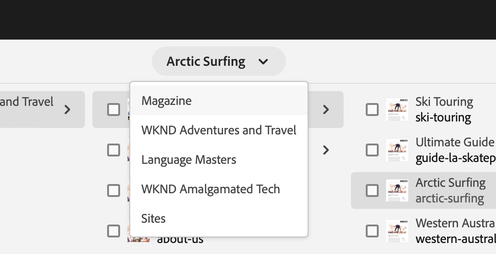

# 작성에 대한 빠른 시작 안내서 {#quick-guide-to-authoring}

**사이트** 콘솔을 사용하여 콘텐츠 작성을 시작하는 데 도움이 되는 빠른 개요 가이드를 보려면 여기에서 시작하십시오.

>[!TIP]
>
>이 빠른 시작 안내서는 사이트 작성에 중점을 두지만, 대부분의 개념은 다른 콘솔에 광범위하게 적용할 수 있습니다.

## 모두 사이트 콘솔에서 시작됩니다. {#sites-console}

새 콘텐츠를 만들든 기존 콘텐츠를 보고 관리하든, 중앙의 개요는 **사이트** 콘솔입니다.

AEM에 처음 로그인하면 전역 탐색 화면이 표시됩니다. **사이트**&#x200B;를 탭하거나 클릭하여 **사이트** 콘솔을 열면 됩니다.

AEM의 다른 위치에서 전역 탐색에 액세스하려면 AEM 화면의 왼쪽 상단에 있는 **Adobe Experience Manager** 링크를 탭하거나 클릭하여 전역 탐색의 드롭다운 오버레이를 엽니다.

**사이트** 콘솔에서는 콘텐츠를 간편하게 탐색할 수 있으며 기본적으로 열 보기로 표시됩니다.

## 보기 {#views}

기본적으로 **사이트** 콘솔은 **열** 보기로 열립니다. 각 계층 레벨은 열로 표시되며, 이 열은 웹 기반의 계층적으로 구성된 컨텐츠에 적합합니다.

열에서 항목을 탭하거나 클릭하여 선택하거나 계층에서 다음 수준을 엽니다. 선택한 항목이 확인 표시가 나타납니다.

다음 두 가지 추가 보기를 사용할 수 있습니다.

* **카드 보기** - 이 보기는 모든 항목을 쉽게 조작할 수 있는 카드로 제공하므로 추가 옵션에 쉽게 액세스할 수 있습니다.
* **목록 보기** - 계층의 단일 수준을 단일 목록으로 표시하여 개별 항목에 대한 자세한 정보를 제공합니다.

화면 왼쪽 상단의 보기 전환기를 사용하여 보기 간을 전환합니다. 이 문서에서는 기본 열 보기를 사용합니다.

## 콘텐츠 탐색 {#navigating}

**열 보기**&#x200B;는 일련의 계단식 열로 콘텐츠를 표시합니다. 현재 열에서 항목을 선택하면 해당 항목이 문서인 경우 오른쪽 다음 열에 세부 정보가 표시되고, 폴더인 경우 다음 계층 수준의 내용이 표시됩니다.

이 방법으로 콘텐츠 구조를 위아래로 트래버스할 수 있습니다.

레벨 간을 빠르게 이동하려면 페이지 상단의 이동 경로를 사용할 수 있습니다.

언제든지 화면 오른쪽 상단의 검색 아이콘을 사용하여 특정 콘텐츠를 찾을 수도 있습니다.

검색은 전체 콘솔에 드롭다운 오버레이로 표시됩니다. 콘텐츠를 찾으려면 검색어를 입력하십시오.

## 콘텐츠 만들기 {#creating}

새 페이지를 만들려면 콘텐츠 계층 구조에서 원하는 위치로 이동한 다음 도구 모음에서 **만들기** 단추를 탭하거나 클릭하면 됩니다.

사용 가능한 옵션은 컨텍스트에 따라 다릅니다. 콘텐츠 구조의 루트에 있는 경우 완전히 새로운 사이트를 만들 수 있습니다. 그렇지 않으면 새 페이지나 기타 페이지 관련 콘텐츠를 만들 수 있습니다.

만들려고 선택한 항목에 따라 적절한 마법사가 시작되어 만들기 프로세스를 안내합니다.

## 콘텐츠 편집 {#editing}

페이지를 편집하려면 탭하거나 클릭하여 **사이트** 콘솔에서 페이지를 선택합니다. 그런 다음 표시되는 도구 모음에서 **편집** 아이콘을 탭하거나 클릭합니다.

이렇게 하면 콘텐츠에 적합한 편집기에서 페이지가 열립니다.

태그나 페이지 이름과 같은 페이지의 속성을 업데이트하려면 도구 모음에서 **속성** 아이콘을 탭하거나 클릭합니다.

## 컨텐츠 구성 {#organizing}

페이지를 이동하거나 복사하려면 콘솔에서 페이지를 선택한 다음 도구 모음에서 **이동** 또는 **복사**&#x200B;를 탭하거나 클릭합니다. 이렇게 하면 마법사가 시작되어 이동 또는 복사 단계를 안내하고 결과 페이지의 이름과 위치를 정의합니다.

## 컨텐츠 게시 {#publishing}

**Sites** 콘솔을 사용하여 콘텐츠를 변경했으면 콘텐츠를 게시할 수 있습니다. 게시하려는 콘텐츠를 선택하고 도구 모음에서 **빠른 Publish** 아이콘을 탭하거나 클릭합니다.

대화 상자에서 **Publish**&#x200B;을 다시 탭하거나 클릭하여 게시를 확인합니다.

## 추가 리소스 {#additional-resources}

이는 Sites 콘텐츠 작성의 힘에 대한 간략한 소개일 뿐이며, 모든 주제 또는 모든 옵션을 다루지는 않습니다.

다음은 콘솔의 모든 기능에 대해 자세히 설명하고 일반적인 콘텐츠 작성에 대한 주제를 논의하는 몇 가지 추가 리소스입니다.

* [기본 처리](/help/sites-cloud/authoring/basic-handling.md)
* [작성 개념](/help/sites-cloud/authoring/author-publish.md)
* [Sites 콘솔](/help/sites-cloud/authoring/sites-console/introduction.md)
* [페이지 편집기](/help/sites-cloud/authoring/page-editor/introduction.md)
* [페이지 게시](/help/sites-cloud/authoring/sites-console/publishing-pages.md)
