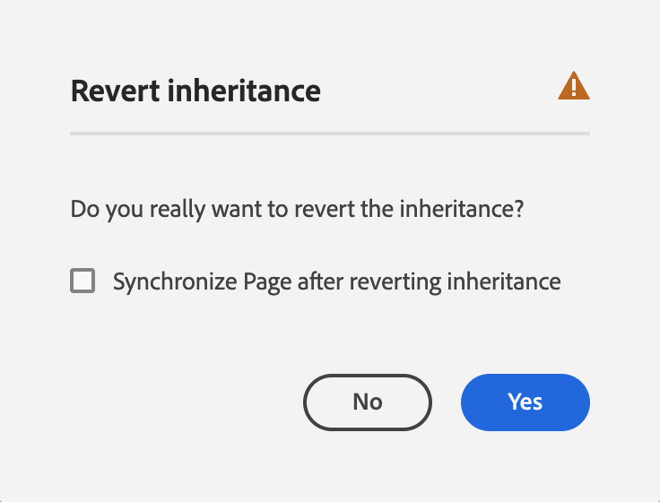

# 페이지 속성 편집 {#page-properties}

[페이지의 속성](/help/sites-cloud/authoring/sites-console/page-properties.md)을 편집하고 페이지의 동작을 변경하는 방법과 페이지 관리 방법을 알아봅니다.

>[!TIP]
>
>사용 가능한 개별 페이지 속성에 대한 자세한 내용은 [페이지 속성](/help/sites-cloud/authoring/sites-console/page-properties.md) 문서를 참조하십시오.

## 페이지 속성 편집 위치 {#where}

AEM의 여러 위치에서 페이지 속성을 편집할 수 있습니다.

* [다음에서 &#x200B;](#from-the-sites-console)
* [페이지 편집기에서](#from-the-page-editor)
* [유니버설 편집기에서](#from-the-universal-editor)

사이트 콘솔을 사용하여 한 번에 [여러 페이지의 속성을 편집할 수도 있습니다.](#editing-multiple-pages)

### 사이트 콘솔에서 {#from-the-sites-console}

**사이트** 콘솔에서 콘텐츠를 검색할 때 도구 모음의 **속성** 단추를 사용하여 페이지 속성을 편집할 수 있습니다.

1. [**사이트** 콘솔을 사용하여](/help/sites-cloud/authoring/sites-console/introduction.md)속성을 보고 편집할 페이지의 위치로 이동합니다.
1. 다음 중 하나를 사용하여 필요한 페이지에 대한 **속성** 옵션을 선택합니다.
   * [빠른 작업](/help/sites-cloud/authoring/basic-handling.md#quick-actions)
   * [선택 모드](/help/sites-cloud/authoring/basic-handling.md#selecting-resources)
   * 페이지 속성이 해당 탭을 사용하여 표시됩니다.
1. 필요에 따라 속성을 보거나 편집합니다.
1. 그런 다음 **저장**&#x200B;을 사용하여 업데이트를 저장한 후 **닫기**&#x200B;를 클릭하여 콘솔로 돌아갑니다.

### 페이지 편집기에서 {#from-the-page-editor}

페이지 편집기를 사용하여 페이지를 편집할 때 **페이지 정보**&#x200B;를 사용하여 페이지 속성을 정의할 수 있습니다.

1. [페이지 편집기](/help/sites-cloud/authoring/page-editor/introduction.md)에서 속성을 편집할 페이지를 엽니다.
1. **페이지 정보** 아이콘을 선택하여 다음과 같은 선택 메뉴를 엽니다.
1. **속성 열기**&#x200B;를 선택하면 해당 탭별로 정렬된 속성을 편집할 수 있는 대화 상자가 열립니다. 도구 모음 오른쪽에는 다음 단추가 있습니다.
   * **취소**
   * **저장 및 닫기**
1. **저장 및 닫기** 버튼을 사용하여 변경 사항을 저장합니다.

## 유니버설 편집기에서 {#from-the-universal-editor}

범용 편집기를 사용하여 페이지를 편집할 때 **페이지 속성** 아이콘을 사용하여 속성을 편집할 수 있습니다.

1. [범용 편집기](/help/sites-cloud/authoring/universal-editor/authoring.md#page-properties)에서 속성을 편집할 페이지를 엽니다.
1. 도구 모음에서 **페이지 속성** 아이콘을 선택합니다.
1. [페이지 편집기에서 페이지 속성을 편집하는 것처럼 AEM의 페이지 속성 창이 새 브라우저 탭에서 열립니다.](#from-the-page-editor) 도구 모음 오른쪽에 다음 단추가 있습니다.
   * **취소**
   * **저장 및 닫기**
1. **저장 및 닫기** 버튼을 사용하여 변경 사항을 저장합니다.
1. 범용 편집기의 브라우저 탭으로 돌아갑니다.

## 여러 페이지의 속성 편집 {#editing-multiple-pages}

[**사이트** 콘솔](/help/sites-cloud/authoring/sites-console/introduction.md)에서 여러 페이지를 선택한 다음 **속성 보기**&#x200B;를 사용하여 페이지 속성을 보거나 편집할 수 있습니다. 이를 페이지 속성의 일괄 편집이라고 합니다.

다음을 비롯하여 다양한 방법으로 일괄 편집할 여러 페이지를 선택할 수 있습니다.

* **Sites** 콘솔을 찾아볼 때
* **검색**&#x200B;을 사용하여 일련의 페이지를 찾은 후

페이지를 선택한 다음 **속성** 옵션을 클릭하거나 탭하면 벌크 속성이 표시됩니다.

다음과 같은 페이지에 대해서만 일괄 편집을 수행할 수 있습니다.

* 동일한 리소스 유형 공유
* Live Copy의 일부가 아닙니다.
   * 선택한 페이지가 라이브 카피의 일부인 경우 속성을 열면 메시지가 표시됩니다.

벌크 편집 창은 세로로 반으로 나눠집니다.

* 왼쪽은 벌크 편집을 위해 선택한 페이지 목록입니다.
   * 필요에 따라 페이지를 선택/선택 해제할 수 있습니다.
   * 기본적으로 모두 선택되어 있습니다.
* 오른쪽은 대량 편집에 사용할 수 있는 [속성 목록입니다.](/help/implementing/developing/extending/bulk-editor.md)
   * 단일 페이지의 속성을 볼 때처럼 탭 아래에 속성이 정렬됩니다.
   * 선택한 모든 페이지에서 사용할 수 있고 일괄 편집에서 사용할 수 있다고 명시적으로 정의된 속성이 표시됩니다.
   * 페이지 선택을 한 페이지로 제한하면 모든 속성이 보입니다.
   * 공통 값이 있는 속성만 표시됩니다.
   * 필드가 다중 값이면(예: 태그) *모두*&#x200B;가 일반적인 경우에만 값이 표시됩니다. 일부만 공통되는 경우 편집할 때만 표시됩니다.
* 공통되지만 여러 페이지에서 값이 다른 필드는 텍스트 `<Mixed Entries>`와 같은 특수한 값으로 표시됩니다.

선택한 페이지에서 사용할 수 있는 필드의 값을 업데이트할 수 있습니다. **완료**&#x200B;를 선택하면 선택한 모든 페이지에 새 값이 적용됩니다. 필드가 다중 값이면(예: 태그) 새 값을 추가하거나 공통 값을 제거할 수 있습니다.

## 속성 상속 {#inheritance}

페이지가 블루프린트를 기반으로 하거나 다른 페이지에서 콘텐츠를 상속하는 경우 상속이 개별 필드의 **페이지 속성** 창에 반영됩니다.

상속된 속성은 편집할 수 없습니다. 상속을 중단하려면 특정 필드 옆에 있는 **상속 취소** 아이콘을 탭하거나 클릭합니다.

**상속 취소** 모달에서 취소를 확인합니다.

필드에 대한 상속이 취소되면 편집할 수 있게 됩니다.

상속을 복원하려면 필드 옆에 있는 **상속 되돌리기** 아이콘을 탭하거나 클릭합니다.

**상속 되돌리기** 모달에서 되돌리기를 확인합니다.

블루프린트에서 최신 값으로 필드를 업데이트하려면 **상속을 되돌린 후 페이지 동기화**&#x200B;를 선택하십시오. 이렇게 하지 않으면 다음에 LiveCopy를 동기화할 때 값이 업데이트됩니다.

>[!TIP]
>
>상속에 대한 자세한 내용은 [다중 사이트 관리자 및 번역](/help/sites-cloud/administering/msm-and-translation.md) 문서를 참조하십시오.
